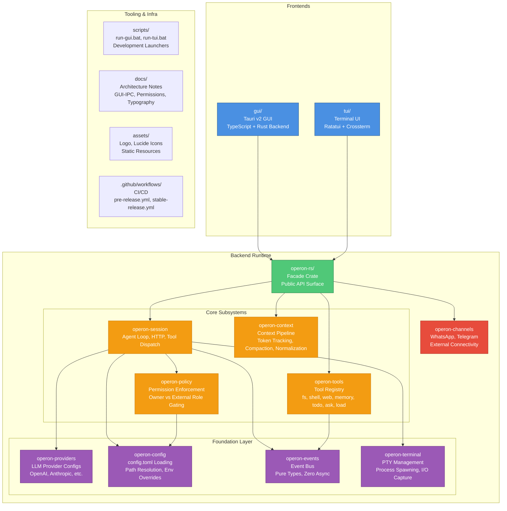

<div align="center">


# **Operon**

***The autonomous AI agent built for everyone — not just developers.***

<br/>

> *Claude Code, Codex, and OpenClaw are powerful — but they're built for engineers who live in a terminal.*  
> ***Operon is built for everyone.***

</div>

## What is Operon?

Operon is a **consumer-first** AI agent similar to OpenClaw but with a clean GUI. It does everything that OpenClaw does — but without requiring you to know what a terminal is.

> **You open Operon → type what you need.** *That's it. ✓*

- Underneath, *Operon* runs a production-grade Rust agent runtime similar to Codex/OpenClaw.
- The difference is the surface: instead of a terminal or an IDE, Operon gives you a familiar chat interface.

> Think ChatGPT app, but with the full autonomous capability of an agent.

## 🐦‍🔥 Back Story

Hi, I'm **Luka Gray** (aka Soumo Mukherjee).

When I first used OpenClaw, one thing became obvious: the intelligence was impressive, the user experience was... a crime scene.

So in early 2026, I started building **Operon**. 🎉

**The mission is simple**: Build powerful AI agents that our *granny* can use, while keeping the depth developers expect.

> ***Built for normal people, because software has ignored them for long enough.***

<details>
<summary><span style="font-size: 1.5em;">⚡ Features</span></summary>
<br>

1. 🗣️ **Chat-First Interface**
   - Operon's primary interface is a clean, familiar chat UI — because billions of people already know how messaging works.
   - Will be available in **TUI**, **VS Code** (in development), **JetBrains** (in development), and **Mobile** soon.

2. ⚡ **Lightweight by Design**
   - The backend is written in Rust, delivering a small memory footprint and fast startup without sacrificing reliability.

3. 📱 **Mobile-Ready Architecture**
   - Built to run beyond desktops, with a shared core runtime and portable frontends designed for mobile from the ground up.

4. 🔌 **Multi-Provider LLM Support**
   - Use OpenAI, Anthropic, local models, OpenAI-compatible APIs, and more — without changing how you work.

5. 📡 **Connector Channels**
   - Connect Operon to WhatsApp, Telegram, Gmail, and other external channels.
   - Your agent stays reachable and operational even when you're away from your desk.

6. 📋 **Tasks & Memory**
   - Operon maintains structured memory across sessions, tracks ongoing tasks, supports scheduled actions, and surfaces relevant context automatically — so nothing gets lost between conversations.

</details>

---

## ⚡ Performance

Operon is built with Rust and Tauri v2. The backend runtime is pure Rust — no Node.js, no V8 heap in the core agent loop, and no garbage collection in critical paths.

| | Operon | Claude Code | Codex | OpenClaw |
|---|---|---|---|---|
| **Runtime** | Rust + Tauri v2 | Node.js + Electron | Node.js + Electron | Node.js |
| **Idle RAM** | **~65 MB** | ~300 MB | ~1 GB | ~512 MB |
| **Under load** | **< 90 MB** | 500 MB – 2+ GB | 2+ GB | 512 MB – 7 GB |

**Architecture Comparison:**

<table>
<tr>
<td width="50%" valign="top">

**❌ Electron-Based Apps**
```
┌─────────────────────────┐
│   Your Application      │
├─────────────────────────┤
│   Full Chromium         │  ← Entire browser
│   (80+ MB base)         │     engine bundled
├─────────────────────────┤
│   Node.js Runtime       │  ← JavaScript VM
│   (V8 + GC overhead)    │     for backend
└─────────────────────────┘
   Result: 300MB+ idle
```

</td>
<td width="50%" valign="top">

**✅ Operon (Tauri v2)**
```
┌─────────────────────────┐
│   TypeScript Frontend   │  ← Static HTML/CSS/JS
│   (Compiled bundle)     │
├─────────────────────────┤
│   System WebView        │  ← Uses OS-native
│   (WebView2/WKWebView)  │     renderer (0 MB cost)
├─────────────────────────┤
│   Rust Backend          │  ← Pure native code
│   (Agent Runtime)       │     Zero-cost abstractions
└─────────────────────────┘
   Result: ~80MB idle
```

</td>
</tr>
</table>

#### 🎯 Why Tauri v2?

<details open>
<summary><b>Native WebView Embedding</b></summary>

Instead of shipping Chromium (like Electron), Tauri uses the WebView already installed on your system:
- **Windows**: WebView2 (Edge-based, auto-updated by Microsoft)
- **macOS**: WKWebView (Safari engine, part of the OS)
- **Linux**: WebKitGTK (system package)

**Impact**: The entire browser engine contributes **0 bytes** to the app bundle size.

</details>

<details open>
<summary><b>Process Separation</b></summary>

The Rust backend runs as a **separate native process** from the WebView frontend:

```
Frontend Process          Backend Process
┌──────────────┐          ┌────────────────────┐
│  TypeScript  │  IPC     │  Rust Agent Loop   │
│  UI Layer    │◄────────►│  • Session Manager │
│  (Rendering) │          │  • Tool Dispatcher │
│              │          │  • HTTP Streaming  │
│              │          │  • Context Pipeline│
└──────────────┘          └────────────────────┘
  Lightweight              Compute-Heavy Tasks
```

**Impact**: UI remains responsive even during heavy LLM streaming or tool execution.

</details>

<details open>
<summary><b>Zero Garbage Collection in Critical Paths</b></summary>

- **Session orchestration**: Pure Rust (no GC pauses)
- **Tool execution**: Native syscalls via Rust std::process
- **HTTP streaming**: Tokio async runtime (no stop-the-world GC)
- **Context compaction**: Manual memory management

**Impact**: Predictable latency, no random 50-200ms GC stalls during agent loops.

</details>

## 🛡️ Permission Model

Operon is built to talk to anyone — your customers on WhatsApp, your team on Telegram, or just you from your own device. That openness is the whole point. But it immediately raises a question:

> ***If anyone can message Operon, what can Operon do on their behalf?***  
> The answer is: exactly what you decided in advance. Nothing more.

### Two Roles, One Clear Boundary

Every sender is classified as one of two roles:

- **Owner** — you, your staff, and people you explicitly trust.
- **External** — customers, leads, patients, the public. Anyone else.

This classification happens at the channel level. A message from your own device is Owner. A message arriving through a public WhatsApp number is External — unless you've explicitly marked that contact as trusted.

Once the role is known, Operon checks what it's permitted to do for that role. If the permission isn't explicitly granted, the answer is no.

### Why This Matters

Most agent tools were built for a single user — the developer running them locally. Permissions weren't a design consideration because there was only one person involved.

Operon is built for deployment. Without a clear permission boundary, opening your agent to external users creates real risk:

- **Prompt injection** — users attempt to manipulate the agent into bypassing its instructions.
- **Data exposure** — internal files, notes, or customer data become reachable by accident.
- **Tool abuse** — external users trigger actions they were never meant to initiate.
- **Operational damage** — broad permissions turn a single bad prompt into an expensive problem.

Operon prevents this by enforcing role separation at the permission layer itself. External users get zero access by default. You define exactly what they can reach, in which directories, using which tools, and whether confirmation is required.

> **Access is segmented by design. Not by hope.**

---

## 📦 Monorepo Layout

Operon is organized as a Cargo workspace with clearly separated frontend, backend, and tooling layers.



### Directory Structure

```
Operon/
├── gui/                      # Tauri v2 Desktop GUI
│   ├── src/                  # TypeScript frontend (HTML/CSS/JS)
│   ├── src-tauri/            # Rust backend (IPC handlers, state management)
│   │   ├── src/              # Tauri app entry point
│   │   ├── Cargo.toml        # operon-gui crate
│   │   └── tauri.conf.json   # Tauri configuration
│   ├── package.json          # TypeScript build config
│   └── tsconfig.json
│
├── tui/                      # Terminal UI (Ratatui)
│   ├── src/                  # TUI rendering, input handling
│   └── Cargo.toml            # operon-tui crate
│
├── operon-rs/                # Backend Runtime (Rust)
│   ├── src/
│   │   ├── operon-session/   # Agent loop, HTTP clients, tool dispatch
│   │   ├── operon-context/   # Context pipeline (normalization, compaction)
│   │   ├── operon-tools/     # Tool implementations (fs, shell, web, memory, etc.)
│   │   ├── operon-policy/    # Permission enforcement (Owner/External roles)
│   │   ├── operon-providers/ # LLM provider configs (OpenAI, Anthropic, etc.)
│   │   ├── operon-config/    # config.toml loading, env var overrides
│   │   ├── operon-events/    # Event bus (pure types, zero async)
│   │   ├── operon-terminal/  # PTY management, process spawning
│   │   ├── operon-channels/  # WhatsApp, Telegram connectivity
│   │   └── operon-diff/      # Diff generation utilities
│   ├── Cargo.toml            # operon-rs facade crate
│   └── README.md             # Backend architecture documentation
│
├── docs/                     # Architecture documentation
│   ├── GUI-IPC-and-State-Architecture.md
│   ├── Permission.md
│   └── Typography-and-Fonts.md
│
├── scripts/                  # Development launchers
│   ├── run-gui.bat           # Start GUI in dev mode
│   ├── run-gui-release.bat   # Start GUI in release mode
│   ├── run-tui.bat           # Start TUI in dev mode
│   └── run-tui-release.bat   # Start TUI in release mode
│
├── assets/                   # Static resources (logo, icons)
├── .github/workflows/        # CI/CD pipelines
├── Cargo.toml                # Workspace root (defines all members)
└── README.md                 # This file
```

### Key Design Decisions

1. **Frontends are Thin Clients**: Both GUI and TUI depend on `operon-rs` as a facade. All agent logic lives in the backend.
2. **Separation of Concerns**: The backend is decomposed into single-responsibility crates (session, tools, policy, providers, config, events).
3. **Permission Enforcement at the Core**: `operon-policy` sits between `operon-session` and `operon-tools`, enforcing Owner/External role separation before tool execution.
4. **Shared Runtime**: TUI and GUI share the exact same Rust backend. No code duplication.
5. **Mobile-Ready Architecture**: The layered design anticipates iOS/Android frontends using the same `operon-rs` core via FFI.

---

## Getting Started

> *Operon is currently in active development.*  
> **Pre-built binaries are available in the releases page.**

---

## Contributing

Contributions are welcome. If you're planning a large feature or architectural change, open an issue first to align before implementation begins.

For bug reports, please include:

- OS / distro
- Rust version
- Operon version / commit hash
- Model provider used
- Logs or error output
- Minimal reproduction steps

The more precise the report, the faster the fix.

---

## License

Operon is licensed under the **GNU Affero General Public License v3.0 (AGPLv3)**. See [LICENSE](./LICENSE) for full terms.

---

<div align="center">

<br/>

Built by **Luka Gray (aka Soumo Mukherjee)** • West Bengal, India • 2026  
*"The best tools disappear. You stop thinking about the tool and start thinking about the work."*

<br/>

**[GitHub](https://github.com/lukagray-dev) • [Instagram](https://www.instagram.com/lukagray.official) • [Email](mailto:heylukagray@gmail.com)**

<br/>

</div>
