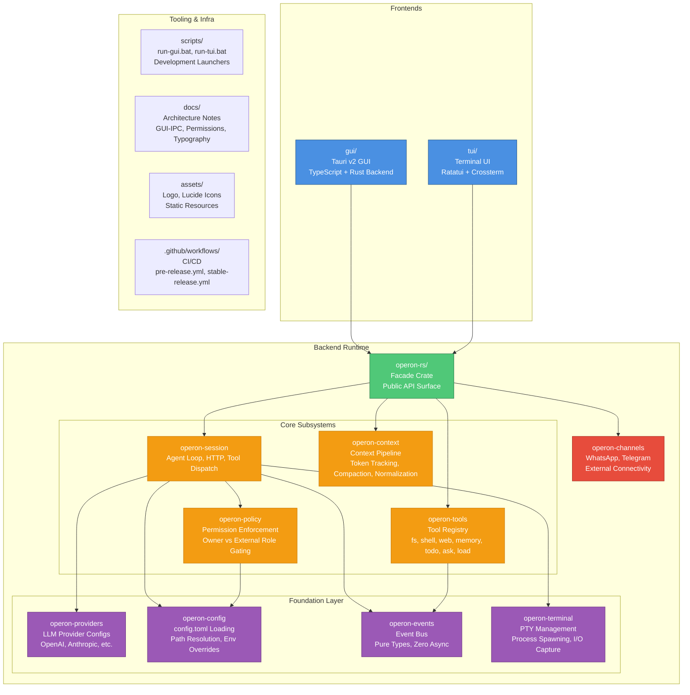

<div align="center">


# **Operon**

[](https://www.rust-lang.org/)
[](../LICENSE)

</div>

## **What is Operon?**

Operon is an autonomous AI agent platform built around a Rust-native agent harness. It provides tool execution, memory, tasks, permissions, multi-provider LLM support, and remote channels such as WhatsApp and Telegram, with a shared core runtime designed to support multiple user-facing frontends.

## **Why Operon?**

Hi, I'm **Luka Gray**.

I started building **Operon** in early 2026 after using autonomous agents like OpenClaw. The technology was powerful, but I noticed some fundamental problems.

These systems aren't really chatbots. They're autonomous system operators (like Claude Code) with access to files, shells, networks, services, and external channels.  
That power created a different class of problems. Setup and configuration became complex, long-running sessions accumulated enormous amounts of context, tool execution became difficult to reason about, and giving an autonomous agent access to your machine created significant security and permission-management challenges.

OpenClaw's own [security documentation](https://docs.openclaw.ai/gateway/security) reflects this tradeoff: *its Gateway assumes one trusted operator boundary and is not designed to provide hostile multi-tenant isolation within a shared Gateway.*

So I started building **Operon** around a different idea: keep the autonomy and depth of an agent, but make the underlying runtime lightweight, permission-aware, and accessible through interfaces that don't require users to understand the machinery underneath.

> I started as a personal experiment and gradually evolved into a complete **Rust-native agent harness**.

## 🛡️ Permission Model

Autonomous agents become significantly harder to secure when they can be reached by people other than their owner.

Operon treats **identity, permissions, and tool access as separate boundaries**. Every incoming request is associated with a role, and that role determines what the agent is allowed to access and execute.

### Two Roles

- **Owner**: the agent's owner and explicitly trusted users.
- **External**: everyone else, including customers, leads, and public users.

External access is **deny-by-default**. A user's role does not grant access to the agent's capabilities by itself; permissions must explicitly allow the requested operation.

Permissions are scoped by:

- **Tools**: what the agent is allowed to execute.
- **Directories**: which parts of the filesystem it can access.
- **Channels**: where the agent can be reached and by whom.

If an external user attempts a prompt injection to make the agent perform an unauthorized action, the model may still generate the request, but the **runtime permission layer will block the corresponding tool execution**. The model does not get to grant itself additional privileges.

> *This boundary is enforced by the runtime rather than relying on the model to follow instructions.*  
> **The model decides what to do. The permission layer decides what it is allowed to do.**

## 📦 Monorepo Layout

Operon is organized as a Cargo workspace with clearly separated frontend, backend, and tooling layers.



### Directory Structure

```text
Operon/
├── gui/                      # Tauri v2 Desktop GUI
│   ├── src/                  # TypeScript frontend (HTML/CSS/JS)
│   ├── src-tauri/            # Rust backend (IPC handlers, state management)
│   │   ├── src/              # Tauri app entry point
│   │   ├── Cargo.toml        # operon-gui crate
│   │   └── tauri.conf.json   # Tauri configuration
│   ├── package.json          # TypeScript build config
│   └── tsconfig.json
│
├── tui/                      # Terminal UI (Ratatui)
│   ├── src/                  # TUI rendering, input handling
│   └── Cargo.toml            # operon-tui crate
│
├── vscode/                   # VS Code Extension
│   ├── bridge/               # Bridge between VS Code and Operon backend
│   │   ├── src/              # Bridge entry point
│   │   └── Cargo.toml        # operon-bridge crate
│   └── extension/            # VS Code extension
│
├── operon-rs/                # Backend Runtime (Rust)
│   ├── src/
│   │   ├── operon-session/   # Agent loop, HTTP clients, tool dispatch
│   │   ├── operon-context/   # Context pipeline (normalization, compaction)
│   │   ├── operon-tools/     # Tool implementations (fs, shell, web, memory, etc.)
│   │   ├── operon-policy/    # Permission enforcement (Owner/External roles)
│   │   ├── operon-providers/ # LLM provider configs (OpenAI, Anthropic, etc.)
│   │   ├── operon-config/    # config.toml loading, env var overrides
│   │   ├── operon-events/    # Event bus (pure types, zero async)
│   │   ├── operon-terminal/  # PTY management, process spawning
│   │   ├── operon-channels/  # WhatsApp, Telegram connectivity
│   │   └── operon-diff/      # Diff generation utilities
│   ├── Cargo.toml            # operon-rs facade crate
│   └── README.md             # Backend architecture documentation
│
├── docs/                     # Architecture documentation
│   ├── GUI-IPC-and-State-Architecture.md
│   ├── Permission.md
│   └── Typography-and-Fonts.md
│
├── scripts/                  # Development launchers
│   ├── run-gui.bat           # Start GUI in dev mode
│   ├── run-gui-release.bat   # Start GUI in release mode
│   ├── run-tui.bat           # Start TUI in dev mode
│   └── run-tui-release.bat   # Start TUI in release mode
│
├── assets/                   # Static resources (logo, icons)
├── .github/workflows/        # CI/CD pipelines
├── Cargo.toml                # Workspace root (defines all members)
└── README.md                 # This file
```

### Key Design Decisions

1. **Frontends are Thin Clients**: GUI, TUI, and VS Code extension depend on `operon-rs` as a facade. All agent logic lives in the backend.
2. **Separation of Concerns**: The backend is decomposed into single-responsibility crates (session, tools, policy, providers, config, events).
3. **Permission Enforcement at the Core**: `operon-policy` sits between `operon-session` and `operon-tools`, enforcing Owner/External role separation before tool execution.

---

## 🚀 Getting Started

### For Users

> Don't want to build Operon yourself? Download the latest pre-built release and start using it **[→ Download Operon](https://github.com/lukagray-dev/Operon/releases)**

### For Developers

Want to build Operon from source or contribute to the project?

First, clone the repository:

```bash
git clone https://github.com/lukagray-dev/Operon.git
cd Operon
```

Then use the development launchers from the repository root:

```text
scripts/
├── run-gui.bat          # Run the Tauri GUI in development mode
├── run-gui-release.bat  # Run the GUI in release mode
├── run-tui.bat          # Run the TUI in development mode
└── run-tui-release.bat  # Run the TUI in release mode
```

On Windows, run the appropriate `.bat` script directly from the repository root.

> For backend architecture and development details, see [`operon-rs/README.md`](operon-rs/README.md).

---

## License & Contributing

Operon is licensed under the **GNU Affero General Public License v3.0 (AGPLv3)**. See [LICENSE](./LICENSE) for full terms.  
Contributions are welcome. If you're planning a large feature or architectural change, open an issue first to align before implementation begins. See [CONTRIBUTING](./CONTRIBUTING) for more information.

---

<div align="center">

<br/>

Built by **Luka Gray (aka Soumo Mukherjee)** • West Bengal, India • 2026  
*"The best tools disappear. You stop thinking about the tool and start thinking about the work."*

<br/>

**[GitHub](https://github.com/lukagray-dev) • [Instagram](https://www.instagram.com/lukagray.official) • [Email](mailto:heylukagray@gmail.com)**

<br/>

</div>
