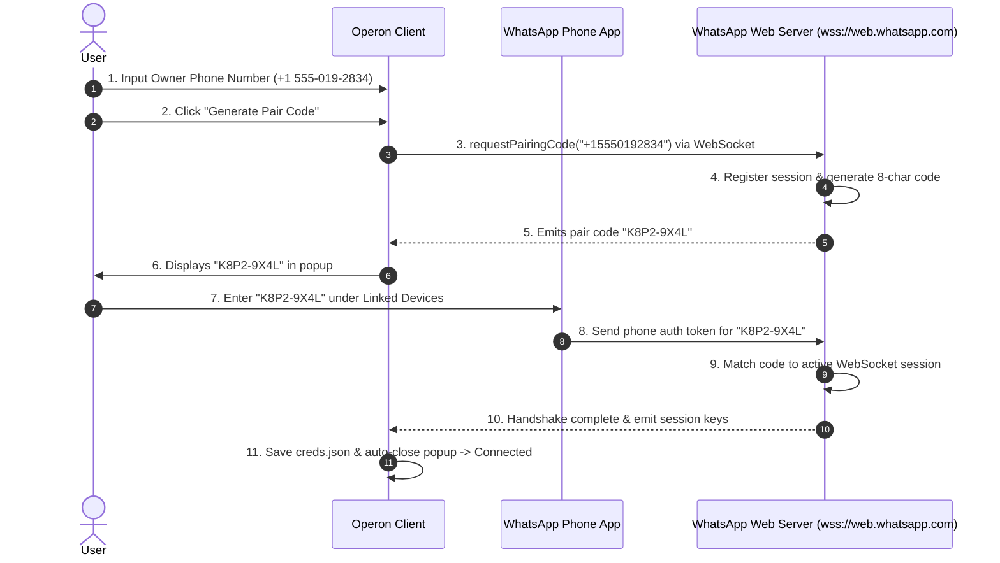

# **Operon**

***The autonomous AI agent built for everyone — not just developers.***

 

> *Claude Code, Codex, and OpenClaw are powerful — but they're built for engineers who live in a terminal.*  
> ***Operon is built for everyone.***

## What is Operon?

Operon is a **consumer-first** AI agent similar to OpenClaw but with a clean GUI. It does everything that OpenClaw does — but without requiring you to know what a terminal is.

> **You open Operon → type what you need.** *That's it. ✓*

- Underneath, *Operon* runs a production-grade Rust agent runtime similar to Codex/OpenClaw.
- The difference is the surface: instead of a terminal or an IDE, Operon gives you a familiar chat interface.

> Think ChatGPT app, but with the full autonomous capability of an agent.

## 🐦‍🔥 Back Story

Hi, I'm **Luka Gray** (aka Soumo Mukherjee).

When I first used OpenClaw, one thing became obvious: the intelligence was impressive, the user experience was... a crime scene.

So in early 2026, I started building **Operon**. 🎉

**The mission is simple**: Build powerful AI agents that our *granny* can use, while keeping the depth developers expect.

> ***Built for normal people, because software has ignored them for long enough.***

⚡ Features

 

1. 🗣️ **Chat-First Interface**
   - Operon's primary interface is a clean, familiar chat UI — because billions of people already know how messaging works.
   - Will be available in **TUI**, **VS Code** (in development), **JetBrains** (in development), and **Mobile** soon.

2. ⚡ **Lightweight by Design**
   - The backend is written in Rust, delivering a small memory footprint and fast startup without sacrificing reliability.

3. 📱 **Mobile-Ready Architecture**
   - Built to run beyond desktops, with a shared core runtime and portable frontends designed for mobile from the ground up.

4. 🔌 **Multi-Provider LLM Support**
   - Use OpenAI, Anthropic, local models, OpenAI-compatible APIs, and more — without changing how you work.

5. 📡 **Connector Channels**
   - Connect Operon to WhatsApp, Telegram, Gmail, and other external channels.
   - Your agent stays reachable and operational even when you're away from your desk.

6. 🌐 **Multi-Format Patch Engine**
   - Supports Codex patches, unified diffs, and SEARCH/REPLACE blocks for broad compatibility across model providers.

7. 📋 **Tasks & Memory**
   - Operon maintains structured memory across sessions, tracks ongoing tasks, supports scheduled actions, and surfaces relevant context automatically — so nothing gets lost between conversations.

---

## ⚡ Performance

Operon is built with Rust and Slint. No Electron, no V8 heap, and no garbage collection.

| | Operon | Claude Code | Codex | OpenClaw |
|---|---|---|---|---|
| **Runtime** | Rust + Slint | Node.js + Electron | Node.js + Electron | Node.js |
| **Idle RAM** | **~70 MB** | ~300 MB | ~1 GB | ~512 MB |
| **Under load** | **< 90 MB** | 500 MB – 2+ GB | 2+ GB | 512 MB – 7 GB |

Electron-based apps require a full Chromium renderer and Node.js runtime.  
Operon compiles down to a single, truly native binary utilizing Slint's direct-to-GPU graphics rendering (no WebViews or browser engines). The entire application (GUI + session runner + tool dispatcher) runs in a single lightweight process.

#### Why Slint?

> We migrated from web-based frameworks (like Tauri) to [`Slint`](https://github.com/SlintSDK/slint) to achieve true native performance. Slint compiles directly to machine code and draws UI elements directly using the GPU (via Skia/FemtoVG), entirely bypassing browser engines, WebViews, or Node.js runtimes.  
> This results in instant startup (<50ms) and keeps the total memory footprint under 90 MB.

## 🛡️ Permission Model

Operon is built to talk to anyone — your customers on WhatsApp, your team on Telegram, or just you from your own device. That openness is the whole point. But it immediately raises a question:

> ***If anyone can message Operon, what can Operon do on their behalf?***  
> The answer is: exactly what you decided in advance. Nothing more.

### Two Roles, One Clear Boundary

Every sender is classified as one of two roles:

- **Owner** — you, your staff, and people you explicitly trust.
- **External** — customers, leads, patients, the public. Anyone else.

This classification happens at the channel level. A message from your own device is Owner. A message arriving through a public WhatsApp number is External — unless you've explicitly marked that contact as trusted.

Once the role is known, Operon checks what it's permitted to do for that role. If the permission isn't explicitly granted, the answer is no.

### Why This Matters

Most agent tools were built for a single user — the developer running them locally. Permissions weren't a design consideration because there was only one person involved.

Operon is built for deployment. Without a clear permission boundary, opening your agent to external users creates real risk:

- **Prompt injection** — users attempt to manipulate the agent into bypassing its instructions.
- **Data exposure** — internal files, notes, or customer data become reachable by accident.
- **Tool abuse** — external users trigger actions they were never meant to initiate.
- **Operational damage** — broad permissions turn a single bad prompt into an expensive problem.

Operon prevents this by enforcing role separation at the permission layer itself. External users get zero access by default. You define exactly what they can reach, in which directories, using which tools, and whether confirmation is required.

> **Access is segmented by design. Not by hope.**

---

## Getting Started

> *Operon is currently in active development.*  
> **Pre-built binaries are available in the releases page.**

---

## Contributing

Contributions are welcome. If you're planning a large feature or architectural change, open an issue first to align before implementation begins.

For bug reports, please include:

- OS / distro
- Rust version
- Operon version / commit hash
- Model provider used
- Logs or error output
- Minimal reproduction steps

The more precise the report, the faster the fix.

---

## License

Operon is licensed under the **GNU Affero General Public License v3.0 (AGPLv3)**. See [LICENSE](./LICENSE) for full terms.

---

 

Built by **Luka Gray (aka Soumo Mukherjee)** • West Bengal, India • 2026  
*"The best tools disappear. You stop thinking about the tool and start thinking about the work."*

 

**[GitHub](https://github.com/lukagray-dev) • [Instagram](https://www.instagram.com/lukagray.official) • [Email](mailto:heylukagray@gmail.com)**

 

