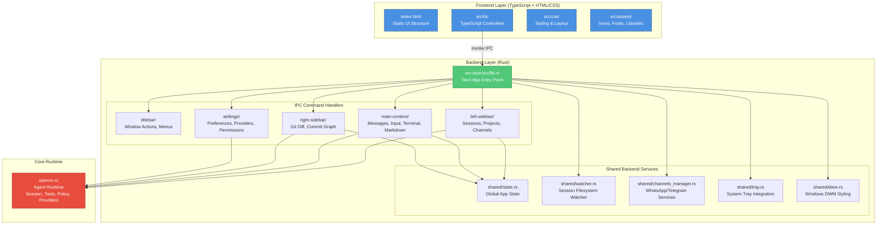
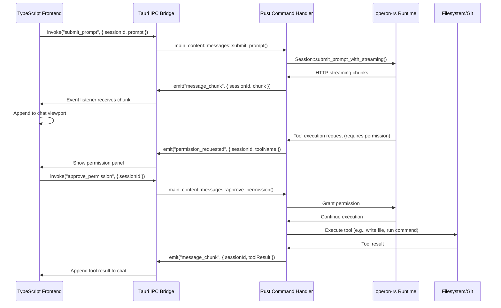

# Operon GUI — Tauri v2 Desktop Frontend

**Production-grade graphical interface for Operon AI agent, built with Tauri v2, TypeScript, and Rust.**

---

## 📋 Overview

The GUI crate implements Operon's desktop application using **Tauri v2**, providing a native cross-platform interface with minimal resource footprint. The architecture follows a clean separation: **TypeScript frontend** for UI rendering and interaction, **Rust backend** for IPC command handlers, state management, and integration with the core `operon-rs` agent runtime.



---

## 🏗️ Architecture

### **1. Frontend (TypeScript + HTML/CSS)**

Located in `gui/src/`, the frontend is a **static web application** compiled from TypeScript to JavaScript and served through Tauri's embedded WebView.

#### Directory Structure

```
gui/src/
├── index.html              # Main application shell
├── settings.html           # Settings window shell
├── ts/                     # TypeScript source (compiled to js/)
│   ├── main.ts             # Application entry point
│   ├── titlebar/           # Window controls, menus
│   ├── left-sidebar/       # Sessions, projects, channels UI
│   ├── main-content/       # Chat viewport, input, terminal, markdown
│   ├── right-sidebar/      # Git diff panel, commit graph
│   ├── settings/           # Settings window controllers
│   ├── shared/             # Utilities (IPC wrappers, helpers)
│   └── thinking-orbs/      # Loading animations
├── css/                    # Modular stylesheets
│   ├── shared/global.css
│   ├── titlebar/
│   ├── left-sidebar/
│   ├── main-content/
│   └── right-sidebar/
├── assets/                 # Static resources
│   ├── brand/              # Logo, icons
│   ├── highlight/          # Syntax highlighting (highlight.js)
│   ├── katex/              # Math rendering (KaTeX)
│   └── xterm/              # Terminal emulator (xterm.js)
└── js/                     # Compiled TypeScript output (generated)
```

#### Key Frontend Modules

| Module | Responsibility |
|--------|----------------|
| **titlebar/** | Custom window controls (minimize, maximize, close), native menu bar (Files, View, Window, Help) |
| **left-sidebar/** | Session list, project folders, WhatsApp/Telegram channel contacts, search/filter |
| **main-content/input/** | Multiline prompt input, attachments, model selector, auto-approve toggle, context usage indicator |
| **main-content/messages/** | Chat message stream rendering, real-time streaming, permission requests, work group indicators |
| **main-content/markdown/** | Server-side markdown rendering with syntax highlighting (highlight.js), math (KaTeX), diff blocks |
| **main-content/terminal/** | Embedded PowerShell terminals using xterm.js, multi-tab support, PTY integration via IPC |
| **main-content/topbar/** | Session title, project badge, terminal toggle, git diff toggle with live stats (+insertions/-deletions) |
| **right-sidebar/** | Git diff viewer, staged/unstaged file tree, commit graph, branch switching, push/pull/fetch |
| **settings/** | Multi-tab settings window (General, Appearance, Models, Permissions, Channels, Memory, About) |

#### Frontend Technology Stack

- **TypeScript 5.7**: Compiled to ES2022 JavaScript with strict type checking
- **No Framework**: Vanilla TypeScript with direct DOM manipulation (no React, Vue, or Angular)
- **xterm.js**: Full-featured terminal emulator for embedded PowerShell sessions
- **highlight.js**: Syntax highlighting for code blocks in markdown rendering
- **KaTeX**: Fast math rendering for LaTeX expressions in markdown
- **Custom UI Components**: Native-looking dropdowns, tabs, modals, context menus built from scratch

---

### **2. Backend (Rust IPC Handlers)**

Located in `gui/src-tauri/src/`, the Rust backend handles all IPC commands, state management, and integration with `operon-rs`.

#### Directory Structure

```
gui/src-tauri/
├── src/
│   ├── main.rs             # Binary entry point (calls lib.rs::run())
│   ├── lib.rs              # Tauri app builder, IPC handler registration
│   ├── titlebar/           # Window actions (minimize, maximize, close, drag)
│   │   └── mod.rs
│   ├── left-sidebar/       # Session CRUD, project management, channel queries
│   │   ├── mod.rs
│   │   ├── session.rs
│   │   ├── whatsapp.rs
│   │   ├── telegram.rs
│   │   └── types.rs
│   ├── main-content/       # Core agent interactions
│   │   ├── input/          # Model selection, attachment picking, context usage
│   │   ├── messages/       # Prompt submission, streaming, permission approval/deny
│   │   ├── markdown/       # Server-side markdown rendering with syntax highlighting
│   │   ├── terminal/       # PTY spawning, I/O bridging, resize, close
│   │   ├── topbar/         # Session info, git stats
│   │   ├── work-group/     # Work group metadata
│   │   └── mod.rs
│   ├── right-sidebar/      # Git operations
│   │   └── mod.rs          # Diff details, stage/unstage, commit, push/pull/fetch, branch ops
│   ├── settings/           # Settings window IPC handlers
│   │   ├── mod.rs
│   │   ├── commands.rs     # Open/close settings window
│   │   ├── prefs.rs        # GuiPrefs struct (TOML persistence)
│   │   ├── general/        # Startup, auto-update, tray behavior
│   │   ├── appearance/     # Fonts, themes, UI customization
│   │   ├── models/         # Provider configs (OpenAI, Anthropic, etc.), model discovery
│   │   ├── permissions/    # Allowed directories, permission mode (ask/auto), tool permissions
│   │   ├── channels/       # WhatsApp/Telegram pairing, workspace assignment, policy checks
│   │   ├── memory/         # Global memory CRUD (SQLite-backed via operon-tools-memory)
│   │   └── about/          # System info (OS, Rust version, Git hash)
│   └── shared/             # Cross-cutting backend services
│       ├── state.rs        # Global AppState (Mutex-wrapped shared data)
│       ├── watcher.rs      # Filesystem watcher for session JSON changes
│       ├── channels_manager.rs # WhatsApp/Telegram service lifecycle
│       ├── tray.rs         # System tray menu, show/hide/quit actions
│       ├── dwm.rs          # Windows DWM styling (sharp corners, border color)
│       └── autostart.rs    # OS-level startup registry (Windows Registry, systemd, LaunchAgents)
├── Cargo.toml              # operon-gui crate definition
├── build.rs                # Tauri build script
├── tauri.conf.json         # Tauri configuration (window size, decorations, CSP, bundle)
├── capabilities/           # Tauri permissions manifest
│   └── default.json
└── icons/                  # Application icons (PNG, ICO, ICNS for all platforms)
```

#### Key Backend Modules

| Module | Responsibility |
|--------|----------------|
| **lib.rs** | Tauri app builder, plugin registration (`tauri-plugin-opener`), state initialization, window setup, tray setup, IPC handler registration |
| **titlebar/** | Window actions (minimize, maximize, close), drag region, sidebar toggle, external URL opening |
| **left-sidebar/** | Session CRUD (create, delete, rename, fork, move), project picker, WhatsApp/Telegram contact queries |
| **main-content/input/** | Model listing, model selection, attachment picker dialog, context window usage calculation |
| **main-content/messages/** | Prompt submission, streaming response handling, permission approval/deny, message history loading |
| **main-content/markdown/** | Server-side markdown-to-HTML conversion with syntax highlighting (pulldown-cmark + custom processors) |
| **main-content/terminal/** | PTY spawning via `operon-terminal`, I/O bridging to xterm.js frontend, resize handling, graceful cleanup |
| **right-sidebar/** | Git diff generation via `operon-diff`, file staging/unstaging, commit with LLM-generated messages, push/pull/fetch, branch management |
| **settings/** | Settings window lifecycle, TOML-based preferences persistence (`GuiPrefs`), provider discovery, permission management, channel pairing (QR/code) |
| **shared/watcher.rs** | Watches `~/.operon/sessions/` for external changes (CLI, TUI, or other GUI instances), triggers UI refresh via Tauri events |
| **shared/channels_manager.rs** | Manages WhatsApp/Telegram service lifecycle (start, stop, restart), auto-start on launch if configured |
| **shared/tray.rs** | System tray icon, menu (Show/Hide, Settings, Quit), minimize-to-tray behavior |
| **shared/dwm.rs** | Windows-specific DWM API calls to remove rounded corners and white border outline for sharp, native appearance |

#### Backend Technology Stack

- **Tauri v2**: Cross-platform desktop framework using system WebView (WebView2/WKWebView/WebKitGTK)
- **operon-rs**: Core agent runtime (session orchestration, tool execution, policy enforcement, context management)
- **tokio**: Async runtime for concurrent I/O (HTTP streaming, PTY I/O, filesystem watching)
- **serde/serde_json**: JSON serialization for IPC message passing
- **pulldown-cmark**: Markdown parsing for server-side rendering
- **notify**: Filesystem watcher for session directory change detection
- **rfd**: Native file picker dialogs (attachments, project folders, allowed directories)
- **windows-sys**: Windows-specific APIs (DWM styling, PTY console allocation)

---

## 🔌 IPC Architecture

Communication between frontend and backend uses **Tauri's IPC bridge**. The frontend invokes Rust commands via `window.__TAURI__.core.invoke()`, and the backend emits events back to the frontend via `app.emit()`.

### IPC Command Flow



### IPC Command Categories

| Category | Command Examples |
|----------|------------------|
| **Window Actions** | `minimize_window`, `toggle_maximize_window`, `close_window`, `start_dragging` |
| **Session Management** | `create_new_session`, `delete_session`, `rename_session`, `fork_session`, `move_session` |
| **Prompt Submission** | `submit_prompt`, `edit_and_submit_prompt`, `cancel_prompt` |
| **Permission Handling** | `approve_permission`, `deny_permission`, `get_pending_permissions` |
| **Terminal Operations** | `create_terminal`, `write_terminal`, `resize_terminal`, `close_terminal` |
| **Git Operations** | `git_stage_file`, `git_commit_changes`, `git_push_changes`, `git_generate_commit_message` |
| **Settings CRUD** | `get_general_settings`, `save_general_settings`, `save_provider_config`, `add_allowed_directory` |
| **Channel Management** | `start_whatsapp_qr_pairing`, `save_telegram_channel_config`, `query_whatsapp_contacts` |

---

## 🚀 Development Workflow

### Prerequisites

- **Rust 1.85+**: Backend compilation
- **Node.js 22+**: TypeScript compilation (optional, but recommended for faster TS builds)
- **Tauri CLI**: `cargo install tauri-cli@^2.0.0`
- **Windows**: WebView2 runtime (auto-installed on Windows 10/11)
- **macOS**: WKWebView (built into macOS)
- **Linux**: WebKitGTK (`sudo apt install libwebkit2gtk-4.1-dev` on Debian/Ubuntu)

### Build Commands

```bash
# Development mode (hot-reload disabled, no separate dev server)
# TypeScript compilation
cd gui
npm run build   # Compile TypeScript (src/ts/ → src/js/)

# Run Tauri in dev mode
cd src-tauri
cargo tauri dev

# Release mode (optimized binary)
npm run build   # Compile TypeScript
cd src-tauri
cargo tauri build
```

### Scripts (Available in Project Root)

```powershell
# Development launchers (Windows)
.\scripts\run-gui.bat          # Debug mode
.\scripts\run-gui-release.bat  # Release mode
```

### Hot-Reload Behavior

- **Rust backend changes**: Requires full restart (Tauri limitation)
- **TypeScript changes**: Requires `npm run build` and restart (no separate dev server configured)
- **HTML/CSS changes**: Requires restart (static files served from `src/`)

---

## 📦 Key Features

### 1. **Multi-Session Management**
- Create unlimited parallel sessions (project-scoped or standalone)
- Fork sessions to explore alternative paths without losing context
- Move sessions between projects
- Rename sessions with live sync across all open instances

### 2. **Embedded Terminal (xterm.js + PTY)**
- Full-featured PowerShell terminals with multi-tab support
- PTY backend via `operon-terminal` crate (Windows: `ConPTY`, Unix: `forkpty`)
- I/O streaming over Tauri IPC bridge
- Resize handling, ANSI color support, UTF-8 support

### 3. **Git Source Control Integration**
- Live diff viewer with syntax-highlighted file changes
- Stage/unstage individual files or all changes
- LLM-generated commit messages via `git_generate_commit_message` (uses active model)
- Push/pull/fetch with authentication via `auth-git2`
- Branch management (create, switch, delete)
- Commit graph visualization

### 4. **Real-Time Permission Enforcement**
- Owner/External role separation enforced at `operon-policy` layer
- Permission requests appear as floating panels in chat UI
- Approve/deny actions with audit trail
- Configurable default mode (ask/auto-approve) per tool category

### 5. **Channel Connectivity (WhatsApp/Telegram)**
- QR code pairing (WhatsApp) and bot token pairing (Telegram)
- Workspace-scoped channel instances (multiple WhatsApp/Telegram accounts per GUI instance)
- Background service lifecycle management (start/stop/restart)
- Contact list queries for session creation
- Policy coverage checks (permissions apply to external channel messages)

### 6. **System Tray Integration**
- Minimize-to-tray with configurable close button behavior
- Show/hide/quit actions from tray menu
- Auto-start on OS boot (Windows Registry, systemd, LaunchAgents)
- Start minimized option (launches hidden, accessible via tray)

### 7. **Server-Side Markdown Rendering**
- Syntax-highlighted code blocks (highlight.js via `pulldown-cmark` post-processing)
- Math rendering (KaTeX for LaTeX expressions)
- Diff blocks with +/- line indicators
- Safe HTML sanitization (no raw HTML injection)

### 8. **Context Window Management**
- Live token usage indicator in input toolbar
- Context budget visualization (used/available tokens)
- Auto-compaction triggers when approaching limits
- Model-specific context window sizes (sourced from `operon-providers`)

### 9. **Appearance Customization**
- Font selection (UI font, markdown font, code font)
- Theme switching (dark mode default, light mode available)
- Font size scaling
- All settings persisted in `~/.operon/gui.toml` via `GuiPrefs`

---

## 🔐 Security & Permissions

### Permission Model Integration

The GUI enforces Operon's **Owner/External role separation** at the UI layer:

1. **Session Role Assignment**: Sessions created from GUI (local user) are Owner. Sessions from WhatsApp/Telegram are External by default (unless contact is marked trusted).
2. **Permission Requests**: When `operon-policy` blocks a tool execution, the backend emits a `permission_requested` event. The frontend displays a floating permission panel with tool name, arguments, and session context.
3. **Approval Flow**:
   - User clicks "Approve" → `approve_permission` IPC command → `operon-policy` grants one-time access → tool executes
   - User clicks "Deny" → `deny_permission` IPC command → tool execution fails → agent receives denial notice
4. **Auto-Approve Mode**: When enabled, Owner sessions auto-approve all tool executions (External sessions never auto-approve).

### Filesystem Access Control

The settings window allows configuration of:

- **Allowed Directories**: Whitelist of paths where External roles can read/write files
- **Tool Permissions**: Per-tool category enable/disable (fs, shell, web, memory, etc.)
- **Default Mode**: Ask (requires approval) vs Auto-Approve (Owner only)

All permission checks happen in `operon-policy` before tool dispatch, not in the GUI layer.

---

## 🧪 Testing & Debugging

### Debug Logging

- **Rust Backend**: Use `tracing::debug!()`, `tracing::info!()`, `tracing::error!()`
  - Logs appear in terminal when running `cargo tauri dev`
- **TypeScript Frontend**: Use `console.debug()`, `console.log()`, `console.error()`
  - Open DevTools: Right-click in app → "Inspect Element" (debug builds only)

### Common Debug Scenarios

| Issue | Debug Approach |
|-------|----------------|
| IPC command not working | Check `lib.rs` handler registration, verify command name matches frontend invoke call |
| Frontend not updating | Check Tauri event emission in backend, verify frontend event listener is registered |
| Session not loading | Check `~/.operon/sessions/<id>.json` exists, verify filesystem watcher is running |
| Permission panel not showing | Check `permission_requested` event is emitted, verify `initPermissionManager()` is called |
| Terminal not rendering | Check xterm.js initialization, verify PTY backend is spawning correctly via `operon-terminal` |
| Git diff not loading | Check git2 repository detection, verify workspace path is valid Git repo |

### DevTools Access

**Debug builds only** (not available in release binaries):

1. Right-click anywhere in the app
2. Select "Inspect Element"
3. DevTools window opens (Chromium-based on Windows/Linux, Safari-based on macOS)

---

## 📊 Performance Characteristics

| Metric | Value |
|--------|-------|
| **Cold Start Time** | ~200ms (debug), ~100ms (release) |
| **Memory Footprint (Idle)** | ~80 MB (includes WebView2 process) |
| **Memory Footprint (Active)** | < 120 MB (single session, no terminal) |
| **Terminal Overhead** | +10 MB per terminal tab (xterm.js + PTY backend) |
| **Binary Size** | ~15 MB (release, Windows x64, no debug symbols) |
| **IPC Latency** | <5ms (local Rust function call overhead) |
| **Markdown Render Time** | <10ms for 1000-line document (server-side rendering) |

**Note**: Memory usage is dominated by the system WebView process (not under Operon's control). Rust backend overhead is <20 MB.

---

## 🛠️ Build Configuration

### Tauri Configuration (`tauri.conf.json`)

```json
{
  "productName": "Operon",
  "version": "0.1.0",
  "identifier": "com.operon.desktop",
  "build": {
    "devUrl": null,              // No separate dev server (static files)
    "frontendDist": "../src"     // Serve from gui/src/ (HTML/CSS/JS)
  },
  "app": {
    "withGlobalTauri": true,     // Expose window.__TAURI__ global
    "windows": [{
      "decorations": false,      // Frameless window (custom titlebar)
      "transparent": false,
      "shadow": false,           // No drop shadow (clean appearance)
      "width": 960,
      "height": 600,
      "minWidth": 960,
      "minHeight": 600
    }]
  },
  "bundle": {
    "active": true,
    "targets": "all",            // Build for all platforms
    "icon": ["icons/icon.ico", "icons/icon.icns", "icons/icon.png"]
  }
}
```

### Cargo Configuration

```toml
[package]
name = "operon-gui"
description = "Operon graphical UI frontend (Tauri v2)"

[lib]
name = "gui_lib"
crate-type = ["staticlib", "cdylib", "rlib"]  # Required for Tauri v2

[dependencies]
operon-rs = { workspace = true }
tauri = { version = "2", features = ["tray-icon"] }
tauri-plugin-opener = "2"
tokio = { workspace = true }
serde = { workspace = true }
serde_json = { workspace = true }
pulldown-cmark = { workspace = true }
notify = { workspace = true }
rfd = { workspace = true }
windows-sys = { workspace = true }
```

---

## 🗂️ State Management

### Global State (`shared/state.rs`)

```rust
pub struct AppState {
    // Active session ID (None if no session loaded)
    pub active_session: Arc<Mutex<Option<String>>>,
    
    // Running terminal PTY handles (keyed by terminal ID)
    pub terminals: Arc<Mutex<HashMap<String, TerminalHandle>>>,
    
    // Pending permission requests (keyed by session ID)
    pub pending_permissions: Arc<Mutex<HashMap<String, PendingPermission>>>,
    
    // Channel service lifecycle handles
    pub whatsapp_service: Arc<Mutex<Option<WhatsAppServiceHandle>>>,
    pub telegram_service: Arc<Mutex<Option<TelegramServiceHandle>>>,
}
```

All IPC handlers receive `State<AppState>` via Tauri's dependency injection.

### Preferences Persistence (`settings/prefs.rs`)

GUI preferences are stored in `~/.operon/gui.toml` using the `GuiPrefs` struct:

```rust
pub struct GuiPrefs {
    // General
    pub start_minimized: bool,
    pub minimize_to_tray_enabled: bool,
    pub close_button_action: CloseButtonAction,  // MinimizeToTray | Exit
    pub auto_update_enabled: bool,
    
    // Appearance
    pub ui_font: String,           // Default: "Inter"
    pub markdown_font: String,     // Default: "Inter"
    pub code_font: String,         // Default: "JetBrains Mono"
    pub theme: Theme,              // Dark | Light
    pub font_size_scale: f32,      // Default: 1.0
}
```

Changes are saved immediately to disk via `GuiPrefs::save()`.

---

## 🌍 Cross-Platform Considerations

### Windows
- **WebView2**: Requires Edge WebView2 Runtime (auto-installed on Windows 10 1803+)
- **DWM Styling**: Custom window attributes applied via `windows-sys` (sharp corners, border color)
- **PTY Backend**: Uses `ConPTY` API for terminal emulation
- **Autostart**: Windows Registry (`HKCU\Software\Microsoft\Windows\CurrentVersion\Run`)

### macOS
- **WKWebView**: Built into macOS (no external dependencies)
- **Window Appearance**: Native macOS window chrome (titlebar hidden, custom drawn)
- **PTY Backend**: Uses `forkpty` via `portable-pty`
- **Autostart**: LaunchAgents (`~/Library/LaunchAgents/com.operon.desktop.plist`)

### Linux
- **WebKitGTK**: Requires `libwebkit2gtk-4.1-dev` package
- **Window Decorations**: Handled by window manager (no DWM equivalent)
- **PTY Backend**: Uses `forkpty` via `portable-pty`
- **Autostart**: systemd user service (`~/.config/systemd/user/operon-gui.service`)

---

## 🔗 Integration with Core Runtime

The GUI depends on `operon-rs` as a workspace dependency, consuming:

- **`operon_rs::session::Session`**: Session creation, prompt submission, message history
- **`operon_rs::providers::Provider`**: Model listing, provider configuration
- **`operon_rs::policy::PolicyEngine`**: Permission enforcement, role assignment
- **`operon_rs::tools::ToolRegistry`**: Tool metadata (names, descriptions, categories)
- **`operon_rs::events::EventBus`**: Event emission for real-time UI updates
- **`operon-terminal`**: PTY spawning, I/O bridging for embedded terminals
- **`operon-diff`**: Git diff generation, file staging/unstaging
- **`operon-channels`**: WhatsApp/Telegram service lifecycle management

All agent logic lives in `operon-rs`. The GUI is purely a presentation and interaction layer.

---

## 📚 Related Documentation

- **Root README**: [`D:\Operon\README.md`](../README.md) — Monorepo overview, performance comparison
- **Backend README**: [`D:\Operon\operon-rs\README.md`](../operon-rs/README.md) — Core runtime architecture
- **TUI README**: [`D:\Operon\tui\README.md`](../tui/README.md) — Terminal UI implementation
- **Architecture Docs**: [`D:\Operon\docs\`](../docs/) — GUI-IPC, Permissions, Typography

---

## 📄 License

Operon is licensed under the **GNU Affero General Public License v3.0 (AGPLv3)**. See [`LICENSE`](../LICENSE) for full terms.

---

**Built with Tauri v2, TypeScript, and Rust** • **Windows, macOS, Linux** • **2026**
