# operon-rs

**Production-grade Rust backend for Operon AI agent — the autonomous agent built for everyone**

`operon-rs` is the **complete backend runtime** for Operon, providing the full agent loop, tool execution, policy enforcement, context management, provider integration, and messaging channel support. This is the facade crate that frontends (GUI, TUI, CLI, WhatsApp, Telegram) depend on.

---

## Overview

Operon is built from **11 core crates** that work together to provide a complete autonomous agent system:

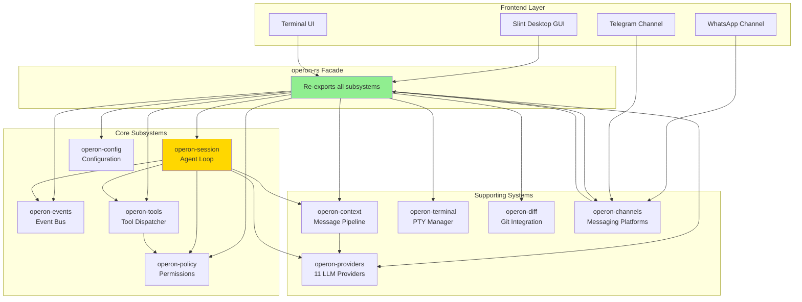

---

## Architecture Philosophy

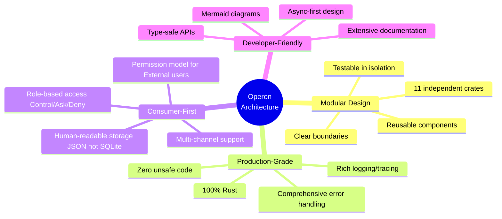

---

## System Components

### 1. Agent Loop (operon-session)

**Purpose**: The heart of agentic execution

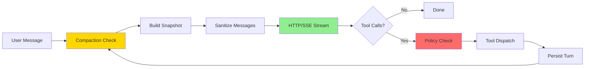

**Key Features**:
- 11-step per-turn cycle
- Real-time SSE streaming (token-by-token)
- JSON-backed persistence (human-readable, not SQLite)
- Lifecycle state machine (Idle → Running → Done/Failed)
- Command channel (Cancel/Approve/Deny from UI)

**Read more**: [operon-session README](./src/operon-session/README.md)

---

### 2. Configuration (operon-config)

**Purpose**: TOML-based config with environment overrides

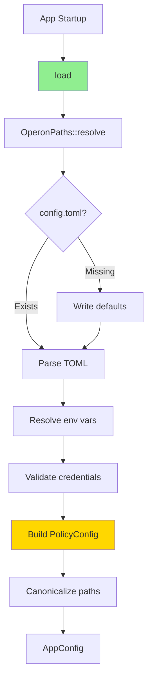

**Three-Directional Directory Model**:

| Direction | Path | Purpose |
|-----------|------|---------|
| **1** | `~/.operon/workspace/` | Default workspace (always accessible) |
| **2** | User-specified in config | Allowed directories with per-dir permissions |
| **3** | Session-specific | VS Code-style project open |

**Read more**: [operon-config README](./src/operon-config/README.md)

---

### 3. Event Bus (operon-events)

**Purpose**: Pure-types bidirectional communication

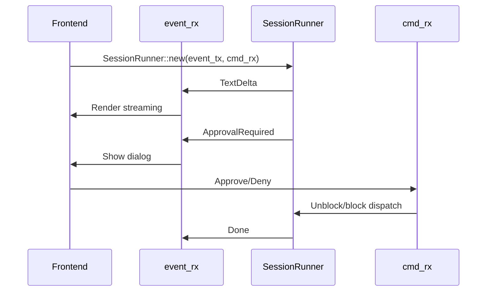

**50+ Event Types**:
- `TextDelta`, `ThinkingDelta` (streaming)
- `ToolCallStart`, `ToolCallArgsReady`, `ToolCallResult`
- `ApprovalRequired`, `ApprovalGranted`, `PermissionDenied`
- `CompactionOccurred`, `TokenUsageUpdated`, `ContextUsageUpdated`

**Read more**: [operon-events README](./src/operon-events/README.md)

---

### 4. Permission Enforcement (operon-policy)

**Purpose**: Allow/Ask/Deny gate before tool execution

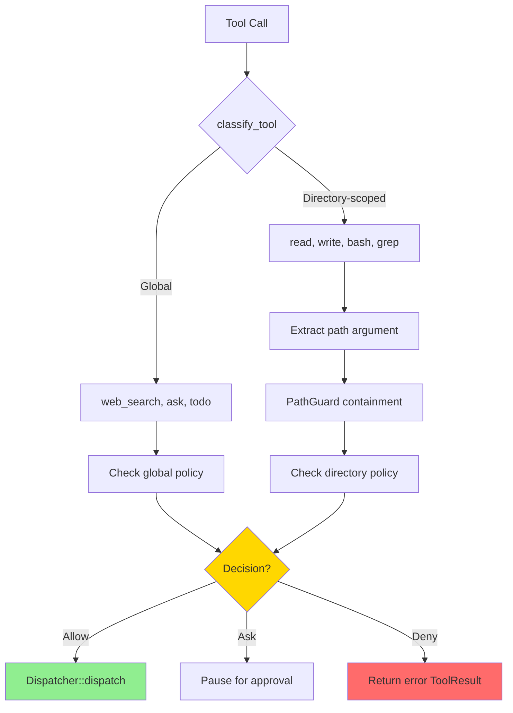

**Role-Based Isolation**:

| Role | Scope | Use Case |
|------|-------|----------|
| **Owner** | Local user, trusted staff | Full access per config |
| **External** | WhatsApp/Telegram users | Restricted by default |

**Read more**: [operon-policy README](./src/operon-policy/README.md)

---

### 5. Tool System (operon-tools)

**Purpose**: 20+ tools across 7 groups

```mermaid
graph TB
    Dispatcher[Tool Dispatcher] --> FS[Filesystem Group<br/>7 tools]
    Dispatcher --> Shell[Shell Group<br/>1 tool]
    Dispatcher --> Memory[Memory Group<br/>5 tools]
    Dispatcher --> Todo[Todo Group<br/>4 tools]
    Dispatcher --> Web[Web Group<br/>2 tools]
    Dispatcher --> Load[Load Group<br/>1 tool]
    Dispatcher --> Ask[Ask Group<br/>1 tool]
    
    FS --> Read[read<br/>Multi-file + ranges]
    FS --> Write[write<br/>Atomic create/overwrite]
    FS --> Edit[edit<br/>6-pass fuzzy hunks]
    FS --> Append[append<br/>O_APPEND mode]
    FS --> Delete[delete<br/>Trash/permanent]
    FS --> Grep[grep<br/>gitignore + FTS]
    FS --> Ls[ls<br/>Metadata + glob]
    
    Shell --> Bash[bash<br/>Stateless subprocess]
    
    Memory --> MAdd[memory_add<br/>SQLite + FTS5]
    Memory --> MEdit[memory_edit<br/>Partial update]
    Memory --> MDel[memory_delete<br/>Permanent]
    Memory --> MRetr[memory_retrieve<br/>Fetch/list]
    Memory --> MSearch[memory_search<br/>BM25 ranking]
    
    style Dispatcher fill:#FFD700
    style FS fill:#90EE90
    style Memory fill:#87CEEB
```

**Tiered Descriptions**:
- **Short** (normal): Concise, sent to model by default
- **Detailed** (after error): Full explanation + examples, auto-switches on malformed call

**Read more**: 
- [operon-tools README](./src/operon-tools/README.md)
- [operon-tools-fs README](./src/operon-tools/src/fs/README.md)
- [operon-tools-memory README](./src/operon-tools/src/memory/README.md)
- [operon-tools-shell README](./src/operon-tools/src/shell/README.md)
- [operon-tools-ask README](./src/operon-tools/src/ask/README.md)

---

### 6. Context Pipeline (operon-context)

**Purpose**: Complete message lifecycle management

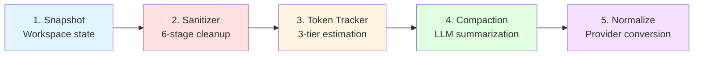

**5 Sub-Crates**:
1. **Snapshot**: Filesystem watcher, gitignore-aware tree, git status, AGENTS.md
2. **Sanitizer**: 6-stage pipeline (orphan dropping, integrity enforcement)
3. **Token Tracker**: 3-tier estimation (Exact → BPE → Heuristic)
4. **Compaction**: Message splitting, LLM summarization, turn preservation
5. **Normalize**: 11 provider support, canonical types, bidirectional conversion

**Read more**: [operon-context README](./src/operon-context/README.md)

---

### 7. Provider Integration (operon-providers)

**Purpose**: 11 LLM providers with model discovery

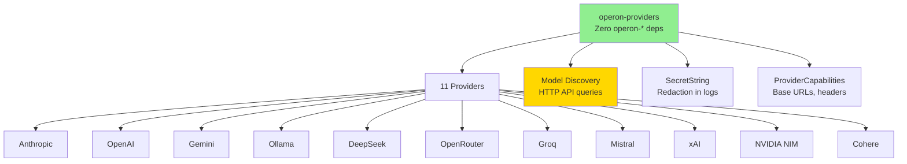

**Discovery Support**:
- ✅ **Anthropic**: `GET /v1/models` (returns context_window or context_length)
- ✅ **OpenAI**: `GET /v1/models` (OpenAI-compatible format)
- ✅ **Gemini**: `GET /v1beta/models?key={key}` (strips `models/` prefix)
- ✅ **Ollama**: `GET /api/tags` + `POST /api/show` (2 calls per model)
- ✅ **Others**: OpenAI-compatible endpoints with fallback defaults

**Read more**: [operon-providers README](./src/operon-providers/README.md)

---

### 8. Terminal Management (operon-terminal)

**Purpose**: Cross-platform PTY session manager

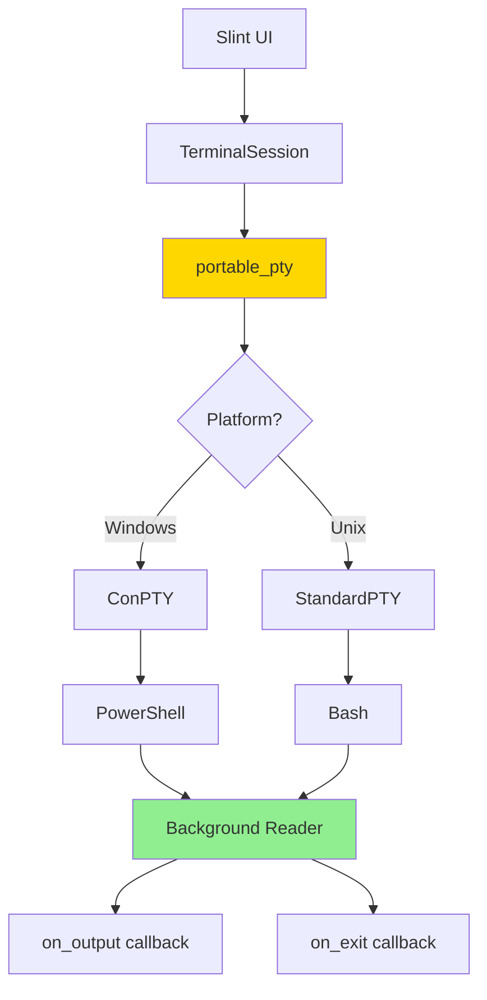

**Features**:
- Thread-safe I/O via `Arc<Mutex>`
- Concurrent write/resize operations
- Auto-kill child on EOF
- Zero-copy streaming

**Read more**: [operon-terminal README](./src/operon-terminal/README.md)

---

### 9. Git Integration (operon-diff)

**Purpose**: Production-grade Git operations

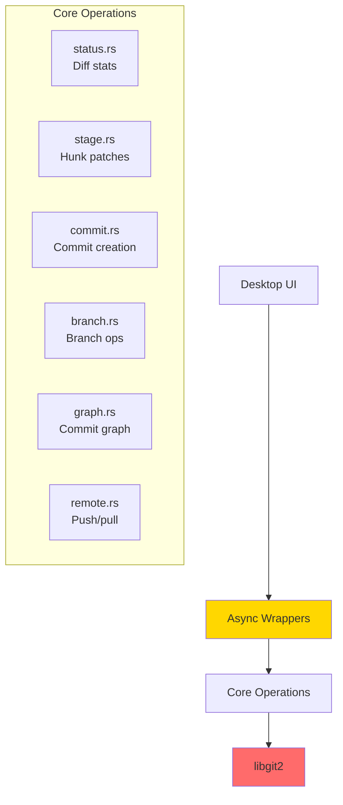

**Capabilities**:
- File-level & hunk-level staging
- Visual commit graph with branch tags
- Branch operations (create, switch, delete, rename)
- Remote operations (push, fetch, fast-forward pull)
- Multi-repository workspace tracking
- Async wrappers for all blocking operations

**Read more**: [operon-diff README](./src/operon-diff/README.md)

---

### 10. Messaging Channels (operon-channels)

**Purpose**: Multi-platform messaging integration

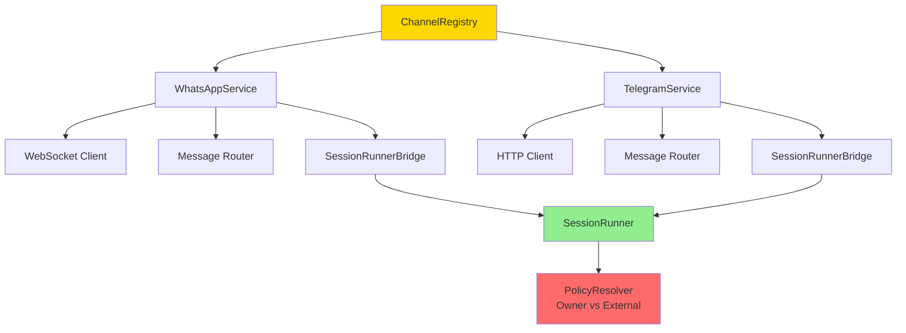

**Role Resolution**:
- **Owner**: Authenticated phone numbers, trusted contacts
- **External**: All other users (restricted permissions by default)

**Supported Platforms**:
- ✅ WhatsApp (via baileys protocol)
- ✅ Telegram (via Bot API)
- 🚧 Gmail (planned)

**Read more**: [operon-channels README](./src/operon-channels/README.md)

---

## Complete Data Flow

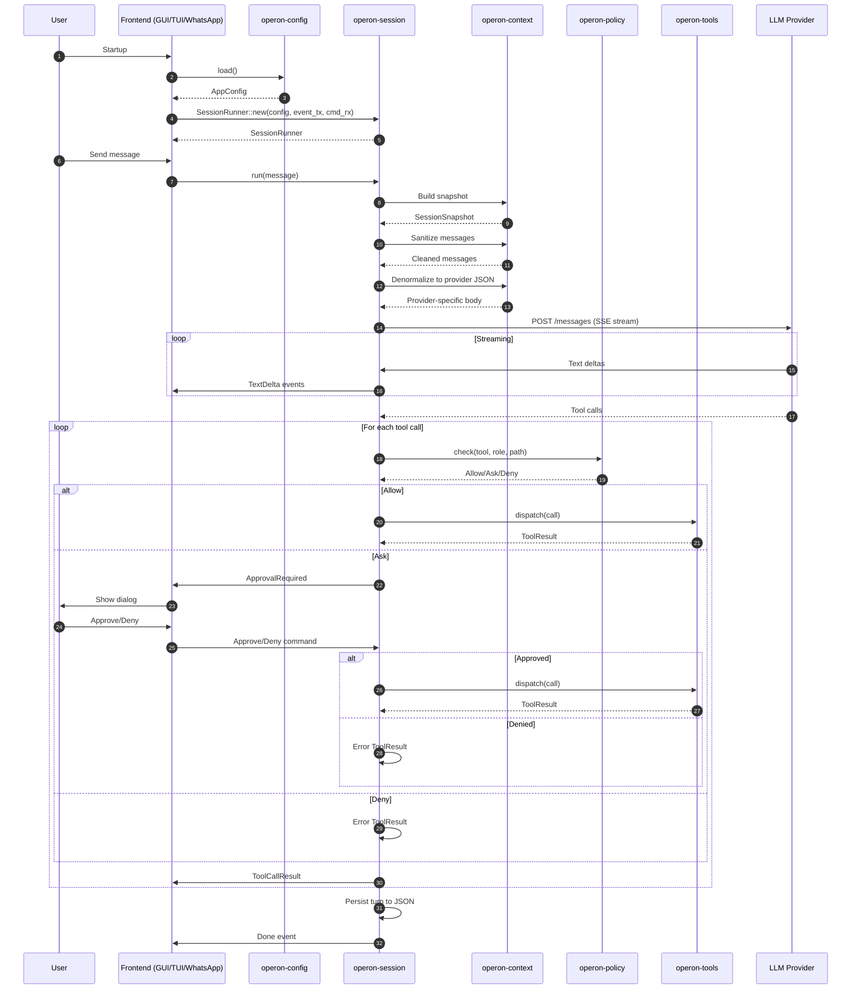

---

## Installation & Usage

### As a Library (for Frontend Developers)

```toml
[dependencies]
operon-rs = { git = "https://github.com/lukagray-dev/operon.git", branch = "main" }
tokio = { version = "1", features = ["full"] }
```

```rust
use operon_rs::*;

#[tokio::main]
async fn main() -> Result<(), Box<dyn std::error::Error>> {
    // 1. Load configuration
    let app = load()?;
    
    // 2. Build session config
    let config = SessionConfig {
        provider_config: app.provider,
        policy: app.policy,
        project_dir: None,
        workspace_root: app.paths.workspace_dir.clone(),
        role: Role::Owner,
        tool_groups: SessionConfig::default_tool_groups(),
        compaction: CompactionConfig::default(),
        store_path: Some(app.paths.session_db("my-session")),
        channel_instructions: None,
    };
    
    // 3. Create event/command channels
    let (event_tx, mut event_rx) = tokio::sync::mpsc::channel(256);
    let (cmd_tx, cmd_rx) = tokio::sync::mpsc::channel(16);
    
    // 4. Create session runner
    let mut runner = SessionRunner::new(config, event_tx, cmd_rx).await?;
    
    // 5. Spawn event listener
    tokio::spawn(async move {
        while let Some(event) = event_rx.recv().await {
            match event {
                SessionEvent::TextDelta { text } => print!("{}", text),
                SessionEvent::Done => println!("\n[Complete]"),
                _ => {}
            }
        }
    });
    
    // 6. Run agent loop
    runner.run("Hello!".to_string(), vec![], vec![]).await?;
    
    Ok(())
}
```

---

## Testing

```bash
# Test all crates
cargo test --workspace

# Test specific subsystem
cargo test -p operon-session
cargo test -p operon-policy
cargo test -p operon-tools

# With output
cargo test --workspace -- --nocapture

# Run integration tests
cargo test --test '*'
```

---

## Performance Characteristics

### Memory Usage

| Component | Idle | Under Load | Notes |
|-----------|------|------------|-------|
| **SessionRunner** | ~10 MB | ~40 MB | Includes message history |
| **Dispatcher** | ~2 MB | ~5 MB | All tool definitions |
| **MemoryStore** | ~1 MB | ~3 MB | SQLite connection pool |
| **SnapshotBuilder** | ~500 KB | ~2 MB | Cached tree + git status |
| **Total (typical)** | ~15 MB | ~50 MB | Single active session |

**Comparison**: Electron-based agents use 300 MB – 2 GB at idle.

---

### Latency

| Operation | Typical | Notes |
|-----------|---------|-------|
| **Config load** | < 5 ms | TOML parse + validation |
| **Session start** | < 50 ms | Includes policy setup |
| **Policy check** | < 100 μs | Path canonicalization dominates |
| **Tool dispatch** | < 1 ms | Excluding tool execution time |
| **Snapshot build** | 5-20 ms | gitignore-aware tree walk |
| **Message sanitization** | < 1 ms | 6-stage pipeline |
| **Token estimation (BPE)** | 2-5 ms | Per 1000 tokens |
| **Compaction** | 5-15s | LLM call dominates |

---

## Directory Structure

```
operon-rs/
├── src/
│   ├── lib.rs                      ← Facade (re-exports all crates)
│   ├── operon-config/              ← Configuration management
│   ├── operon-session/             ← Agent loop orchestrator
│   ├── operon-events/              ← Event bus (zero deps)
│   ├── operon-policy/              ← Permission enforcement
│   ├── operon-context/             ← Message pipeline (5 sub-crates)
│   ├── operon-providers/           ← 11 LLM providers
│   ├── operon-tools/               ← Tool dispatcher + 7 groups
│   ├── operon-terminal/            ← PTY session manager
│   ├── operon-diff/                ← Git integration (libgit2)
│   └── operon-channels/            ← WhatsApp/Telegram
├── Cargo.toml                      ← Workspace manifest
└── README.md                       ← This file
```

---

## Design Principles

### 1. Modularity

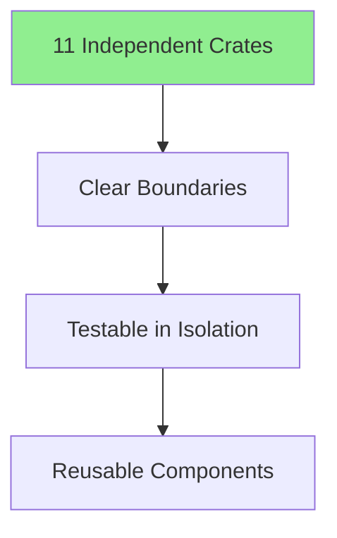

**Example**: `operon-providers` has **zero operon-\* dependencies**, making it the foundation that all normalize crates depend on.

---

### 2. Production-Grade

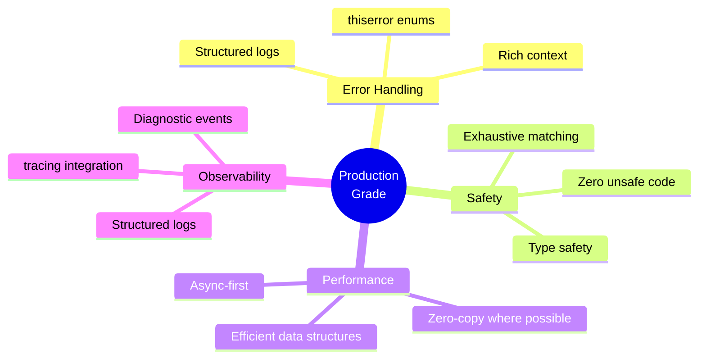

---

### 3. Consumer-First

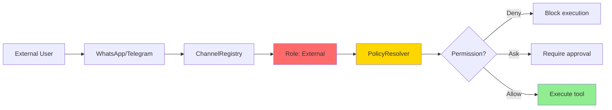

**Protection Mechanisms**:
- Role-based isolation (Owner vs External)
- Per-directory permissions
- Path containment checks
- Symlink-safe canonicalization
- Command approval gates

---

### 4. Human-Readable Storage

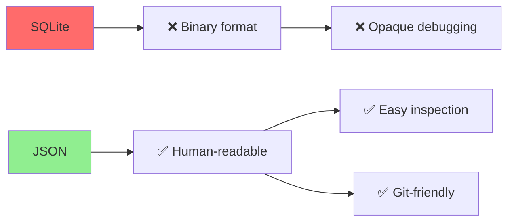

**Example**: Session store moved from SQLite to JSON for transparency.

---

## Contributing

Contributions are welcome! For large features or architectural changes, open an issue first to align before implementation.

### Bug Reports

Include:
- OS / distro
- Rust version
- Operon version / commit hash
- Model provider used
- Logs or error output
- Minimal reproduction steps

---

## Performance Comparison

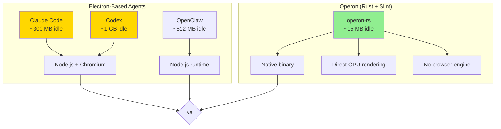

| Metric | Operon | Claude Code | Codex | OpenClaw |
|--------|--------|-------------|-------|----------|
| **Runtime** | Rust + Slint | Node + Electron | Node + Electron | Node.js |
| **Idle RAM** | **~70 MB** | ~300 MB | ~1 GB | ~512 MB |
| **Under Load** | **< 90 MB** | 500 MB – 2+ GB | 2+ GB | 512 MB – 7 GB |
| **Startup** | **< 50 ms** | ~2s | ~3s | ~1s |

---

## License

Operon is licensed under the **GNU Affero General Public License v3.0 (AGPLv3)**.

See [LICENSE](../../LICENSE) for full terms.

---

## Links

- **Main Repository**: [github.com/lukagray-dev/operon](https://github.com/lukagray-dev/operon)
- **Documentation**: See individual crate READMEs
- **Issues**: [github.com/lukagray-dev/operon/issues](https://github.com/lukagray-dev/operon/issues)

---

## Related Crates

| Crate | Purpose | README |
|-------|---------|--------|
| **operon-config** | Configuration management | [Link](./src/operon-config/README.md) |
| **operon-session** | Agent loop orchestrator | [Link](./src/operon-session/README.md) |
| **operon-events** | Event bus (zero deps) | [Link](./src/operon-events/README.md) |
| **operon-policy** | Permission enforcement | [Link](./src/operon-policy/README.md) |
| **operon-context** | Message pipeline | [Link](./src/operon-context/README.md) |
| **operon-providers** | 11 LLM providers | [Link](./src/operon-providers/README.md) |
| **operon-tools** | Tool dispatcher | [Link](./src/operon-tools/README.md) |
| **operon-terminal** | PTY manager | [Link](./src/operon-terminal/README.md) |
| **operon-diff** | Git integration | [Link](./src/operon-diff/README.md) |
| **operon-channels** | Messaging platforms | [Link](./src/operon-channels/README.md) |

---

<div align="center">

<br/>

Built by **Luka Gray (aka Soumo Mukherjee)** • West Bengal, India • 2026

*"The best tools disappear. You stop thinking about the tool and start thinking about the work."*

<br/>

**[GitHub](https://github.com/lukagray-dev) • [Instagram](https://www.instagram.com/lukagray.official) • [Email](mailto:heylukagray@gmail.com)**

<br/>

</div>
