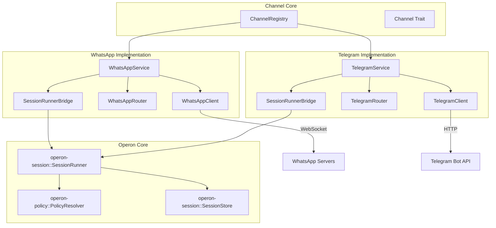
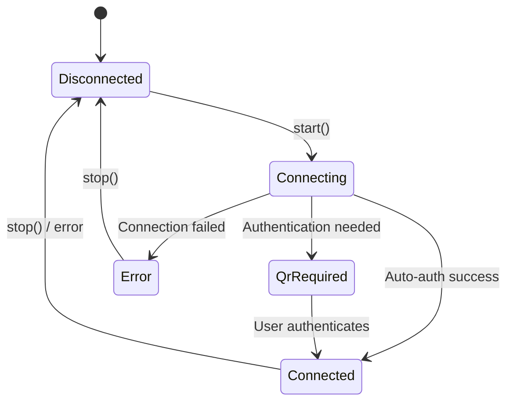
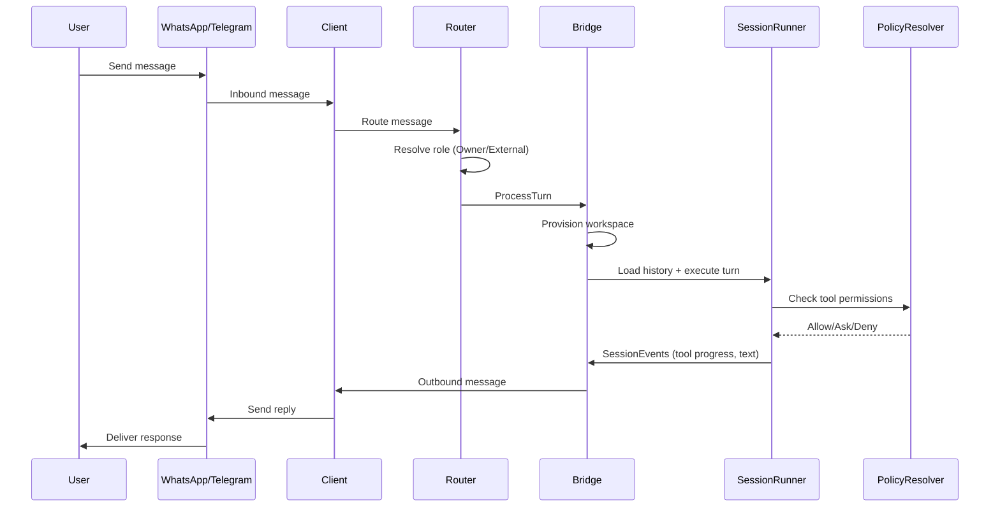
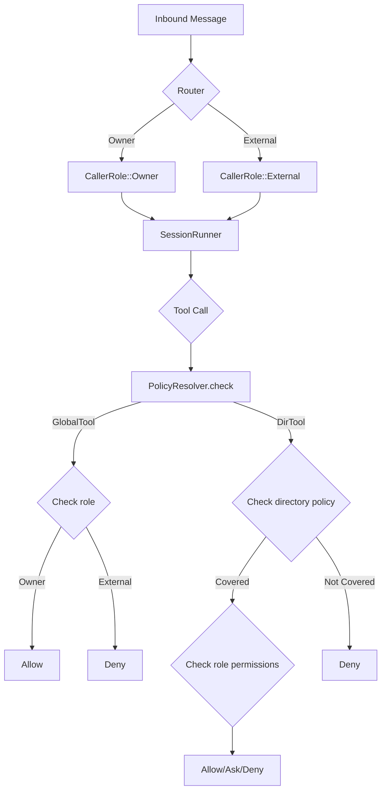
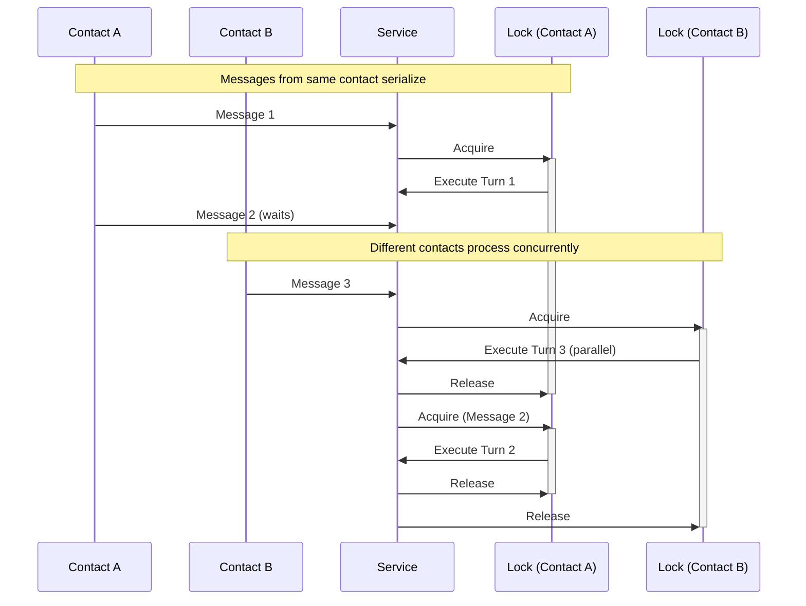

# operon-channels

**Production-grade messaging channel abstraction for Operon AI agent**

`operon-channels` provides a unified, trait-based architecture enabling Operon to communicate with users through multiple messaging platforms (WhatsApp, Telegram) while maintaining consistent permission enforcement, session management, and message routing patterns.

---

## Architecture Overview



---

## Core Concepts

### Channel Trait

All messaging platforms implement the `Channel` trait, providing:

| Method | Purpose |
|--------|---------|
| `id()` | Returns unique `ChannelId` (WhatsApp, Telegram, Other) |
| `start()` | Initiates background engine and network listeners |
| `stop()` | Gracefully shuts down connection and tasks |
| `status()` | Returns current `ChannelStatus` |
| `subscribe_qr()` | Provides QR code updates for authentication |

### Connection Lifecycle



### Message Flow



---

## Key Features

### 🎯 Unified Abstraction

- Single `Channel` trait for all messaging platforms
- Platform-agnostic `ChannelMessage` type
- Thread-safe `ChannelRegistry` for multi-channel management

### 🔒 Role-Based Access Control

- **Owner**: Main number + allowlist contacts (full access)
- **External**: All other contacts (restricted by policy)
- **Session-pinned roles**: Evaluated once per session, preventing mid-turn races

### 💾 Persistent Sessions

- Per-contact session storage: `~/.operon/sessions/{platform}/<contact>/<session_id>.json`
- Automatic history restoration across messages
- Turn persistence via `operon-session::SessionStore`

### ⚡ Sequential Processing

- Per-contact mutex locks guarantee message order
- Concurrent processing across different contacts
- Automatic lock cleanup after turn completion

### 🔄 Turn Cancellation

- `/new` command aborts in-flight turns
- Sends `SessionCommand::Cancel` to active `SessionRunner`
- Generates fresh session ID and notifies user

### 📦 Buffered Outbound Queue

- Buffers messages during disconnection
- FIFO delivery guarantee
- Automatic flush on reconnection

---

## Permission Model

### Workspace Isolation

All channel contacts use a **shared workspace** directory (`~/.operon/workspace/`) to guarantee `PolicyConfig` coverage:

```
~/.operon/
├── workspace/              # Shared workspace for all channel contacts
│   └── AGENTS.md          # Channel-specific agent instructions
├── sessions/
│   ├── whatsapp/          # WhatsApp session storage
│   │   └── <phone>/
│   │       └── <session_id>.json
│   └── telegram/          # Telegram session storage
│       └── <chat_id>/
│           └── <session_id>.json
└── channels/
    ├── whatsapp/
    │   └── auth/          # WhatsApp credentials (0600 permissions)
    └── telegram/
        └── auth/          # Telegram bot tokens
```

### Policy Enforcement Flow



### Critical Design: Policy Coverage

**All channel workspaces MUST be covered by a `DirectoryPolicy` entry in `AppConfig.policy`, or all tool calls will silently fail.**

Example policy configuration:

```toml
[[policy.directory_policies]]
path = "/home/user/.operon/workspace"
owners_can_read = true
owners_can_write = true
owners_can_run_code = true
owners_require_confirmation_to = ["write", "run_code"]
external_can_read = false
external_can_write = false
external_can_run_code = false
```

---

## Implementation Comparison

| Feature | WhatsApp | Telegram |
|---------|----------|----------|
| **Transport** | WebSocket (WhatsApp Web) | HTTP Long-Polling |
| **Authentication** | QR Code + Pairing Code | Bot Token (config) |
| **Library** | `whatsapp-rust` | Raw `reqwest` |
| **Message Format** | GFM → WhatsApp markdown | GFM → MarkdownV2 |
| **Character Limit** | ~65KB (practical limit) | 4096 (auto-split) |
| **Owner Resolution** | Phone number + allowlist | Chat ID + allowlist |
| **Session ID Format** | `wa-{hex_timestamp}` | `tg-{hex_timestamp}` |
| **Credentials Path** | `~/.operon/channels/whatsapp/auth/` | `~/.operon/channels/telegram/auth/` |

---

## Usage

### Registering Channels

```rust
use operon_channels::{ChannelRegistry, whatsapp::WhatsAppService, telegram::TelegramService};

#[tokio::main]
async fn main() -> Result<(), Box<dyn std::error::Error>> {
    let registry = ChannelRegistry::new();
    
    // Register WhatsApp channel
    let wa_service = Arc::new(WhatsAppService::new(
        wa_client,
        wa_config,
        app_config.clone(),
    ));
    registry.register(wa_service.clone()).await;
    
    // Register Telegram channel
    let tg_service = Arc::new(TelegramService::new(
        tg_client,
        tg_config,
        app_config.clone(),
    ));
    registry.register(tg_service.clone()).await;
    
    // Start channels
    registry.start_channel(&ChannelId::WhatsApp).await?;
    registry.start_channel(&ChannelId::Telegram).await?;
    
    Ok(())
}
```

### Checking Channel Status

```rust
let status = registry.get_status(&ChannelId::WhatsApp).await?;
match status {
    ChannelStatus::Connected => println!("WhatsApp is online"),
    ChannelStatus::QrRequired(qr) => println!("Scan QR: {}", qr.payload),
    ChannelStatus::Disconnected => println!("WhatsApp is offline"),
    _ => {}
}
```

---

## Message Processing Guarantees

### Sequential Per-Contact Processing

Messages from the same contact are processed sequentially:



### Automatic Lock Cleanup

Locks are pruned when `Arc::strong_count == 2` (registry + task reference only), preventing memory leaks.

---

## Error Handling

| Error Type | Description | Recovery |
|------------|-------------|----------|
| `NotRegistered` | Channel not found in registry | Register channel first |
| `AlreadyRunning` | `start()` called on running channel | Check status before starting |
| `Execution` | Runtime error in channel engine | Check logs, retry connection |
| `Io` | File system error (credentials, storage) | Verify permissions and paths |

---

## Security Considerations

### Credential Protection

- **Unix**: File permissions `0600` (owner read/write only)
- **Windows**: ACL-based permission hardening
- **No encryption-at-rest**: Relies on OS-level protection

### First-Time Onboarding

New contacts automatically receive onboarding documentation:

```
👋 *Welcome to Operon!*

I am your autonomous AI assistant running locally on Operon.

💡 *Shortcuts & Tips:*
• Send `/new` anytime to start a fresh, clean session.
• You can ask questions, run web searches, analyze files, and manage tasks.

_Starting your session now..._
```

### Role-Specific Instructions

Generated in-memory per turn via `generate_owner_channel_instructions()` / `generate_external_channel_instructions()` and injected via `SessionConfig.channel_instructions`, eliminating concurrent-write race conditions on shared `AGENTS.md` files.

---

## Dependencies

| Crate | Purpose |
|-------|---------|
| `operon-session` | SessionRunner orchestration and turn execution |
| `operon-policy` | CallerRole and PolicyResolver for permission checks |
| `operon-config` | AppConfig, ProviderConfig, PolicyConfig |
| `operon-events` | SessionEvent, SessionCommand messaging |
| `tokio` | Async runtime and mpsc channels |
| `whatsapp-rust` (WhatsApp) | Multi-device protocol implementation |
| `reqwest` (Telegram) | HTTP client for Bot API |

---

## Testing

Run the test suite:

```bash
cargo test --package operon-channels
```

Run tests for a specific channel:

```bash
cargo test --package operon-channels-whatsapp
cargo test --package operon-channels-telegram
```

---

## Contributing

When implementing a new channel:

1. Implement the `Channel` trait
2. Create `Client`, `Router`, `Service`, and `SessionRunnerBridge` components
3. Handle platform-specific authentication flows
4. Implement outbound message formatting
5. Add comprehensive tests for role resolution and session management
6. Document authentication mechanism and message flow

---

## License

Operon is licensed under the **GNU Affero General Public License v3.0 (AGPLv3)**.

---

> Built by **Luka Gray (aka Soumo Mukherjee)** • West Bengal, India • 2026
