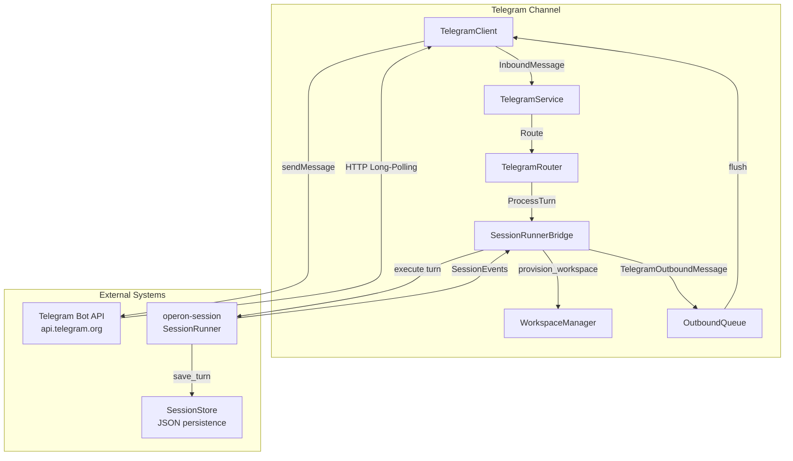
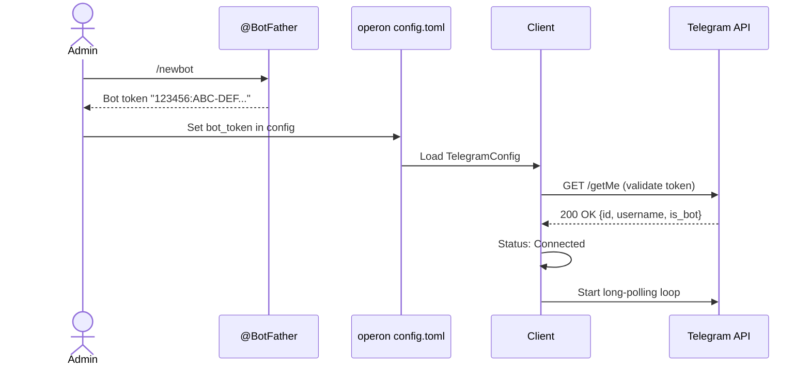
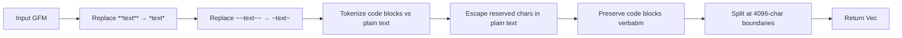

# operon-channels-telegram

**Production-grade Telegram Bot API integration for Operon AI agent**

This crate implements the Telegram messaging channel for Operon, enabling autonomous AI interactions over Telegram using the Bot API with lightweight raw HTTP via `reqwest`.

---

## Architecture



---

## Key Components

### TelegramClient (`client.rs`)

Lightweight HTTP client for Telegram Bot API built with raw `reqwest` (no third-party frameworks).

**Responsibilities:**
- Bot token validation via `getMe` endpoint
- 30-second long-polling loop (`getUpdates` with `timeout: 30`)
- HTTP client timeout set to 35s to prevent client-side timeouts
- Inbound message parsing and outbound message delivery with MarkdownV2 fallback

**Authentication Flow:**



**Connection Status Flow:**

$$
\text{Disconnected} \xrightarrow{\text{connect()}} \text{Connecting} \xrightarrow{\text{getMe success}} \text{Connected}
$$

$$
\text{Connecting} \xrightarrow{\text{getMe failed}} \text{Error}
$$

**Long-Polling Loop:**

```rust
// 30s long-poll with offset tracking
let poll_payload = serde_json::json!({
    "offset": current_offset,
    "timeout": 30,
    "allowed_updates": ["message"]
});

// HTTP timeout: 35s (5s buffer over long-poll timeout)
let http = reqwest::Client::builder()
    .timeout(Duration::from_secs(35))
    .build()?;
```

**Key Methods:**

| Method | Purpose |
|--------|---------|
| `connect()` | Validates bot token and spawns long-poll loop |
| `disconnect()` | Stops long-poll loop and transitions to Disconnected |
| `status()` | Returns current `ConnectionStatus` |
| `send_message(chat_id, text)` | Sends text with MarkdownV2, falls back to plain text on 400 |
| `take_message_receiver()` | Consumes inbound message mpsc receiver |
| `is_running()` | Checks if long-poll loop is active |

**MarkdownV2 Fallback:**

When `sendMessage` with `parse_mode: "MarkdownV2"` returns HTTP 400:

1. Logs full error response body
2. Retries **once** in plain text mode (omitting `parse_mode`)
3. Returns success if plain text send succeeds

```rust
// First attempt: MarkdownV2
let markdown_payload = serde_json::json!({
    "chat_id": chat_id,
    "text": text,
    "parse_mode": "MarkdownV2"
});

// On 400 error, retry without parse_mode
let plain_payload = serde_json::json!({
    "chat_id": chat_id,
    "text": text
});
```

---

### TelegramRouter (`router.rs`)

Message routing engine with **session-pinned role resolution** and turn cancellation support.

**Architecture Pattern:** Identical to WhatsApp router with platform-specific types (`ChatId` instead of `ContactId`).

**Core Concept: Session-Pinned Roles**

```mermaid
stateDiagram-v2
    [*] --> EvaluateRole: First message
    EvaluateRole --> PinOwner: is_owner() || is_self
    EvaluateRole --> PinExternal: Otherwise
    PinOwner --> ActiveSession: Store session with Owner role
    PinExternal --> ActiveSession: Store session with External role
    ActiveSession --> ActiveSession: Subsequent messages (role unchanged)
    ActiveSession --> EvaluateRole: /new command or reset
```



**Turn Cancellation on `/new`:**

| Step | Action |
|------|--------|
| 1 | User sends `/new` during active turn |
| 2 | Router sends `SessionCommand::Cancel` to `cmd_tx` |
| 3 | Bridge aborts `runner_handle` task |
| 4 | Router generates fresh `session_id` with re-evaluated role |
| 5 | Sends notification: `✨ Fresh session started.` |

**Key Methods:**

| Method | Purpose |
|--------|---------|
| `route(msg)` | Returns `RouteOutcome` (FreshSessionRequested or ProcessTurn) |
| `register_cmd_tx(chat, session_id, cmd_tx)` | Wires cancellation channel |
| `unregister_cmd_tx(chat, session_id)` | Cleans up after turn completion |
| `is_owner(chat)` | Checks owner chat ID + allowlist |
| `reset_session(chat)` | Programmatically resets session |

**Session ID Format:** `tg-{hex_timestamp}` (e.g., `tg-19a2b3c4d5e6f708`)

---

### TelegramService (`service.rs`)

Central orchestration loop coordinating all Telegram channel components.

**Orchestration Pattern:** Parallel to WhatsApp with same sequential per-contact processing and outbound queue management.

**Per-Chat Sequential Processing:**

```mermaid
gantt
    title Message Processing Timeline
    dateFormat X
    axisFormat %L
    
    section Chat A
    Message 1    :active, 0, 100
    Message 2 waits :crit, 0, 100
    Message 2 starts :active, 100, 200
    
    section Chat B
    Message 3    :active, 20, 120
```

Messages from the same chat serialize via `Arc<AsyncMutex<()>>` lock:



**Automatic Lock Cleanup:**

Same pattern as WhatsApp — locks pruned when `Arc::strong_count == 2`.

---

### SessionRunnerBridge (`runner_bridge.rs`)

Integration layer connecting Telegram messages to `operon-session::SessionRunner`.

**Turn Processing Pipeline:** Identical to WhatsApp with platform-specific formatting.

**Session Storage:**

- **Path:** `~/.operon/sessions/telegram/<chat_id>/<session_id>.json`
- **Format:** `operon-session::SessionStore` JSON schema
- **Persistence:** Automatic via `SessionRunner`

**Workspace Structure:**

```
~/.operon/
└── workspace/              # Shared workspace for all channel contacts
    └── AGENTS.md          # Role-specific agent instructions (regenerated per turn)
```

**Event Forwarding:**

| SessionEvent | Telegram Action |
|--------------|-----------------|
| `ToolCallStart { name }` | Send `⚡ *Executing:* name` |
| `TextDelta { text }` | Accumulate response text |
| `Done` | Format and send via `format_for_telegram()` |
| `Error { message }` | Send `❌ *Error:* message` |
| `ApprovalRequired { tool }` | Notify user to approve in GUI |

**First-Time Onboarding:**

```
👋 *Welcome to Operon!*

I am your autonomous AI assistant running locally on Operon.

💡 *Shortcuts & Tips:*
• Send `/new` anytime to start a fresh, clean session.
• You can ask questions, run web searches, analyze files, and manage tasks.

_Starting your session now..._
```

---

### OutboundQueue (`outbound.rs`)

Buffered message queue with FIFO guarantee and 4096-character message splitting.

**Queue Behavior:** Same as WhatsApp with additional message splitting for Telegram's limits.

**Message Splitting:**

Telegram enforces a **4096 character limit** per message. Long responses are automatically split:

```
Message 1: [first 4096 chars]

(continues...)

─────────────────────

Message 2: (continued)

[next chunk]

(continues...)

─────────────────────

Message 3: (continued)

[final chunk]
```

**Code Fence Preservation:**

When a code block spans multiple messages:

```
Message 1:
Here's the code:
```python
def example():
    pass
```
(continues...)

─────────────────────

Message 2: (continued)
```python
    # More code here
```
```

---

### Message Formatting (`outbound.rs`)

GFM (GitHub Flavored Markdown) to Telegram MarkdownV2 conversion with strict escaping.

**MarkdownV2 Reserved Characters:**

```rust
const RESERVED_MARKDOWN_V2_CHARS: &[char] = &[
    '_', '*', '[', ']', '(', ')', '~', '`', '>', '#', 
    '+', '-', '=', '|', '{', '}', '.', '!'
];
```

**Conversion Rules:**

| GFM | Telegram MarkdownV2 |
|-----|---------------------|
| `**bold**` | `*bold*` |
| `~~strikethrough~~` | `~strikethrough~` |
| `` `code` `` | `` `code` `` (preserved) |
| Plain text `.` | `\.` (escaped) |
| Plain text `!` | `\!` (escaped) |

**Processing Pipeline:**



**UTF-8 Safety:**

Uses `char_indices()` for multi-byte character safety:

```rust
pub fn escape_markdown_v2_text(text: &str) -> String {
    let mut escaped = String::with_capacity(text.len() * 2);
    for c in text.chars() {
        if is_reserved_markdown_char(c) {
            escaped.push('\\');
        }
        escaped.push(c);
    }
    escaped
}
```

**Test Coverage:**

- ✅ Emoji and non-Latin script (Bengali, Japanese) surrounding `*bold*` markers
- ✅ Reserved character escaping (e.g., `Hello!` → `Hello\!`)
- ✅ Code fence preservation across message splits
- ✅ Mixed multi-byte and ASCII formatting

---

## Configuration

### TelegramConfig Schema

```toml
[channels.telegram]
enabled = true
bot_token = "123456:ABC-DEF1234ghIkl-zyx57W2v1u123ew11"
owner_chat_id = 123456789              # Main owner chat ID
allowed_chat_ids = [987654321]         # Additional owner chat IDs
workspace_base = "~/.operon/workspace"
session_base = "~/.operon/sessions/telegram"
poll_interval_secs = 30                # Long-polling timeout (default: 30)
```

### Creating a Telegram Bot

1. **Message @BotFather on Telegram**
   ```
   /newbot
   ```

2. **Provide bot name and username**
   ```
   Name: Operon AI Assistant
   Username: operon_assistant_bot
   ```

3. **Copy bot token**
   ```
   123456:ABC-DEF1234ghIkl-zyx57W2v1u123ew11
   ```

4. **Add to config**
   ```toml
   [channels.telegram]
   bot_token = "123456:ABC-DEF1234ghIkl-zyx57W2v1u123ew11"
   ```

5. **Find your chat ID**
   - Send a message to your bot
   - Check logs for `chat_id` in inbound message

### Policy Coverage Requirement

**Critical:** The workspace directory MUST be covered by a `DirectoryPolicy`:

```toml
[[policy.directory_policies]]
path = "/home/user/.operon/workspace"
owners_can_read = true
owners_can_write = true
owners_can_run_code = true
owners_require_confirmation_to = ["write", "run_code"]
external_can_read = false
external_can_write = false
external_can_run_code = false
```

---

## Usage Example

```rust
use operon_channels_telegram::{TelegramClient, TelegramService};
use operon_config::AppConfig;
use std::sync::Arc;

#[tokio::main]
async fn main() -> Result<(), Box<dyn std::error::Error>> {
    let app_config = AppConfig::load()?;
    let tg_config = app_config.channels.telegram.clone();
    
    // Create and connect client
    let client = Arc::new(TelegramClient::new(tg_config.clone()));
    client.connect().await?;
    
    // Check status
    match client.status().await {
        ConnectionStatus::Connected => {
            println!("Telegram bot connected!");
        }
        ConnectionStatus::Error(e) => {
            eprintln!("Connection failed: {}", e);
        }
        _ => {}
    }
    
    // Create and run service
    let service = TelegramService::new(client, tg_config, app_config);
    service.run().await?;
    
    Ok(())
}
```

---

## Comparison with WhatsApp

| Feature | WhatsApp | Telegram |
|---------|----------|----------|
| **Transport** | WebSocket | HTTP Long-Polling |
| **Authentication** | QR Code + Pairing Code | Bot Token (from @BotFather) |
| **Library** | `whatsapp-rust` | Raw `reqwest` |
| **Message Format** | GFM → WhatsApp markdown | GFM → MarkdownV2 + escaping |
| **Character Limit** | ~65KB (practical limit) | 4096 (auto-split with continuation markers) |
| **Owner Resolution** | Phone number + allowlist | Chat ID + allowlist |
| **Session ID Format** | `wa-{hex_timestamp}` | `tg-{hex_timestamp}` |
| **Setup Complexity** | Requires phone linking | Simple bot token config |
| **Runtime Overhead** | WebSocket connection | HTTP polling (35s timeout) |

---

## Testing

Run the test suite:

```bash
cargo test -p operon-channels-telegram
```

Run specific test:

```bash
cargo test -p operon-channels-telegram router::tests::cancels_in_flight_turn_on_new
```

**Key Test Cases:**

- ✅ `/new` cancels in-flight turn and sends confirmation
- ✅ Role pinned per session, re-evaluated on `/new`
- ✅ OutboundQueue buffers messages while disconnected
- ✅ MarkdownV2 escaping for reserved characters
- ✅ Message splitting preserves code fences
- ✅ UTF-8 safe formatting (no panics on emoji)
- ✅ Per-chat sequential processing with lock cleanup
- ✅ MarkdownV2 fallback to plain text on 400 error

---

## Error Handling

| Error Type | Description | Recovery |
|------------|-------------|----------|
| `ConnectionFailed` | `getMe` validation failed | Check bot token validity |
| `InvalidBotToken` | Token format invalid | Verify token from @BotFather |
| `MessageSendFailed` | Failed to send outbound message | Buffered in OutboundQueue |
| `SessionStorageError` | JSON persistence failed | Check disk space and permissions |
| `WorkspaceProvisionError` | Failed to create workspace | Verify parent directory permissions |

---

## Performance Characteristics

| Metric | Value |
|--------|-------|
| **Memory per chat** | ~2-5 KB (session state only) |
| **Inbound message latency** | <200ms (long-poll + route + execute) |
| **Long-poll timeout** | 30s (configurable) |
| **HTTP client timeout** | 35s (5s buffer) |
| **Outbound queue capacity** | Unbounded (Vec) |
| **Concurrent chats** | Limited by OS thread pool |
| **Lock contention** | O(1) per chat (HashMap lookup) |

---

## Security Considerations

### Threat Model

| Threat | Mitigation |
|--------|------------|
| **Bot token theft** | Store in config with restrictive file permissions |
| **Prompt injection** | PolicyResolver enforces tool restrictions per role |
| **Unauthorized access** | Allowlist + session-pinned role checks |
| **Mid-turn role escalation** | Session pinning prevents mid-turn role changes |

### Bot Token Security

**Best Practices:**

- ✅ Store token in `~/.operon/config.toml` with `0600` permissions
- ✅ Never commit token to version control (use environment variables in CI/CD)
- ✅ Regenerate token via @BotFather if compromised
- ✅ Use separate bots for development and production

**Environment Variable Override:**

```bash
export OPERON_TELEGRAM_BOT_TOKEN="123456:ABC-DEF..."
operon gui
```

---

## Telegram Bot API Limits

| Limit | Value | Operon Handling |
|-------|-------|-----------------|
| **Message length** | 4096 chars | Auto-split with continuation markers |
| **Messages per second** | ~30 | OutboundQueue rate limiting (future) |
| **Messages per minute** | ~20/chat | No built-in throttling (rely on Telegram's 429 errors) |
| **Long-poll timeout** | Max 50s | Default 30s (configurable) |

---

## Dependencies

| Crate | Version | Purpose |
|-------|---------|---------|
| `reqwest` | 0.11 | HTTP client for Bot API |
| `tokio` | 1.x | Async runtime |
| `operon-session` | Workspace | SessionRunner orchestration |
| `operon-policy` | Workspace | Permission checks |
| `operon-config` | Workspace | Configuration loading |
| `operon-events` | Workspace | SessionEvent/SessionCommand types |
| `serde` | 1.x | Config and JSON serialization |
| `serde_json` | 1.x | Bot API request/response |
| `tracing` | 0.1 | Structured logging |

---

## Contributing

When contributing to Telegram channel:

1. **Test with real Telegram bots** (use @BotFather for test bots)
2. **Preserve session pinning semantics** (critical for security)
3. **Maintain MarkdownV2 escaping correctness** (strict Telegram validation)
4. **Test message splitting edge cases** (code fences, long URLs)
5. **Document breaking changes** to public API

---

## License

Operon is licensed under the **GNU Affero General Public License v3.0 (AGPLv3)**.

---

> Built by **Luka Gray (aka Soumo Mukherjee)** • West Bengal, India • 2026
