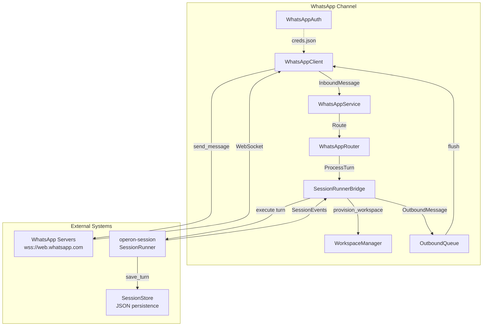
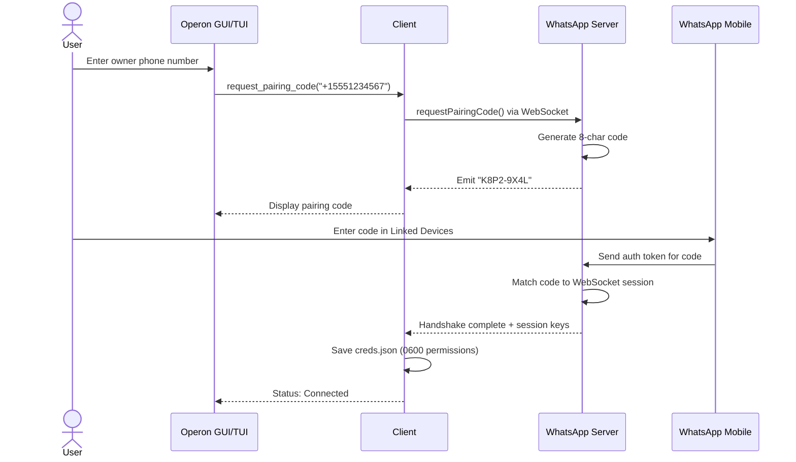
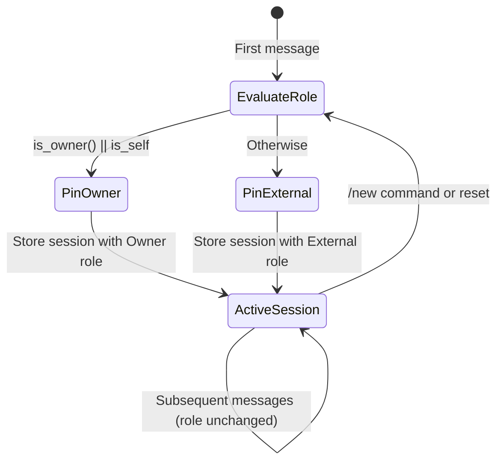
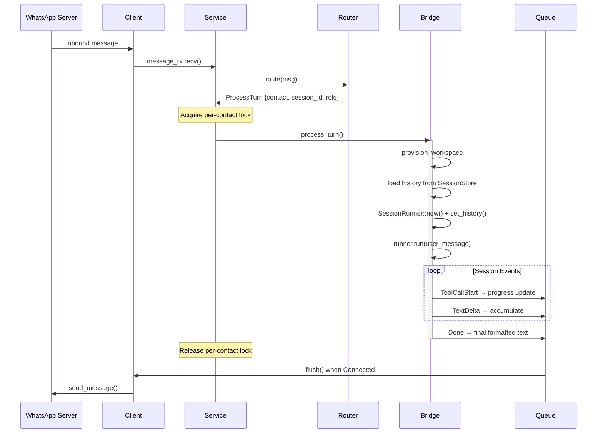
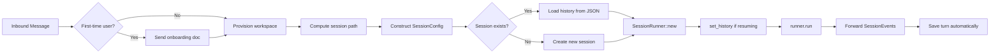
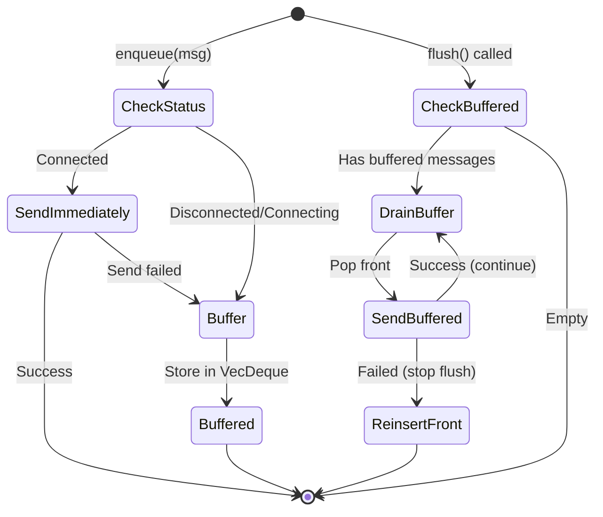

# operon-channels-whatsapp

**Production-grade WhatsApp Multi-Device integration for Operon AI agent**

This crate implements the WhatsApp messaging channel for Operon, enabling autonomous AI interactions over WhatsApp using the Multi-Device protocol via `whatsapp-rust` library.

---

## Architecture



---

## Key Components

### WhatsAppClient (`client.rs`)

Low-level WhatsApp Web Multi-Device connection manager built on `whatsapp-rust`.

**Responsibilities:**
- WebSocket connection lifecycle to `web.whatsapp.com`
- QR code and pairing code authentication flows
- Inbound message parsing and outbound message delivery
- Connection status tracking and recovery

**Authentication Flow:**



**Connection Status Flow:**

$$
\text{Disconnected} \xrightarrow{\text{connect()}} \text{Connecting} \xrightarrow{\text{auth success}} \text{Connected}
$$

$$
\text{Connecting} \xrightarrow{\text{auth needed}} \text{QrRequired} \xrightarrow{\text{scan/pair}} \text{Connected}
$$

**Key Methods:**

| Method | Purpose |
|--------|---------|
| `connect()` | Initiates WebSocket connection and auth flow |
| `disconnect()` | Cleanly closes connection and tasks |
| `status()` | Returns current `ConnectionStatus` |
| `send_message(jid, text)` | Sends text message to WhatsApp JID |
| `request_pairing_code(phone)` | Requests 8-char pairing code |
| `take_message_receiver()` | Consumes inbound message mpsc receiver |
| `subscribe_qr()` | Returns QR code update channel |

**Design Notes:**
- Maintains `sent_message_ids: HashSet<MessageId>` to filter outbound message echoes
- Tracks `reply_targets: HashMap<MessageId, Jid>` to preserve original WhatsApp namespace (LID vs phone-number JID) for reliable Multi-Device routing
- Initial status derived from persisted device existence in `session.db`

---

### WhatsAppRouter (`router.rs`)

Message routing engine with **session-pinned role resolution** and turn cancellation support.

**Core Concept: Session-Pinned Roles**



**Why Session Pinning?**
- Prevents mid-turn role changes if allowlist is modified during execution
- Provides audit trail of what permissions a session actually ran under
- Role re-evaluated only on `/new` command or first contact

**Turn Cancellation on `/new`:**

When a user sends `/new` while a turn is running:

1. Router sends `SessionCommand::Cancel` to active `SessionRunner` via registered `cmd_tx`
2. Bridge aborts `runner_handle` task
3. Generates fresh `session_id` with re-evaluated role
4. Sends notification: `✨ Fresh session started.`

**Key Methods:**

| Method | Purpose |
|--------|---------|
| `route(msg)` | Returns `RouteOutcome` (FreshSessionRequested or ProcessTurn) |
| `register_cmd_tx(contact, session_id, cmd_tx)` | Wires cancellation channel |
| `unregister_cmd_tx(contact, session_id)` | Cleans up after turn completion |
| `is_owner(contact)` | Checks owner number + allowlist |
| `reset_session(contact)` | Programmatically resets session |

**Session ID Format:** `wa-{hex_timestamp}` (e.g., `wa-19a2b3c4d5e6f708`)

---

### WhatsAppService (`service.rs`)

Central orchestration loop coordinating all WhatsApp channel components.

**Orchestration Flow:**



**Per-Contact Sequential Processing:**

Messages from the same contact serialize via `Arc<AsyncMutex<()>>` lock:

| Time | Contact A | Contact B | Lock Status |
|------|-----------|-----------|-------------|
| T0 | Message 1 arrives | - | Lock A acquired |
| T1 | Message 2 arrives (waits) | Message 3 arrives | Lock B acquired (concurrent) |
| T2 | Turn 1 completes | Turn 3 in progress | Lock A released, Message 2 starts |
| T3 | Turn 2 in progress | Turn 3 completes | Lock B released |

**Automatic Lock Cleanup:**

Locks are pruned when `Arc::strong_count == 2` (registry reference + task reference only):

```rust
let mut locks = contact_locks.lock().await;
if Arc::strong_count(&contact_lock) == 2 {
    if let Some(entry) = locks.get(&contact) {
        if Arc::ptr_eq(entry, &contact_lock) {
            locks.remove(&contact);  // No other tasks waiting
        }
    }
}
```

**Outbound Message Paths:**

1. **bridge_rx**: SessionRunner events (tool progress, final text) → OutboundQueue
2. **client_rx**: Direct replies and notifications → OutboundQueue

500ms ticker flushes buffered messages when `ConnectionStatus::Connected`.

---

### SessionRunnerBridge (`runner_bridge.rs`)

Integration layer connecting WhatsApp messages to `operon-session::SessionRunner`.

**Turn Processing Pipeline:**



**Session Storage Format:**

- **Path:** `~/.operon/sessions/whatsapp/<contact_number>/<session_id>.json`
- **Format:** `operon-session::SessionStore` JSON schema
- **Persistence:** Automatic via `SessionRunner` internal calls to `store.save_turn()`

**History Loading** (mirrors GUI pattern exactly):

```rust
// 1. Open SessionStore at computed path
let store = SessionStore::open(&store_path).await?;

// 2. Create session record if brand new
if is_new_session {
    store.create_session(session_id, workspace_root, model_id, provider).await?;
}

// 3. Load prior turns (empty vec if new)
let history_turns = store.load_turns(session_id).await?;

// 4. Compute turn index and last token count
let turn_index = history_turns.len();
let last_token_count = store.get_last_token_count(session_id).await?;

// 5. Create runner and restore state
let mut runner = SessionRunner::new(session_config, event_tx, cmd_rx).await?;
if !history.is_empty() {
    runner.set_history(history, turn_index, last_token_count);
}
```

**Workspace Structure:**

```
~/.operon/
└── workspace/              # Shared workspace for all channel contacts
    └── AGENTS.md          # Role-specific agent instructions (regenerated per turn)
```

**Why Shared Workspace?**

All WhatsApp contacts use **single shared workspace** (`~/.operon/workspace/`) to guarantee `PolicyConfig` `DirectoryPolicy` coverage. Per-contact workspaces would require dynamically adding policy rules at runtime, creating permission gaps.

**Role-Specific Instructions:**

Generated in-memory via `generate_owner_channel_instructions()` / `generate_external_channel_instructions()` and injected via `SessionConfig.channel_instructions`:

```rust
pub fn generate_owner_channel_instructions(contact: &ContactId) -> String {
    format!(
        "# WhatsApp Channel Context\n\n\
         You are communicating with contact: `{}`\n\n\
         **Access Role:** Owner\n\n\
         This contact has full access to all Owner-permitted tools and directories \
         as defined in the system PolicyConfig.",
        contact
    )
}
```

**Event Forwarding:**

| SessionEvent | WhatsApp Action |
|--------------|-----------------|
| `ToolCallStart { name }` | Send `⚡ *Executing:* name` |
| `TextDelta { text }` | Accumulate response text |
| `Done` | Send final formatted response |
| `Error { message }` | Send `❌ *Error:* message` |
| `ApprovalRequired { tool }` | Notify user to approve in GUI |

**First-Time Onboarding:**

```
👋 *Welcome to Operon!*

I am your autonomous AI assistant running locally on Operon.

💡 *Shortcuts & Tips:*
• Send `/new` anytime to start a fresh, clean session.
• You can ask questions, run web searches, analyze files, and manage tasks.

_Starting your session now..._
```

---

### WhatsAppAuth (`auth.rs`)

Credential management with OS-level security hardening.

**Auth Directory Structure:**

```
~/.operon/channels/whatsapp/auth/
├── creds.json              # Session keys (0600 permissions)
├── session.db              # WhatsApp protocol state
└── pairing_state.json      # Pairing code metadata
```

**Security Measures:**

| Platform | Protection |
|----------|------------|
| **Unix** | File permissions `0600` (owner read/write only) |
| **Windows** | ACL-based permission hardening |
| **Encryption** | ❌ Not implemented (relies on OS-level protection) |

```rust
#[cfg(unix)]
fn set_secure_permissions(path: &Path) -> Result<()> {
    use std::os::unix::fs::PermissionsExt;
    let mut perms = path.metadata()?.permissions();
    perms.set_mode(0o600);  // Owner read/write only
    std::fs::set_permissions(path, perms)?;
    Ok(())
}
```

**QR Code Generation:**

- **SVG Format**: Base64-encoded for GUI display
- **ASCII Format**: Terminal-friendly box characters for TUI

---

### OutboundQueue (`outbound.rs`)

Buffered message queue with FIFO guarantee across disconnection/reconnection cycles.

**Queue Behavior:**



**Key Methods:**

| Method | Purpose |
|--------|---------|
| `enqueue(msg, status)` | Add message, send immediately if Connected |
| `flush()` | Drain buffer in FIFO order (stops on first failure) |
| `buffered_count()` | Returns number of queued messages |

**Test Coverage:**

- ✅ Messages enqueued while disconnected are not lost
- ✅ Flush preserves send order (FIFO)
- ✅ Failed send re-inserts at buffer front

---

### Message Formatting (`outbound.rs`)

GFM (GitHub Flavored Markdown) to WhatsApp markdown conversion:

| GFM | WhatsApp |
|-----|----------|
| `**bold**` | `*bold*` |
| `~~strikethrough~~` | `~strikethrough~` |
| `` `code` `` | `` `code` `` (preserved) |
| `[link](url)` | Preserved |

**UTF-8 Safety:**

Uses `char_indices()` for multi-byte character safety (no panics on emoji or non-Latin text):

```rust
pub fn format_for_whatsapp(text: &str) -> String {
    let mut result = String::with_capacity(text.len());
    let chars: Vec<char> = text.chars().collect();
    // Safe character-by-character processing...
}
```

**Test Coverage:**

- ✅ Emoji and non-Latin script (Bengali, Japanese) surrounding `**bold**` markers
- ✅ Mixed multi-byte and ASCII formatting

---

## Configuration

### WhatsAppConfig Schema

```toml
[channels.whatsapp]
enabled = true
owner_number = "+15551234567"        # Main owner phone
allowed_contacts = ["+15559876543"]  # Additional owner contacts
workspace_base = "~/.operon/workspace"
auth_dir = "~/.operon/channels/whatsapp/auth"
session_base = "~/.operon/sessions/whatsapp"
```

### Policy Coverage Requirement

**Critical:** The workspace directory MUST be covered by a `DirectoryPolicy`:

```toml
[[policy.directory_policies]]
path = "/home/user/.operon/workspace"
owners_can_read = true
owners_can_write = true
owners_can_run_code = true
owners_require_confirmation_to = ["write", "run_code"]
external_can_read = false
external_can_write = false
external_can_run_code = false
```

Without this, all tool calls will silently return `PolicyDecision::Deny`.

---

## Usage Example

```rust
use operon_channels_whatsapp::{WhatsAppClient, WhatsAppService};
use operon_config::AppConfig;
use std::sync::Arc;

#[tokio::main]
async fn main() -> Result<(), Box<dyn std::error::Error>> {
    let app_config = AppConfig::load()?;
    let wa_config = app_config.channels.whatsapp.clone();
    
    // Create and connect client
    let client = Arc::new(WhatsAppClient::new(wa_config.clone())?);
    client.connect().await?;
    
    // Check status
    match client.status().await {
        ConnectionStatus::QrRequired(qr) => {
            println!("Scan QR code: {}", qr.payload);
        }
        ConnectionStatus::Connected => {
            println!("WhatsApp connected!");
        }
        _ => {}
    }
    
    // Create and run service
    let service = WhatsAppService::new(client, wa_config, app_config);
    service.run().await?;
    
    Ok(())
}
```

---

## Testing

Run the test suite:

```bash
cargo test -p operon-channels-whatsapp
```

Run specific test:

```bash
cargo test -p operon-channels-whatsapp router::tests::cancels_in_flight_turn_on_new
```

**Key Test Cases:**

- ✅ `/new` cancels in-flight turn and sends confirmation
- ✅ Role pinned per session, re-evaluated on `/new`
- ✅ AGENTS.md regenerated when role changes
- ✅ OutboundQueue buffers messages while disconnected
- ✅ UTF-8 safe message formatting (no panics on emoji)
- ✅ Per-contact sequential processing with lock cleanup

---

## Error Handling

| Error Type | Description | Recovery |
|------------|-------------|----------|
| `ConnectionFailed` | WebSocket connection failed | Retry with exponential backoff |
| `AuthenticationFailed` | QR/pairing code rejected | Re-initiate auth flow |
| `MessageSendFailed` | Failed to send outbound message | Buffered in OutboundQueue |
| `SessionStorageError` | JSON persistence failed | Check disk space and permissions |
| `WorkspaceProvisionError` | Failed to create workspace | Verify parent directory permissions |

---

## Performance Characteristics

| Metric | Value |
|--------|-------|
| **Memory per contact** | ~2-5 KB (session state only) |
| **Inbound message latency** | <100ms (route → execute) |
| **Outbound queue capacity** | Unbounded (VecDeque) |
| **Concurrent contacts** | Limited by OS thread pool |
| **Lock contention** | O(1) per contact (HashMap lookup) |

---

## Security Considerations

### Threat Model

| Threat | Mitigation |
|--------|------------|
| **Credential theft** | OS file permissions (0600), no encryption-at-rest |
| **Prompt injection** | PolicyResolver enforces tool restrictions per role |
| **Unauthorized access** | Allowlist + session-pinned role checks |
| **Mid-turn role escalation** | Session pinning prevents mid-turn role changes |

## Dependencies

| Crate | Version | Purpose |
|-------|---------|---------|
| `whatsapp-rust` | Latest | WhatsApp Multi-Device protocol implementation |
| `tokio` | 1.x | Async runtime |
| `operon-session` | Workspace | SessionRunner orchestration |
| `operon-policy` | Workspace | Permission checks |
| `operon-config` | Workspace | Configuration loading |
| `operon-events` | Workspace | SessionEvent/SessionCommand types |
| `serde` | 1.x | Config and JSON serialization |
| `tracing` | 0.1 | Structured logging |

---

## Contributing

When contributing to WhatsApp channel:

1. **Test with real WhatsApp accounts** (sandbox unavailable)
2. **Preserve session pinning semantics** (critical for security)
3. **Maintain UTF-8 safety** in all string operations
4. **Add tests for edge cases** (concurrent `/new`, disconnection races)
5. **Document breaking changes** to public API

---

## License

Operon is licensed under the **GNU Affero General Public License v3.0 (AGPLv3)**.

---

> Built by **Luka Gray (aka Soumo Mukherjee)** • West Bengal, India • 2026
