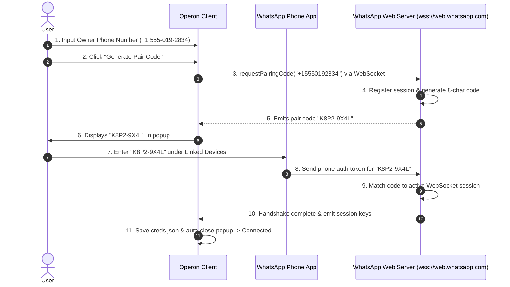

---

Hi! 
So, I was working on this project, [README.md](file;file:///d%3A/Operon/README.md) 

I already built a backend `operon-rs` and a native gui frontend, `gui`.
Now, I'm focusing to work on the backend to add some new features such as channels. Let me explain:

In openclaw, there is channels which lets the user to comunicate to the agent from WhatsApp, Telegram, etc. apps.  
Since Operon is also similar agent, we'll implement this feature too.

---

We use seperated sub-crate atchitecture in the backend of operon. So, we'll be using `operon-channels` for this. We'll make every channel a seperate sub-sub-crate, for example whatsapp will have it's own crate, same as telegram. And all of these crates will have a fascade crate as `operon-channels` which will also have a higher fascade crate `operon-rs`.

---

> So, now you explore the current condition of the backend (especially the `operon-session`, `operon-policy`, and `operon-config`) to understand this project and to get context then clone openclaw's repo as a temporary referance source in the repo root (keep it in the gitignore, so that we don't accidently push openclaw 😅).

---

I have explored the backend architecture of Operon—specifically [`operon-config`](file:///d:/Operon/operon-rs/src/operon-config/src/lib.rs), [`operon-policy`](file:///d:/Operon/operon-rs/src/operon-policy/src/resolver.rs), [`operon-session`](file:///d:/Operon/operon-rs/src/operon-session/src/runner.rs), and [`operon-channels`](file:///d:/Operon/operon-rs/src/operon-channels)—and successfully set up the temporary reference source.

---

### 1. OpenClaw Reference Setup
* **Cloned Repo**: Cloned `openclaw` to `d:\Operon\openclaw`.
* **Gitignore Status**: Confirmed that `openclaw/` is listed in [.gitignore](file:///d:/Operon/.gitignore#L84), ensuring it will not be committed.

---

### 2. Backend Context & Architecture Summary

#### 🛠️ [`operon-config`](file:///d:/Operon/operon-rs/src/operon-config/src/lib.rs)
* **Purpose**: Config loader for `~/.operon/config.toml` and environment variable overrides.
* **Key Components**:
  * Returns [`AppConfig`](file:///d:/Operon/operon-rs/src/operon-config/src/schema.rs#L300) containing `ProviderConfig`, `PolicyConfig`, and `OperonPaths`.
  * Multi-Directory Permission Model: Tracks directory-scoped tool permissions categorized by role (`owner` vs. `external`).

#### 🛡️ [`operon-policy`](file:///d:/Operon/operon-rs/src/operon-policy/src/resolver.rs)
* **Purpose**: Centralized permission gate enforcing tool call access before execution.
* **Key Components**:
  * [`PolicyResolver`](file:///d:/Operon/operon-rs/src/operon-policy/src/resolver.rs#L68) checks tool calls against [`CallerRole`](file:///d:/Operon/operon-rs/src/operon-policy/src/types.rs) (`Owner` for local GUI/TUI, `External` for channels like WhatsApp & Telegram).
  * Classifies tools into `GlobalTool` (e.g. `web`, `subagent`, `ask`, `todo`, `load_tools`, `memory`) and `DirTool` (e.g. `read`, `write`, `edit`, `bash`).
  * Returns `PolicyDecision::Allow`, `PolicyDecision::Ask`, or `PolicyDecision::Deny`.

#### 🔄 [`operon-session`](file:///d:/Operon/operon-rs/src/operon-session/src/runner.rs)
* **Purpose**: Orchestrates the agent loop ([`SessionRunner`](file:///d:/Operon/operon-rs/src/operon-session/src/runner.rs#L56)).
* **Key Components**:
  * Runs pre-turn workspace snapshotting ([`SnapshotBuilder`](file:///d:/Operon/operon-rs/src/operon-session/src/runner.rs#L212)), message sanitization, LLM streaming request dispatch, plain-text tag tool parsing ([`operon-tools-parser`](file:///d:/Operon/operon-rs/src/operon-session/src/runner.rs#L336)), policy validation, tool dispatching, and SQLite persistence ([`SessionStore`](file:///d:/Operon/operon-rs/src/operon-session/src/store.rs)).
  * Accepts `Role::Owner` or `Role::External` in [`SessionConfig`](file:///d:/Operon/operon-rs/src/operon-session/src/config.rs#L76), allowing external channels to run within policy-bounded external roles.

#### 📡 [`operon-channels`](file:///d:/Operon/operon-rs/src/operon-channels)
* **Sub-crate Architecture**:
  * Directory layout set up under `operon-rs/src/operon-channels/src` with `whatsapp`, `telegram`, and `operon` sub-crates.
  * Serves as the facade crate exposed through the main backend facade [`operon-rs`](file:///d:/Operon/operon-rs/src/lib.rs).

---

### Ready for Next Steps
We have all the context and reference materials ready. Let me know when you'd like to start building out `operon-channels` or defining the channel interfaces!

---

Since you have the the context of our permission policy that we have two type of prompt sender:
**Owner:** The main user who messahes grom GUI or TUI or the allowed numbers in WhatsApp - Yes, allowlist contacts will be treated as owner.  
**External:** All other people from channels whose numbers are not in the allowlist will follow the permission of external, which is set by the owner from gui or tui.

We will also need to manage the sessions differently of the channels. Right now we have two type of sessions: 
**General chats:** These sessions are not project specific. For these sessions the workspace directory is, `~/.operon/workspace` - default workspace directory.  
**Project specific:** When the user opens a project in the GUI (in gui user can click on the `Open project` menu option from the Files in the titlebar and can open a project, then all sessions under that project is considerd as project specific session) or TUI - in that case the workspace directory is set to the project's root folder.

---

Now when it comes to channels (starting with WhatsApp), then every external person will have a seperate workspace folder for each channel and each user in `~/operon/channels/whatsapp/<contact_number_as_folder_name>/` — here we'll create seperate workspace folders in the channels/whatsapp for every external user.

> And the session's JSON files will be stored similarly how project specific sessions are stored.

---

Next, how does Operon receive messages from WhatsApp and send reply to the messager?  
We'll follow the same pipeline that OpenClaw follows in rust.   

Here is how the flow will look in gui or tui:  
User will open the settings in the gui or tui → go to channels section → they will see a bunch of channels to setup → click on a channel (e.g., WhatsApp) to setup → there they will put the WhatsApp number from where people can message to operon and operon can reply back → after puting the number user will have to sign-in → for signing we'll generate or featch qr code → user will scan the qr and signin will complete. - This number will be treated as owner. So if someone messages himself with this number, then the message will be sent to operon and operon will reply back it the same number.  
In the same setup page will be options to add allowed contact numbers. Those allowed numbers will be treated as owner.  

---

When talking to operon over whatsapp, there should be a keyword to start a fresh session, we'll use `/new` for that.  
So, whenever someone sends `/new` to operon over whatsapp (or any other channel that we will implement later) - that will start a freash session for that user.

---

>> **Now you explore of how OpenClaw implemented WhatsApp channel and make a robust implementation plan for our whatsapp channel.**
>> **Right now we will implement the backend for whatsapp channel.**
>> Also, tell me what the file stracture will be for `whatsapp` crate.
>> Follow the coding standards written here, `D:\Operon\AGENTS.md`.

---

Viewed store.rs:1-481
Edited implementation_plan.md

I have updated the [Implementation Plan](file:///C:/Users/soumo/.gemini/antigravity-ide/brain/33a0b6b8-a878-4828-bd25-58db65460fa4/implementation_plan.md) to reflect all of our design decisions:

### Aligned Design Decisions:
1. **Workspace Directory**:
   `~/.operon/channels/whatsapp/workspace/<contact_number>/`
2. **Session Storage Format & Path**:
   JSON format (`SessionStore` / `SessionJson`), saved per-contact at:
   `~/.operon/sessions/whatsapp/<contact_number>/<session_id>.json`
3. **Inbound Queueing**:
   Sequential queueing per contact (Message 2 is processed after Message 1 turn completes).
4. **Outbound Responses**:
   Sends progress updates for tool executions (e.g. `⚡ Searching web...`) and sends the final formatted answer upon turn completion.
5. **Auth Credentials Path**:
   `~/.operon/channels/whatsapp/auth/`
6. **Fresh Session Trigger (`/new`)**:
   Inbound `/new` generates a fresh JSON session file under `~/.operon/sessions/whatsapp/<contact_number>/<new_session_id>.json`.

---

Whenever you're ready, let me know if you approve the [Implementation Plan](file:///C:/Users/soumo/.gemini/antigravity-ide/brain/33a0b6b8-a878-4828-bd25-58db65460fa4/implementation_plan.md) and I will start implementing the `operon-channels` facade and `operon-channels-whatsapp` sub-crate!

---

I checked your implementation and I think we need to work more on the whatsapp crate before moving on.

Fix the following confirmed bugs in operon-rs/src/operon-channels/src/whatsapp/. Read each file fully before editing. Do not change file structure or public API names unless required by the fix.

BUG 1 — /new does not cancel in-flight turns (router.rs + runner_bridge.rs)
router.rs::route() updates active_sessions on `/new` but process_turn() in runner_bridge.rs
already owns a copied session_id and has no way to observe the change. The `_cmd_tx` created
in process_turn is never used — SessionCommand is dead wiring.
Fix: wire cmd_tx into the router so that a `/new` while a turn is running for that contact sends
a SessionCommand::Cancel (or equivalent existing variant — check operon_events::SessionCommand
for what's available, add a Cancel variant if none exists) to the running SessionRunner's cmd_rx.
The runner_bridge event loop must select() over event_rx and a cancellation signal, abort
runner_handle on cancellation, and send a WhatsApp notification confirming the fresh session
started even when a turn was interrupted.

BUG 2 — Role is recomputed per-message with no session pinning, and stale mid-turn (router.rs)
Role is derived fresh from config.is_owner() on every route() call, meaning a turn already
in flight keeps whatever role it started with even if the allowlist changes mid-turn, and
there's no audit trail of what role a given session ran under.
Fix: store the resolved CallerRole alongside the session_id in active_sessions (change the
HashMap value to a struct/tuple of {session_id, role}), so role is pinned for the life of a
session and only re-evaluated on /new or first contact. Log role transitions.

BUG 3 — AGENTS.md is generated once and never updates (workspace.rs)
provision_workspace() only writes AGENTS.md if it doesn't already exist, so a contact's
role instructions become permanently stale if their allowlist status changes after first contact.
Fix: always regenerate AGENTS.md to match the current is_owner value passed in, unless content
is already correct (compare current role marker before rewriting, to avoid unnecessary disk
writes). Add a unit test proving a contact promoted from External to Owner gets updated content
on next provision_workspace call.

BUG 4 — No encryption at rest for WhatsApp auth credentials (auth.rs)
creds.json and related pairing state are written to ~/.operon/channels/whatsapp/auth/ in
plaintext with no encryption and no restrictive file permissions.
Fix: on Unix, set file permissions to 0600 on write (owner read/write only) for anything under
auth_dir, using std::os::unix::fs::PermissionsExt. Add a doc comment noting that credential
encryption at rest is not yet implemented and file-permission hardening is the current mitigation;
do not implement full encryption in this pass unless there's an existing operon-policy or
operon-config utility for it — if one exists, use it and flag it in your summary.

BUG 5 — outbound.rs has no actual queue (outbound.rs)
Despite being documented and referenced elsewhere as an "outbound queue," OutboundMessage::new
just constructs a struct with no buffering. There is no handling for the WhatsAppClient being
disconnected (client.rs::connect() is currently a stub with no real socket — do not implement
the real socket, only the queue).
Fix: implement an OutboundQueue struct (mpsc-backed) that buffers OutboundMessage when
ConnectionStatus is not Connected, and flushes in order once reconnected. Expose
enqueue() and a drain/flush() method. Wire ConnectionStatus checks from client.rs's
status() method. Add unit tests for: message enqueued while disconnected is not lost,
and flush preserves send order (FIFO).

BUG 6 — format_for_whatsapp panics on non-ASCII text (outbound.rs)
The bold/strikethrough converter slices Strings by byte index (text[start+2..]) which will
panic if a multi-byte UTF-8 character falls near a ** or ~~ boundary.
Fix: rewrite format_for_whatsapp using char_indices() or the regex crate (check if already
a workspace dependency; if not, do the char-safe manual version) so it never panics on
non-ASCII input. Add a unit test with emoji and non-Latin script (e.g. Bengali or Japanese
text) surrounding **bold** markers.

For all fixes: run `cargo check -p operon-channels-whatsapp` and `cargo test -p operon-channels-whatsapp`
after each bug fix, not just at the end. Report which SessionCommand variants existed already
vs. which you had to add, since that touches operon-events and may affect other channel crates
(telegram) that share it.

---

Next, we'll wire the WhatsApp backend with the gui. 

In the gui, we use a sidebar where we include two type of sessions. Chats​ and Projects​. I think we should add another section WhatsApp​ (when WhatsApp is connected or some sessions are present of it) similar to Projects. Where every user's contact number will be treated as a project under WhatsApp with their sessions. If owner opens a WhatsApp session in gui or tui then they will able to see their messages. But owner can't join that session from gui/tui. There will be no input panel in the main content area for WhatsApp sessions.

---

In the settings panel there is a category as, Channels​ of the left sidebar of settings. Clicking on that currently shows a placeholder text in the main content area of settings panel.  

But now, since we are wiring the channels, there will be a lot of channels (for now it's just WhatsApp, later we'll add more) and their active or not sign same as the models page - in models page, there is also a list of all supported providers with their activation status.  

Clicking on a channel will open their setup page where will be:  

A mobile number input field which will be the used by Operon to sent and receive messages. 

A field for adding numbers to the allow list.

When the qr code appears, show it in a pop-up dialog. And when the scan successfully done then automatically close the popup and show a connected sign.

---

> Use this file to implement the rust side settings wiring in the gui settings page, gui\src\settings\main-content\whatsapp.rs​.

> Use this file to wire the left sidebar of the app's window to the whatsapp, gui\src\left-sidebar\whatsapp.rs​.

> In the slint side, use this file to build the setup page for whatsapp channel, gui\ui\settings\main-content\channels\whatsapp.slint​.

> And this file to built the ui to build the fascade page foe the channels where we'll show the list of all available channels with their active stayus like the models page, gui\ui\settings\main-content\channels.slint​.

---

*Now make an implementation plan for the wiring.*

---

The qr implementation is getting harder. Is there any way to use otp verification for login?
It's like, user will put their number which will be used by Operon for sent and receive messages. And in the pop-up it will ask for otp sent by WhatsApp company?

> Check online deeply for correctness.

---

