# operon-config

**Configuration loading, validation, and policy management for Operon AI agent**

`operon-config` provides the central configuration system for Operon, handling TOML parsing, environment variable overrides, path resolution, and policy validation. All Operon binaries (GUI, TUI, CLI) call `load()` once at startup to obtain a validated `AppConfig`.

---

## Architecture Overview

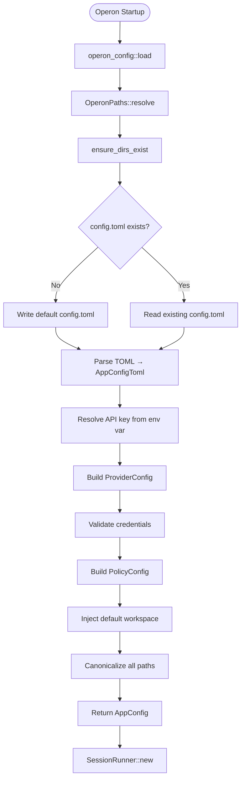

---

## Core Concepts

### Configuration Sources

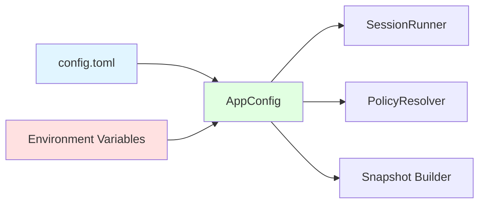

**Priority Order:**

$$
\text{config.toml} \; > \; \text{Environment Variables} \; > \; \text{Defaults}
$$

### Directory Model

Operon uses a **three-directional directory system**:

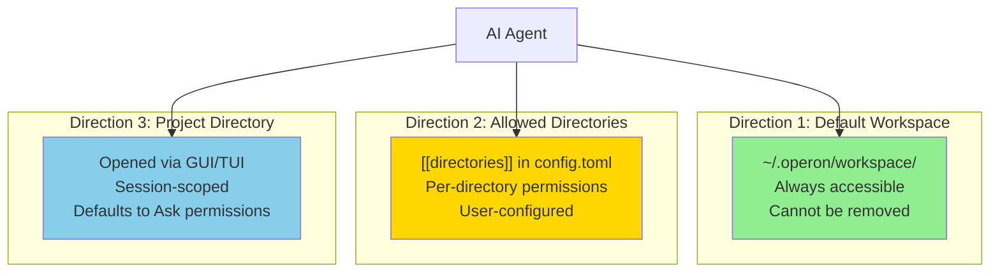

| Direction | Path | Configured In | Permissions | Removable |
|-----------|------|---------------|-------------|-----------|
| **1** | `~/.operon/workspace/` | Injected automatically | Full owner access | ❌ No |
| **2** | User-specified | `[[directories]]` in config.toml | Per-directory policy | ✅ Yes |
| **3** | Session-specific | Passed to SessionRunner | Defaults to Ask | N/A (session-scoped) |

---

## File System Layout

```
~/.operon/
├── config.toml              ← Main configuration file (TOML format)
├── workspace/               ← Direction 1: Default workspace
│   └── AGENTS.md           ← Global agent instructions (loaded in normal mode)
├── sessions/                ← Per-session JSON files
│   ├── <session_id_1>.json
│   └── <session_id_2>.json
└── memory/                  ← Global persistent memory
    └── memory.db           ← SQLite FTS5-indexed memory store
```

### Platform-Specific Paths

| Platform | Home Directory | Config Path |
|----------|----------------|-------------|
| **Linux** | `/home/<user>/` | `/home/<user>/.operon/config.toml` |
| **macOS** | `/Users/<user>/` | `/Users/<user>/.operon/config.toml` |
| **Windows** | `C:\Users\<user>\` | `C:\Users\<user>\.operon\config.toml` |

---

## Configuration Schema

### Complete TOML Structure

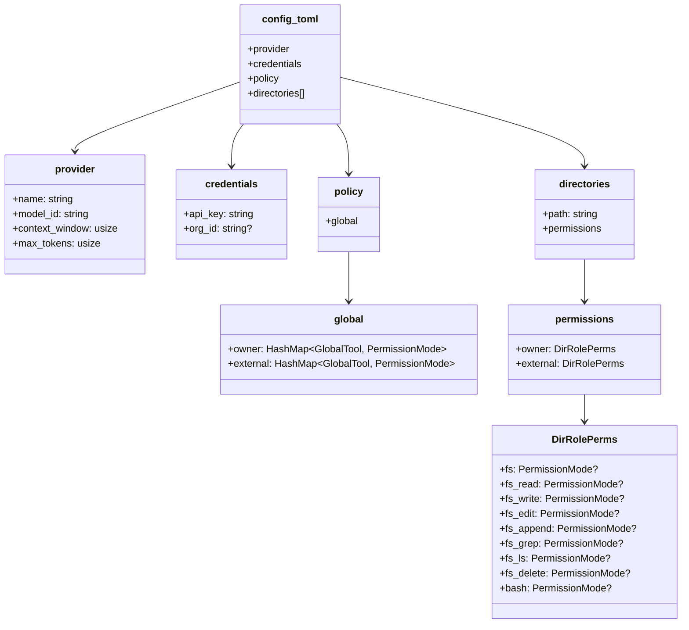

### Example config.toml

```toml
[provider]
name           = "anthropic"
model_id       = "claude-sonnet-4-20250514"
context_window = 200000
max_tokens     = 16000

[credentials]
api_key = "sk-ant-api01-..."  # Or leave empty to use ANTHROPIC_API_KEY env var
# org_id = "org-..."           # OpenAI only

[policy.global.owner]
web        = "allow"
sub_agent  = "ask"
ask        = "allow"
todo       = "allow"

[policy.global.external]
web        = "deny"
sub_agent  = "deny"
ask        = "deny"
todo       = "deny"

[[directories]]
path = "~/projects/my-app"

[directories.permissions.owner]
fs   = "allow"         # Shorthand: applies to all fs tools
bash = "ask"

[directories.permissions.external]
fs   = "deny"
bash = "deny"

[[directories]]
path = "/var/www/public"

[directories.permissions.owner]
fs        = "allow"    # Base permission
fs_delete = "deny"     # Override: block deletions
bash      = "deny"

[directories.permissions.external]
fs   = "deny"
bash = "deny"
```

---

## Configuration Loading Flow

### Main Entry Point: `load()`

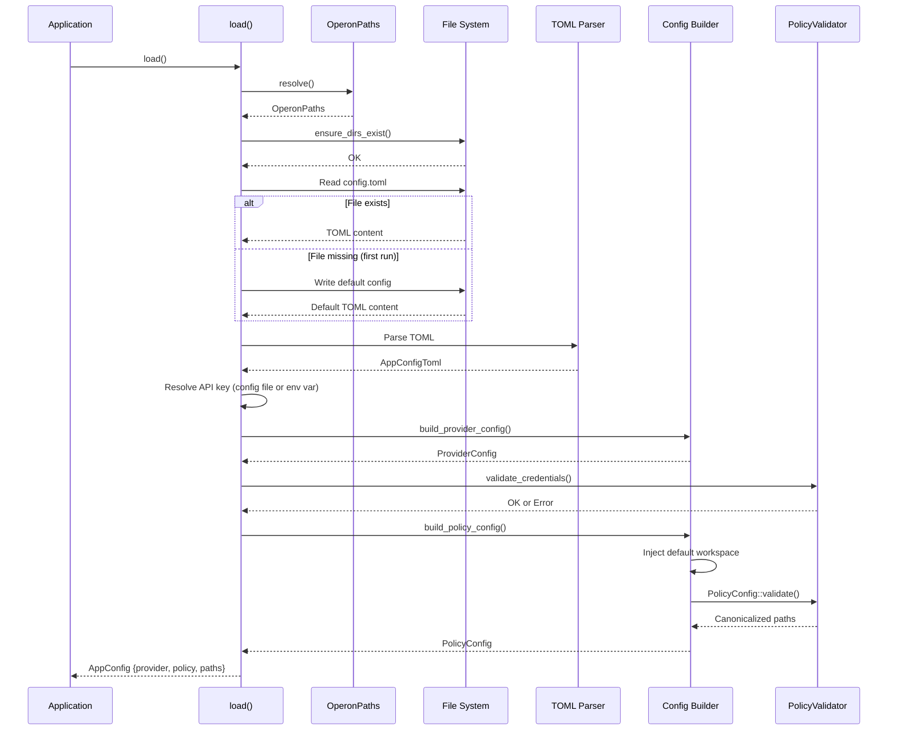

### API Key Resolution

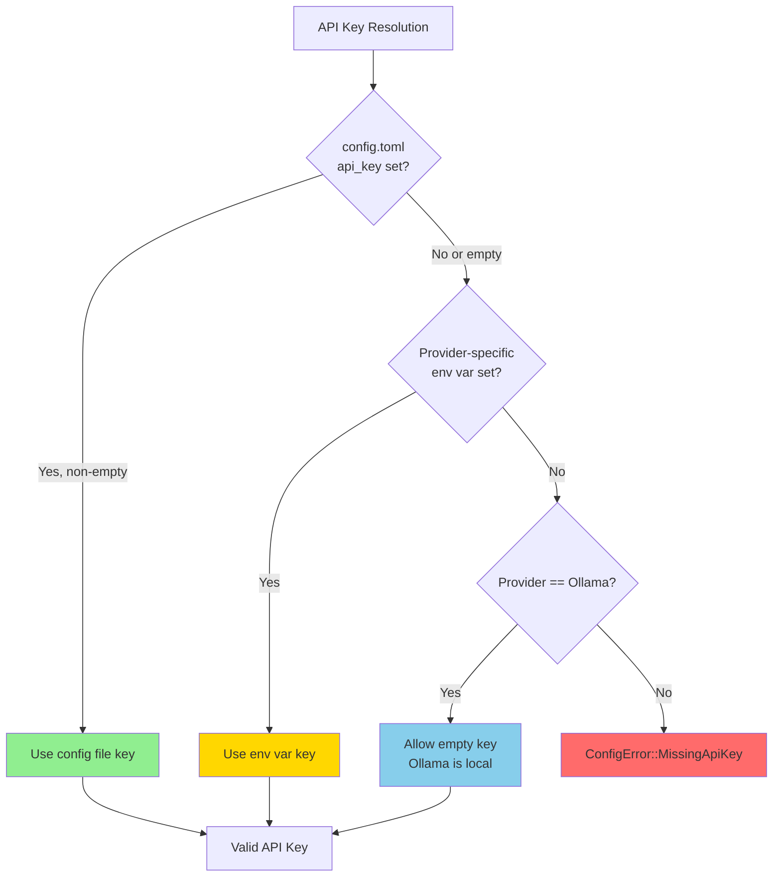

**Environment Variable Mapping:**

| Provider | Environment Variable |
|----------|---------------------|
| `anthropic` | `ANTHROPIC_API_KEY` |
| `open_ai` | `OPENAI_API_KEY` |
| `gemini` | `GEMINI_API_KEY` |
| `deep_seek` | `DEEPSEEK_API_KEY` |
| `open_router` | `OPENROUTER_API_KEY` |
| `groq` | `GROQ_API_KEY` |
| `mistral` | `MISTRAL_API_KEY` |
| `xai` | `XAI_API_KEY` |
| `cohere` | `COHERE_API_KEY` |
| `ollama` | *(no key required)* |

---

## Permission Model

### Tool Categories

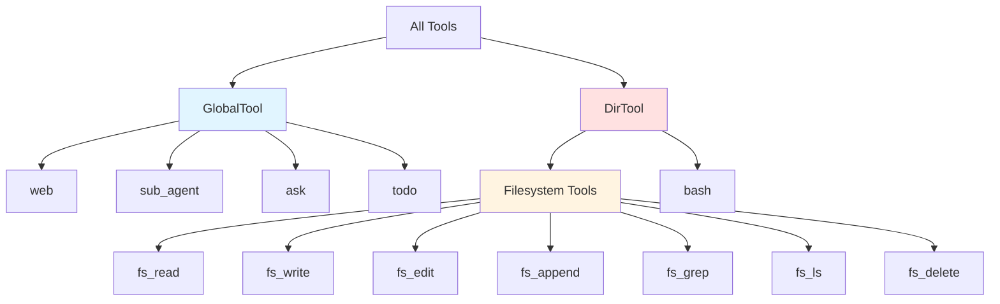

### Permission Modes

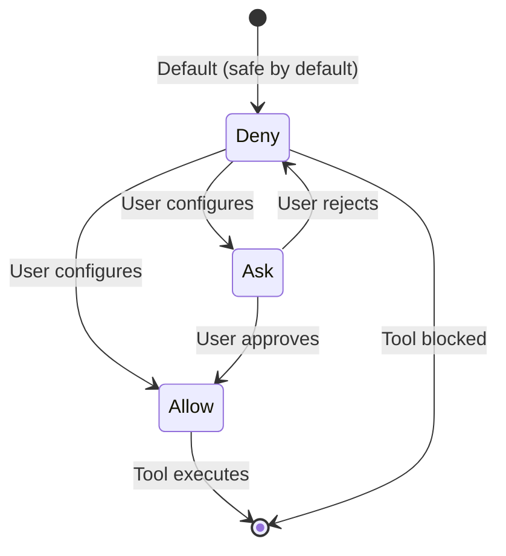

| Mode | Behavior | Use Case |
|------|----------|----------|
| **Allow** | Execute immediately | Trusted operations (read in workspace) |
| **Ask** | Require user confirmation | Risky operations (write, shell exec) |
| **Deny** | Block execution | Forbidden operations (external user writes) |

### Caller Roles

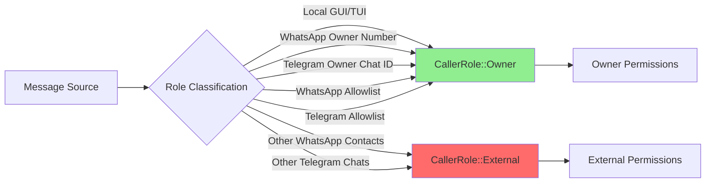

### Permission Resolution

```mermaid
flowchart TD
    Start[Tool Call] --> Global{GlobalTool or DirTool?}
    
    Global -->|GlobalTool| CheckGlobal[Check global policy]
    CheckGlobal --> Role1{Caller Role?}
    Role1 -->|Owner| GlobalOwner[policy.global.owner]
    Role1 -->|External| GlobalExt[policy.global.external]
    
    Global -->|DirTool| CheckDir[Find matching directory policy]
    CheckDir --> Match{Path covered by policy?}
    Match -->|No| DefaultDeny[Default: Deny]
    Match -->|Yes| Role2{Caller Role?}
    Role2 -->|Owner| DirOwner[policy.directories[].owner]
    Role2 -->|External| DirExt[policy.directories[].external]
    
    GlobalOwner --> Mode1[Get PermissionMode]
    GlobalExt --> Mode1
    DirOwner --> Mode1
    DirExt --> Mode1
    DefaultDeny --> Deny[Deny]
    
    Mode1 --> Decision{Mode?}
    Decision -->|Allow| Allow[Execute Tool]
    Decision -->|Ask| Confirm{User confirms?}
    Decision -->|Deny| Deny
    Confirm -->|Yes| Allow
    Confirm -->|No| Deny
    
    style Allow fill:#90EE90
    style Deny fill:#FF6B6B
    style Confirm fill:#FFD700
```

### Filesystem Permission Shorthand

**Group Shorthand vs. Individual Override:**

```toml
[directories.permissions.owner]
fs        = "allow"    # Applies to all fs tools
fs_delete = "deny"     # Override: block deletions only
bash      = "ask"
```

**Resolution Order:**

$$
\text{Individual Key} \; > \; \text{Group Shorthand (fs)} \; > \; \text{Default (Deny)}
$$

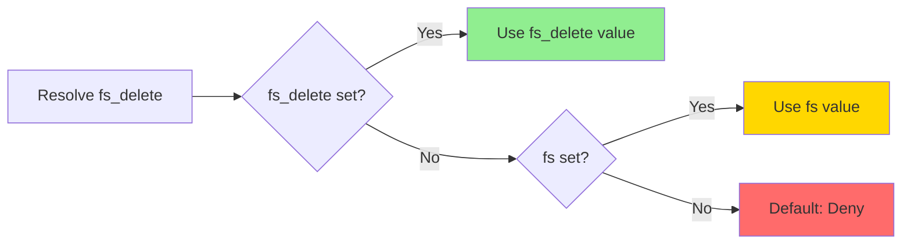

---

## Path Resolution

### Home Directory Expansion

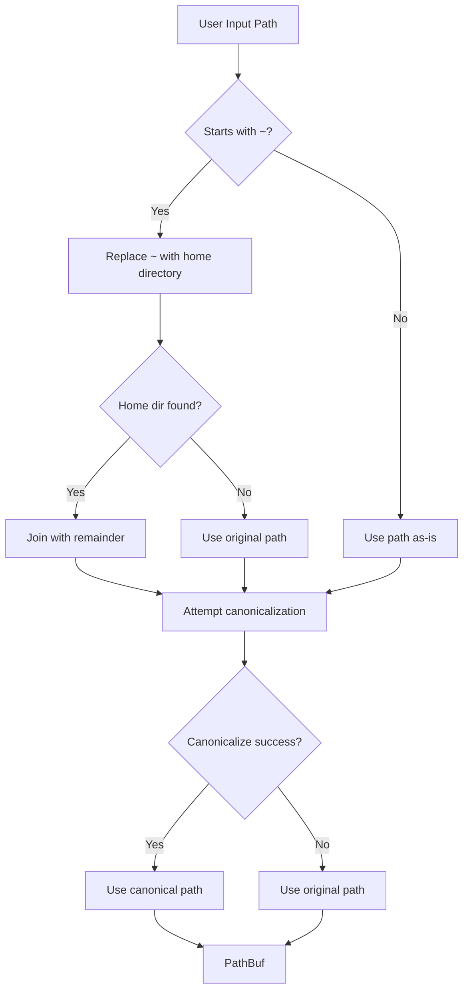

**Examples:**

| Input | Platform | Resolved Path |
|-------|----------|---------------|
| `~/projects/my-app` | Linux | `/home/user/projects/my-app` |
| `~/projects/my-app` | macOS | `/Users/user/projects/my-app` |
| `~/projects/my-app` | Windows | `C:\Users\user\projects\my-app` |
| `/var/www` | All | `/var/www` (absolute, no expansion) |
| `./relative` | All | Relative to current working directory |

---

## Policy Validation

### Validation Flow

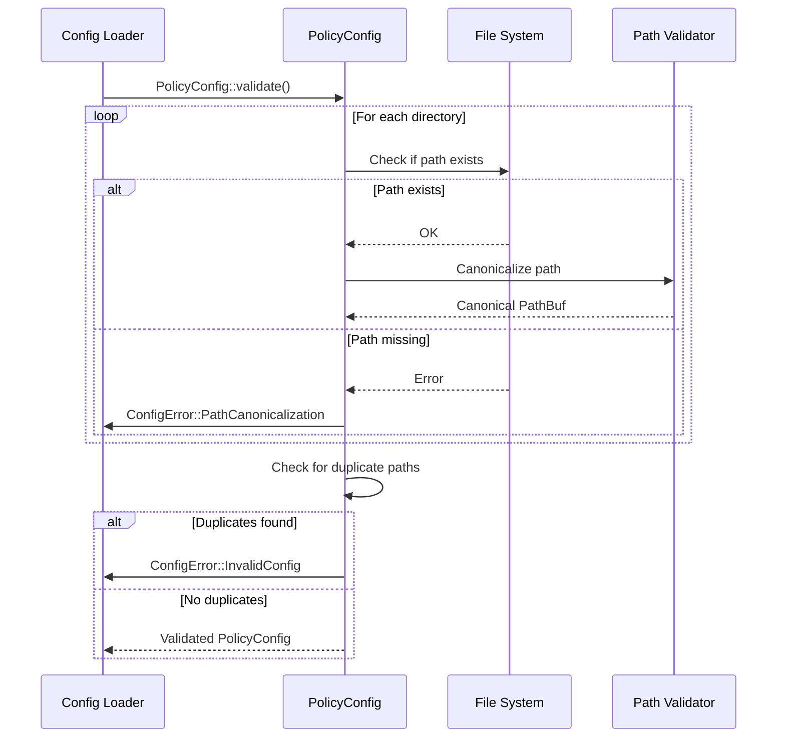

### Validation Rules

| Rule | Description | Error |
|------|-------------|-------|
| **Path Existence** | All `[[directories]]` paths must exist | `PathCanonicalization` |
| **Canonicalization** | Paths must resolve (symlinks followed) | `PathCanonicalization` |
| **No Duplicates** | Same canonical path cannot appear twice | `InvalidConfig` |
| **Workspace Presence** | Default workspace always injected | N/A (automatic) |

---

## Usage

### Basic Loading

```rust
use operon_config::load;

fn main() -> Result<(), Box<dyn std::error::Error>> {
    // Load and validate configuration
    let config = load()?;
    
    // Access provider config
    println!("Provider: {:?}", config.provider.provider);
    println!("Model: {}", config.provider.model_id());
    
    // Access paths
    println!("Workspace: {}", config.paths.workspace_dir.display());
    println!("Sessions: {}", config.paths.sessions_dir.display());
    
    // Pass to SessionRunner
    let session = operon_session::SessionRunner::new(
        operon_session::SessionConfig {
            provider_config: config.provider,
            policy: config.policy,
            workspace_root: config.paths.workspace_dir,
            // ...
        },
        event_tx,
        cmd_rx,
    ).await?;
    
    Ok(())
}
```

### Saving Provider Configuration

```rust
use operon_config::save_provider;
use operon_providers::{Provider, ProviderConfig, ModelConfig, ApiCredentials};

fn update_model() -> Result<(), Box<dyn std::error::Error>> {
    let provider_config = ProviderConfig {
        provider: Provider::Anthropic,
        credentials: ApiCredentials::with_key("sk-ant-api01-..."),
        model: ModelConfig {
            model_id: "claude-sonnet-4-20250514".to_string(),
            context_window: 200_000,
            max_tokens: 16_000,
        },
        base_url_override: None,
    };
    
    // Updates [provider] and [credentials] sections only
    // Preserves comments and other sections
    save_provider(&provider_config)?;
    
    Ok(())
}
```

### Managing Allowed Directories

```rust
use operon_config::{add_allowed_directory, remove_allowed_directory, get_allowed_directories_list};

fn manage_directories() -> Result<(), Box<dyn std::error::Error>> {
    // Add new allowed directory
    add_allowed_directory("~/projects/my-app")?;
    
    // List all allowed directories
    let dirs = get_allowed_directories_list()?;
    for dir in dirs {
        println!("Allowed: {}", dir);
    }
    
    // Remove directory (except default workspace)
    remove_allowed_directory("~/projects/old-app")?;
    
    // Attempting to remove workspace fails
    let result = remove_allowed_directory("~/.operon/workspace");
    assert!(result.is_err());  // Cannot remove Direction 1
    
    Ok(())
}
```

### Updating Permissions

```rust
use operon_config::update_permission;

fn update_perms() -> Result<(), Box<dyn std::error::Error>> {
    // Update global tool permission
    update_permission(
        "owner",                // Role: owner or external
        None,                   // None = global policy
        "web",                  // Tool name
        Some("allow"),          // New mode: allow/ask/deny
    )?;
    
    // Update directory-specific permission
    update_permission(
        "owner",
        Some("~/projects/my-app"),  // Directory path
        "fs_delete",                // Tool name
        Some("deny"),               // Block deletions
    )?;
    
    // Remove permission (revert to default Deny)
    update_permission(
        "external",
        Some("~/projects/my-app"),
        "bash",
        None,  // Remove entry
    )?;
    
    Ok(())
}
```

---

## Error Handling

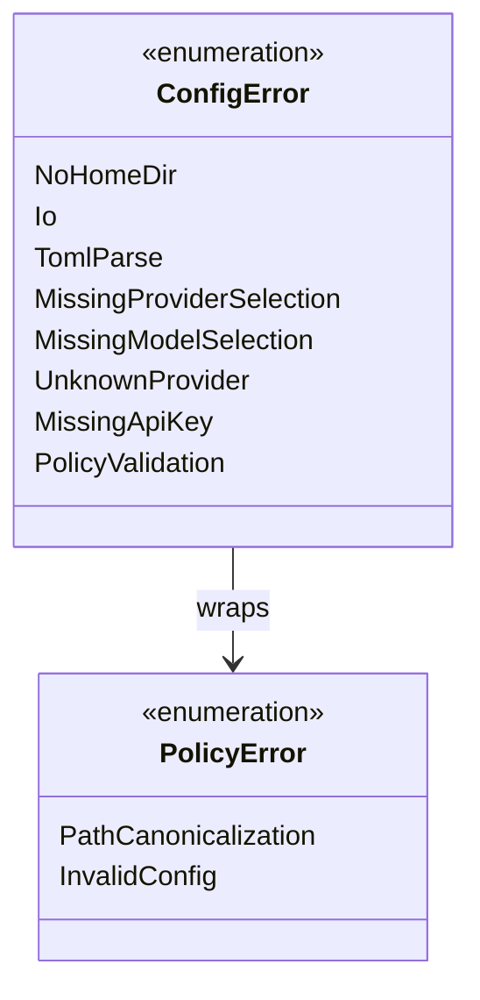

### Error Types

| Error | Description | Recovery |
|-------|-------------|----------|
| `NoHomeDir` | Home directory cannot be determined | Check environment (HOME, USERPROFILE) |
| `Io` | File system operation failed | Check permissions, disk space |
| `TomlParse` | config.toml syntax error | Fix TOML syntax, check for typos |
| `MissingProviderSelection` | `[provider] name` is empty | Set provider in config or GUI |
| `MissingModelSelection` | `[provider] model_id` is empty | Set model in config or GUI |
| `UnknownProvider` | Invalid provider name | Use snake_case provider name |
| `MissingApiKey` | No API key in config or env var | Add key to config.toml or set env var |
| `PolicyValidation` | Path canonicalization failed | Ensure directories exist |

---

## First-Run Behavior

### Default Config Generation

On first run, when `~/.operon/config.toml` does not exist:

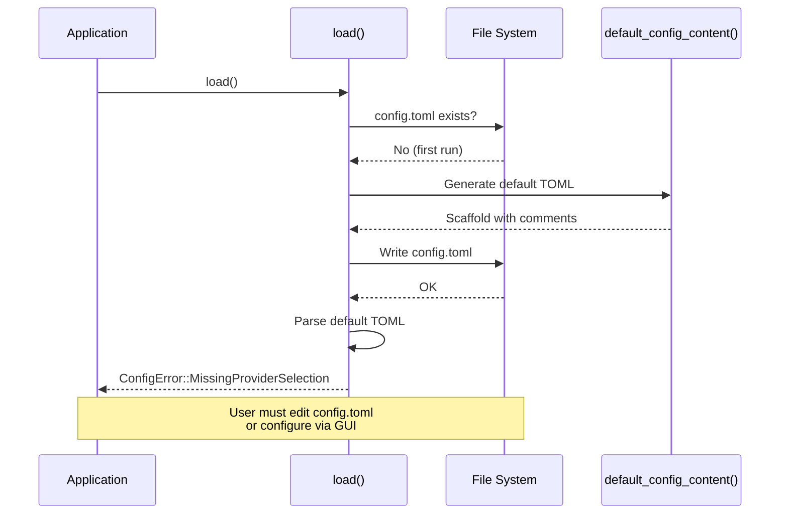

**Default config.toml structure:**

- Heavily commented with guidance
- Empty `provider.name` and `provider.model_id` fields
- Default workspace with `Ask` permissions for owner
- All external permissions set to `Deny`
- No additional directories

---

## TOML Schema Details

### Provider Section

```toml
[provider]
name           = "anthropic"              # Required: snake_case provider name
model_id       = "claude-sonnet-4-20250514"  # Required: exact model ID
context_window = 200000                   # Total token capacity
max_tokens     = 16000                    # Max output tokens per turn
```

### Credentials Section

```toml
[credentials]
api_key = "sk-ant-api01-..."    # Optional: falls back to env var if empty
org_id  = "org-..."             # Optional: OpenAI only
```

### Global Policy Section

```toml
[policy.global.owner]
web        = "allow"    # Web search tool
sub_agent  = "ask"      # Sub-agent invocation
ask        = "allow"    # User confirmation prompt
todo       = "allow"    # Task management

[policy.global.external]
web        = "deny"     # Block web access for external users
sub_agent  = "deny"
ask        = "deny"
todo       = "deny"
```

### Directory Section

```toml
[[directories]]
path = "~/projects/my-app"

[directories.permissions.owner]
fs        = "allow"         # Group shorthand
fs_delete = "deny"          # Override for one tool
bash      = "ask"

[directories.permissions.external]
fs   = "deny"               # All fs tools denied
bash = "deny"
```

---

## Integration with Other Crates

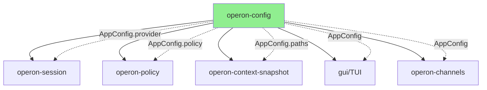

### Data Flow

| Consumer | Uses | Purpose |
|----------|------|---------|
| **operon-session** | `provider`, `policy` | LLM requests + permission checks |
| **operon-policy** | `policy` | Tool call authorization |
| **operon-context-snapshot** | `paths.workspace_dir` | Load AGENTS.md |
| **GUI/TUI** | `paths` | Display workspace, session locations |
| **operon-channels** | `provider`, `policy` | WhatsApp/Telegram integrations |

---

## Testing

Run the test suite:

```bash
cargo test -p operon-config
```

Run specific test:

```bash
cargo test -p operon-config test_dir_role_perms_individual_overrides_group
```

**Key Test Cases:**

- ✅ Default config TOML parses cleanly
- ✅ Provider name deserialization for all providers
- ✅ Filesystem shorthand (`fs`) applies to all 7 tools
- ✅ Individual keys (`fs_delete`) override group shorthand
- ✅ Workspace injection when absent
- ✅ Workspace injection does not duplicate
- ✅ API key resolution (config file → env var)
- ✅ Ollama exempted from API key requirement
- ✅ Path ~ expansion on all platforms
- ✅ save_provider preserves comments

---

## Performance Characteristics

| Operation | Complexity | Time |
|-----------|-----------|------|
| **load()** | O(n) directories | <10ms typical |
| **Path canonicalization** | O(n) directories | <5ms per path |
| **TOML parsing** | O(file size) | <1ms for typical config |
| **save_provider()** | O(file size) | <5ms (preserves comments) |
| **add_allowed_directory()** | O(n) directories | <5ms |

---

## Dependencies

| Crate | Version | Purpose |
|-------|---------|---------|
| `operon-providers` | Workspace | Provider enum, ProviderConfig |
| `toml` | 0.8 | TOML deserialization |
| `toml_edit` | 0.22 | Comment-preserving TOML editing |
| `serde` | 1.x | Serialization framework |
| `serde_json` | 1.x | Provider enum parsing |
| `dirs` | 5.0 | Cross-platform home directory |
| `thiserror` | 1.x | Error type derivation |

---

## Contributing

When contributing to operon-config:

1. **Preserve backward compatibility** in TOML schema
2. **Test on all platforms** (Windows, macOS, Linux)
3. **Document new configuration options** in default config comments
4. **Add validation** for new policy types
5. **Update error messages** to be actionable

---

## License

Operon is licensed under the **GNU Affero General Public License v3.0 (AGPLv3)**.

---

> Built by **Luka Gray (aka Soumo Mukherjee)** • West Bengal, India • 2026
