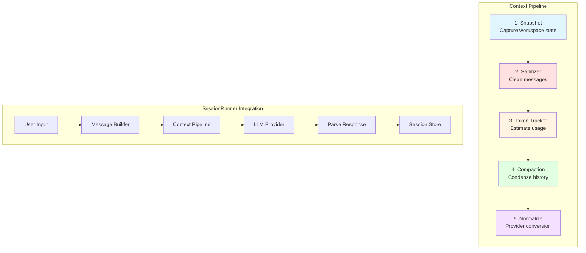
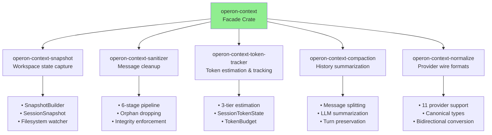
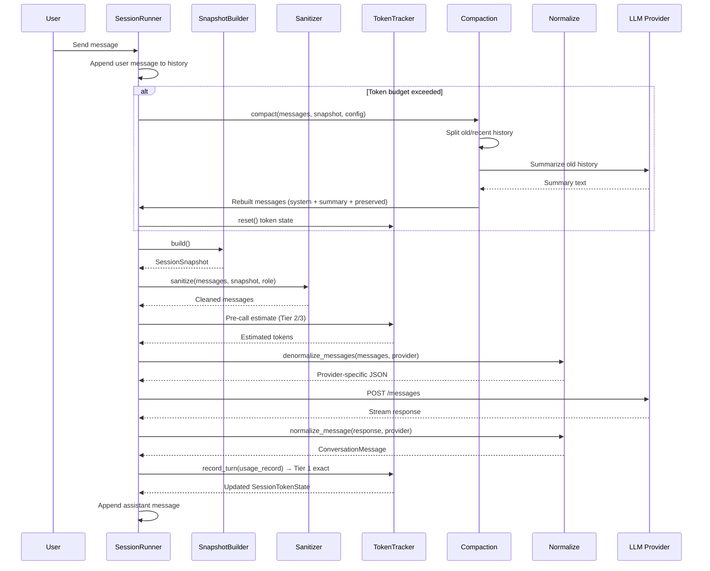
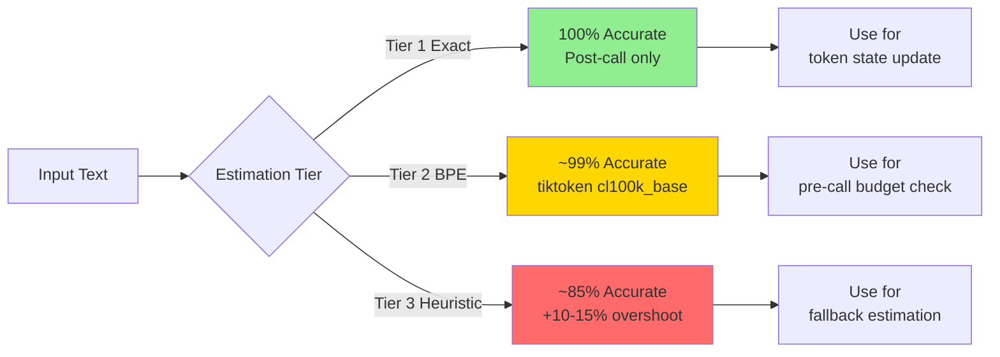
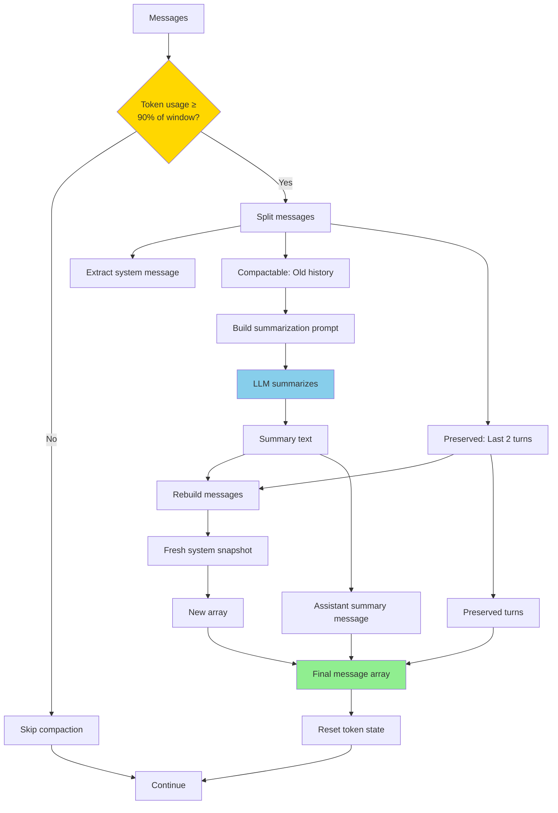
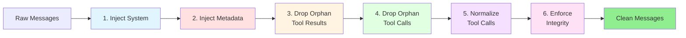
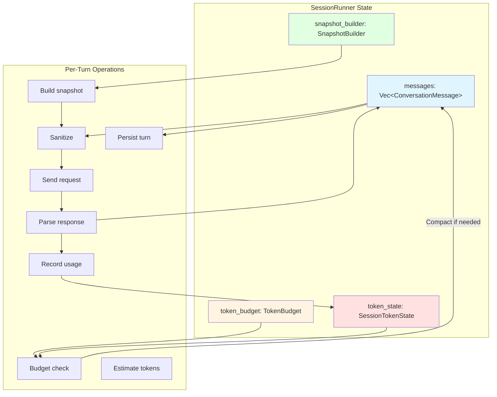
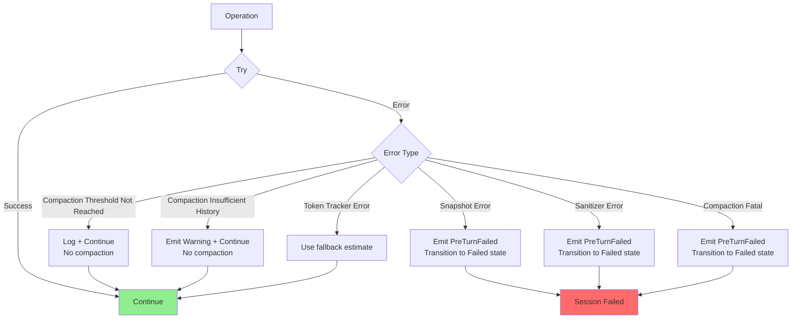

# operon-context

**Complete context pipeline for Operon AI agent conversations**

`operon-context` is a facade crate that orchestrates five independently usable sub-crates to manage the complete message lifecycle in Operon's LLM agent system. From workspace capture through token management to provider-specific wire format conversion, this crate provides the full transformation pipeline.

---

## Architecture Overview



---

## Sub-Crates



### 1. [operon-context-snapshot](./src/operon-context-snapshot/)

Captures workspace state per turn:
- **File tree** (gitignore-aware, depth-limited)
- **Git status** (branch, staged/unstaged/untracked counts, line changes)
- **AGENTS.md** (project-specific agent instructions)
- **Tool groups** (available tool categories)
- **Filesystem watcher** (caches tree/AGENTS.md until changes detected)

### 2. [operon-context-sanitizer](./src/operon-context-sanitizer/)

Cleans messages before every LLM call (6-stage pipeline):
1. Inject fresh system message
2. Prepend metadata to user message
3. Drop orphan tool results
4. Drop orphan tool calls
5. Normalize malformed tool calls
6. Enforce integrity (reorder, merge, deduplicate)

### 3. [operon-context-token-tracker](./src/operon-context-token-tracker/)

Three-tier token estimation:
- **Tier 1 (Exact)**: Provider API `usage` block (post-call ground truth)
- **Tier 2 (BPE)**: `tiktoken` cl100k_base encoding (~99% accurate, `bpe` feature)
- **Tier 3 (Heuristic)**: Byte-length estimation (code: ÷3, prose: ÷4, always available)

Budget management:
- `TokenBudget`: Compaction threshold calculation
- `SessionTokenState`: Cross-turn usage tracking

### 4. [operon-context-compaction](./src/operon-context-compaction/)

Token-threshold driven history summarization:
- **Splits** old history from recent turns
- **Summarizes** compactable portion via LLM
- **Preserves** last N complete turns verbatim
- **Rebuilds** message array with fresh system + summary + preserved

### 5. [operon-context-normalize](./src/operon-context-normalize/)

Canonical message types and provider conversion:
- **11 LLM providers** (Anthropic, OpenAI, Gemini, Ollama, DeepSeek, OpenRouter, Groq, Mistral, XAI, NvidiaNim, Cohere)
- **Canonical types**: `ConversationMessage`, `ContentBlock`, `ToolCall`, `ToolResult`
- **Bidirectional**: Provider JSON ↔ Canonical types

---

## Message Flow Through Pipeline



---

## Usage

### Basic Pipeline

```rust
use operon_context::prelude::*;

#[tokio::main]
async fn main() -> Result<(), Box<dyn std::error::Error>> {
    // 1. Configure snapshot
    let snapshot_config = SnapshotConfig {
        root: std::env::current_dir()?,
        role: Role::Owner,
        session_id: "sess-123".to_string(),
        tree_depth: 2,
        tool_groups: vec!["fs".to_string(), "shell".to_string()],
        channel_instructions: None,
    };
    
    // 2. Create builder
    let mut snapshot_builder = SnapshotBuilder::new(snapshot_config)?;
    
    // 3. Build snapshot
    let snapshot = snapshot_builder.build()?;
    
    // 4. Sanitize messages
    let messages = vec![
        ConversationMessage::user(vec![
            ContentBlock::Text("Hello!".to_string())
        ])
    ];
    
    let clean_messages = sanitize(messages, &snapshot, Role::Owner)?;
    
    println!("Pipeline ready!");
    Ok(())
}
```

### Token Tracking

```rust
use operon_context::{TokenBudget, SessionTokenState, TokenEstimator};

// Create budget (90% threshold)
let budget = TokenBudget::with_window(200_000)?;

// Track usage across turns
let mut state = SessionTokenState::new();

// Pre-call estimate (Tier 2 or 3)
let (tokens, tier) = TokenEstimator::estimate("Hello, world!");
state.apply_estimate(tokens, tier);

// Check if compaction needed
if budget.should_compact(state.current_context_tokens) {
    println!("Compaction required!");
}

// Post-call update (Tier 1 exact)
let usage = UsageRecord {
    input_tokens: 150,
    output_tokens: 50,
    cache_read_tokens: None,
    cache_write_tokens: None,
    model: "claude-sonnet-4".to_string(),
    provider: "anthropic".to_string(),
};

state.record_turn(&usage);
println!("Total tokens used: {}", state.total_tokens());
```

### Context Compaction

```rust
use operon_context::{compact, CompactionConfig, AnthropicCompactionClient};

let config = CompactionConfig {
    preserved_turns: 2,
    threshold_pct: 0.90,
    context_window: 200_000,
};

// Create client (Anthropic only currently)
let client = AnthropicCompactionClient {
    api_key: "sk-ant-api01-...".to_string(),
    model_id: "claude-sonnet-4-20250514".to_string(),
    http: reqwest::Client::new(),
};

// Compact when needed
let result = compact(
    messages,
    &snapshot,
    &client,
    &config,
    current_token_count,
).await?;

println!("Tokens before: {}", result.tokens_before);
println!("Tokens after: {}", result.tokens_after);
println!("Summary: {}", result.summary);

// Use rebuilt messages
messages = result.messages;
```

---

## Configuration

### Default Values

| Component | Parameter | Default | Purpose |
|-----------|-----------|---------|---------|
| **TokenBudget** | `compaction_threshold` | 0.90 (90%) | Trigger compaction at 90% of window |
| **CompactionConfig** | `preserved_turns` | 2 | Keep last 2 complete turns verbatim |
| **CompactionConfig** | `threshold_pct` | 0.90 (90%) | Same as TokenBudget |
| **CompactionConfig** | `context_window` | 200,000 | Claude Sonnet 4.5 default |
| **SnapshotConfig** | `tree_depth` | 1 | Top-level directory only |
| **SnapshotConfig** | `role` | External | Default access level |

### Tuning Guidelines

**Compaction Threshold**:
- **Lower (0.75-0.85)**: More headroom, earlier compaction, more frequent summarization
- **Higher (0.92-0.95)**: Maximum context utilization, risk of truncation

**Preserved Turns**:
- **Lower (1)**: More aggressive summarization, lower token usage
- **Higher (3-5)**: Better context retention, higher token usage

**Tree Depth**:
- **Lower (1)**: Faster snapshot, less context
- **Higher (2-3)**: More file visibility, slower snapshot, more tokens

---

## Token Estimation Accuracy



| Tier | Accuracy | Speed | Dependencies | When Available |
|------|----------|-------|--------------|----------------|
| **1 - Exact** | 100% | N/A | Provider API | Post-call only |
| **2 - BPE** | ~99% | ~5-10ms per message | `tiktoken` (`bpe` feature) | Pre-call, any model |
| **3 - Heuristic** | ~85% (overshoots) | <1ms per message | None | Always |

---

## Compaction Flow



**Preserved Turn Definition:**
- User message + all assistant responses until next user message
- Final in-flight user message (no assistant response yet) always preserved
- Complete turns counted from end backward

---

## Sanitizer Pipeline



### Stage Details

| Stage | Operation | Purpose |
|-------|-----------|---------|
| **1** | Drop stale system messages, inject fresh | System prompt always matches current workspace |
| **2** | Prepend timestamp + role to last user message | Audit trail and temporal context |
| **3** | Drop tool results with no matching tool call | Prevents provider rejection |
| **4** | Drop tool calls with no matching result | Cleans incomplete tool cycles |
| **5** | Synthesize missing IDs, trim names, parse args | Normalizes malformed tool blocks |
| **6** | Reorder results, merge adjacent, deduplicate | Ensures structural integrity |

---

## Integration with SessionRunner



**SessionRunner owns**:
- `SnapshotBuilder`: Constructed once, reused every turn
- `TokenBudget`: Immutable configuration
- `SessionTokenState`: Mutable, updated after every turn
- `messages`: Full conversation history

**Per-Turn Flow**:
1. Check `token_budget.should_compact(token_state.current_context_tokens)`
2. Run compaction if threshold exceeded
3. Build snapshot: `snapshot_builder.build()`
4. Sanitize: `sanitize(messages, snapshot, role)`
5. Estimate tokens (Tier 2/3 pre-call)
6. Denormalize to provider format
7. Send HTTP request, parse response
8. Normalize response to canonical format
9. Record usage (Tier 1 exact post-call): `token_state.record_turn(usage)`
10. Append assistant message to `messages`
11. Persist turn to session store

---

## Error Handling



### Error Types

| Crate | Error | Description | Recovery |
|-------|-------|-------------|----------|
| **snapshot** | `InvalidRoot` | Root directory does not exist | Check path configuration |
| **snapshot** | `WatcherError` | Filesystem watcher failed | Falls back to no caching |
| **sanitizer** | `EmptyMessages` | Message array is empty | Cannot sanitize empty input |
| **token-tracker** | `InvalidContextWindow` | Context window is zero | Check model configuration |
| **token-tracker** | `InvalidThreshold` | Threshold not in (0.0, 1.0] | Use default 0.90 |
| **compaction** | `ThresholdNotReached` | Token usage below threshold | Skip compaction, continue |
| **compaction** | `InsufficientHistory` | Not enough messages to compact | Skip compaction, continue |
| **compaction** | `ClientError` | LLM API call failed | Retry or fail session |

---

## Performance Characteristics

| Operation | Complexity | Time (typical) | Caching |
|-----------|-----------|----------------|---------|
| **Snapshot build** | O(files × depth) | 10-50ms | Tree + AGENTS.md cached |
| **Sanitize** | O(messages × blocks) | 1-5ms | No caching |
| **Token estimate (BPE)** | O(text length) | 5-10ms per message | Encoder cached (OnceLock) |
| **Token estimate (Heuristic)** | O(text length) | <1ms per message | No caching |
| **Compaction split** | O(messages) | <1ms | No caching |
| **Compaction summarize** | O(LLM latency) | 2-5 seconds | No caching |
| **Normalize** | O(blocks) | <1ms per message | No caching |

---

## Dependencies

| Sub-Crate | Key Dependencies |
|-----------|------------------|
| **snapshot** | `notify`, `ignore`, `git2` |
| **sanitizer** | `operon-context-normalize` |
| **token-tracker** | `tiktoken` (optional, `bpe` feature) |
| **compaction** | `reqwest` (optional, `http-client` feature) |
| **normalize** | `serde`, `serde_json` |

---

## Feature Flags

| Feature | Description | Enables |
|---------|-------------|---------|
| `bpe` | BPE token estimation via `tiktoken` | Tier 2 estimation (~99% accurate) |
| `http-client` | Anthropic HTTP client for compaction | `AnthropicCompactionClient` |
| `test-utils` | Mock implementations for testing | `MockCompactionClient` |

---

## Testing

```bash
# Run all tests
cargo test -p operon-context

# Run specific sub-crate tests
cargo test -p operon-context-snapshot
cargo test -p operon-context-sanitizer
cargo test -p operon-context-token-tracker
cargo test -p operon-context-compaction
cargo test -p operon-context-normalize

# Run with BPE feature
cargo test -p operon-context-token-tracker --features bpe
```

---

## License

Operon is licensed under the **GNU Affero General Public License v3.0 (AGPLv3)**.

---

> Built by **Luka Gray (aka Soumo Mukherjee)** • West Bengal, India • 2026
