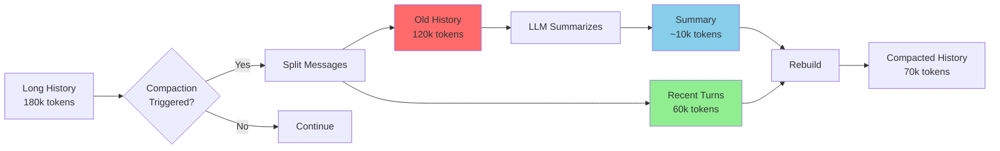
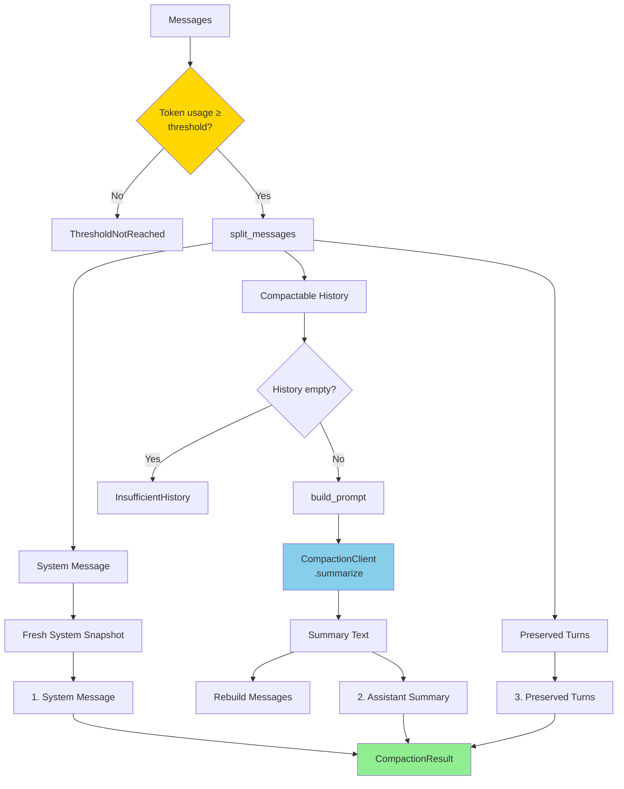
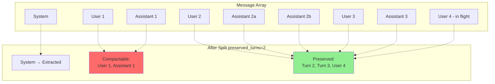
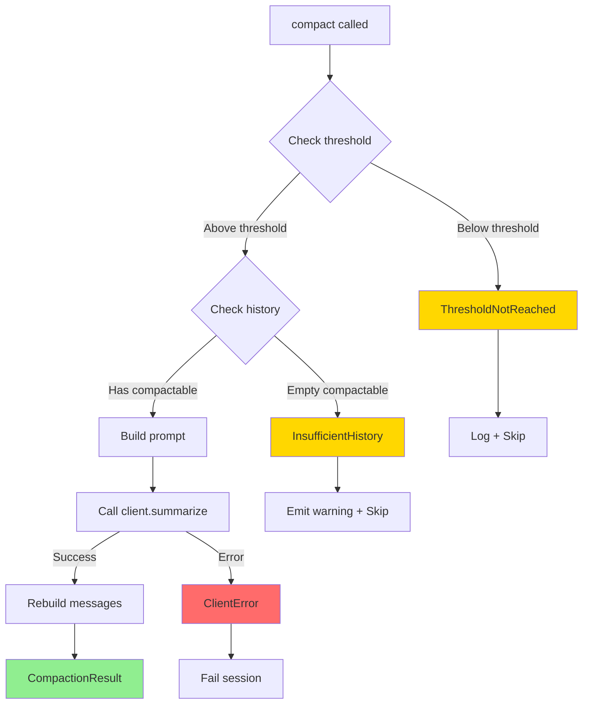
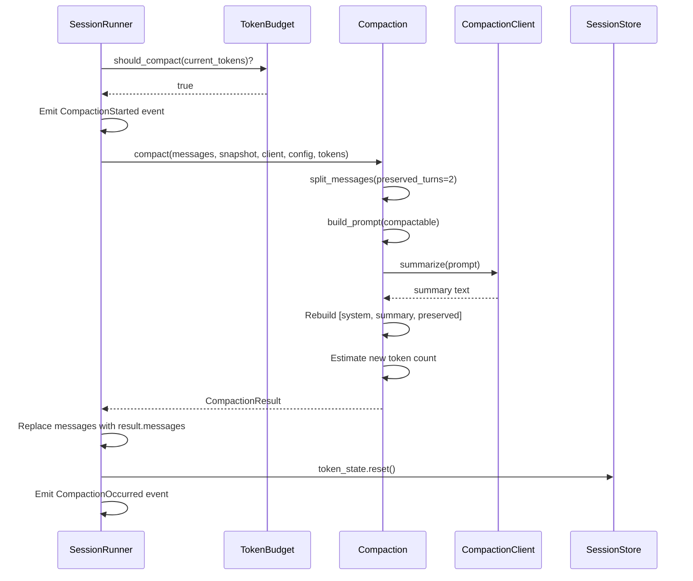

# operon-context-compaction

**Token-threshold driven conversation history summarization for LLM context window management**

`operon-context-compaction` provides intelligent conversation compaction by summarizing old history while preserving recent complete turns verbatim, enabling long-running agent sessions without hitting context limits.

---

## Overview

When token usage approaches the context window limit (default: 90%), this crate condenses old conversation history into an LLM-generated summary while keeping the last N complete user→assistant turns unchanged.



**Result**: 180k tokens → 70k tokens while retaining recent context quality

---

## Architecture

### Compaction Pipeline



---

## Key Concepts

### Turn Definition

A **complete turn** consists of:
1. User message
2. All assistant responses until the next user message

**Preserved turns are counted from the end backward.**

**In-flight user message** (final user message with no assistant response yet) is **always preserved**.

### Message Splitting Strategy



---

## Configuration

```rust
pub struct CompactionConfig {
    pub preserved_turns: usize,     // Default: 2
    pub threshold_pct: f32,         // Default: 0.90 (90%)
    pub context_window: usize,      // Default: 200,000
}
```

### Tuning Guidelines

| Parameter | Lower Value | Higher Value |
|-----------|-------------|--------------|
| `preserved_turns` | More aggressive compaction<br/>Lower token usage<br/>Less context retained | Better recent context<br/>Higher token usage<br/>More context retained |
| `threshold_pct` | Earlier compaction<br/>More headroom<br/>More frequent summarization | Later compaction<br/>Maximum context usage<br/>Risk of truncation |

**Recommended Ranges:**
- `preserved_turns`: 1-5 (default: 2)
- `threshold_pct`: 0.75-0.95 (default: 0.90)

---

## Usage

### Basic Compaction

```rust
use operon_context_compaction::{compact, CompactionConfig, AnthropicCompactionClient};

let config = CompactionConfig {
    preserved_turns: 2,
    threshold_pct: 0.90,
    context_window: 200_000,
};

let client = AnthropicCompactionClient {
    api_key: "sk-ant-api01-...".to_string(),
    model_id: "claude-sonnet-4-20250514".to_string(),
    http: reqwest::Client::new(),
};

// Compact when threshold exceeded
let result = compact(
    messages,
    &snapshot,
    &client,
    &config,
    current_token_count,
).await?;

println!("Before: {} tokens", result.tokens_before);
println!("After: {} tokens", result.tokens_after);
println!("Saved: {} tokens", result.tokens_before - result.tokens_after);
println!("Summary: {}", result.summary);

// Use rebuilt messages
messages = result.messages;
```

### Custom Compaction Client

```rust
use operon_context_compaction::{CompactionClient, CompactionError};
use async_trait::async_trait;

struct CustomClient {
    // Your client fields
}

#[async_trait]
impl CompactionClient for CustomClient {
    async fn summarize(&self, prompt: String) -> Result<String, CompactionError> {
        // Your summarization logic
        // Send prompt to any LLM provider
        // Return summary text
        Ok("Summary of conversation...".to_string())
    }
}
```

### Mock Client for Testing

```rust
#[cfg(test)]
use operon_context_compaction::MockCompactionClient;

#[tokio::test]
async fn test_compaction() {
    let client = MockCompactionClient::new("Test summary");
    
    // Compaction will use the fixed summary
    let result = compact(messages, &snapshot, &client, &config, 180_000).await?;
    
    assert_eq!(result.summary, "Test summary");
}
```

---

## Prompt Construction

Old history is converted to plain text for summarization:

```
[user] Can you help me debug this function?

[assistant] I'd be happy to help debug the function. Could you share the code?

[tool_call] read_file("/src/utils.rs")

[tool_result] read_file: fn calculate(x: i32) -> i32 { ... }

[assistant] I see the issue. The function has an off-by-one error...
```

**Format Rules:**
- Each message prefixed with `[role]`
- Tool calls: `[tool_call] name(arguments)`
- Tool results: `[tool_result] name: content`
- Images/documents: source type indicator (Base64, URL, Text)

---

## Token Estimation

After rebuilding, tokens are re-estimated using the same heuristic as `operon-context-token-tracker` Tier 3:

```rust
fn estimate_text(text: &str) -> usize {
    if is_code_like(text) {
        (text.len() / 3).max(1)  // Token-dense code
    } else {
        (text.len() / 4).max(1)  // Token-sparse prose
    }
}
```

**Message Overhead**: +4 tokens per message

---

## Error Handling



### Error Types

| Error | Description | Recovery |
|-------|-------------|----------|
| `ThresholdNotReached` | Token usage below `threshold_pct` | Skip compaction, continue normally |
| `InsufficientHistory` | Not enough messages to compact | Skip compaction, emit warning |
| `ClientError` | LLM API call failed | Retry or fail session |

---

## Integration with SessionRunner



**SessionRunner Handling:**
1. Check `token_budget.should_compact()` before each turn
2. If true, call `run_compaction()`
3. On success: replace `self.messages`, reset `token_state`, emit event
4. On `ThresholdNotReached`: log and continue
5. On `InsufficientHistory`: emit warning, continue
6. On fatal error: emit `PreTurnFailed`, transition to `Failed` state

---

## Provider Support

| Provider | Status | Client |
|----------|--------|--------|
| **Anthropic** | ✅ Supported | `AnthropicCompactionClient` |
| **OpenAI** | ⏳ Planned | Future implementation |
| **Gemini** | ⏳ Planned | Future implementation |
| **Others** | ❌ Not supported | Logs warning, skips compaction |

---

## Performance

| Operation | Complexity | Time |
|-----------|-----------|------|
| **Threshold check** | O(1) | <1ms |
| **Message splitting** | O(messages) | <1ms |
| **Prompt construction** | O(compactable messages × blocks) | 1-5ms |
| **LLM summarization** | O(LLM latency) | 2-5 seconds |
| **Token estimation** | O(rebuilt messages × text length) | 1-3ms |

**Total**: ~2-5 seconds (dominated by LLM API call)

---

## Testing

```bash
# Run all tests
cargo test -p operon-context-compaction

# Test with mock client
cargo test -p operon-context-compaction --features test-utils
```

---

## License

Operon is licensed under the **GNU Affero General Public License v3.0 (AGPLv3)**.

---

> Built by **Luka Gray (aka Soumo Mukherjee)** • West Bengal, India • 2026
