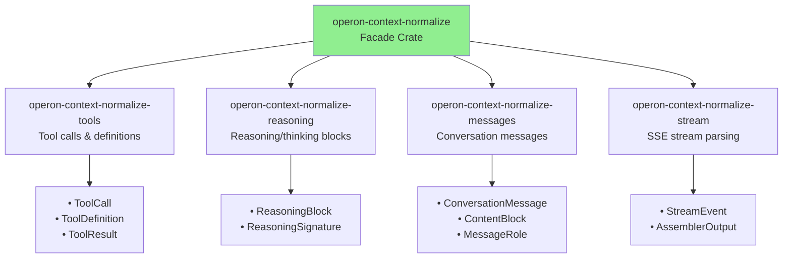

# operon-context-normalize

**Canonical message types and bidirectional provider wire format conversion**

`operon-context-normalize` is a facade crate that re-exports four dedicated normalization sub-crates, providing a unified API for converting between provider-specific JSON and canonical Operon message types.

---

## Architecture



---

## Supported Providers (11 Total)

| Provider | Protocol | Tool Support | Reasoning Support |
|----------|----------|--------------|-------------------|
| **Anthropic** | Messages API | ✅ Native | ✅ Extended thinking |
| **OpenAI** | Chat Completions | ✅ Function calling | ❌ |
| **Gemini** | GenerateContent | ✅ Function declarations | ❌ |
| **Ollama** | /api/chat | ✅ OpenAI-compatible | ❌ |
| **DeepSeek** | Chat Completions | ✅ OpenAI-compatible | ✅ reasoning_content |
| **OpenRouter** | Auto-detect | ✅ OpenAI or Anthropic | ✅ Varies by model |
| **Groq** | Chat Completions | ✅ OpenAI-compatible | ❌ |
| **Mistral** | Chat Completions | ✅ OpenAI-compatible | ❌ |
| **XAI** | Chat Completions | ✅ OpenAI-compatible | ✅ reasoning_content |
| **NvidiaNim** | Chat Completions | ✅ OpenAI-compatible | ✅ reasoning_content |
| **Cohere** | v2 Chat API | ✅ Cohere format | ❌ |

---

## Re-exported Modules

Sub-crates remain independently usable when a narrower dependency is preferred.

### `tools` → `operon-context-normalize-tools`
Canonical tool-call types and provider wire conversion

### `reasoning` → `operon-context-normalize-reasoning`  
Canonical reasoning/thinking block conversion

### `messages` → `operon-context-normalize-messages`
Canonical conversation message conversion

### `stream` → `operon-context-normalize-stream`
Canonical stream-event parsing and stream assembly

---

## Flattened Root Exports

For convenience, common types are also re-exported at crate root:

```rust
pub use operon_context_normalize_messages::{
    ContentBlock, ConversationMessage, MessageRole, StopReason,
};
pub use operon_context_normalize_reasoning::{
    ReasoningBlock, ReasoningSignature,
};
pub use operon_context_normalize_stream::{
    AssemblerOutput, StreamEvent,
};
pub use operon_context_normalize_tools::{
    Provider, ToolCall, ToolCallId, ToolContent, 
    ToolDefinition, ToolResult,
};
```

---

## Example

```rust
use operon_context_normalize::{
    Provider, ConversationMessage, ContentBlock, MessageRole, StreamEvent,
};

// Create canonical message
let msg = ConversationMessage {
    role: MessageRole::User,
    content: vec![ContentBlock::Text("hello".to_string())],
    stop_reason: None,
};

// Parse stream event
let event = StreamEvent::TextDelta { text: "chunk".to_string() };

// Provider-specific handling
let provider = Provider::OpenAI;
assert_eq!(msg.content.len(), 1);
```

---

## Canonical Types

### ConversationMessage

```rust
ConversationMessage {
    role: MessageRole,              // User | Assistant | System | Tool
    content: Vec<ContentBlock>,     // Ordered blocks
    stop_reason: Option<StopReason>,
}
```

### ContentBlock

```rust
enum ContentBlock {
    Text(String),
    Image(ImageBlock),              // Base64 or URL
    Document(DocumentBlock),        // Base64, URL, or Text
    ToolCall(ToolCall),             // Model-emitted request
    ToolResult(ToolResult),         // Execution result fed back
    Reasoning(ReasoningBlock),      // Thinking/reasoning from model
}
```

---

## Build

```bash
cargo check -p operon-context-normalize
```

---

## License

Operon is licensed under the **GNU Affero General Public License v3.0 (AGPLv3)**.

---

Built by **Luka Gray (aka Soumo Mukherjee)** • West Bengal, India • 2026
