# operon-context-sanitizer

**Six-stage message array sanitization pipeline for LLM-ready conversation histories**

`operon-context-sanitizer` ensures conversation messages are clean, well-formed, and compliant with LLM provider requirements before every API call. Pure, synchronous, side-effect-free transformation.

---

## Overview

Before each LLM request, the message array must be sanitized to handle:
- Stale system messages from previous snapshots
- Missing per-turn metadata (timestamp, role)
- Orphaned tool calls/results from failed operations
- Malformed tool call fields (missing IDs, JSON-string arguments)
- Out-of-order tool results, role violations, duplicate tool call IDs

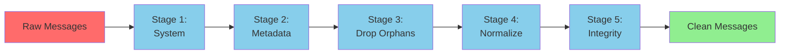

**Single Entry Point**: `sanitize(messages, snapshot, role) -> Result<Vec<ConversationMessage>, SanitizerError>`

---

## Six-Stage Pipeline

### Stage 1: System Message Injection

**Purpose**: Replace all stale system messages with a fresh snapshot render

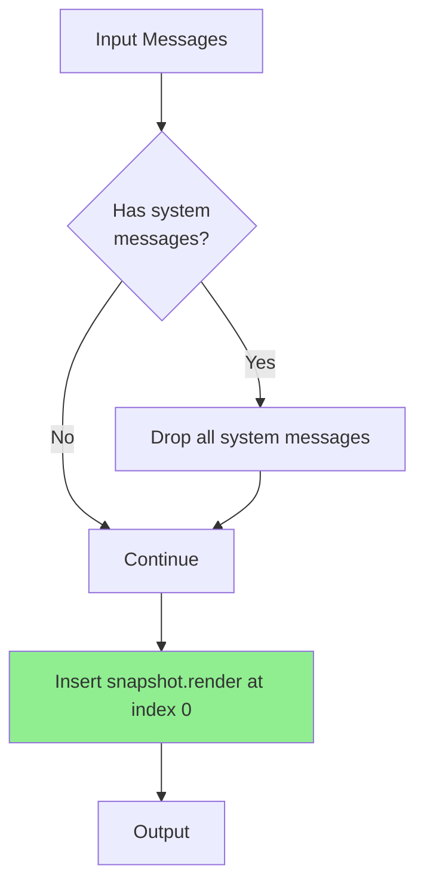

**Implementation**: `system::inject_system(messages, snapshot)`

**Behavior**:
1. Filter out all messages with `role == System`
2. Insert `ConversationMessage::system(snapshot.render())` at index 0
3. System message is **always** the first message

**Why**: System prompt changes across turns (new snapshot blocks, updated AGENTS.md, git status). Old system messages must be replaced to reflect current environment state.

---

### Stage 2: Metadata Injection

**Purpose**: Prepend timestamp and role to the **last user message**

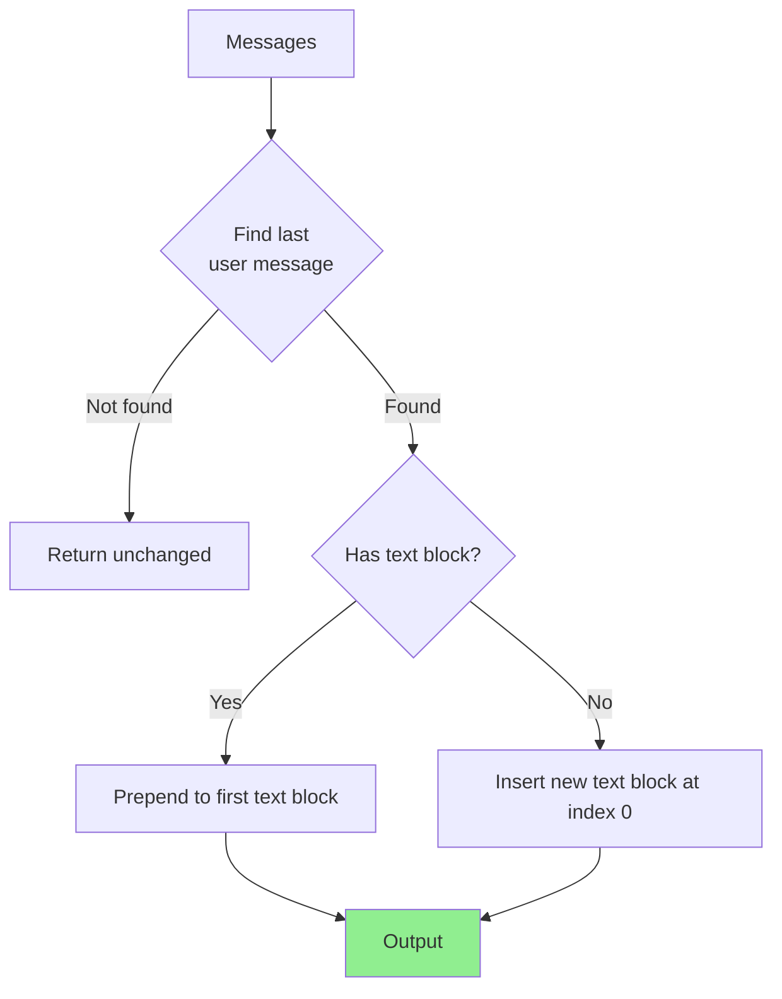

**Implementation**: `metadata::inject_metadata(messages, role)`

**Format**: `[Time: 2026-08-17T14:32:19Z | Role: Owner]\n{original_text}`

**Example**:

```diff
- User: "Can you debug this function?"
+ User: "[Time: 2026-08-17T14:32:19Z | Role: Owner]\nCan you debug this function?"
```

**Why**: LLM needs temporal context and role awareness for each turn. Only the **last** user message is annotated (the current turn being processed).

---

### Stage 3: Drop Orphans (Two Passes)

**Purpose**: Remove tool calls without matching results and tool results without matching calls

#### Pass 3a: Drop Orphan Tool Results

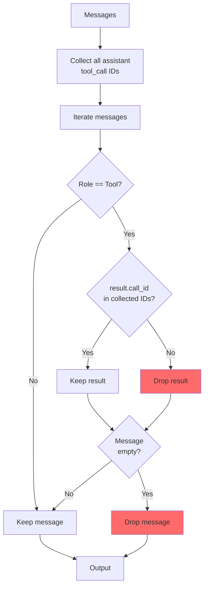

**Implementation**: `orphans::drop_orphan_tool_results(messages)`

**Example**:

```rust
// BEFORE
[
    Assistant: [ToolCall(id="call_1", name="read_file")],
    Tool: [ToolResult(call_id="call_1", ...)],        // ✅ Kept
    Tool: [ToolResult(call_id="call_999", ...)],      // ❌ Dropped (no matching call)
]

// AFTER
[
    Assistant: [ToolCall(id="call_1", name="read_file")],
    Tool: [ToolResult(call_id="call_1", ...)],
]
```

#### Pass 3b: Drop Orphan Tool Calls

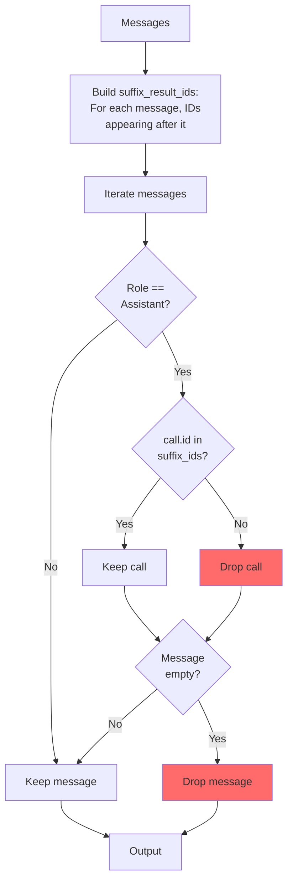

**Implementation**: `orphans::drop_orphan_tool_calls(messages)`

**Example**:

```rust
// BEFORE
[
    Assistant: [ToolCall(id="call_1", name="read_file")],
    Assistant: [ToolCall(id="call_2", name="grep_search")],  // ❌ No result follows
    Tool: [ToolResult(call_id="call_1", ...)],
]

// AFTER
[
    Assistant: [ToolCall(id="call_1", name="read_file")],
    Tool: [ToolResult(call_id="call_1", ...)],
]
```

**Why Suffix Check**: A tool call is only valid if its result appears **after** it in the message array. This handles cases where results are out of order.

---

### Stage 4: Normalize Tool Calls

**Purpose**: Fix malformed assistant tool call fields

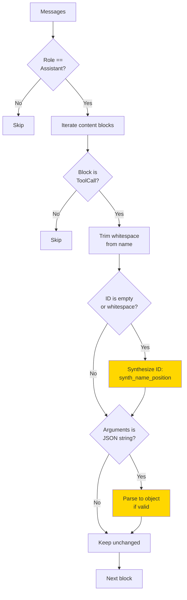

**Implementation**: `normalize::normalize_tool_calls(messages)`

**Fixes Applied**:

| Issue | Fix | Example |
|-------|-----|---------|
| Missing ID | Synthesize from name + position | `""` → `"synth_read_file_0"` |
| Whitespace in name | Trim | `"  read_file  "` → `"read_file"` |
| JSON-string arguments | Parse to object | `"{\"path\":\"/tmp/a\"}"` → `{"path": "/tmp/a"}` |

**Example**:

```rust
// BEFORE
ToolCall {
    id: "",
    name: "  read_file  ",
    arguments: Value::String("{\"path\":\"/tmp/a.txt\"}")
}

// AFTER
ToolCall {
    id: "synth_read_file_0",
    name: "read_file",
    arguments: Value::Object({"path": "/tmp/a.txt"})
}
```

---

### Stage 5: Enforce Integrity (Three Operations)

**Purpose**: Ensure message order, role alternation, and ID uniqueness

#### Operation 5a: Reorder Tool Results

**Move misplaced tool results to appear immediately after their first tool call**

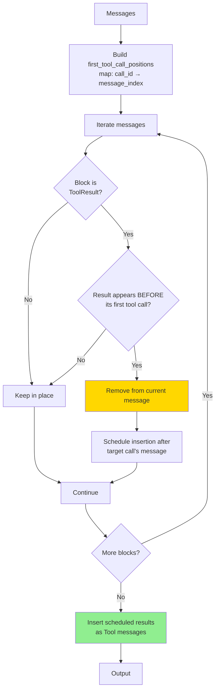

**Implementation**: `integrity::reorder_tool_results(messages)`

**Example**:

```rust
// BEFORE (result appears BEFORE its call)
[
    Tool: [ToolResult(call_id="call_1", ...)],        // ❌ Out of order
    Assistant: [ToolCall(id="call_1", ...)],
]

// AFTER
[
    Assistant: [ToolCall(id="call_1", ...)],
    Tool: [ToolResult(call_id="call_1", ...)],        // ✅ Moved after call
]
```

#### Operation 5b: Merge Adjacent Same-Role Messages

**Combine consecutive messages with the same role (except System)**

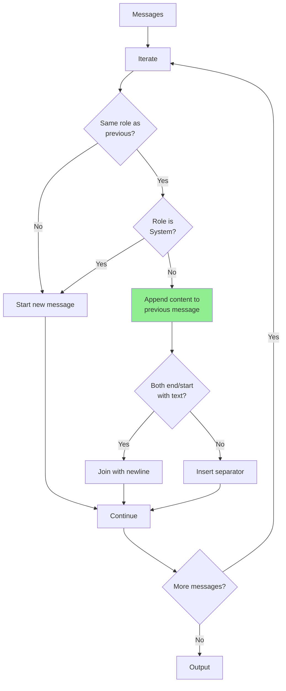

**Implementation**: `integrity::merge_adjacent_same_role_messages(messages)`

**Example**:

```rust
// BEFORE
[
    User: [Text("Can you help?")],
    User: [Text("I need to debug this")],
]

// AFTER
[
    User: [Text("Can you help?\nI need to debug this")],
]
```

**Separator Rules**:

| Last Block | First Block | Separator |
|------------|-------------|-----------|
| Text | Text | `\n` (joined inline) |
| Text | Non-text | `\n` (append to last text) |
| Non-text | Text | `\n` (prepend to first text) |
| Non-text | Non-text | New Text block `"\n"` |

#### Operation 5c: Deduplicate Tool Call IDs

**Drop duplicate tool calls and their corresponding results**

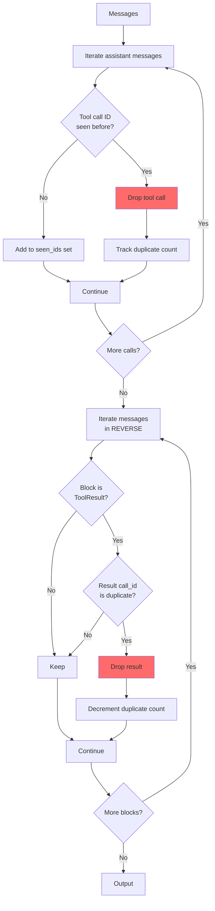

**Implementation**: `integrity::deduplicate_tool_call_ids(messages)`

**Example**:

```rust
// BEFORE
[
    Assistant: [ToolCall(id="dup", name="read_file")],
    Tool: [ToolResult(call_id="dup", ...)],
    Assistant: [ToolCall(id="dup", name="read_file")],  // ❌ Duplicate
    Tool: [ToolResult(call_id="dup", ...)],             // ❌ Dropped
]

// AFTER
[
    Assistant: [ToolCall(id="dup", name="read_file")],
    Tool: [ToolResult(call_id="dup", ...)],
]
```

**Why Reverse Iteration**: Matching results are dropped from the end backward, preserving the **first** occurrence of each tool call and its result.

---

## Complete Pipeline Example

```rust
use operon_context_sanitizer::{sanitize, SanitizerError};
use operon_context_normalize_messages::ConversationMessage;
use operon_context_snapshot::{Role, SessionSnapshot};

// Raw messages with multiple issues
let raw_messages = vec![
    ConversationMessage::system("Old system prompt"),  // Stale
    ConversationMessage::user(vec![
        ContentBlock::Text("Debug this".to_string())   // Missing metadata
    ]),
    ConversationMessage::assistant(vec![
        ContentBlock::ToolCall(ToolCall {
            id: "".to_string(),                        // Missing ID
            name: "  read_file  ".to_string(),         // Whitespace
            arguments: Value::String("{}".to_string()) // JSON string
        })
    ]),
    ConversationMessage::tool(vec![
        ContentBlock::ToolResult(result("orphan_id"))  // Orphan result
    ]),
];

// Sanitize
let clean = sanitize(raw_messages, &snapshot, Role::Owner)?;

// RESULT:
// [
//     System: [Fresh snapshot with bootstrap, AGENTS.md, tree, git, tools],
//     User: [Text("[Time: 2026-08-17T14:32:19Z | Role: Owner]\nDebug this")],
//     Assistant: [ToolCall(id="synth_read_file_0", name="read_file", arguments={})],
// ]
// - System replaced
// - Metadata injected
// - Orphan result dropped
// - Tool call normalized (ID synthesized, name trimmed, arguments parsed)
```

---

## Error Handling

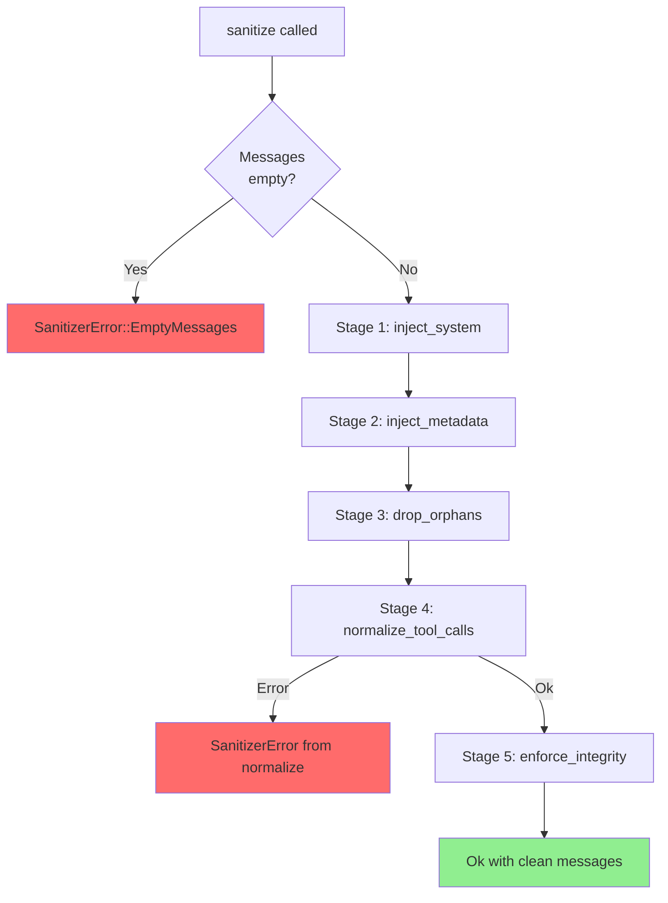

### Error Types

| Error | Cause | Recovery |
|-------|-------|----------|
| `EmptyMessages` | Input array is empty | Fail early; SessionRunner prevents this |
| Normalize errors | Currently none; future validation may add | Return error to SessionRunner |

**Current Behavior**: All stages are **infallible** except empty input check. Invalid data is **fixed or dropped**, not rejected.

---

## Integration with SessionRunner

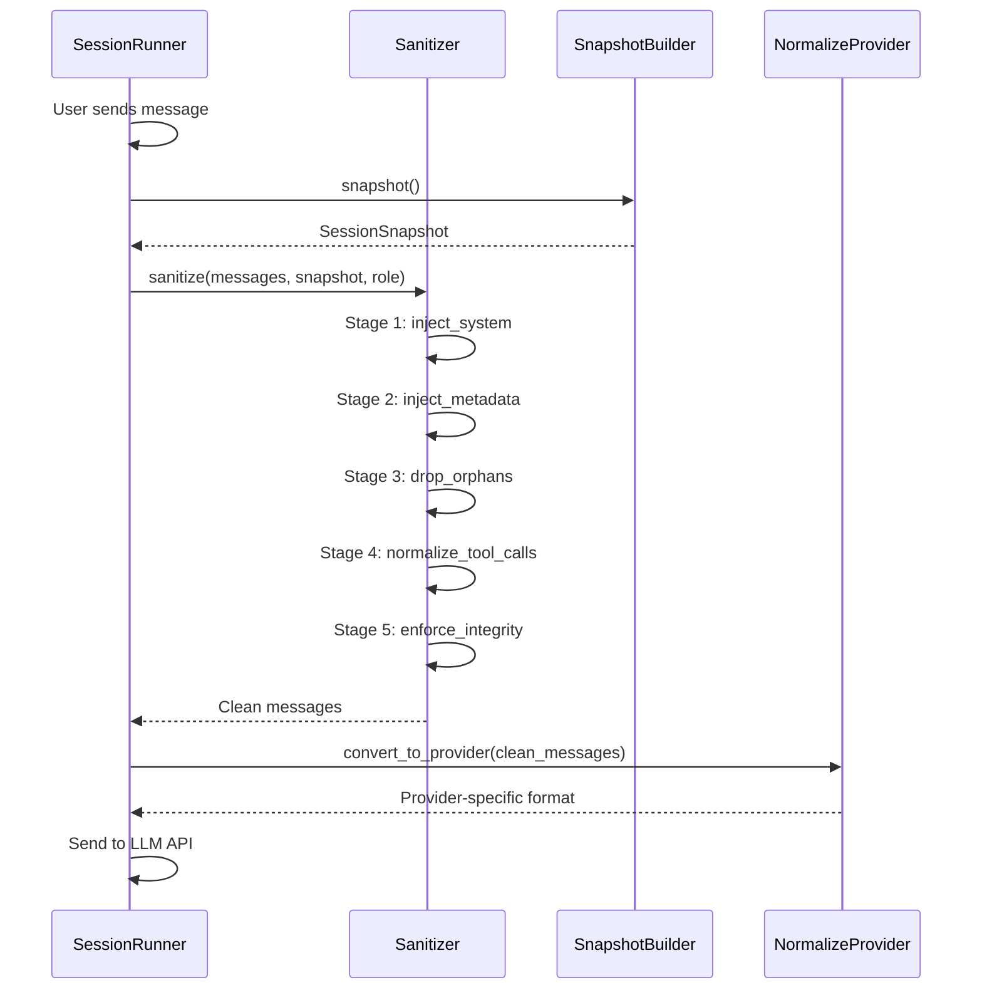

**SessionRunner Call Sites**:
1. **Before every LLM request**: `run_turn()` → `sanitize()` → `convert_to_provider()`
2. **After compaction**: Compaction returns raw messages → `sanitize()` → continue
3. **After tool execution**: Tool results added → `sanitize()` → send next chunk

---

## Performance

| Stage | Complexity | Typical Time |
|-------|-----------|--------------|
| **Stage 1: System** | O(messages) | <1ms |
| **Stage 2: Metadata** | O(messages) | <1ms |
| **Stage 3a: Drop Orphan Results** | O(messages × content blocks) | <1ms |
| **Stage 3b: Drop Orphan Calls** | O(messages × content blocks) | 1-2ms |
| **Stage 4: Normalize** | O(messages × content blocks) | <1ms |
| **Stage 5a: Reorder** | O(messages × content blocks) | 1-3ms |
| **Stage 5b: Merge** | O(messages × content blocks) | <1ms |
| **Stage 5c: Deduplicate** | O(messages × content blocks) | 1-2ms |

**Total**: 5-10ms for typical 50-message array with 100 content blocks

---

## Properties Guaranteed After Sanitization

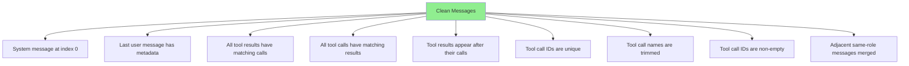

**LLM Provider Compatibility**: Clean messages satisfy Anthropic, OpenAI, Google, and other provider requirements for message structure.

---

## Testing

```bash
# Run all tests
cargo test -p operon-context-sanitizer

# Run specific stage tests
cargo test -p operon-context-sanitizer --test system
cargo test -p operon-context-sanitizer --test orphans
cargo test -p operon-context-sanitizer --test integrity
```

**Test Coverage**:
- ✅ Each stage has isolated unit tests
- ✅ Pipeline integration tests with multi-issue messages
- ✅ Edge cases (empty arrays, missing fields, out-of-order blocks)

---

## License

Operon is licensed under the **GNU Affero General Public License v3.0 (AGPLv3)**.

---

> Built by **Luka Gray (aka Soumo Mukherjee)** • West Bengal, India • 2026
