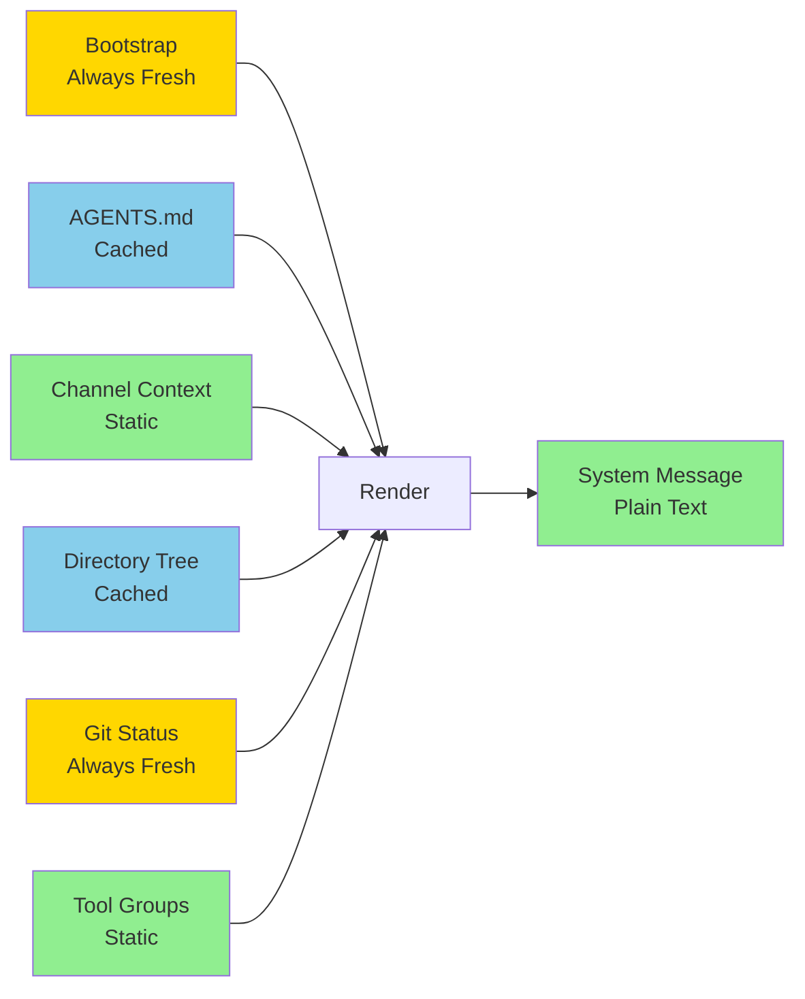
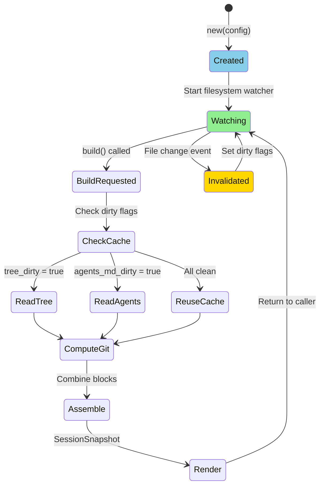
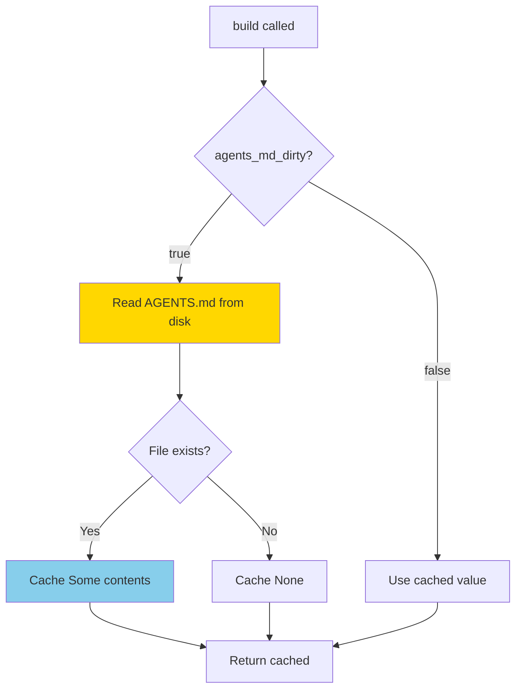
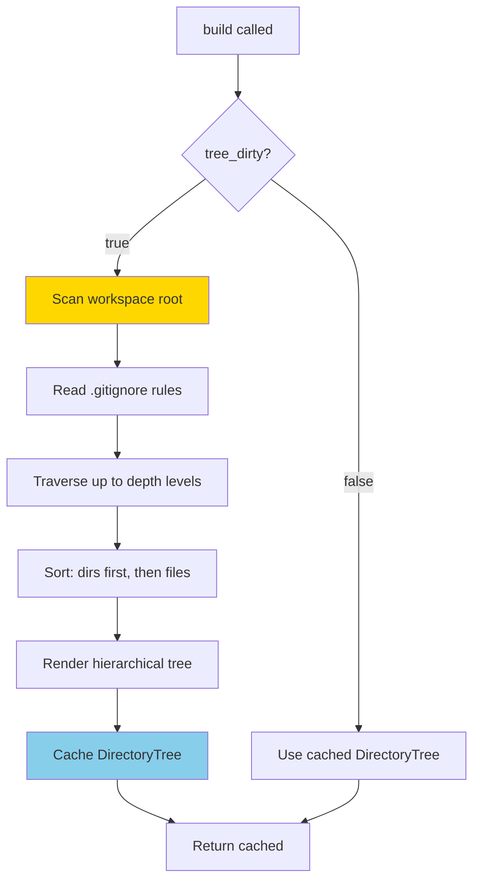
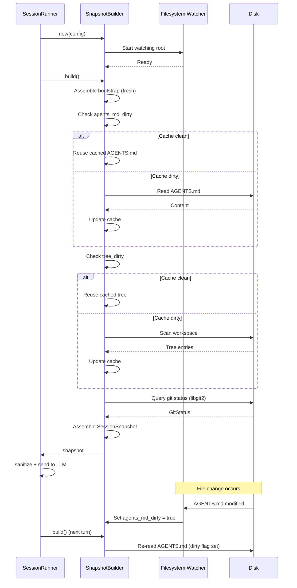
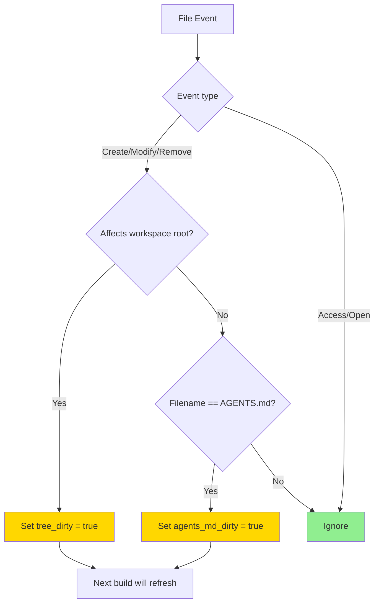
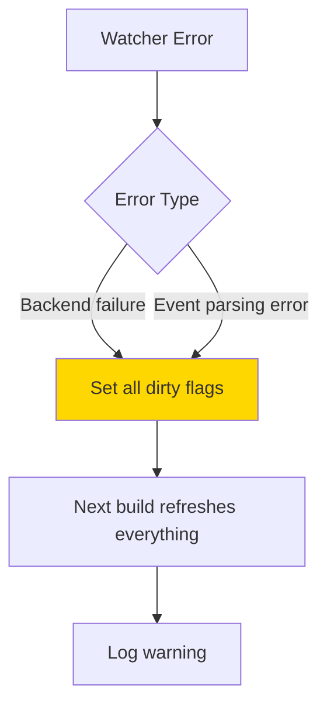
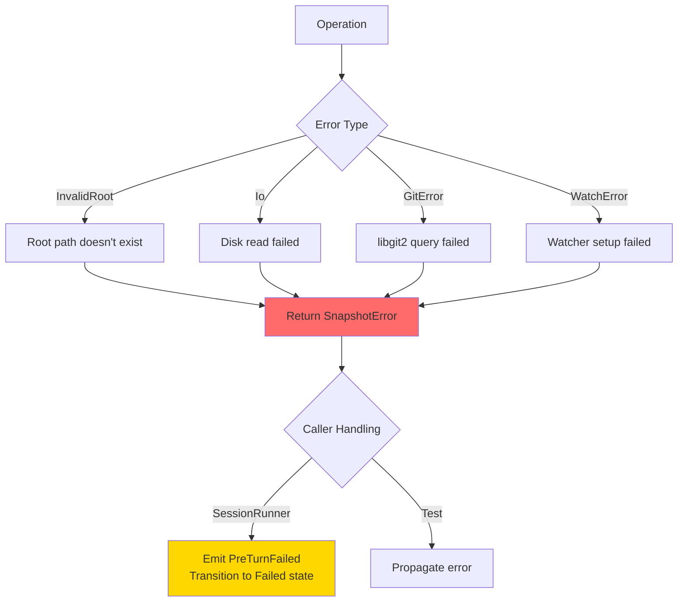
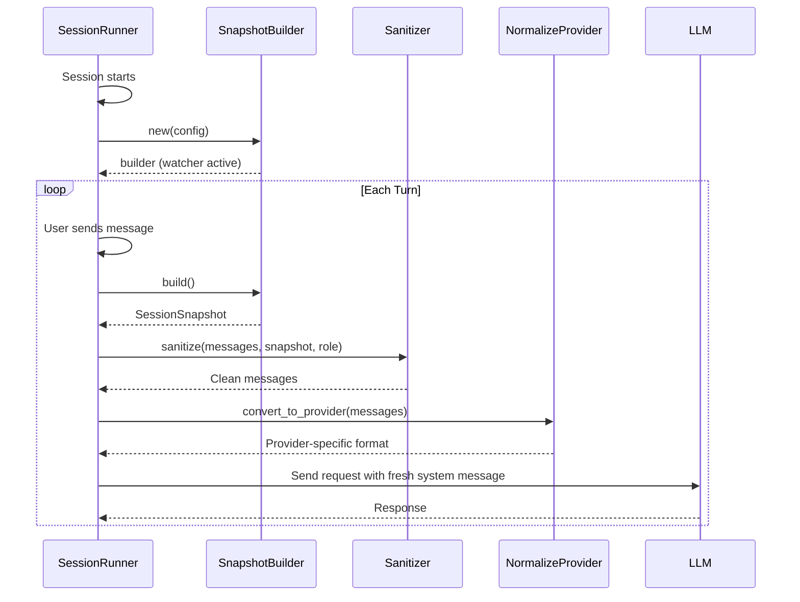

# operon-context-snapshot

**Per-turn system message builder with intelligent caching and filesystem watch**

`operon-context-snapshot` generates the LLM system message for each conversation turn, combining agent identity, workspace rules, project structure, git status, and available tools into a single plain-text context block.

---

## Overview

Every LLM request needs a **fresh system message** reflecting current environment state. This crate builds that message by assembling five blocks:



**Key Features**:
- **Filesystem watcher**: Invalidates caches when `AGENTS.md` or workspace root changes
- **Selective caching**: Tree and AGENTS.md cached; bootstrap and git always fresh
- **Zero I/O blocks**: Channel context and tool groups are in-memory strings
- **Single entry point**: `SnapshotBuilder::build() -> SessionSnapshot`

---

## Architecture

### SnapshotBuilder Lifecycle



### Block Computation Strategy

| Block | Computation | Caching | Invalidation |
|-------|-------------|---------|--------------|
| **Bootstrap** | Always fresh | None | Every `build()` |
| **AGENTS.md** | Read from `$ROOT/AGENTS.md` | Cached | `AGENTS.md` modified |
| **Channel Context** | In-memory string (config) | None | Manual via `config_mut()` |
| **Tree** | Gitignore-aware traversal | Cached | Workspace root change |
| **Git Status** | libgit2 query | None | Every `build()` |
| **Tool Groups** | In-memory vec (config) | None | Manual via `config_mut()` |

---

## Snapshot Blocks

### Block 1: Bootstrap (Always Fresh)

**Purpose**: Session identity and timestamp

```rust
pub struct BootstrapBlock {
    pub agent_name: String,      // "Operon"
    pub timestamp: String,        // RFC3339 UTC: "2026-08-17T14:32:19Z"
    pub session_id: String,       // Hex nanoseconds
    pub role: Role,               // Owner | External
    pub system_prompt: &'static str, // Main agent instructions
}
```

**Rendered Output**:

```
=== OPERON SESSION ===
Agent: Operon
Role: Owner
Session: 18f4a2b3c9d1e
Time: 2026-08-17T14:32:19Z
```

**Timestamp Generation**: Custom UTC formatter using civil calendar algorithm (no chrono dependency)

---

### Block 2: AGENTS.md (Cached)

**Purpose**: Workspace-specific rules and instructions



**Invalidation Trigger**: Filesystem watcher detects change to any file named `AGENTS.md` in workspace

**Rendered Output**:

```
=== INSTRUCTIONS ===
You are an AI agent operating as part of a production-grade software system...
[full AGENTS.md content]
```

**Fallback**: If missing: `(none)`

---

### Block 3: Channel Context (Static)

**Purpose**: Channel-specific role instructions (WhatsApp, Telegram, etc.)

```rust
pub struct SnapshotConfig {
    pub channel_instructions: Option<String>, // In-memory string
}
```

**Rendered Output** (when present):

```
=== CHANNEL CONTEXT ===
WhatsApp channel constraints:
- Owner: Full tool access
- External: No filesystem tools
```

**Update Strategy**: Manual via `builder.config_mut().channel_instructions = Some(...)`

---

### Block 4: Directory Tree (Cached)

**Purpose**: Gitignore-aware workspace structure



**Configuration**:

```rust
pub struct SnapshotConfig {
    pub tree_depth: usize, // Default: 1 (root + immediate children)
}
```

**Invalidation Trigger**: Filesystem watcher detects file/directory create/modify/remove in workspace root

**Rendered Output** (depth=1):

```
=== PROJECT ===
Root: D:\Operon
d:\Operon
├── .git\
├── .github\
├── assets\
├── operon-rs\
├── .gitignore
├── AGENTS.md
├── Cargo.toml
└── README.md
```

**Sorting**: Directories first (alphabetical), then files (alphabetical)

**Gitignore Integration**: Uses `ignore` crate (same as ripgrep) to respect `.gitignore`, `.git/info/exclude`, and global ignore

---

### Block 5: Git Status (Always Fresh)

**Purpose**: Current repository state

```rust
pub struct GitStatus {
    pub branch: String,      // "main", "HEAD (detached)"
    pub staged: usize,       // Files in index
    pub unstaged: usize,     // Modified working tree
    pub untracked: usize,    // New files not in .gitignore
    pub insertions: u64,     // Lines added
    pub deletions: u64,      // Lines removed
}
```

**Computation**: libgit2 queries repository state

**Rendered Output**:

```
=== GIT ===
Branch: feat/documentation
Staged: 3  Unstaged: 1  Untracked: 0
Modified lines: +142 -37
```

**Omitted**: If workspace root is not a git repository

---

### Block 6: Tool Groups (Static)

**Purpose**: List available tool categories

```rust
pub struct SnapshotConfig {
    pub tool_groups: Vec<String>, // ["fs", "shell", "web", "todo"]
}
```

**Rendered Output**:

```
=== AVAILABLE TOOLS ===
fs, shell, web, todo, memory, media
```

**Omitted**: If `tool_groups` is empty

**Update Strategy**: Manual via `builder.config_mut().tool_groups = vec![...]`

---

## Usage

### Basic Setup

```rust
use operon_context_snapshot::{SnapshotBuilder, SnapshotConfig, Role};
use std::path::PathBuf;

// Configure builder
let config = SnapshotConfig {
    root: PathBuf::from("D:/Operon"),
    role: Role::Owner,
    session_id: "session_abc123".to_string(),
    tree_depth: 2,
    tool_groups: vec![
        "fs".to_string(),
        "shell".to_string(),
        "web".to_string(),
    ],
    channel_instructions: None,
};

// Create builder (starts filesystem watcher)
let mut builder = SnapshotBuilder::new(config)?;

// Build snapshot for current turn
let snapshot = builder.build()?;

// Use in system message
let system_message = snapshot.render();
println!("{}", system_message);
```

### Per-Turn Workflow



### Dynamic Configuration Updates

```rust
// Update role mid-session (channel role change)
builder.config_mut().role = Role::External;

// Add channel-specific instructions
builder.config_mut().channel_instructions = Some(
    "External role: Filesystem tools disabled".to_string()
);

// Update available tool groups
builder.config_mut().tool_groups.push("memory".to_string());

// Increase tree depth for deep exploration
builder.config_mut().tree_depth = 3;

// Next build() will use updated config
let snapshot = builder.build()?;
```

---

## Caching Strategy

### Cache Invalidation Flow



### Cache Hit Rates (Typical Session)

| Turn | Bootstrap | AGENTS.md | Tree | Git | Result |
|------|-----------|-----------|------|-----|--------|
| 1 | Fresh | Read | Read | Fresh | Full computation |
| 2-10 | Fresh | **Cache hit** | **Cache hit** | Fresh | Fast path |
| 11 | Fresh | **Cache hit** (edit detected) | Read | Fresh | Tree refresh |
| 12-20 | Fresh | **Cache hit** | **Cache hit** | Fresh | Fast path |

**Expected**: 80-90% cache hit rate for AGENTS.md and tree in typical sessions

---

## Filesystem Watcher Details

### Watcher Backend

- **Windows**: ReadDirectoryChangesW (native API)
- **Linux**: inotify
- **macOS**: FSEvents

**Crate**: `notify` (recommended_watcher with automatic backend selection)

### Watch Scope

```rust
watcher.watch(&config.root, RecursiveMode::NonRecursive)
```

**NonRecursive**: Only monitors workspace root (not subdirectories)

**Rationale**: Subdirectory changes don't affect tree (only root-level structure matters at depth=1-2)

### Event Filtering

```rust
fn event_should_invalidate(kind: &EventKind) -> bool {
    matches!(
        kind,
        EventKind::Create(_)
            | EventKind::Modify(_)
            | EventKind::Remove(_)
    )
}
```

**Ignored Events**: Access, Metadata (no content change)

### Error Handling



**Conservative Fallback**: On watcher errors, mark all caches dirty

---

## Thread Safety

```rust
impl SnapshotBuilder {
    // ✅ Send: Can be moved across threads
    // ❌ NOT Sync: Cannot be shared across threads
}
```

**Multi-threaded Usage**:

```rust
use std::sync::Mutex;
use tokio::sync::Mutex as TokioMutex;

// Async context
let builder = Arc::new(TokioMutex::new(SnapshotBuilder::new(config)?));

// Tokio task
let snapshot = builder.lock().await.build()?;

// Std threads
let builder = Arc::new(Mutex::new(SnapshotBuilder::new(config)?));
let snapshot = builder.lock().unwrap().build()?;
```

**Why Not Sync**: Internal `RecommendedWatcher` is not `Sync` (platform-specific file handles)

---

## Performance

| Operation | Complexity | Typical Time |
|-----------|-----------|--------------|
| **Builder creation** | O(1) + watcher setup | 1-2ms |
| **build() - all cache hits** | O(1) | <1ms |
| **build() - AGENTS.md miss** | O(file size) | 1-5ms |
| **build() - tree miss (depth=1)** | O(root entries × gitignore rules) | 5-20ms |
| **build() - tree miss (depth=2)** | O(root entries × avg_children × rules) | 20-100ms |
| **build() - git status** | O(repo size) | 5-50ms |

**Typical Turn (cache hits)**: 10-60ms total (dominated by git status query)

**First Turn (all misses)**: 50-200ms

---

## Error Handling



### Error Types

| Error | Cause | Recovery |
|-------|-------|----------|
| `InvalidRoot` | Config root path doesn't exist | Fix config, retry |
| `Io` | Disk read permission denied, file deleted mid-read | Retry, fallback to partial snapshot |
| `GitError` | Corrupted git repo, permission issues | Omit git block, continue |
| `WatchError` | Too many open files, unsupported filesystem | Disable caching, always recompute |

---

## Integration with SessionRunner



**SessionRunner Responsibilities**:
1. Create `SnapshotBuilder` at session start
2. Call `builder.build()` before each LLM request
3. Pass snapshot to `sanitizer::sanitize()`
4. Update `config_mut()` when role or tools change

---

## Example Rendered Snapshot

```
You are Operon, an AI-powered development environment...
[full system prompt]

=== OPERON SESSION ===
Agent: Operon
Role: Owner
Session: 18f4a2b3c9d1e
Time: 2026-08-17T14:32:19Z

=== INSTRUCTIONS ===
You are an AI agent operating as part of a production-grade software system.
Your behavior must reflect real-world engineering standards...
[full AGENTS.md content]

=== CHANNEL CONTEXT ===
WhatsApp channel: Owner role has full tool access.
External contacts are restricted to read-only operations.

=== PROJECT ===
Root: D:\Operon
d:\Operon
├── .git\
├── .github\
│   └── workflows\
├── assets\
│   ├── lucide\
│   └── logo.svg
├── operon-rs\
│   ├── src\
│   └── Cargo.toml
├── .gitignore
├── AGENTS.md
├── Cargo.toml
└── README.md

=== GIT ===
Branch: feat/documentation
Staged: 3  Unstaged: 1  Untracked: 0
Modified lines: +142 -37

=== AVAILABLE TOOLS ===
fs, shell, web, todo, memory, media
```

---

## Testing

```bash
# Run all tests
cargo test -p operon-context-snapshot

# Test specific blocks
cargo test -p operon-context-snapshot --test tree
cargo test -p operon-context-snapshot --test git
cargo test -p operon-context-snapshot --test bootstrap
```

**Test Coverage**:
- ✅ Bootstrap timestamp format (RFC3339 compliance)
- ✅ Tree rendering with gitignore
- ✅ Git status computation (staged, unstaged, untracked, line counts)
- ✅ Snapshot render output format
- ✅ Cache invalidation logic
- ✅ Multi-turn builder reuse

---

## License

Operon is licensed under the **GNU Affero General Public License v3.0 (AGPLv3)**.

---

> Built by **Luka Gray (aka Soumo Mukherjee)** • West Bengal, India • 2026
