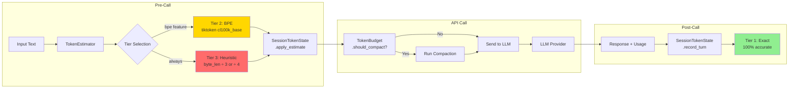
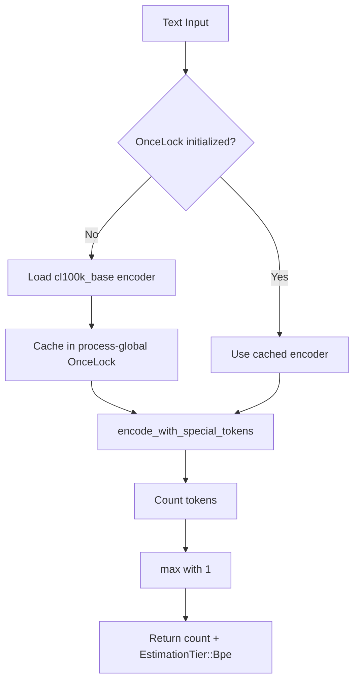
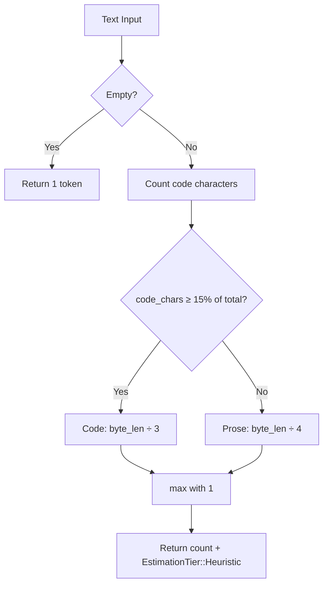

# operon-context-token-tracker

**Three-tier token estimation and budget management for LLM context window control**

`operon-context-token-tracker` provides a sophisticated token counting strategy that lets you estimate, track, and budget token usage across an entire agent session — before and after each API call.

---

## Overview

Every LLM has a hard context-window limit. Exceeding it causes truncation or rejection. This crate provides a **three-tier token counting strategy** to prevent context overflow and enable intelligent compaction.

| Tier | When | Accuracy | Dependency | Latency |
|------|------|----------|------------|---------|
| **Exact** | Post-call | 100% | Provider API | N/A (part of response) |
| **BPE** | Pre-call | ~99% | `tiktoken` (`bpe` feature) | ~5-10ms per message |
| **Heuristic** | Pre-call | ~85-90% | None (always available) | <1ms per message |

---

## Architecture



### Tier 1 — Exact (post-call)

Record the actual token counts from the provider API response. Every major provider includes this in their response body:

- **Anthropic**: `usage.input_tokens`, `usage.output_tokens`
- **OpenAI**: `usage.prompt_tokens`, `usage.completion_tokens`
- **Gemini**: `usageMetadata.promptTokenCount`, `usageMetadata.candidatesTokenCount`

This is ground truth. Always use it to correct session state after each turn.

**Update Formula:**
```
current_context_tokens = usage.input_tokens  // Full prompt size
total_input_tokens    += usage.input_tokens
total_output_tokens   += usage.output_tokens
turn_count            += 1
```

### Tier 2 — BPE (pre-call, `bpe` feature)

Uses the `tiktoken` crate with `cl100k_base` encoding — the industry standard for OpenAI-family models.

**Algorithm:**


**Accuracy**: ~99% for GPT-3.5/4, DeepSeek, Nvidia NIM, and Anthropic (OpenAI-family tokenizer)

**Performance**: ~5-10ms per message (first call loads encoder, subsequent calls reuse)

### Tier 3 — Heuristic (pre-call, always available)

Zero-dependency content-aware estimation using character analysis.

**Algorithm:**



**Code Characters**: `{` `}` `(` `)` `;` `[` `]` `<` `>` `/`

**Detection Rule**: If ≥15% of characters are code indicators → code-like

**Accuracy**: ~85-90% (intentionally overshoots ~10-15%)

**Conservative Bias**: Overshooting triggers compaction *before* hard limit, never after

**Chat Message Overhead**: +4 tokens per message for role/separator/primer

---

## Quick Start

```toml
# Cargo.toml
[dependencies]
operon-context-token-tracker = "0.1"

# Optional: enable BPE tier
# operon-context-token-tracker = { version = "0.1", features = ["bpe"] }
```

```rust
use operon_context_token_tracker::{
    TokenEstimator, TokenBudget, SessionTokenState, UsageRecord, TokenRecorder,
};

// Pre-call: estimate before sending to the LLM
let (count, tier) = TokenEstimator::estimate("Hello, world!");
println!("~{count} tokens (via {tier:?})");

// Budget: check if compaction is needed
let budget = TokenBudget::with_window(200_000)?;
if budget.should_compact(current_tokens) {
    // trigger compaction before next call
}

// Post-call: record exact usage from the API response
let mut session = SessionTokenState::new();
let record = UsageRecord {
    input_tokens:       1_024,
    output_tokens:      256,
    cache_read_tokens:  None,
    cache_write_tokens: None,
    model:    "claude-sonnet-4-5".into(),
    provider: "anthropic".into(),
};
session.record_turn(&record);

// Check if context window needs compaction
if budget.should_compact(session.current_context_tokens) {
    // run compaction, then session.reset()
}
```

---

## API Reference

### `TokenEstimator`

Stateless. All methods are associated functions.

| Method | Description |
|---|---|
| `estimate(text)` | Estimate tokens for a single string. Returns `(count, tier)`. |
| `estimate_messages(msgs)` | Estimate for a slice of messages, adding 4 tokens/message overhead. |
| `is_code_like(text)` | Returns `true` if `>= 15%` of chars are code indicators. |

### `TokenBudget`

Immutable configuration for one model session.

| Method | Description |
|---|---|
| `with_window(n)` | Construct with 90% compaction threshold. |
| `new(n, threshold)` | Construct with custom threshold in `(0.0, 1.0]`. |
| `should_compact(tokens)` | `true` when at or past the compaction limit. |
| `remaining(tokens)` | Tokens left before the compaction limit. |
| `utilization(tokens)` | Fraction consumed `[0.0, 1.0]`. |
| `compaction_limit()` | Absolute token count at which compaction triggers. |

### `SessionTokenState`

Mutable cross-turn state. Persist this between agent turns.

| Method | Description |
|---|---|
| `record_turn(&record)` | Update from a post-call `UsageRecord` (Tier 1). |
| `apply_estimate(n, tier)` | Update `current_context_tokens` from a pre-call estimate. |
| `reset()` | Zero all state for a new session or post-compaction. |
| `total_tokens()` | Sum of all input + output tokens this session. |

### `TokenRecorder`

Accumulates `UsageRecord`s. History is newest-first.

| Method | Description |
|---|---|
| `record(usage)` | Append a usage record. |
| `last()` | Most recent record. |
| `history()` | All records, newest first. |
| `total_input()` / `total_output()` / `total_tokens()` | Aggregate stats. |
| `clear()` | Discard all records. |

### `UsageRecord`

```rust
pub struct UsageRecord {
    pub input_tokens:        usize,
    pub output_tokens:       usize,
    pub cache_read_tokens:   Option<usize>,  // Anthropic prompt caching
    pub cache_write_tokens:  Option<usize>,  // Anthropic prompt caching
    pub model:               String,
    pub provider:            String,
}
```

---

## Features

| Feature | Default | Description |
|---|---|---|
| `bpe` | off | Enable BPE tokenisation via `tiktoken` (`cl100k_base`). |

The `bpe` feature is strictly additive — disabling it never breaks compilation or changes the public API. When off, `EstimationTier::Bpe` is never returned.

---

## Correctness Guarantees

- No `unwrap()` or `expect()` in library code.
- All counter arithmetic uses `saturating_add` (counters) or `checked_add` + `Err(Overflow)` where overflow would corrupt a budget decision.
- `TokenBudget::new()` validates both parameters and rejects NaN/infinity thresholds.
- `cargo test` and `cargo clippy -- -D warnings` pass clean.

---

## License

Operon is licensed under the **GNU Affero General Public License v3.0 (AGPLv3)**.

---

> Built by **Luka Gray (aka Soumo Mukherjee)** • West Bengal, India • 2026
