# operon-diff

**Production-grade Git integration engine with async UI interop for Operon**

`operon-diff` provides comprehensive Git repository management via `libgit2`, including diff parsing, staging operations, branch management, commit creation, visual commit graphs, remote synchronization, and multi-repository workspace tracking. All blocking operations have non-blocking async wrappers for seamless UI integration.

---

## Overview

This crate is the **core Git integration layer** for Operon, handling all version control operations from the desktop UI (Slint) and future web/CLI clients. It wraps `libgit2` with ergonomic, production-ready APIs and rich DTOs for frontend consumption.

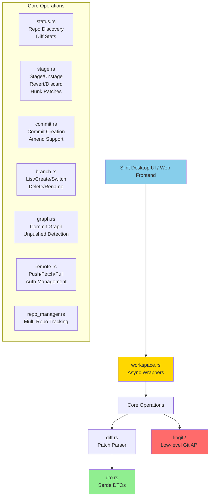

**Key Features**:
- ✅ **File-level and hunk-level staging** with unified patch generation
- ✅ **Visual commit graph** with branch tags and unpushed commit detection
- ✅ **Branch operations** (create, switch, delete, rename) with upstream tracking
- ✅ **Remote operations** (push, fetch, fast-forward pull) with auto-credential handling
- ✅ **Multi-repository workspaces** with in-memory registry
- ✅ **Async wrappers** for all blocking operations (`tokio::task::spawn_blocking`)
- ✅ **Rich DTOs** with camelCase serialization for frontend interop

---

## Architecture

### Module Organization

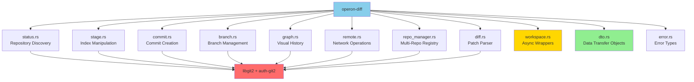

---

## Core Operations

### 1. Repository Discovery & Diff Statistics

**Module**: `status.rs`

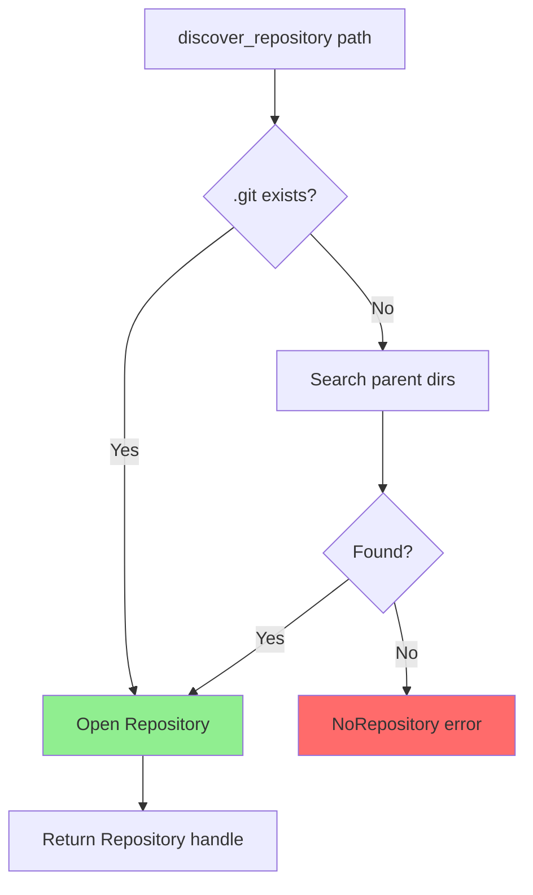

**API**:

```rust
// Discover repository root from workspace path
pub fn discover_repository<P: AsRef<Path>>(workspace_root: P) 
    -> Result<Repository, DiffError>;

// Quick stats for header badge (+X -Y)
pub fn get_diff_stats<P: AsRef<Path>>(workspace_root: P) 
    -> Result<GitDiffStats, DiffError>;

// Full diff tree with file-level hunks
pub fn get_diff_details<P: AsRef<Path>>(workspace_root: P) 
    -> Result<RepositoryDiff, DiffError>;
```

**Diff Computation**:

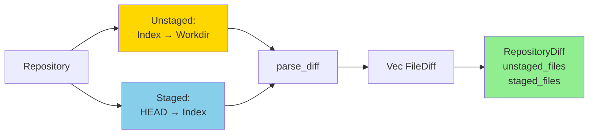

**Stats Calculation**:
- **Staged**: `diff_tree_to_index(HEAD, Index)` (handles unborn HEAD)
- **Unstaged**: `diff_index_to_workdir(Index, Workdir)` with `include_untracked(true)`
- **Total**: Sum of staged and unstaged insertions/deletions

---

### 2. Staging Operations

**Module**: `stage.rs`

#### File-Level Operations

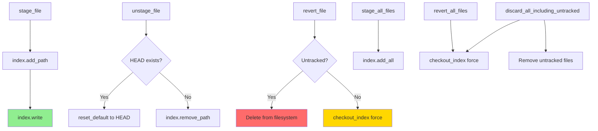

**API**:

```rust
// Stage single file
pub fn stage_file<P: AsRef<Path>>(workspace_root: P, relative_path: &str) 
    -> Result<(), DiffError>;

// Unstage file (reset to HEAD)
pub fn unstage_file<P: AsRef<Path>>(workspace_root: P, relative_path: &str) 
    -> Result<(), DiffError>;

// Revert unstaged changes (untracked files deleted)
pub fn revert_file<P: AsRef<Path>>(workspace_root: P, relative_path: &str) 
    -> Result<(), DiffError>;

// Stage all modifications and untracked files
pub fn stage_all_files<P: AsRef<Path>>(workspace_root: P) 
    -> Result<(), DiffError>;

// Discard all unstaged changes (tracked files only)
pub fn revert_all_files<P: AsRef<Path>>(workspace_root: P) 
    -> Result<(), DiffError>;

// Nuclear option: discard + delete untracked
pub fn discard_all_including_untracked<P: AsRef<Path>>(workspace_root: P) 
    -> Result<(), DiffError>;
```

#### Hunk-Level Operations

**Unified Patch Generation** for selective staging:

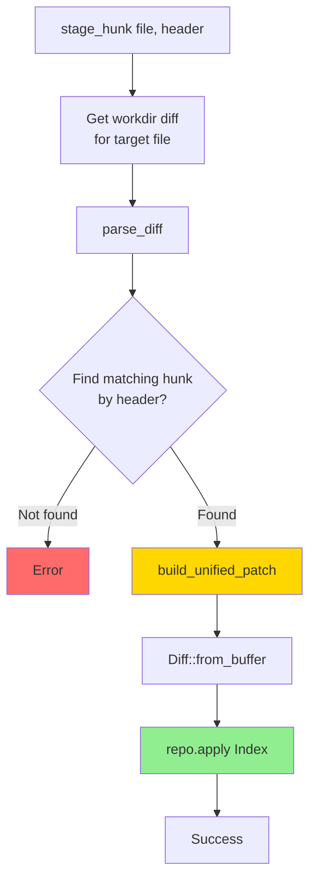

**Patch Format** (example):

```diff
diff --git a/src/main.rs b/src/main.rs
--- a/src/main.rs
+++ b/src/main.rs
@@ -245,6 +245,21 @@ fn process_data(input: &str) -> Result<String> {
+    // New validation logic
+    if input.is_empty() {
+        return Err("Empty input");
+    }
     let result = transform(input);
```

**API**:

```rust
// Stage single hunk within file
pub fn stage_hunk<P: AsRef<Path>>(
    workspace_root: P,
    relative_path: &str,
    hunk_header: &str,
) -> Result<(), DiffError>;

// Unstage single hunk (reverse patch)
pub fn unstage_hunk<P: AsRef<Path>>(
    workspace_root: P,
    relative_path: &str,
    hunk_header: &str,
) -> Result<(), DiffError>;
```

**Reverse Patch** for unstaging:
- Swap `+` and `-` line types
- Invert hunk header ranges: `@@ -new_start,new_lines +old_start,old_lines @@`
- Handle file status inversions (added → deleted, deleted → added)

---

### 3. Commit Creation

**Module**: `commit.rs`

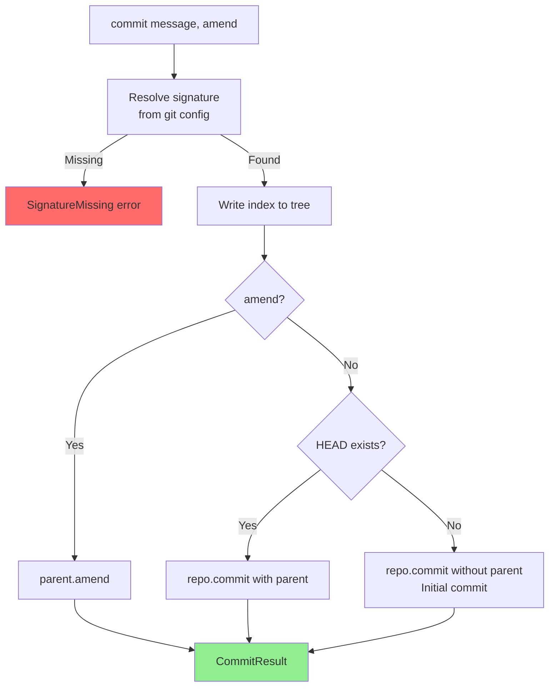

**API**:

```rust
pub fn commit(
    repo: &Repository,
    message: &str,
    amend: bool,
) -> Result<CommitResult, DiffError>;

pub fn commit_workspace<P: AsRef<Path>>(
    workspace_root: P,
    message: &str,
    amend: bool,
) -> Result<CommitResult, DiffError>;
```

**Signature Resolution**:
- Reads `user.name` and `user.email` from:
  1. Repository-local `.git/config`
  2. Global `~/.gitconfig`
  3. Environment variables (`GIT_AUTHOR_NAME`, `GIT_AUTHOR_EMAIL`)
- Returns `DiffError::SignatureMissing` if unconfigured

**Amend Support**:
- Modifies last commit in-place
- Preserves parent relationships
- Updates message and tree
- **Warning**: Only amend unpushed commits

---

### 4. Branch Management

**Module**: `branch.rs`

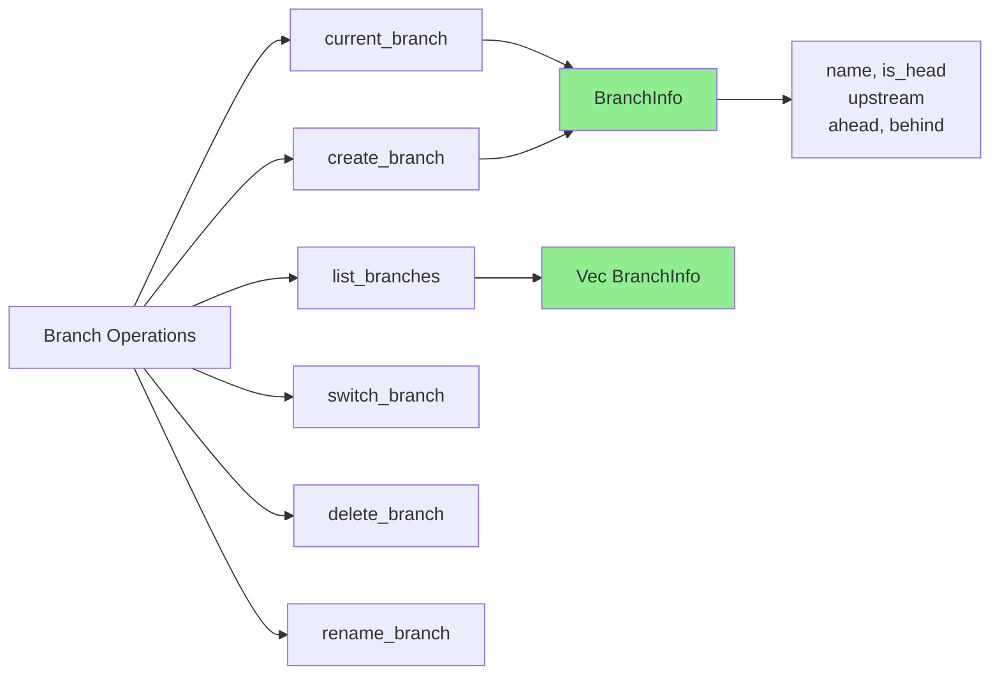

**API**:

```rust
// Get current HEAD branch with tracking info
pub fn current_branch(repo: &Repository) 
    -> Result<BranchInfo, DiffError>;

// List all local branches with ahead/behind metrics
pub fn list_branches(repo: &Repository) 
    -> Result<Vec<BranchInfo>, DiffError>;

// Create new branch at commit (or HEAD)
pub fn create_branch(
    repo: &Repository,
    name: &str,
    target_commit_sha: Option<&str>,
) -> Result<BranchInfo, DiffError>;

// Switch to branch (checkout)
pub fn switch_branch(repo: &Repository, name: &str) 
    -> Result<(), DiffError>;

// Delete local branch
pub fn delete_branch(repo: &Repository, name: &str) 
    -> Result<(), DiffError>;

// Rename existing branch
pub fn rename_branch(
    repo: &Repository,
    old_name: &str,
    new_name: &str,
) -> Result<(), DiffError>;
```

**BranchInfo Structure**:

```rust
pub struct BranchInfo {
    pub name: String,              // "main"
    pub is_head: bool,             // Currently checked out?
    pub upstream: Option<String>,  // "origin/main"
    pub ahead: usize,              // Commits ahead of upstream
    pub behind: usize,             // Commits behind upstream
}
```

**Upstream Tracking**:

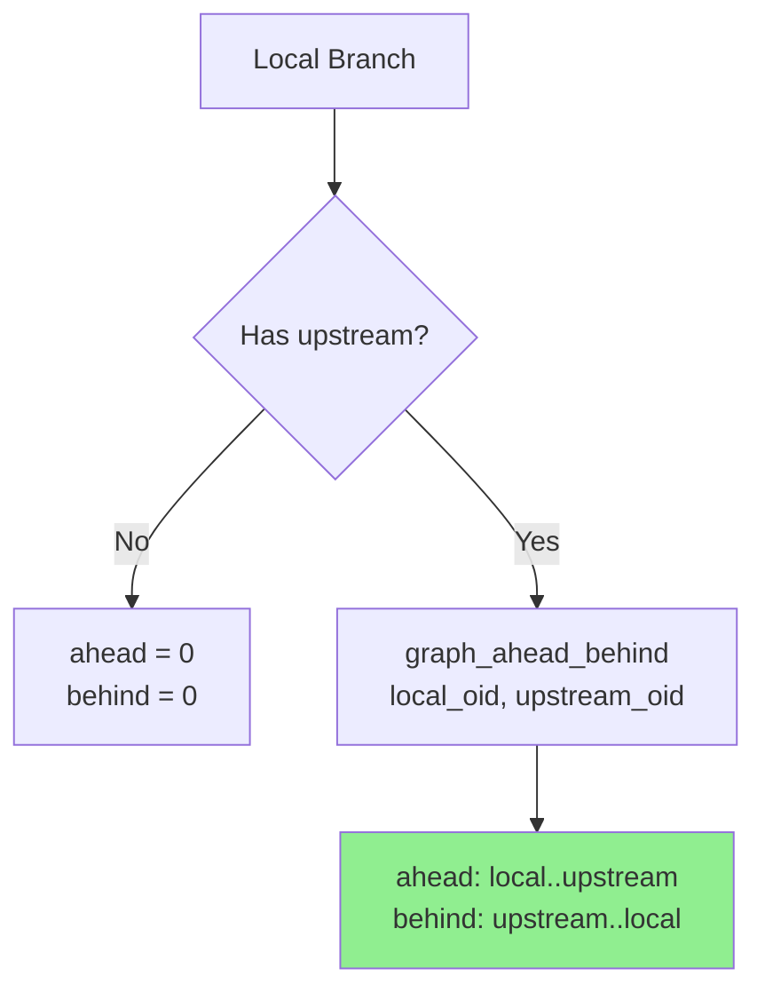

**Unborn Branch Handling**:
- Fresh repos with no commits: `HEAD` → `refs/heads/main`
- Returns `BranchInfo` with `name = "main"`, `is_head = true`, no upstream

---

### 5. Visual Commit Graph

**Module**: `graph.rs`

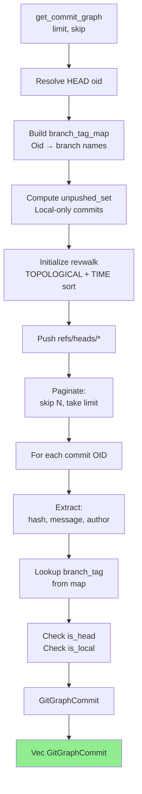

**API**:

```rust
// Paginated commit history
pub fn get_commit_graph(
    repo: &Repository,
    limit: usize,  // Max commits to return (0 = all)
    skip: usize,   // Pagination offset
) -> Result<Vec<GitGraphCommit>, DiffError>;

// Resolve branch tag for specific commit
pub fn branch_tag_for(repo: &Repository, oid: Oid) -> String;
```

**GitGraphCommit Structure**:

```rust
pub struct GitGraphCommit {
    pub hash: String,         // Full 40-char SHA
    pub short_hash: String,   // 7-char abbreviated
    pub message: String,      // First line summary
    pub author: String,       // Name or email
    pub branch_tag: String,   // "main, develop" (comma-separated)
    pub is_head: bool,        // Current HEAD commit?
    pub is_local: bool,       // Unpushed to upstream?
}
```

**Branch Tag Map**:

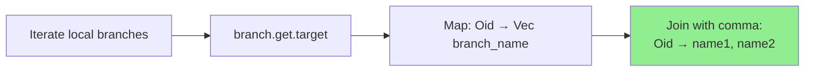

**Unpushed Detection**:

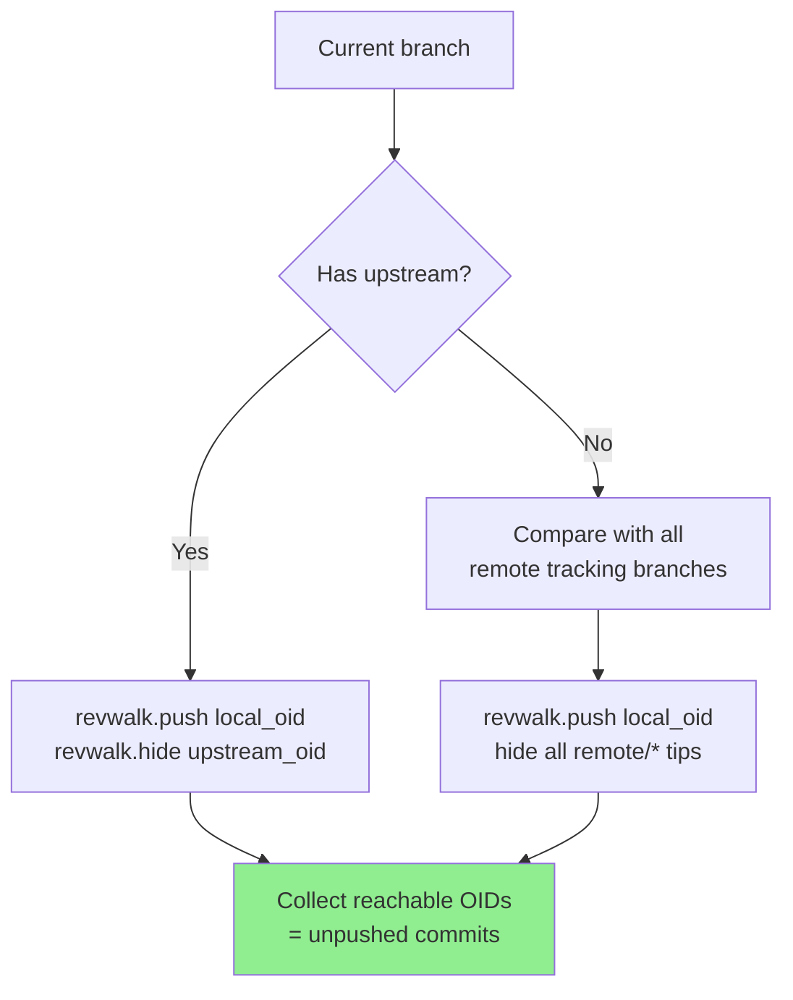

**Sorting**: `Sort::TOPOLOGICAL | Sort::TIME`
- Topological: Parents before children
- Time: Recent commits first

---

### 6. Remote Operations

**Module**: `remote.rs`

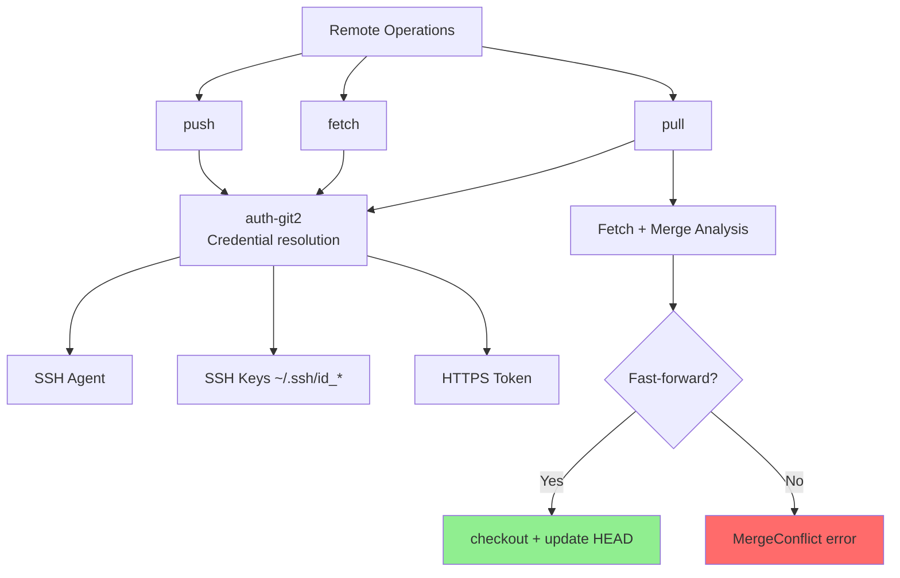

**API**:

```rust
// Push local branch to remote
pub fn push(
    repo: &Repository,
    remote_name: &str,
    branch: &str,
) -> Result<(), DiffError>;

// Fetch refs and objects from remote
pub fn fetch(
    repo: &Repository,
    remote_name: &str,
) -> Result<(), DiffError>;

// Pull with fast-forward-only merge
pub fn pull(
    repo: &Repository,
    remote_name: &str,
    branch: &str,
) -> Result<(), DiffError>;
```

**Authentication** (`auth-git2`):

| Method | Priority | Fallback |
|--------|----------|----------|
| **SSH Agent** | 1 | Standard on Linux/macOS |
| **SSH Keys** | 2 | `~/.ssh/id_rsa`, `~/.ssh/id_ed25519` |
| **HTTPS Token** | 3 | `credential.helper` from git config |

**Pull Strategy**:

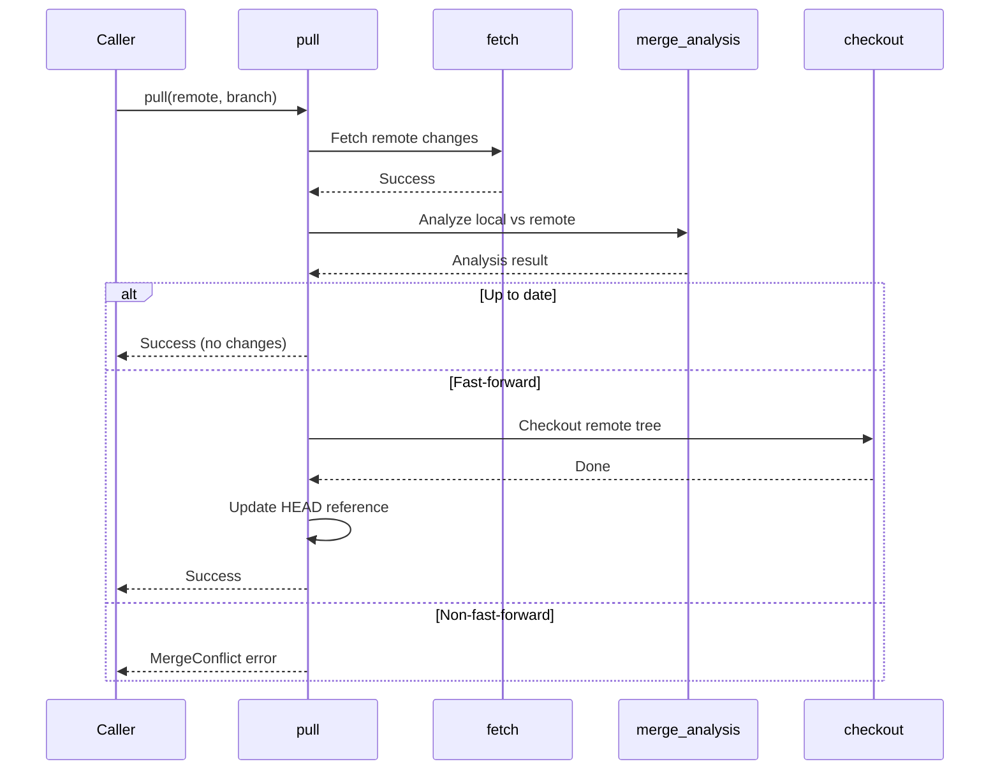

**Error Handling**:
- `RemoteAuth`: Credential failure, network timeout
- `MergeConflict`: Non-fast-forwardable pull
- `BranchNotFound`: Remote tracking branch missing

---

### 7. Multi-Repository Workspace

**Module**: `repo_manager.rs`

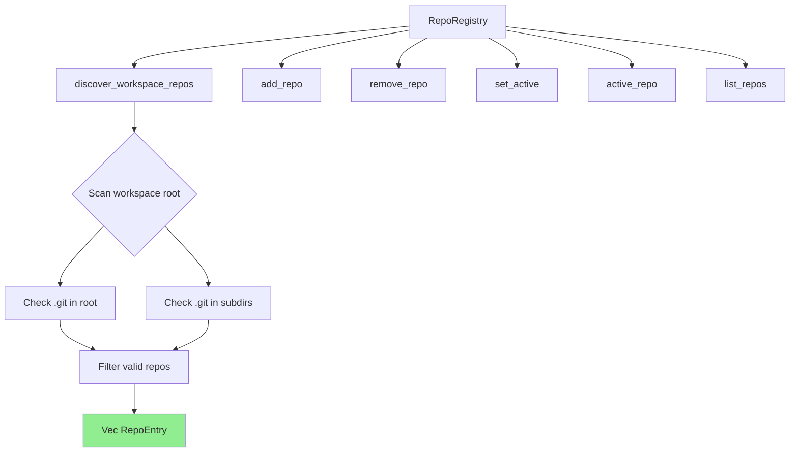

**API**:

```rust
pub struct RepoRegistry {
    repos: Vec<RepoEntry>,
    active_root: Option<PathBuf>,
}

impl RepoRegistry {
    // Create empty registry
    pub fn new() -> Self;
    
    // Discover repos in workspace (non-recursive)
    pub fn discover_workspace_repos<P: AsRef<Path>>(
        &mut self,
        workspace_root: P,
    ) -> Vec<RepoEntry>;
    
    // Manually add repository
    pub fn add_repo<P: AsRef<Path>>(
        &mut self,
        root: P,
    ) -> Result<RepoEntry, DiffError>;
    
    // Remove repository from tracking
    pub fn remove_repo<P: AsRef<Path>>(&mut self, root: P) -> bool;
    
    // Switch active repository
    pub fn set_active<P: AsRef<Path>>(&mut self, root: P) 
        -> Result<(), DiffError>;
    
    // Get current active repo
    pub fn active_repo(&self) -> Option<&RepoEntry>;
    
    // List all tracked repos
    pub fn list_repos(&self) -> Vec<RepoEntry>;
}
```

**RepoEntry Structure**:

```rust
pub struct RepoEntry {
    pub root: PathBuf,        // Absolute path to .git parent
    pub name: String,         // Directory name
    pub is_active: bool,      // Currently selected?
    pub has_changes: bool,    // Uncommitted modifications?
}
```

**Discovery Strategy**:

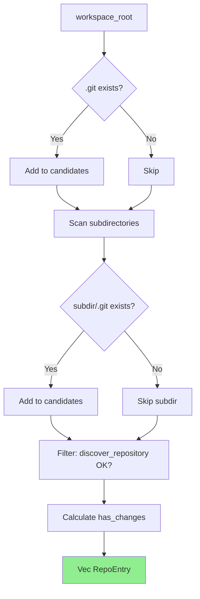

**Non-Recursive**: Only scans workspace root + immediate subdirectories (not nested)

**Active Repository**:
- First discovered repo is active by default
- UI operations target active repo
- `set_active()` updates `is_active` flags

---

### 8. Diff Parsing

**Module**: `diff.rs`

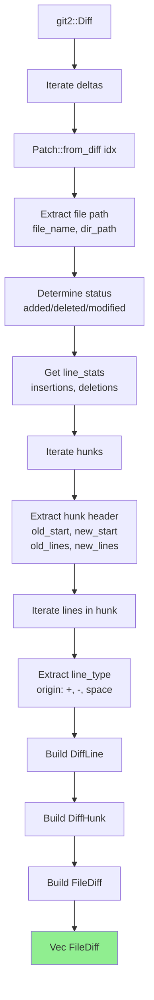

**Data Structures**:

```rust
pub struct FileDiff {
    pub path: String,           // "gui/ui/app.slint"
    pub file_name: String,      // "app.slint"
    pub dir_path: String,       // "gui/ui"
    pub status: String,         // "modified"
    pub insertions: usize,      // Lines added
    pub deletions: usize,       // Lines removed
    pub hunks: Vec<DiffHunk>,   // Modification hunks
    pub is_expanded: bool,      // UI accordion state
}

pub struct DiffHunk {
    pub header: String,         // "@@ -245,6 +245,21 @@"
    pub lines: Vec<DiffLine>,   // Hunk content
    pub old_start: u32,         // Line in old file
    pub old_lines: u32,         // Lines in old
    pub new_start: u32,         // Line in new file
    pub new_lines: u32,         // Lines in new
}

pub struct DiffLine {
    pub line_type: char,        // '+', '-', ' '
    pub content: String,        // Line text
    pub old_line_num: Option<u32>,
    pub new_line_num: Option<u32>,
}
```

**Status Mapping**:

| git2::Delta | status string |
|-------------|---------------|
| `Added` | `"added"` |
| `Deleted` | `"deleted"` |
| `Modified` | `"modified"` |
| `Renamed` | `"renamed"` |
| `Typechange` | `"typechanged"` |
| `Untracked` | `"untracked"` |

---

### 9. Async Wrappers

**Module**: `workspace.rs`

**Purpose**: Prevent UI thread blocking by wrapping all synchronous Git operations in `tokio::task::spawn_blocking`

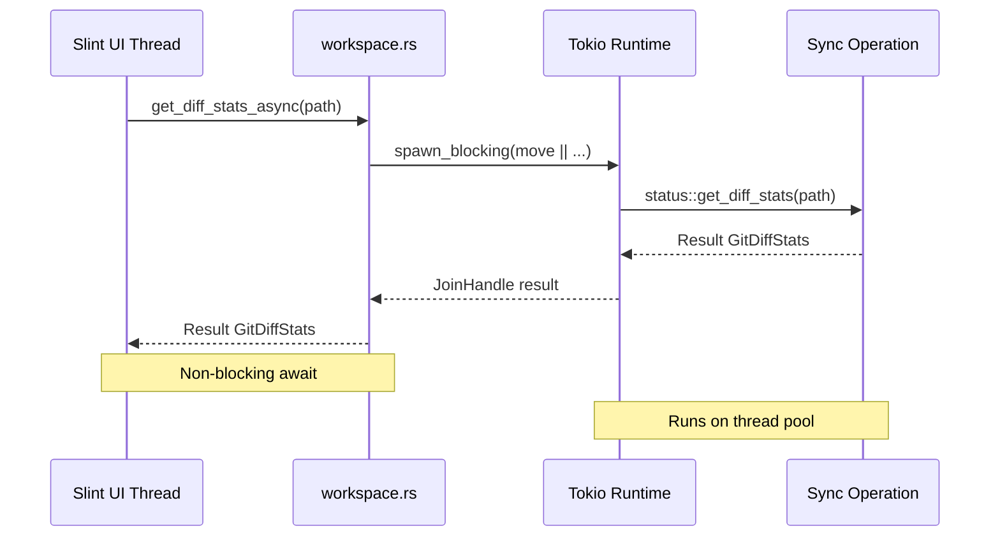

**Naming Convention**: Every sync operation has an `_async` variant

**Example**:

```rust
// Synchronous (blocks thread)
pub fn get_diff_stats<P: AsRef<Path>>(workspace_root: P) 
    -> Result<GitDiffStats, DiffError>;

// Async wrapper (non-blocking)
pub async fn get_diff_stats_async(workspace_root: PathBuf) 
    -> Result<GitDiffStats, DiffError> {
    task::spawn_blocking(move || status::get_diff_stats(workspace_root))
        .await?
}
```

**UI Integration**:

```rust
// ❌ DON'T: Blocks UI thread, causes frame drops
let stats = operon_diff::get_diff_stats(workspace)?;

// ✅ DO: Non-blocking, UI stays responsive
let stats = operon_diff::get_diff_stats_async(workspace).await?;
```

**Complete API Surface**:

| Sync Operation | Async Wrapper |
|----------------|---------------|
| `get_diff_stats` | `get_diff_stats_async` |
| `get_diff_details` | `get_diff_details_async` |
| `stage_file` | `stage_file_async` |
| `unstage_file` | `unstage_file_async` |
| `revert_file` | `revert_file_async` |
| `stage_all_files` | `stage_all_files_async` |
| `revert_all_files` | `revert_all_files_async` |
| `discard_all_including_untracked` | `discard_all_including_untracked_async` |
| `stage_hunk` | `stage_hunk_async` |
| `unstage_hunk` | `unstage_hunk_async` |
| `commit_workspace` | `commit_async` |
| `current_branch_workspace` | `current_branch_async` |
| `list_branches_workspace` | `list_branches_async` |
| `create_branch_workspace` | `create_branch_async` |
| `switch_branch_workspace` | `switch_branch_async` |
| `delete_branch_workspace` | `delete_branch_async` |
| `rename_branch_workspace` | `rename_branch_async` |
| `get_commit_graph_workspace` | `get_commit_graph_async` |
| `push_workspace` | `push_async` |
| `fetch_workspace` | `fetch_async` |
| `pull_workspace` | `pull_async` |
| `discover_workspace_repos` | `discover_workspace_repos_async` |

---

## Data Transfer Objects (DTOs)

**Module**: `dto.rs`

All DTOs use `#[serde(rename_all = "camelCase")]` for frontend interop:

```rust
// Rust: snake_case fields
pub struct BranchInfo {
    pub is_head: bool,
    pub upstream: Option<String>,
}

// JSON/Slint: camelCase properties
{
  "isHead": true,
  "upstream": "origin/main"
}
```

**Complete DTO Catalog**:

| DTO | Purpose | Key Fields |
|-----|---------|-----------|
| `GitDiffStats` | Header badge counts | `has_repo`, `insertions`, `deletions` |
| `RepositoryDiff` | Full diff tree | `staged_files`, `unstaged_files`, `total_insertions` |
| `FileDiff` | Single file changes | `path`, `status`, `hunks`, `is_expanded` |
| `DiffHunk` | Modification block | `header`, `lines`, `old_start`, `new_start` |
| `DiffLine` | Individual line change | `line_type`, `content`, `old_line_num`, `new_line_num` |
| `BranchInfo` | Branch metadata | `name`, `is_head`, `upstream`, `ahead`, `behind` |
| `GitGraphCommit` | Visual commit node | `hash`, `message`, `author`, `branch_tag`, `is_local` |
| `CommitResult` | Commit creation result | `oid` |
| `RepoEntry` | Repository registry entry | `root`, `name`, `is_active`, `has_changes` |

---

## Error Handling

**Module**: `error.rs`

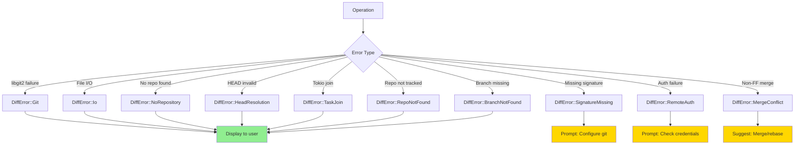

**Error Variants**:

```rust
#[derive(Debug, Error)]
pub enum DiffError {
    #[error("Git libgit2 error: {0}")]
    Git(#[from] git2::Error),
    
    #[error("IO error: {0}")]
    Io(#[from] std::io::Error),
    
    #[error("No git repository found: {0}")]
    NoRepository(String),
    
    #[error("HEAD commit resolution failed: {0}")]
    HeadResolution(String),
    
    #[error("Async task execution error: {0}")]
    TaskJoin(String),
    
    #[error("Git signature missing: {0}")]
    SignatureMissing(String),
    
    #[error("Repository not found: {0}")]
    RepoNotFound(String),
    
    #[error("Branch not found: {0}")]
    BranchNotFound(String),
    
    #[error("Remote authentication failed: {0}")]
    RemoteAuth(String),
    
    #[error("Merge conflict encountered: {0}")]
    MergeConflict(String),
}
```

**UI Integration**:

```rust
match result {
    Ok(data) => show_success(data),
    Err(DiffError::SignatureMissing(msg)) => {
        show_dialog("Git Configuration Required", msg);
        suggest_command("git config --global user.name \"Your Name\"");
    }
    Err(DiffError::RemoteAuth(msg)) => {
        show_dialog("Authentication Failed", msg);
        suggest_ssh_setup();
    }
    Err(e) => show_error(e.to_string()),
}
```

---

## Usage Examples

### Basic Workflow

```rust
use operon_diff::*;
use std::path::PathBuf;

#[tokio::main]
async fn main() -> Result<(), DiffError> {
    let workspace = PathBuf::from("D:/Operon");
    
    // 1. Get diff stats
    let stats = get_diff_stats_async(workspace.clone()).await?;
    println!("Changes: +{} -{}", stats.insertions, stats.deletions);
    
    // 2. Get detailed diff
    let diff = get_diff_details_async(workspace.clone()).await?;
    for file in &diff.unstaged_files {
        println!("{}: {} ({})", 
            file.status, 
            file.path, 
            file.hunks.len()
        );
    }
    
    // 3. Stage specific file
    stage_file_async(
        workspace.clone(),
        "src/main.rs".to_string(),
    ).await?;
    
    // 4. Commit changes
    let result = commit_async(
        workspace.clone(),
        "feat: Add new feature".to_string(),
        false,
    ).await?;
    println!("Committed: {}", result.oid);
    
    // 5. Push to remote
    push_async(
        workspace,
        "origin".to_string(),
        "main".to_string(),
    ).await?;
    
    Ok(())
}
```

### Hunk-Level Staging

```rust
// Get diff with hunks
let diff = get_diff_details_async(workspace.clone()).await?;

// Find target file
let file = diff.unstaged_files
    .iter()
    .find(|f| f.path == "src/parser.rs")
    .unwrap();

// Stage second hunk only
let hunk_header = &file.hunks[1].header;
stage_hunk_async(
    workspace,
    file.path.clone(),
    hunk_header.clone(),
).await?;
```

### Branch Management

```rust
// List branches with tracking
let branches = list_branches_async(workspace.clone()).await?;
for branch in &branches {
    let tracking = if let Some(upstream) = &branch.upstream {
        format!("↑{} ↓{} tracking {}", 
            branch.ahead, 
            branch.behind, 
            upstream
        )
    } else {
        "no upstream".to_string()
    };
    
    let marker = if branch.is_head { "*" } else { " " };
    println!("{} {} ({})", marker, branch.name, tracking);
}

// Create and switch to new branch
create_branch_async(
    workspace.clone(),
    "feat/new-feature".to_string(),
    None,
).await?;

switch_branch_async(
    workspace,
    "feat/new-feature".to_string(),
).await?;
```

### Commit Graph Visualization

```rust
// Get first 20 commits
let commits = get_commit_graph_async(
    workspace,
    20,  // limit
    0,   // skip
).await?;

for commit in commits {
    let head_marker = if commit.is_head { "HEAD → " } else { "" };
    let local_marker = if commit.is_local { "●" } else { "○" };
    let branch_tag = if !commit.branch_tag.is_empty() {
        format!(" ({})", commit.branch_tag)
    } else {
        String::new()
    };
    
    println!(
        "{} {} {}{}{} - {}",
        local_marker,
        commit.short_hash,
        head_marker,
        commit.message,
        branch_tag,
        commit.author
    );
}

// Output:
// ● a1b2c3d HEAD → feat: Add documentation (main) - Luka Gray
// ○ d4e5f6a fix: Resolve merge conflict (develop) - Luka Gray
// ○ 7g8h9i0 refactor: Clean up parser - Luka Gray
```

### Multi-Repository Workspace

```rust
let mut registry = RepoRegistry::new();

// Discover repos
let repos = registry.discover_workspace_repos("D:/Projects");
println!("Found {} repositories", repos.len());

for repo in &repos {
    let active = if repo.is_active { "[ACTIVE]" } else { "" };
    let changes = if repo.has_changes { "●" } else { "○" };
    println!("{} {} {} - {}", 
        changes, 
        active, 
        repo.name, 
        repo.root.display()
    );
}

// Switch active repo
registry.set_active("D:/Projects/operon-rs")?;

// Get active repo
if let Some(active) = registry.active_repo() {
    let workspace = active.root.clone();
    let stats = get_diff_stats_async(workspace).await?;
    println!("Active repo changes: +{} -{}", 
        stats.insertions, 
        stats.deletions
    );
}
```

---

## Performance Characteristics

| Operation | Complexity | Typical Time |
|-----------|-----------|--------------|
| **Repository discovery** | O(1) disk seek | <1ms |
| **Diff stats** | O(changed lines) | 5-50ms |
| **Diff details** (100 files) | O(files × hunks × lines) | 50-200ms |
| **Stage file** | O(file size) | 1-10ms |
| **Unstage file** | O(file size) | 1-10ms |
| **Revert file** | O(file size) | 1-10ms |
| **Stage hunk** | O(file hunks) + patch apply | 5-20ms |
| **Commit** | O(index size) | 10-100ms |
| **List branches** | O(branches × upstream queries) | 10-50ms |
| **Switch branch** | O(changed files) | 50-500ms |
| **Commit graph** (50 commits) | O(commits × branch lookups) | 20-100ms |
| **Push** | O(unpushed commits × network) | 500ms-5s |
| **Fetch** | O(refs × network) | 200ms-2s |
| **Pull** | fetch + O(merge analysis) | 500ms-3s |

**Optimization Notes**:
- `get_diff_stats` is **much faster** than `get_diff_details` (no hunk parsing)
- Commit graph with `limit` avoids full repository traversal
- Async wrappers add ~1-2ms overhead (thread pool dispatch)

---

## Testing

```bash
# Run all tests
cargo test -p operon-diff

# Test specific modules
cargo test -p operon-diff --test status
cargo test -p operon-diff --test stage
cargo test -p operon-diff --test branch
cargo test -p operon-diff --test graph

# Test with output
cargo test -p operon-diff -- --nocapture
```

---

## Dependencies

```toml
[dependencies]
git2 = "0.19"              # libgit2 bindings
auth-git2 = "0.5"          # SSH/HTTPS credential management
tokio = { version = "1", features = ["rt", "macros"] }
serde = { version = "1", features = ["derive"] }
thiserror = "1"            # Error derive macros
```

**Why libgit2?**
- Native performance (no shell process spawning)
- Fine-grained control (patch application, revwalk, credentials)
- Portable (works without Git CLI installed)
- Thread-safe (multiple repos simultaneously)

---

## License

Operon is licensed under the **GNU Affero General Public License v3.0 (AGPLv3)**.

---

> Built by **Luka Gray (aka Soumo Mukherjee)** • West Bengal, India • 2026
