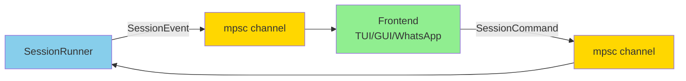
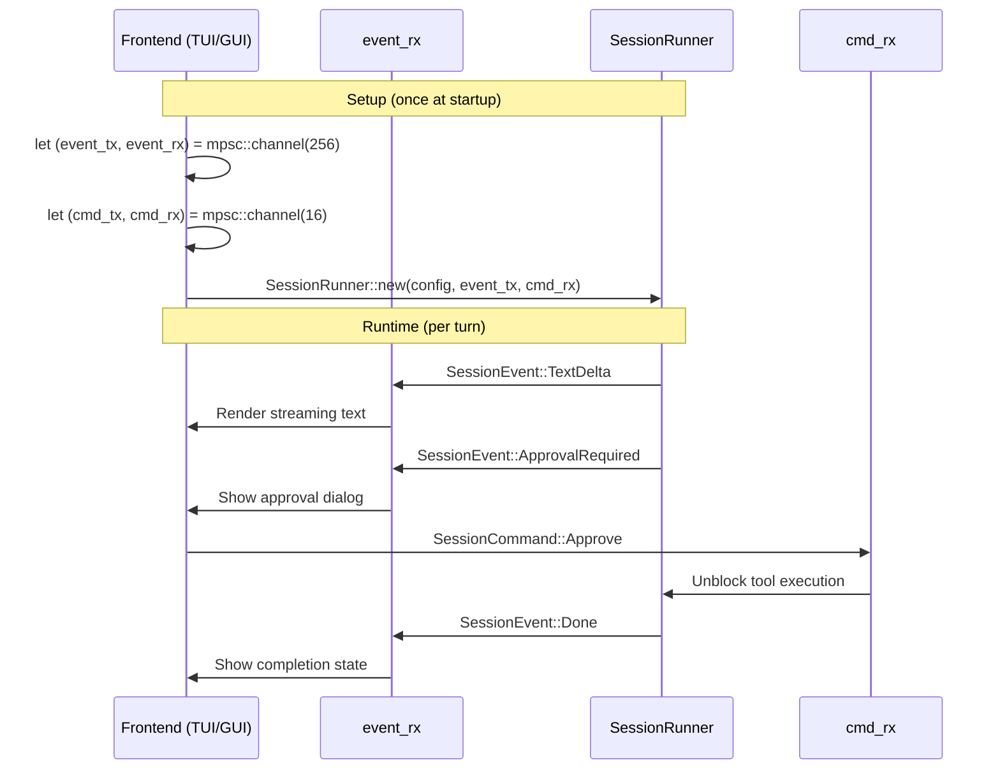
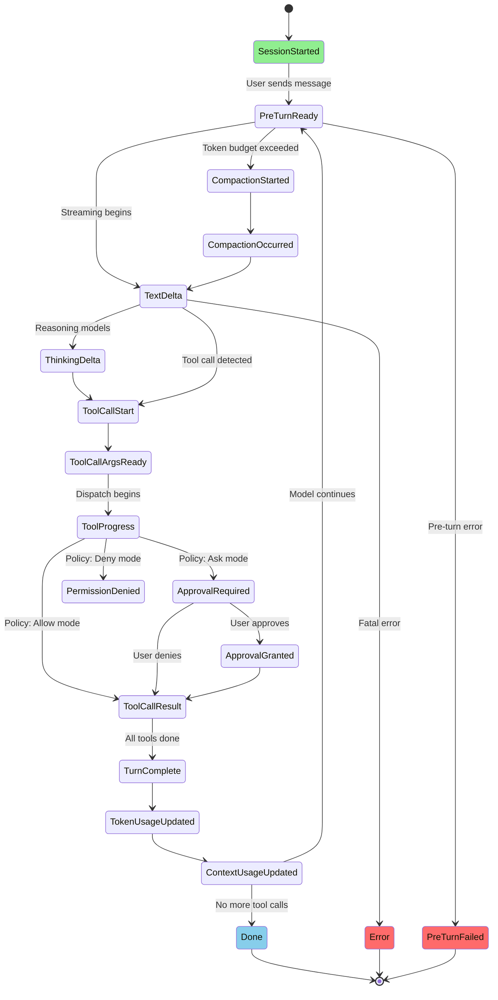
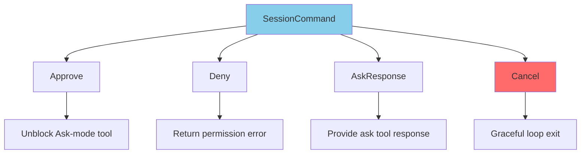
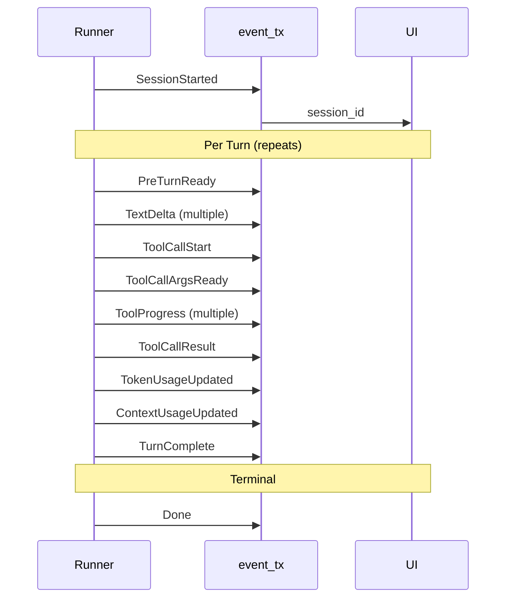
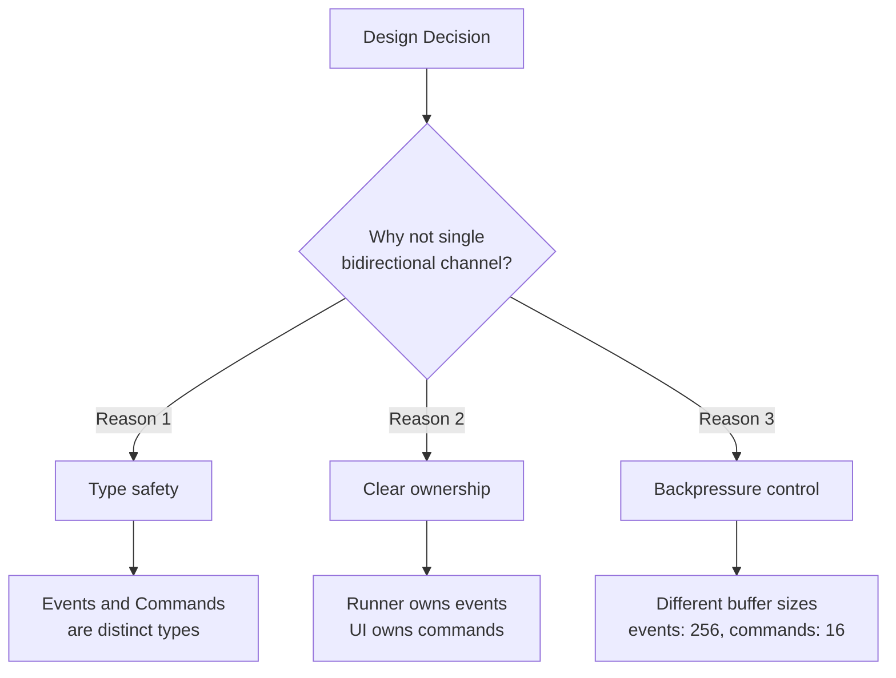

# operon-events

**Pure-types event bus for the Operon agent loop with zero dependencies**

`operon-events` provides the canonical event and command types for bidirectional communication between the Operon session runner and frontend UIs (TUI, GUI, WhatsApp, Telegram). Pure Rust with only `serde` derives — no async, no I/O, no tokio.

---

## Overview

This crate defines the **data contract** for the agent loop's event bus:



**Key Features**:
- ✅ **Zero runtime dependencies** (only `serde` + `operon-tools-core` for ToolProgress)
- ✅ **Serializable** — log, replay, or transmit events over network
- ✅ **Bidirectional** — outbound events + inbound commands
- ✅ **No tool definitions** — tool call IDs are plain strings (avoids dependency)

---

## Architecture

### Two Channel Model



**Channel Directions**:
1. **Outbound**: `mpsc::Sender<SessionEvent>` (runner → UI)
2. **Inbound**: `mpsc::Receiver<SessionCommand>` (UI → runner)

---

## SessionEvent (Outbound)

### Event Lifecycle



### Event Categories

| Category | Events | Purpose |
|----------|--------|---------|
| **Lifecycle** | `SessionStarted`, `Done`, `Error`, `Warning` | Session state transitions |
| **Streaming** | `TextDelta`, `ThinkingDelta` | Real-time model output |
| **Tool Execution** | `ToolCallStart`, `ToolCallArgsReady`, `ToolProgress`, `ToolCallResult`, `ToolDegraded` | Tool dispatch pipeline |
| **Policy** | `PermissionDenied`, `ApprovalRequired`, `ApprovalGranted` | Permission enforcement |
| **Interactive** | `AskQuestion` | Model requests user input |
| **Turn Tracking** | `PreTurnReady`, `TurnComplete`, `PreTurnFailed` | Turn boundaries |
| **Token Usage** | `TokenUsageUpdated`, `ContextUsageUpdated` | Budget tracking |
| **Compaction** | `CompactionStarted`, `CompactionOccurred` | Context summarization |

---

## Event Reference

### Lifecycle Events

```rust
SessionEvent::SessionStarted {
    session_id: String,  // Hex nanosecond timestamp
}
```

**When**: Once at the end of `SessionRunner::new()` before first turn  
**Purpose**: UI labels panels with session ID

---

```rust
SessionEvent::Done
```

**When**: Model returns `EndTurn` with no tool calls  
**Purpose**: Natural loop termination (happy path)

---

```rust
SessionEvent::Error {
    message: String,  // Human-readable error description
}
```

**When**: Fatal error during stream or tool dispatch  
**Purpose**: Runner transitions to `LifecycleState::Failed`

---

```rust
SessionEvent::Warning {
    message: String,  // Non-fatal warning message
}
```

**When**: Recoverable issues (unknown tool group, compaction skipped)  
**Purpose**: Log to console, optionally show toast notification

---

### Streaming Events

```rust
SessionEvent::TextDelta {
    text: String,  // Fragment from SSE stream
}
```

**When**: Each SSE event with text content  
**Purpose**: Concatenate deltas to build assistant response

**Example**:
```
TextDelta { text: "The" }
TextDelta { text: " solution" }
TextDelta { text: " is" }
TextDelta { text: "..." }
→ Final: "The solution is..."
```

---

```rust
SessionEvent::ThinkingDelta {
    text: String,  // Reasoning/chain-of-thought fragment
}
```

**When**: Reasoning models emit thinking stream (Anthropic, DeepSeek, o1)  
**Purpose**: Show separate "Thinking..." panel in UI

---

### Tool Execution Events

```rust
SessionEvent::ToolCallStart {
    call_id: String,  // Provider-specific ID (e.g. "toolu_01A")
    name: String,     // Tool name (e.g. "read_file")
}
```

**When**: Assembler detects complete tool call in stream  
**Purpose**: UI shows "Executing: read_file" badge

---

```rust
SessionEvent::ToolCallArgsReady {
    call_id: String,  // Matches ToolCallStart
    name: String,
    args_json: String,  // Serialized arguments
}
```

**When**: Immediately after `ToolCallStart`  
**Purpose**: UI shows expandable "Arguments" JSON viewer

---

```rust
SessionEvent::ToolProgress(ToolProgress)
```

**Re-exported from** `operon-tools-core`

**Variants**:
```rust
ToolProgress::Started {
    call_id: String,
    name: String,
}

ToolProgress::Running {
    call_id: String,
    status: String,  // "Fetching URL...", "Writing file..."
}

ToolProgress::Completed {
    call_id: String,
}

ToolProgress::Failed {
    call_id: String,
    reason: String,
}
```

**Purpose**: Granular progress tracking for long-running tools

---

```rust
SessionEvent::ToolCallResult {
    call_id: String,  // Matches ToolCallStart
    name: String,
    is_error: bool,   // Tool execution failed?
    content_json: String,  // Serialized ToolContent
}
```

**When**: After `Dispatcher::dispatch()` returns  
**Purpose**: UI shows result in expandable panel

---

```rust
SessionEvent::ToolDegraded {
    name: String,  // Tool entering degraded mode
}
```

**When**: First time model sends malformed args for a tool  
**Purpose**: UI shows warning badge; detailed definitions sent next turn

---

### Policy Events

```rust
SessionEvent::PermissionDenied {
    tool: String,
    path: Option<String>,  // For filesystem/shell tools
    reason: String,        // Internal diagnostic message
}
```

**When**: Policy resolver returns `PolicyDecision::Deny`  
**Purpose**: UI shows blocked operation; tool NOT dispatched

---

```rust
SessionEvent::ApprovalRequired {
    id: String,            // Unique approval request ID
    tool: String,
    path: Option<String>,
    reason: String,        // Human-readable explanation
    args_json: String,     // Full arguments for review
}
```

**When**: Policy resolver returns `PolicyDecision::Ask`  
**Purpose**: UI shows confirmation dialog; loop suspends

**Response**: Send `SessionCommand::Approve` or `SessionCommand::Deny`

---

```rust
SessionEvent::ApprovalGranted {
    id: String,            // Matches ApprovalRequired
    tool: String,
    path: Option<String>,
}
```

**When**: After UI sends `SessionCommand::Approve`  
**Purpose**: Confirmation that tool will execute

---

### Interactive Events

```rust
SessionEvent::AskQuestion {
    id: String,            // Unique question ID
    question: String,      // Question text
    options: Vec<String>,  // Exactly 3 pre-defined options
}
```

**When**: Model invokes `ask` tool  
**Purpose**: UI shows 3 radio buttons + free-text field (4th option)

**Response**: Send `SessionCommand::AskResponse { id, answer }`

---

### Turn Tracking Events

```rust
SessionEvent::PreTurnReady {
    turn_index: usize,        // 0-based
    message_count: usize,     // Messages in sanitized history
    tool_count: usize,        // Tools in definitions array
    estimated_tokens: usize,  // Heuristic token estimate
}
```

**When**: Immediately before HTTP request sent  
**Purpose**: Debug pre-turn assembly; diagnose 413 errors early

---

```rust
SessionEvent::TurnComplete {
    turn_index: usize,  // 0-based, increments monotonically
}
```

**When**: After model response + all tool calls dispatched  
**Purpose**: Turn boundary marker for UI state reset

---

```rust
SessionEvent::PreTurnFailed {
    turn_index: usize,
    step: PreTurnStep,  // Compaction | Snapshot | Sanitizer
    reason: String,
}
```

**When**: Snapshot/sanitize/compaction fails before HTTP request  
**Purpose**: Distinct from `Error` (stream-level failures)

---

### Token Usage Events

```rust
SessionEvent::TokenUsageUpdated {
    input_tokens: usize,   // This turn's prompt tokens
    output_tokens: usize,  // This turn's completion tokens
    context_total: usize,  // Cumulative context tokens
    cache_read_tokens: Option<usize>,   // Anthropic only
    cache_write_tokens: Option<usize>,  // Anthropic only
}
```

**When**: After API usage block parsed  
**Purpose**: Status bar token counter

---

```rust
SessionEvent::ContextUsageUpdated {
    current_context_tokens: usize,   // Tokens in window
    context_window: usize,           // Hard window size
    remaining_context_tokens: usize, // Window - current
    utilization: f32,                // 0.0..=1.0
    compaction_limit: usize,         // Trigger threshold
}
```

**When**: At session start, after token update, after compaction  
**Purpose**: Status bar gauge (visual fill percentage)

---

### Compaction Events

```rust
SessionEvent::CompactionStarted {
    tokens_before: usize,  // Triggered compaction threshold
}
```

**When**: Immediately before compaction API call  
**Purpose**: UI shows "Condensing context..." spinner

---

```rust
SessionEvent::CompactionOccurred {
    tokens_before: usize,  // Pre-compaction count
    tokens_after: usize,   // Post-compaction count (heuristic)
}
```

**When**: After compaction succeeds  
**Purpose**: Log token reduction; analytics

---

## SessionCommand (Inbound)

### Command Types



---

```rust
SessionCommand::Approve {
    id: String,  // Matches ApprovalRequired.id
}
```

**Purpose**: Grant permission for pending Ask-mode tool call  
**Result**: Runner emits `ApprovalGranted` → dispatches tool

---

```rust
SessionCommand::Deny {
    id: String,  // Matches ApprovalRequired.id
}
```

**Purpose**: Reject pending Ask-mode tool call  
**Result**: Runner returns permission-denied `ToolResult` to model

---

```rust
SessionCommand::AskResponse {
    id: String,      // Matches AskQuestion.id
    answer: String,  // User's selection or free-text
}
```

**Purpose**: Submit answer to `ask` tool question  
**Result**: Answer returned as tool result; loop continues

---

```rust
SessionCommand::Cancel
```

**Purpose**: Stop loop gracefully  
**Result**: Finishes current tool call → emits `Done` → exits

**Not a Kill Signal**: Runner completes current operation before stopping

---

## Usage Examples

### Basic Event Consumption

```rust
use operon_events::{SessionEvent, SessionCommand};
use tokio::sync::mpsc;

#[tokio::main]
async fn main() {
    let (event_tx, mut event_rx) = mpsc::channel::<SessionEvent>(256);
    let (cmd_tx, cmd_rx) = mpsc::channel::<SessionCommand>(16);
    
    // Create runner (consumes event_tx, cmd_rx)
    let runner = SessionRunner::new(config, event_tx, cmd_rx).await?;
    
    // Spawn event consumer task
    tokio::spawn(async move {
        while let Some(event) = event_rx.recv().await {
            match event {
                SessionEvent::TextDelta { text } => {
                    print!("{}", text);  // Stream to stdout
                }
                SessionEvent::ThinkingDelta { text } => {
                    eprintln!("[Thinking] {}", text);
                }
                SessionEvent::ToolCallStart { name, .. } => {
                    println!("\n[Tool: {}]", name);
                }
                SessionEvent::TokenUsageUpdated { context_total, .. } => {
                    eprintln!("Tokens used: {}", context_total);
                }
                SessionEvent::Done => {
                    println!("\nSession complete.");
                    break;
                }
                SessionEvent::Error { message } => {
                    eprintln!("Error: {}", message);
                    break;
                }
                _ => {}
            }
        }
    });
    
    // Run agent loop
    runner.run("Can you help me?".to_string()).await?;
}
```

---

### Handling Approval Requests

```rust
use operon_events::{SessionEvent, SessionCommand};

// In event consumer task:
match event {
    SessionEvent::ApprovalRequired { id, tool, path, reason, .. } => {
        println!("Approval required:");
        println!("  Tool: {}", tool);
        if let Some(p) = path {
            println!("  Path: {}", p);
        }
        println!("  Reason: {}", reason);
        println!("Allow? (y/n)");
        
        let mut input = String::new();
        std::io::stdin().read_line(&mut input)?;
        
        let response = if input.trim().eq_ignore_ascii_case("y") {
            SessionCommand::Approve { id: id.clone() }
        } else {
            SessionCommand::Deny { id: id.clone() }
        };
        
        cmd_tx.send(response).await?;
    }
    _ => {}
}
```

---

### Handling Ask Questions

```rust
match event {
    SessionEvent::AskQuestion { id, question, options } => {
        println!("Question: {}", question);
        for (i, opt) in options.iter().enumerate() {
            println!("  {}. {}", i + 1, opt);
        }
        println!("  4. [Type your own answer]");
        println!("Choice (1-4): ");
        
        let mut input = String::new();
        std::io::stdin().read_line(&mut input)?;
        
        let answer = match input.trim() {
            "1" => options[0].clone(),
            "2" => options[1].clone(),
            "3" => options[2].clone(),
            "4" => {
                println!("Enter answer: ");
                let mut custom = String::new();
                std::io::stdin().read_line(&mut custom)?;
                custom.trim().to_string()
            }
            _ => "Invalid choice".to_string(),
        };
        
        cmd_tx.send(SessionCommand::AskResponse {
            id: id.clone(),
            answer,
        }).await?;
    }
    _ => {}
}
```

---

### Graceful Cancellation

```rust
use tokio::signal;

// Spawn cancellation handler
let cmd_tx_cancel = cmd_tx.clone();
tokio::spawn(async move {
    signal::ctrl_c().await.ok();
    println!("\nReceived Ctrl+C, stopping session...");
    let _ = cmd_tx_cancel.send(SessionCommand::Cancel).await;
});
```

---

## Event Ordering Guarantees



**Guaranteed Order**:
1. `SessionStarted` is always first
2. `ToolCallStart` → `ToolCallArgsReady` (immediate sequence)
3. `ToolCallArgsReady` → `ToolProgress`* → `ToolCallResult`
4. `TokenUsageUpdated` → `ContextUsageUpdated` (after each turn)
5. `TurnComplete` after all tool calls in turn
6. `Done` or `Error` is always last

**No Guarantee**:
- Relative order of `TextDelta` and `ThinkingDelta` (provider-dependent)
- Order of multiple `ToolProgress::Running` events

---

## Design Rationale

### Why Two Channels?



---

### Why Plain Strings for Tool Call IDs?

**Avoids** `operon-context-normalize-tools` dependency

```rust
// ❌ Would create circular dependency
pub struct SessionEvent {
    tool_call: ToolCall,  // Requires normalize-tools
}

// ✅ Uses plain string
pub struct SessionEvent {
    call_id: String,  // Provider-specific ID
}
```

**Trade-off**: Slightly less type safety, but zero coupling

---

### Why Serializable?

```rust
// Log events to file for debugging
let event = SessionEvent::TextDelta { text: "Hello".into() };
let json = serde_json::to_string(&event)?;
fs::write("events.jsonl", json + "\n")?;

// Replay events in tests
let event: SessionEvent = serde_json::from_str(&json)?;
```

**Use Cases**:
- Session replay for debugging
- Network transmission (WhatsApp bridge)
- Analytics/telemetry

---

## Testing

```bash
# Run all tests
cargo test -p operon-events

# Check serialization round-trip
cargo test -p operon-events --test serde_roundtrip
```

**Test Coverage**:
- ✅ All event variants serialize/deserialize
- ✅ Event equality checks
- ✅ Command matching logic

---

## Performance

| Operation | Complexity | Typical Time |
|-----------|-----------|--------------|
| **Event construction** | O(1) | <1µs |
| **Serialization (JSON)** | O(event size) | 5-50µs |
| **Channel send** | O(1) | <1µs |
| **Channel recv** | O(1) blocking | <1µs |

**Memory**: Events are small (typically 50-500 bytes each)

---

## License

Operon is licensed under the **GNU Affero General Public License v3.0 (AGPLv3)**.

---

> Built by **Luka Gray (aka Soumo Mukherjee)** • West Bengal, India • 2026
