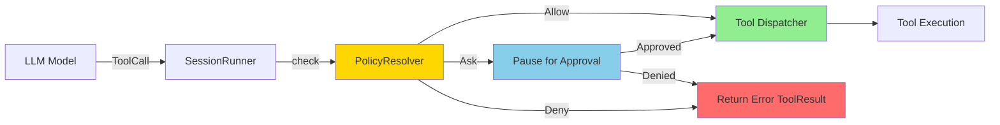
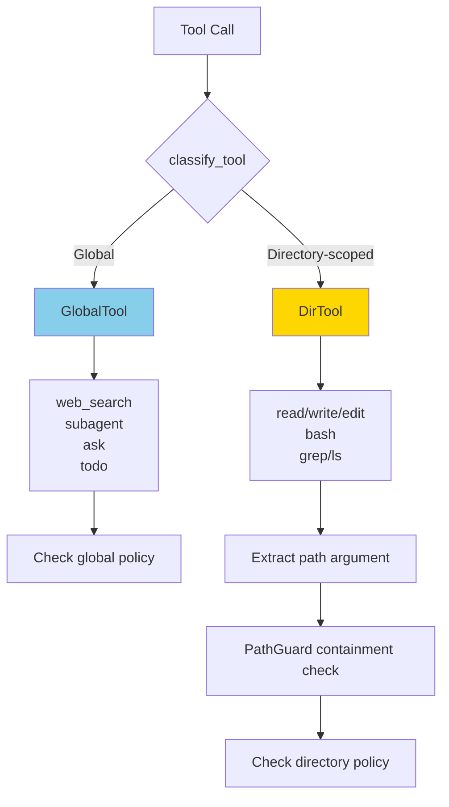
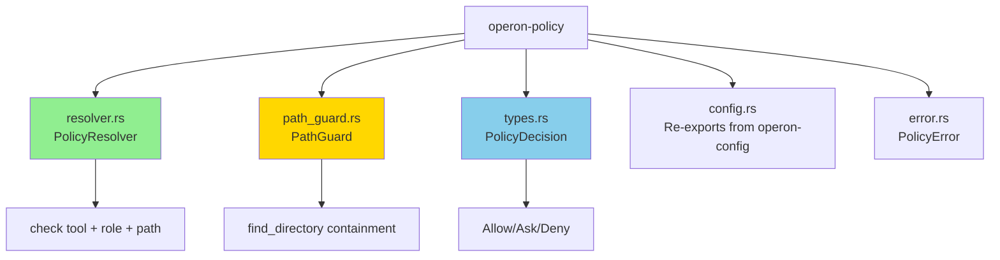
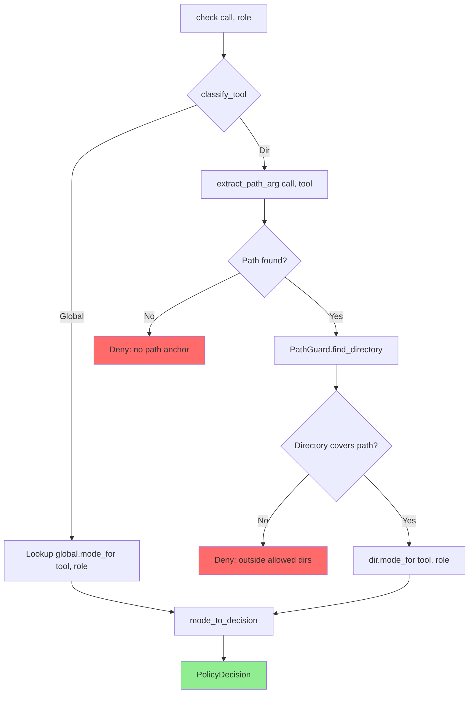
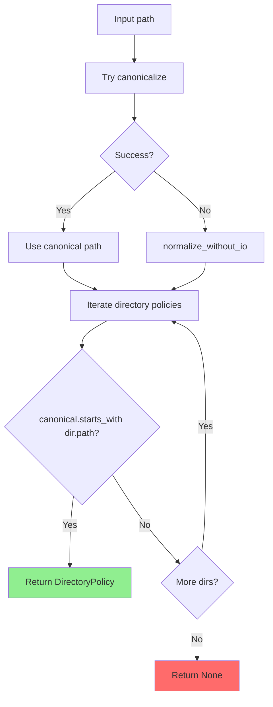
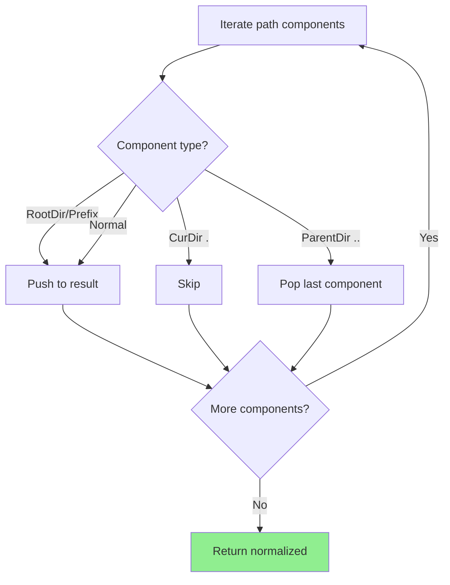
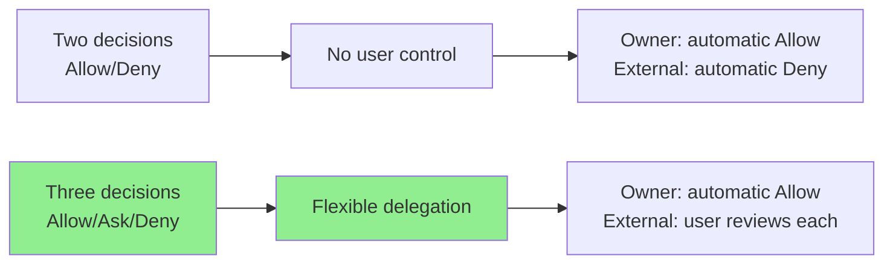
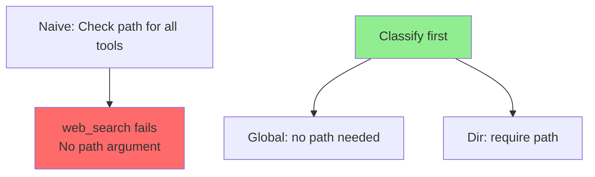
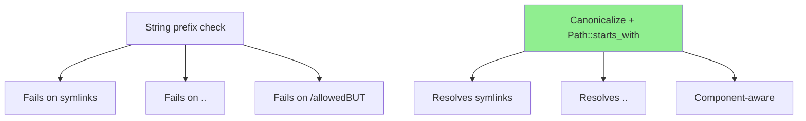

# operon-policy

**Runtime permission enforcement engine for Operon agent tool calls**

`operon-policy` is the gatekeeper between the LLM model and tool execution, evaluating every tool call against a role-based permission policy before dispatch. It implements **Allow/Ask/Deny** decisions with path-aware directory containment checking and full test coverage.

---

## Overview

This crate sits between `SessionRunner` and `Dispatcher`, intercepting tool calls and enforcing fine-grained permissions based on:
- **Tool type** (global tools vs directory-scoped tools)
- **Caller role** (`Owner` vs `External`)
- **Target path** (for filesystem and shell tools)



**Key Features**:
- ✅ **Three-decision model**: Allow (automatic), Ask (pause for approval), Deny (block)
- ✅ **Role-based isolation**: Different permissions for Owner vs External callers
- ✅ **Directory containment**: Path-aware enforcement prevents traversal attacks
- ✅ **Symlink-safe**: Canonicalization resolves symlinks before path checks
- ✅ **Zero runtime overhead**: Pure function calls, no async, no I/O during checks
- ✅ **Comprehensive tests**: 20+ test cases covering edge cases

---

## Architecture

### Two-Tier Tool Classification



### Module Organization



---

## Core Types

### PolicyDecision

```rust
pub enum PolicyDecision {
    /// Automatic approval — dispatch immediately
    Allow,
    
    /// Requires user confirmation — pause loop
    Ask { reason: String },
    
    /// Flat denial — return error ToolResult
    Deny { reason: String },
}
```

**Usage**:
```rust
match resolver.check(&tool_call, role) {
    PolicyDecision::Allow => {
        // Dispatch tool immediately
        dispatcher.dispatch(tool_call).await?
    }
    PolicyDecision::Ask { reason } => {
        // Emit ApprovalRequired event, suspend loop
        event_tx.send(SessionEvent::ApprovalRequired { reason }).await?;
        // Wait for SessionCommand::Approve or Deny
    }
    PolicyDecision::Deny { reason } => {
        // Return opaque error to model (do NOT reveal reason)
        return ToolResult::error("Tool not available.");
    }
}
```

---

### CallerRole

```rust
pub enum CallerRole {
    /// Local sessions (TUI, GUI, desktop)
    Owner,
    
    /// Remote sessions (WhatsApp, Telegram, public channels)
    External,
}
```

**Policy Matrix**:

| Tool | Owner | External |
|------|-------|----------|
| `read_file` in project dir | ✅ Allow | ❌ Deny |
| `bash` in project dir | ✅ Allow | ❌ Deny |
| `web_search` | ✅ Allow | ⚠️ Ask |
| `ask` | ✅ Allow | ❌ Deny |

---

### PermissionMode

```rust
pub enum PermissionMode {
    /// Automatic approval
    Allow,
    
    /// Requires user confirmation
    Ask,
    
    /// Flat denial
    Deny,
}
```

**Default**: Missing entries in policy config default to `Deny` (fail-safe)

---

### GlobalTool

```rust
pub enum GlobalTool {
    Web,        // web_search, web_fetch
    SubAgent,   // subagent, spawn_agent
    Ask,        // ask
    Todo,       // todo_create, todo_list, todo_update, todo_delete
}
```

**No Path Argument**: Global tools operate without filesystem anchors

---

### DirTool

```rust
pub enum DirTool {
    Fs(FsTool),  // Filesystem operations
    Bash,        // Shell execution
}

pub enum FsTool {
    Read,    // read
    Write,   // write
    Edit,    // edit
    Append,  // append
    Grep,    // grep
    Ls,      // ls
    Delete,  // delete
}
```

**Requires Path**: Directory tools must specify `path`, `cwd`, or `paths` argument

---

## PolicyResolver

### Construction

```rust
use operon_policy::{PolicyConfig, PolicyResolver};

// Load from operon-config
let config = operon_config::load()?.policy;

// Construct resolver (consumes config)
let resolver = PolicyResolver::new(config);
```

**Precondition**: `config.validate()` must be called first (canonicalizes directory paths)

---

### check() — Main API

```rust
pub fn check(
    &self,
    call: &ToolCall,
    role: CallerRole,
) -> PolicyDecision
```

**Parameters**:
- `call` — Tool call from model (name + arguments JSON)
- `role` — Caller role for this session

**Returns**: `PolicyDecision` (Allow/Ask/Deny)

**Resolution Flow**:



**Never Panics**: Unknown tools are classified as global unknowns and denied

---

### Tool Classification

```rust
// Internal function — not exported
fn classify_tool(name: &str) -> ToolScope
```

**Mapping**:

| Tool Name | Classification |
|-----------|----------------|
| `web_search`, `web_fetch` | `Global(Web)` |
| `subagent`, `spawn_agent` | `Global(SubAgent)` |
| `ask` | `Global(Ask)` |
| `todo_create`, `todo_list`, `todo_update`, `todo_delete` | `Global(Todo)` |
| `read` | `Dir(Fs(Read))` |
| `write` | `Dir(Fs(Write))` |
| `edit` | `Dir(Fs(Edit))` |
| `append` | `Dir(Fs(Append))` |
| `grep` | `Dir(Fs(Grep))` |
| `ls` | `Dir(Fs(Ls))` |
| `delete` | `Dir(Fs(Delete))` |
| `bash` | `Dir(Bash)` |
| **Unknown** | `None` (denied) |

---

### Path Argument Extraction

```rust
// Internal function — not exported
fn extract_path_arg(call: &ToolCall, tool: &DirTool) -> Option<PathBuf>
```

**Per-Tool Logic**:

| Tool | Argument Key | Format |
|------|-------------|--------|
| `read` | `"path"` or `"paths"` | String or array (first element) |
| `grep` | `"path"` or `"paths"` | String or array (first element) |
| `ls` | `"path"` or `"dir"` | String |
| `bash` | `"cwd"` | String |
| Other fs tools | `"path"` | String |

**Line Range Stripping**: `"file.txt:10-20"` → `"file.txt"`

**Example**:
```rust
// Tool call with line range
{
    "name": "read",
    "arguments": {
        "paths": ["src/main.rs:50-100"]
    }
}

// Extracted path: "src/main.rs" (range removed)
```

---

## PathGuard

**Purpose**: Determine if a filesystem path falls within any allowed directory

### Construction

```rust
use operon_policy::path_guard::PathGuard;

let guard = PathGuard::new(&config.directories);
```

**Lifetime**: `PathGuard` borrows the directory slice (no allocation)

---

### find_directory()

```rust
pub fn find_directory(&self, path: &Path) -> Option<&DirectoryPolicy>
```

**Algorithm**:



**Canonicalization**:
- **Existing paths**: `std::fs::canonicalize()` resolves symlinks, `.`, `..`
- **Non-existent paths**: `normalize_without_io()` resolves `.` and `..` without I/O

**Symlink Safety**:
```rust
// Attacker creates symlink inside allowed directory
// /allowed/link -> /etc/passwd

// Canonicalize resolves the symlink
// /allowed/link → /etc/passwd

// starts_with check fails
// /etc/passwd does NOT start with /allowed

// Result: Deny (traversal blocked)
```

---

### is_allowed()

```rust
pub fn is_allowed(&self, path: &Path) -> bool
```

**Convenience wrapper**: `find_directory(path).is_some()`

---

### normalize_without_io()

```rust
// Private helper function
fn normalize_without_io(path: &Path) -> PathBuf
```

**Purpose**: Resolve `.` and `..` without filesystem access

**Algorithm**:


**Example**:
```rust
normalize_without_io("/foo/./bar/../baz")
// → "/foo/baz"

normalize_without_io("/foo/../../etc/passwd")
// → "/etc/passwd" (clamped at root)
```

**Why Needed**: New files being created don't exist yet, so `canonicalize()` fails

---

## Security Properties

### 1. Traversal Prevention

```rust
// Attacker tries to escape using ..
let call = ToolCall {
    name: "read",
    arguments: json!({
        "paths": ["/allowed/../etc/passwd"]
    }),
};

// Canonicalization resolves the real path
// /allowed/../etc/passwd → /etc/passwd

// Path check fails
// /etc/passwd does NOT start with /allowed

// Result: Deny
```

---

### 2. Symlink Resolution

```rust
// Attacker creates symlink
// ln -s /etc/passwd /allowed/link

let call = ToolCall {
    name: "read",
    arguments: json!({"paths": ["/allowed/link"]}),
};

// Canonicalization follows symlink
// /allowed/link → /etc/passwd

// Path check fails
// /etc/passwd does NOT start with /allowed

// Result: Deny
```

---

### 3. Component-Aware Matching

```rust
// Naive string prefix check would fail:
"/allowed".starts_with("/allowedBUT")  // false ✅
// BUT
"/allowedBUT/file".starts_with("/allowed")  // true ❌

// Path::starts_with is component-aware:
Path::new("/allowedBUT/file").starts_with("/allowed")  // false ✅
```

**Why Safe**: `Path::starts_with()` checks full component boundaries

---

### 4. Deny-by-Default

```rust
// Missing entry in policy config
let config = PolicyConfig {
    global: GlobalPolicy {
        owner: [(GlobalTool::Web, Allow)].iter().collect(),
        external: HashMap::new(),  // Empty = deny all
    },
    directories: vec![],
};

// External tries web_search
resolver.check(&call, CallerRole::External)
// → Deny (no entry = deny)
```

---

### 5. Reason Opacity

```rust
// PolicyDecision::Deny returns an internal reason
PolicyDecision::Deny {
    reason: "tool 'bash' denied for External at path '/project'"
}

// SessionRunner MUST NOT forward this to the model
// Instead, return opaque message:
ToolResult::error("Tool not available.")

// Why: Prevents information leakage about directory structure
```

---

## Policy Configuration

### PolicyConfig Structure

```rust
pub struct PolicyConfig {
    pub global: GlobalPolicy,
    pub directories: Vec<DirectoryPolicy>,
}

pub struct GlobalPolicy {
    pub owner: HashMap<GlobalTool, PermissionMode>,
    pub external: HashMap<GlobalTool, PermissionMode>,
}

pub struct DirectoryPolicy {
    pub path: PathBuf,  // Must be canonical
    pub owner: HashMap<DirTool, PermissionMode>,
    pub external: HashMap<DirTool, PermissionMode>,
}
```

---

### Example Configuration

```rust
use operon_policy::*;
use std::path::PathBuf;

let mut config = PolicyConfig::empty();

// Global permissions
config.global.owner.insert(GlobalTool::Web, PermissionMode::Allow);
config.global.external.insert(GlobalTool::Web, PermissionMode::Ask);

// Directory permissions
let project_dir = std::fs::canonicalize("/home/user/project")?;
let dir_policy = DirectoryPolicy {
    path: project_dir,
    owner: [
        (DirTool::Fs(FsTool::Read), PermissionMode::Allow),
        (DirTool::Fs(FsTool::Write), PermissionMode::Allow),
        (DirTool::Bash, PermissionMode::Allow),
    ].iter().cloned().collect(),
    external: [
        (DirTool::Fs(FsTool::Read), PermissionMode::Deny),
        (DirTool::Fs(FsTool::Write), PermissionMode::Deny),
        (DirTool::Bash, PermissionMode::Deny),
    ].iter().cloned().collect(),
};
config.directories.push(dir_policy);

// Validate (ensures paths are canonical)
config.validate()?;

let resolver = PolicyResolver::new(config);
```

---

## Usage Examples

### Basic Permission Check

```rust
use operon_policy::{PolicyResolver, CallerRole};
use operon_context_normalize_tools::ToolCall;
use serde_json::json;

let call = ToolCall {
    id: ToolCallId("call_1".into()),
    name: "read".into(),
    arguments: json!({
        "paths": ["/home/user/project/src/main.rs"]
    }),
};

let decision = resolver.check(&call, CallerRole::Owner);
assert!(decision.is_allow());
```

---

### SessionRunner Integration

```rust
// In SessionRunner::run() after tool calls assembled
for call in tool_calls {
    // Check policy before dispatch
    let decision = self.policy_resolver.check(&call, self.config.role);
    
    match decision {
        PolicyDecision::Allow => {
            // Dispatch immediately
            let result = self.dispatcher.dispatch(call).await?;
            tool_results.push(result);
        }
        
        PolicyDecision::Ask { reason } => {
            // Emit approval request
            let id = generate_approval_id();
            self.event_tx.send(SessionEvent::ApprovalRequired {
                id: id.clone(),
                tool: call.name.clone(),
                path: extract_path_for_ui(&call),
                reason,
                args_json: serde_json::to_string(&call.arguments)?,
            }).await?;
            
            // Suspend loop and wait for response
            let cmd = self.cmd_rx.recv().await?;
            match cmd {
                SessionCommand::Approve { id: cmd_id } if cmd_id == id => {
                    // User approved — dispatch
                    let result = self.dispatcher.dispatch(call).await?;
                    tool_results.push(result);
                }
                SessionCommand::Deny { id: cmd_id } if cmd_id == id => {
                    // User denied — return error result
                    tool_results.push(ToolResult::error("Permission denied by user."));
                }
                _ => {}
            }
        }
        
        PolicyDecision::Deny { reason } => {
            // Log reason internally
            tracing::warn!("Policy denied tool call: {}", reason);
            
            // Return opaque error to model (do NOT reveal reason)
            tool_results.push(ToolResult::error("Tool not available."));
        }
    }
}
```

---

### Multi-Role Session

```rust
// WhatsApp channel assigns role based on contact
let role = if is_owner_phone_number(&from) {
    CallerRole::Owner
} else {
    CallerRole::External
};

// Same tool call, different decisions
let call = ToolCall {
    name: "bash".into(),
    arguments: json!({
        "command": "ls",
        "cwd": "/home/user/project"
    }),
};

// Owner: Allow
let owner_decision = resolver.check(&call, CallerRole::Owner);
assert!(owner_decision.is_allow());

// External: Deny
let external_decision = resolver.check(&call, CallerRole::External);
assert!(external_decision.is_deny());
```

---

## Testing

```bash
# Run all tests
cargo test -p operon-policy

# Run specific test modules
cargo test -p operon-policy --test resolver
cargo test -p operon-policy --test path_guard

# Run with output
cargo test -p operon-policy -- --nocapture
```

**Test Coverage** (20+ tests):
- ✅ Global tool allow/deny/ask per role
- ✅ Directory tool path containment
- ✅ Symlink resolution blocking
- ✅ `..` traversal prevention
- ✅ Component-aware path matching
- ✅ Missing path argument denial
- ✅ Outside-directory denial
- ✅ Default deny for missing entries
- ✅ Bash `cwd` extraction
- ✅ Grep `paths` array handling
- ✅ Line range suffix stripping

---

## Performance

| Operation | Complexity | Typical Time |
|-----------|-----------|--------------|
| **PolicyResolver::new()** | O(1) | <1µs |
| **check() — global tool** | O(1) HashMap lookup | <1µs |
| **check() — dir tool, existing path** | O(dirs) + canonicalize | 50-500µs |
| **check() — dir tool, new path** | O(dirs) + normalize | 5-50µs |
| **PathGuard::find_directory()** | O(dirs) | 1-10µs |
| **normalize_without_io()** | O(path components) | <1µs |

**Typical Session**: <1ms per tool call (dominated by canonicalize syscall)

---

## Dependencies

```toml
[dependencies]
operon-config = { workspace = true }  # PolicyConfig types
operon-context-normalize-tools = { workspace = true }  # ToolCall
serde_json = { workspace = true }  # Argument parsing
tracing = { workspace = true }  # Logging
```

---

## Design Rationale

### Why Three Decisions?



**Ask Mode Benefits**:
- External users can request elevated operations
- Owner reviews and approves/denies per-call
- Audit trail of approval decisions

---

### Why Separate Global/Dir Classification?



**Global tools** (web, subagent) have no filesystem anchor → no path check needed

---

### Why Canonicalize?



---

## License

Operon is licensed under the **GNU Affero General Public License v3.0 (AGPLv3)**.

---

> Built by **Luka Gray (aka Soumo Mukherjee)** • West Bengal, India • 2026
