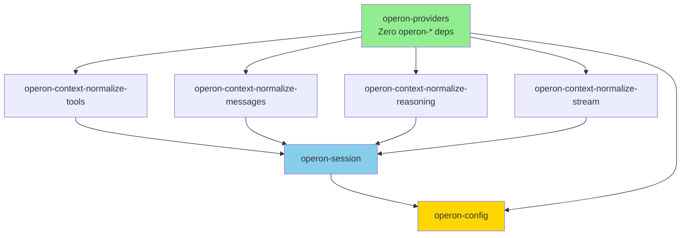
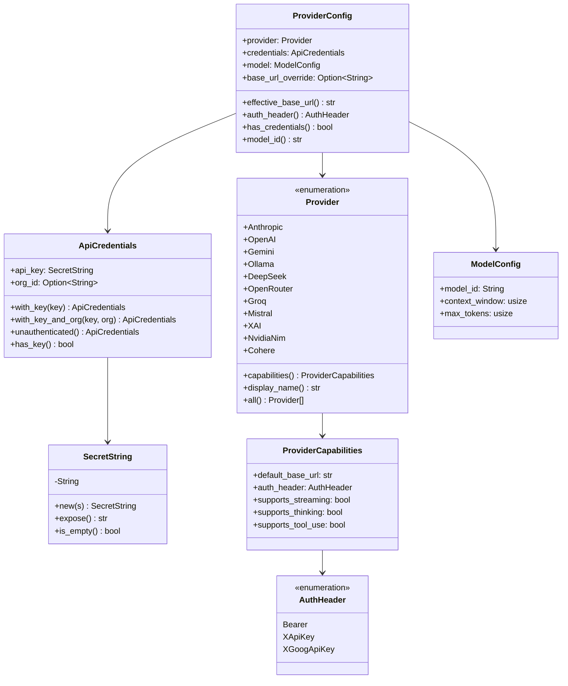
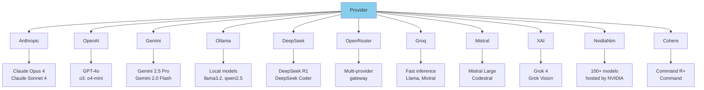
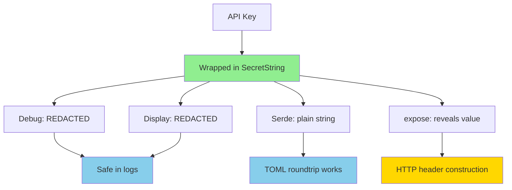
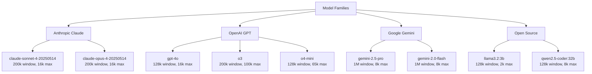
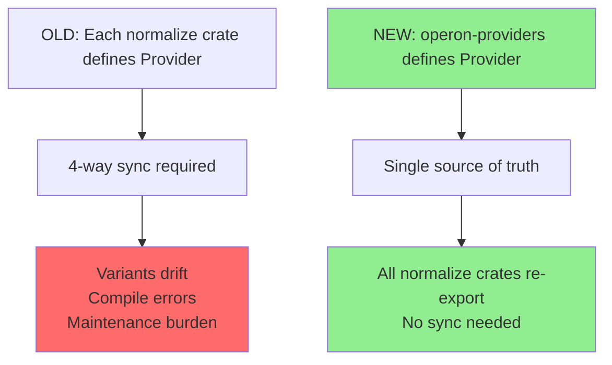
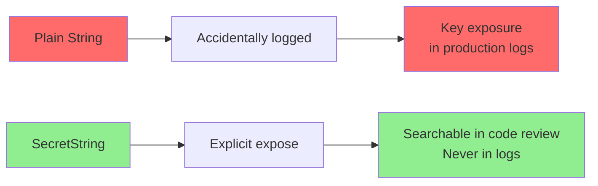
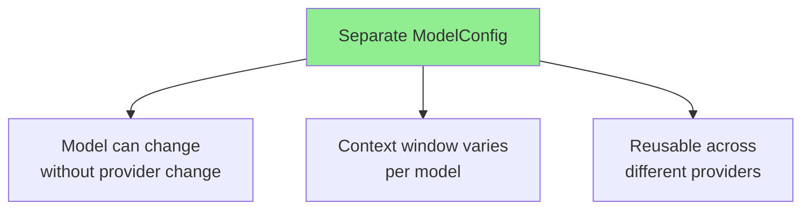

# operon-providers

**Provider identity, credentials, model configuration, and capability metadata for 11 LLM providers**

`operon-providers` is the **root crate** for all provider-related types in Operon. It has **zero operon-\* dependencies**, making it the foundation that all context normalization crates depend on for the canonical `Provider` enum.

---

## Overview

This crate eliminates the four-way `Provider` enum synchronization burden that existed before by providing a single authoritative definition that all normalize crates re-export.



**Key Features**:
- ✅ **Single Provider enum** — re-exported by all normalize crates
- ✅ **11 provider support** — Anthropic, OpenAI, Gemini, Ollama, DeepSeek, OpenRouter, Groq, Mistral, xAI, NVIDIA NIM, Cohere
- ✅ **Credential security** — `SecretString` redacts API keys in logs
- ✅ **Model discovery** — Query provider APIs for available models
- ✅ **Capability metadata** — Base URLs, auth headers, feature flags
- ✅ **Zero coupling** — No dependencies on other operon crates

---

## Architecture

### Type Hierarchy



---

## Provider Enum

### Supported Providers



### Wire Format Families

| Provider | Wire Format | Auth Header | Thinking Support |
|----------|-------------|-------------|------------------|
| **Anthropic** | Messages API | `x-api-key` | ✅ Extended thinking |
| **OpenAI** | Chat Completions | `Bearer` | ✅ reasoning_summary (o1/o3) |
| **Gemini** | GenerateContent | `x-goog-api-key` | ✅ thought parts (2.5+) |
| **Ollama** | OpenAI-compatible | `Bearer` (empty OK) | ✅ Some models (qwq, deepseek-r1) |
| **DeepSeek** | OpenAI-compatible | `Bearer` | ✅ reasoning_content |
| **OpenRouter** | Auto-detect | `Bearer` | ✅ Model-dependent |
| **Groq** | OpenAI-compatible | `Bearer` | ❌ |
| **Mistral** | OpenAI-compatible | `Bearer` | ❌ |
| **xAI** | OpenAI-compatible | `Bearer` | ✅ reasoning_content (Grok) |
| **NVIDIA NIM** | OpenAI-compatible | `Bearer` | ✅ Some models (R1, QwQ) |
| **Cohere** | Custom API | `Bearer` | ❌ |

---

### Provider Definition

```rust
#[derive(Debug, Clone, Copy, PartialEq, Eq, Hash, Serialize, Deserialize)]
#[serde(rename_all = "snake_case")]
pub enum Provider {
    Anthropic,
    #[serde(rename = "open_ai")]
    OpenAI,
    Gemini,
    Ollama,
    DeepSeek,
    OpenRouter,
    Groq,
    Mistral,
    #[serde(rename = "xai")]
    XAI,
    #[serde(rename = "nvidia_nim")]
    NvidiaNim,
    Cohere,
}
```

**Serde Representation**: Lowercase snake_case

```toml
# TOML config example
[provider]
provider = "anthropic"  # not "Anthropic"
```

---

### Provider Methods

#### capabilities()

```rust
pub fn capabilities(self) -> ProviderCapabilities
```

**Returns**: Static capability metadata for the provider

**Example**:
```rust
let caps = Provider::Anthropic.capabilities();
assert_eq!(caps.default_base_url, "https://api.anthropic.com/v1");
assert_eq!(caps.auth_header, AuthHeader::XApiKey);
assert!(caps.supports_thinking);
```

---

#### display_name()

```rust
pub fn display_name(self) -> &'static str
```

**Returns**: Human-readable name for UI display

**Mapping**:
```rust
Provider::Anthropic     → "Anthropic"
Provider::OpenAI        → "OpenAI"
Provider::Gemini        → "Google Gemini"
Provider::Ollama        → "Ollama"
Provider::DeepSeek      → "DeepSeek"
Provider::OpenRouter    → "OpenRouter"
Provider::Groq          → "Groq"
Provider::Mistral       → "Mistral"
Provider::XAI           → "xAI"
Provider::NvidiaNim     → "NVIDIA NIM"
Provider::Cohere        → "Cohere"
```

---

#### all()

```rust
pub fn all() -> &'static [Provider]
```

**Returns**: Static slice of all providers

**Usage**: UI dropdowns, config validation

---

## ProviderConfig

**Purpose**: Complete runtime configuration for a single provider connection

```rust
pub struct ProviderConfig {
    pub provider: Provider,
    pub credentials: ApiCredentials,
    pub model: ModelConfig,
    pub base_url_override: Option<String>,
}
```

---

### Construction

```rust
use operon_providers::{Provider, ProviderConfig};
use operon_providers::credentials::ApiCredentials;
use operon_providers::model::ModelConfig;

let config = ProviderConfig {
    provider: Provider::Anthropic,
    credentials: ApiCredentials::with_key("sk-ant-..."),
    model: ModelConfig {
        model_id: "claude-sonnet-4-20250514".to_string(),
        context_window: 200_000,
        max_tokens: 16_000,
    },
    base_url_override: None,
};
```

---

### Methods

#### effective_base_url()

```rust
pub fn effective_base_url(&self) -> &str
```

**Returns**: `base_url_override` if set, otherwise provider's default URL

**Example**:
```rust
// Default URL
let config = ProviderConfig { /* ... */ base_url_override: None };
assert_eq!(config.effective_base_url(), "https://api.anthropic.com/v1");

// Custom URL (self-hosted Ollama)
let config = ProviderConfig {
    provider: Provider::Ollama,
    base_url_override: Some("http://10.0.0.5:11434/v1".into()),
    /* ... */
};
assert_eq!(config.effective_base_url(), "http://10.0.0.5:11434/v1");
```

---

#### auth_header()

```rust
pub fn auth_header(&self) -> AuthHeader
```

**Returns**: Auth header style for this provider

---

#### has_credentials()

```rust
pub fn has_credentials(&self) -> bool
```

**Returns**: `true` if API key is present and non-empty (always `true` for Ollama)

**Usage**: Startup validation

---

#### model_id(), context_window(), max_tokens()

```rust
pub fn model_id(&self) -> &str
pub fn context_window(&self) -> usize
pub fn max_tokens(&self) -> usize
```

**Convenience accessors** for model config fields

---

## ApiCredentials

**Purpose**: Secure wrapper for API keys with optional org ID

```rust
pub struct ApiCredentials {
    pub api_key: SecretString,
    pub org_id: Option<String>,
}
```

---

### Construction

```rust
// Standard (most providers)
let creds = ApiCredentials::with_key("sk-ant-api-key");

// With organization ID (OpenAI only)
let creds = ApiCredentials::with_key_and_org(
    "sk-openai-key",
    "org-abc123".to_string(),
);

// Unauthenticated (Ollama)
let creds = ApiCredentials::unauthenticated();
```

---

### SecretString

**Purpose**: Redact API keys in logs and debug output

```rust
pub struct SecretString(String);
```

**Debug/Display Output**: `[REDACTED]`

**Example**:
```rust
let key = SecretString::new("sk-secret-key".into());

println!("{}", key);       // "[REDACTED]"
println!("{:?}", key);     // "SecretString([REDACTED])"
println!("{}", key.expose()); // "sk-secret-key" (explicit)
```

---

### Security Properties



**Never Accidentally Logged**:
```rust
tracing::info!("Config: {:?}", config);
// Output: "Config: ProviderConfig { credentials: ApiCredentials { api_key: SecretString([REDACTED]), ... } }"
```

---

## ModelConfig

**Purpose**: Model identifier + token budgets

```rust
pub struct ModelConfig {
    pub model_id: String,
    pub context_window: usize,
    pub max_tokens: usize,
}
```

---

### Field Descriptions

| Field | Purpose | Example Values |
|-------|---------|----------------|
| `model_id` | Exact string sent in `"model"` field | `"claude-sonnet-4-20250514"`, `"gpt-4o"`, `"llama3.2"` |
| `context_window` | Total token capacity (input + output) | `200_000`, `128_000`, `1_048_576` |
| `max_tokens` | Max output tokens per turn | `4_096`, `8_192`, `16_000`, `32_768` |

---

### Common Models



---

## ProviderCapabilities

**Purpose**: Static metadata about provider features

```rust
pub struct ProviderCapabilities {
    pub default_base_url: &'static str,
    pub auth_header: AuthHeader,
    pub supports_streaming: bool,
    pub supports_thinking: bool,
    pub supports_tool_use: bool,
}
```

---

### AuthHeader

```rust
pub enum AuthHeader {
    Bearer,      // Authorization: Bearer <key>
    XApiKey,     // x-api-key: <key>
    XGoogApiKey, // x-goog-api-key: <key>
}
```

---

### Capability Matrix

| Provider | Base URL | Auth | Streaming | Thinking | Tools |
|----------|----------|------|-----------|----------|-------|
| **Anthropic** | `https://api.anthropic.com/v1` | XApiKey | ✅ | ✅ | ✅ |
| **OpenAI** | `https://api.openai.com/v1` | Bearer | ✅ | ✅ | ✅ |
| **Gemini** | `https://generativelanguage.googleapis.com/v1beta` | XGoogApiKey | ✅ | ✅ | ✅ |
| **Ollama** | `http://localhost:11434/v1` | Bearer | ✅ | ✅ | ✅ |
| **DeepSeek** | `https://api.deepseek.com/v1` | Bearer | ✅ | ✅ | ✅ |
| **OpenRouter** | `https://openrouter.ai/api/v1` | Bearer | ✅ | ✅ | ✅ |
| **Groq** | `https://api.groq.com/openai/v1` | Bearer | ✅ | ❌ | ✅ |
| **Mistral** | `https://api.mistral.ai/v1` | Bearer | ✅ | ❌ | ✅ |
| **xAI** | `https://api.x.ai/v1` | Bearer | ✅ | ✅ | ✅ |
| **NVIDIA NIM** | `https://integrate.api.nvidia.com/v1` | Bearer | ✅ | ✅ | ✅ |
| **Cohere** | `https://api.cohere.com/v2` | Bearer | ✅ | ❌ | ✅ |

---

## Model Discovery

**Purpose**: Query provider APIs to list available models

```rust
pub async fn discover_models(
    provider: Provider,
    api_key: &str,
    base_url: Option<&str>,
) -> Result<DiscoveryResult, String>
```

---

### Discovery Support

| Provider | Discovery Endpoint | Status | Notes |
|----------|-------------------|--------|-------|
| **Anthropic** | `GET /v1/models` | ✅ Supported | Returns context_window or context_length |
| **OpenAI** | `GET /v1/models` | ✅ Supported | OpenAI-compatible format |
| **Gemini** | `GET /v1beta/models?key={key}` | ✅ Supported | Strips `models/` prefix from IDs |
| **Ollama** | `GET /api/tags` + `POST /api/show` | ✅ Supported | Requires 2 calls per model |
| **OpenRouter** | `GET /v1/models` | ✅ Supported | Custom response format |
| **Groq** | `GET /openai/v1/models` | ✅ Supported | OpenAI-compatible format |
| **Mistral** | `GET /v1/models` | ✅ Supported | OpenAI-compatible format |
| **xAI** | `GET /v1/models` | ✅ Supported | OpenAI-compatible format |
| **NVIDIA NIM** | `GET /v1/models` | ✅ Supported | OpenAI-compatible format |
| **DeepSeek** | `GET /v1/models` | ✅ Supported | OpenAI-compatible format |
| **Cohere** | `GET /v1/models` | ✅ Supported | Uses OpenAI-compatible fallback |

---

### DiscoveredModel

```rust
pub struct DiscoveredModel {
    pub model_id: String,
    pub context_window: usize,
    pub max_tokens: usize,
    pub description: String,
}
```

---

### DiscoveryResult

```rust
pub struct DiscoveryResult {
    pub models: Vec<DiscoveredModel>,
    #[serde(skip)]
    pub provider: Option<Provider>,
}
```

**Note**: `provider` field is not serialized (marked with `#[serde(skip)]`)

---

### Example Usage

```rust
use operon_providers::{Provider, discover_models};

#[tokio::main]
async fn main() -> Result<(), String> {
    let result = discover_models(
        Provider::Anthropic,
        "sk-ant-api-key",
        None,  // Use default base URL
    ).await?;
    
    for model in result.models {
        println!("{}: {}k context, {}k max",
            model.model_id,
            model.context_window / 1000,
            model.max_tokens / 1000,
        );
    }
    
    Ok(())
}
```

**Output**:
```
claude-sonnet-4-20250514: 200k context, 16k max
claude-opus-4-20250514: 200k context, 16k max
claude-3-5-haiku-latest: 200k context, 8k max
```

---

### HTTP Client Configuration

All discovery calls use:
- **Timeout**: 10 seconds
- **User-Agent**: `Operon/1.0`
- **Client**: reqwest with default TLS

**Error Handling**:
- Non-2xx status codes return `Err(String)` with status + body
- Network errors return `Err(String)` with error description
- JSON parsing errors return `Err(String)` with parse error

---

### Provider-Specific Discovery

#### OpenAI-Compatible Providers

**Applies to**: OpenAI, Groq, Mistral, xAI, DeepSeek, NVIDIA NIM

**Fallback Strategy**: When `context_window` or `context_length` is not provided by the API:
- Defaults to **8,192 tokens** for context window
- Many OpenAI-compatible providers don't expose metadata fields
- This prevents discovery failure, returns conservative defaults

**Example Response**:
```json
{
  "data": [
    {
      "id": "gpt-4o",
      "owned_by": "openai",
      "context_window": 128000,
      "max_output_tokens": 16384
    }
  ]
}
```

---

#### Ollama

**Requires two calls**:
1. `GET /api/tags` — list installed models
2. `POST /api/show` (per model) — get context window from model_info

**Note**: Only models with successfully retrieved context_length are included in results

**Example**:
```json
// /api/tags response
{
  "models": [
    {"name": "llama3.2:3b", "size": 3212448768},
    {"name": "qwen2.5-coder:32b", "size": 34359738368}
  ]
}

// /api/show response (per model)
{
  "model_info": {
    "llama.context_length": 131072
    // Searches for any key ending with ".context_length"
  }
}
```

**Implementation Details**:
- Iterates through `model_info` HashMap looking for keys ending with `.context_length`
- Silently skips models where `/api/show` fails or doesn't return context_length
- `description` field contains human-readable size: `"Size: 3 GB"`

---

#### Gemini

**Query parameter authentication**:
```
GET /v1beta/models?key={api_key}
```

**Model ID transformation**: Strips `"models/"` prefix from name field

**Filtering**: Only includes models with both `inputTokenLimit` and `outputTokenLimit` present

**Response parsing**:
```json
{
  "models": [
    {
      "name": "models/gemini-2.5-pro",
      "inputTokenLimit": 1048576,
      "outputTokenLimit": 8192
    }
  ]
}
```

**Model ID transformation**: Strip `"models/"` prefix

---

#### Anthropic

**Authentication**: `x-api-key` header + `anthropic-version: 2023-06-01` header required

**Field resolution**: Checks `context_window` first, falls back to `context_length`

**Max tokens resolution**: Checks `max_tokens` first, falls back to `max_output_tokens`, defaults to min(4096, context_window)

**Example Response**:
```json
{
  "data": [
    {
      "id": "claude-sonnet-4-20250514",
      "display_name": "Claude Sonnet 4",
      "context_window": 200000,
      "max_output_tokens": 16000
    }
  ]
}
```

---

#### OpenRouter

**Custom response format**: Uses `context_length` field (not `context_window`)

**Filtering**: Only includes models with `context_length` present

**Max tokens**: Defaults to min(4096, context_length)

**Example Response**:
```json
{
  "data": [
    {
      "id": "anthropic/claude-3.5-sonnet",
      "name": "Claude 3.5 Sonnet",
      "context_length": 200000,
      "description": "Anthropic's Claude 3.5 Sonnet"
    }
  ]
}
```

---

## Usage Examples

### Basic Configuration

```rust
use operon_providers::{Provider, ProviderConfig};
use operon_providers::credentials::ApiCredentials;
use operon_providers::model::ModelConfig;

// Anthropic Claude
let anthropic = ProviderConfig {
    provider: Provider::Anthropic,
    credentials: ApiCredentials::with_key("sk-ant-..."),
    model: ModelConfig {
        model_id: "claude-sonnet-4-20250514".to_string(),
        context_window: 200_000,
        max_tokens: 16_000,
    },
    base_url_override: None,
};

// OpenAI with organization
let openai = ProviderConfig {
    provider: Provider::OpenAI,
    credentials: ApiCredentials::with_key_and_org(
        "sk-openai-...",
        "org-abc123".to_string(),
    ),
    model: ModelConfig {
        model_id: "gpt-4o".to_string(),
        context_window: 128_000,
        max_tokens: 16_384,
    },
    base_url_override: None,
};

// Ollama (local)
let ollama = ProviderConfig {
    provider: Provider::Ollama,
    credentials: ApiCredentials::unauthenticated(),
    model: ModelConfig {
        model_id: "llama3.2".to_string(),
        context_window: 128_000,
        max_tokens: 8_192,
    },
    base_url_override: Some("http://10.0.0.5:11434/v1".into()),
};
```

---

### Building HTTP Headers

```rust
use reqwest::header::{HeaderMap, HeaderValue};

fn build_headers(config: &ProviderConfig) -> HeaderMap {
    let mut headers = HeaderMap::new();
    
    match config.auth_header() {
        AuthHeader::Bearer => {
            let bearer = format!("Bearer {}", config.credentials.api_key.expose());
            headers.insert("Authorization", HeaderValue::from_str(&bearer).unwrap());
        }
        AuthHeader::XApiKey => {
            headers.insert(
                "x-api-key",
                HeaderValue::from_str(config.credentials.api_key.expose()).unwrap(),
            );
            headers.insert("anthropic-version", HeaderValue::from_static("2023-06-01"));
        }
        AuthHeader::XGoogApiKey => {
            headers.insert(
                "x-goog-api-key",
                HeaderValue::from_str(config.credentials.api_key.expose()).unwrap(),
            );
        }
    }
    
    headers
}
```

---

### Provider Capabilities Check

```rust
fn supports_thinking(provider: Provider) -> bool {
    provider.capabilities().supports_thinking
}

// Usage
if supports_thinking(config.provider) {
    println!("This provider exposes reasoning/thinking content");
}
```

---

### TOML Serialization

```rust
use operon_providers::ProviderConfig;

let config = /* ... */;

// Serialize to TOML
let toml = toml::to_string(&config)?;
// Output:
// [provider]
// provider = "anthropic"
// 
// [provider.credentials]
// api_key = "sk-ant-..."
// 
// [provider.model]
// model_id = "claude-sonnet-4-20250514"
// context_window = 200000
// max_tokens = 16000

// Deserialize from TOML
let restored: ProviderConfig = toml::from_str(&toml)?;
```

---

## Design Rationale

### Why Zero operon-\* Dependencies?



---

### Why SecretString?



---

### Why Separate ModelConfig?



**Example**: Switch from `gpt-4o` (128k) to `o3` (200k) without changing provider

---

## Testing

```bash
# Run all tests
cargo test -p operon-providers

# Test discovery
cargo test -p operon-providers --test discovery -- --nocapture

# Test serialization
cargo test -p operon-providers --test serde_roundtrip
```

---

## Dependencies

```toml
[dependencies]
serde = { workspace = true }
serde_json = { workspace = true }
thiserror = { workspace = true }
reqwest = { workspace = true }
tokio = { workspace = true }
```

**Minimal Dependencies**: No operon-\* crates

---

## License

Operon is licensed under the **GNU Affero General Public License v3.0 (AGPLv3)**.

---

> Built by **Luka Gray (aka Soumo Mukherjee)** • West Bengal, India • 2026
