# operon-session

**Agent loop orchestration, provider HTTP/SSE streaming, tool dispatch coordination, context compaction, and JSON-backed persistence**

`operon-session` is the **heart of Operon's agentic execution**. It sits between the frontend (TUI/GUI) and the context/tools pipeline, orchestrating the complete agent loop from user input to model response to tool execution.

---

## Overview

This crate provides `SessionRunner`, the central orchestrator that owns all session state and drives the full agentic cycle:

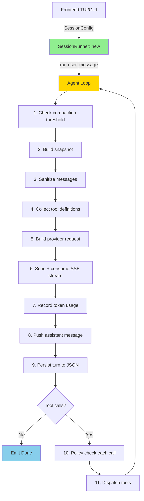

**Key Features**:
- ✅ **Complete agent loop** — compaction → snapshot → stream → dispatch → repeat
- ✅ **HTTP/SSE streaming** — real-time token-by-token provider responses
- ✅ **Policy enforcement** — Allow/Ask/Deny gates before tool execution
- ✅ **JSON persistence** — human-readable session + turn storage
- ✅ **Lifecycle state machine** — Idle → Running → Done/Failed
- ✅ **Command channel** — Cancel/Approve/Deny from UI
- ✅ **11 provider support** — via operon-providers + operon-context normalize crates
- ✅ **Special tool handling** — ask-tool suspends loop for user input

---

## Architecture

### Crate Structure

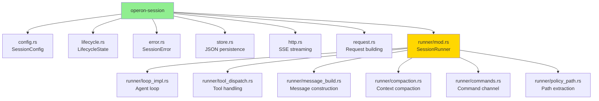

---

### Dependency Graph

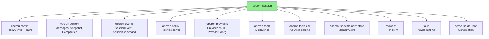

---

## Core Types

### SessionRunner

**Purpose**: The agent loop orchestrator — owns all session state

```rust
pub struct SessionRunner {
    session_id: String,
    config: SessionConfig,
    messages: Vec<ConversationMessage>,
    dispatcher: Dispatcher,
    snapshot_builder: SnapshotBuilder,
    token_state: SessionTokenState,
    token_budget: TokenBudget,
    lifecycle: LifecycleState,
    http_client: Client,
    event_tx: mpsc::Sender<SessionEvent>,
    cmd_rx: mpsc::Receiver<SessionCommand>,
    policy_resolver: PolicyResolver,
    pending_commands: VecDeque<SessionCommand>,
    store: Option<SessionStore>,
    turn_index: usize,
}
```

---

### SessionConfig

**Purpose**: All runtime parameters for a SessionRunner

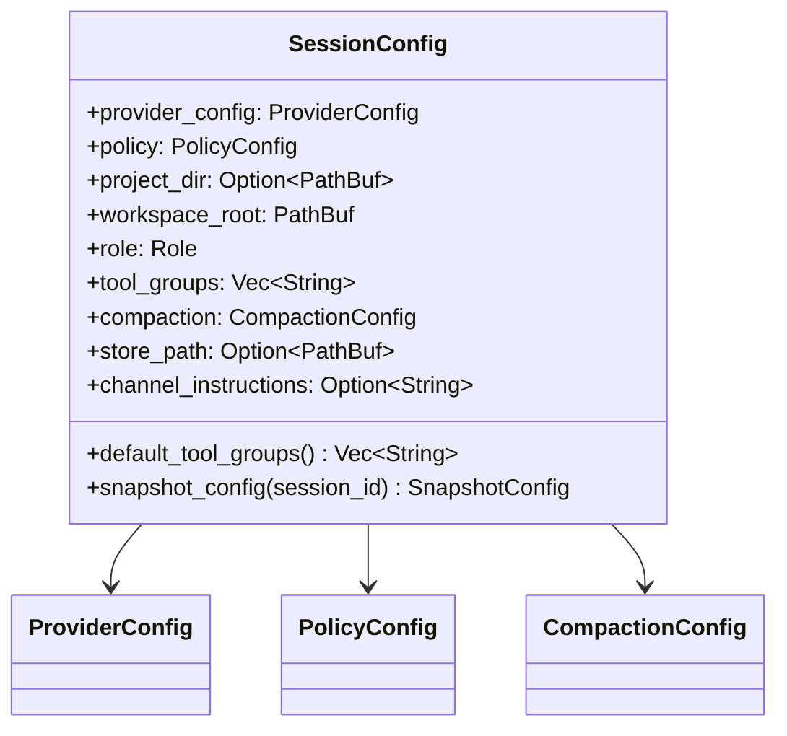

---

#### Directory Model (3 Directions)

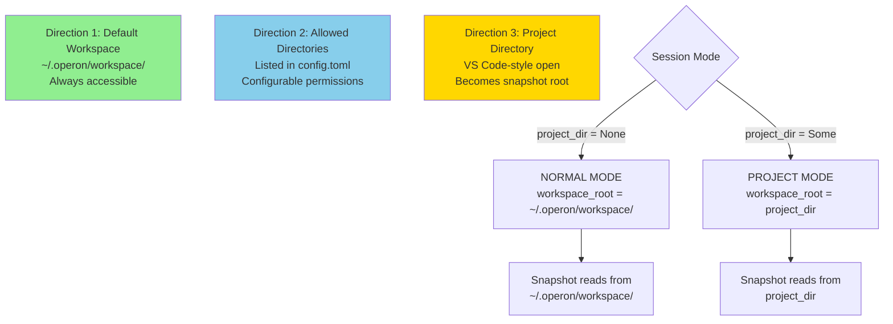

**Direction 1 (Default Workspace)**:
- Path: `~/.operon/workspace/`
- Always accessible to the agent
- Injected into policy by operon-config
- Snapshot root in NORMAL mode

**Direction 2 (Allowed Directories)**:
- Loaded from `config.toml` `[[directories]]` blocks
- Configurable per-directory permissions (filesystem + shell)
- Checked by PolicyResolver at runtime

**Direction 3 (Project Directory)**:
- Opened VS Code-style via `project_dir: Some(path)`
- Becomes workspace_root (snapshot root) in PROJECT mode
- Must already exist in config.toml as a Direction 2 directory
- No runtime policy changes — permissions configured in advance

---

### LifecycleState

**Purpose**: State machine for session execution

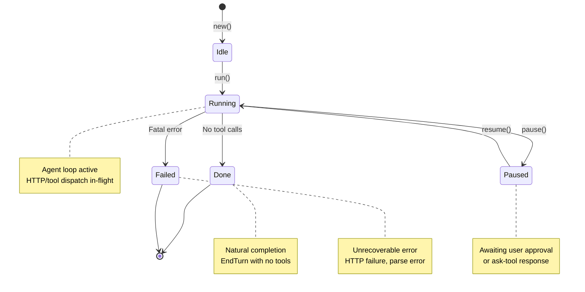

```rust
pub enum LifecycleState {
    Idle,     // Created but not started
    Running,  // Loop actively executing
    Paused,   // Waiting for approval/input
    Done,     // Natural completion
    Failed,   // Fatal error occurred
}
```

**State Guards**:
```rust
impl LifecycleState {
    pub fn can_run(&self) -> bool {
        matches!(self, Self::Idle | Self::Paused)
    }
    
    pub fn can_pause(&self) -> bool {
        matches!(self, Self::Running)
    }
}
```

---

### SessionError

**Purpose**: Unified error type for all session operations

```mermaid
classDiagram
    class SessionError {
        <<enumeration>>
        Http(reqwest Error)
        Stream(String)
        Normalize(String)
        Sanitizer(SanitizerError)
        Snapshot(SnapshotError)
        Compaction(CompactionError)
        Store(String)
        InvalidState{state String}
        Config(String)
        Memory(MemoryStoreError)
    }
    
    SessionError --> reqwest_Error
    SessionError --> SanitizerError
    SessionError --> SnapshotError
    SessionError --> CompactionError
    SessionError --> MemoryStoreError
```

---

## Agent Loop Implementation

### Per-Turn Cycle (run method)

**Module**: `runner/loop_impl.rs`

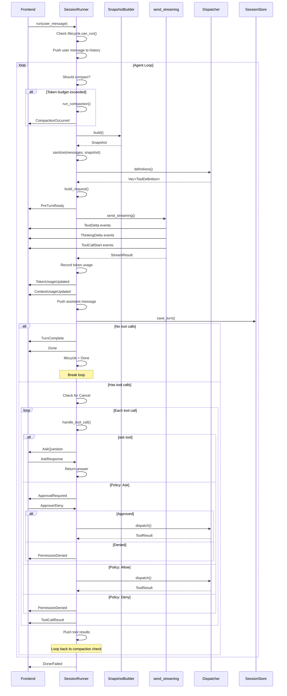

---

### Compaction Flow

**Module**: `runner/compaction.rs`

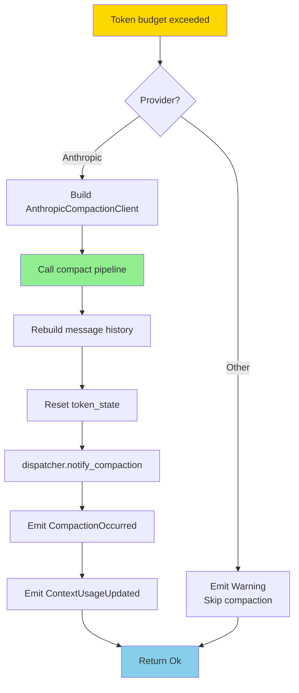

**Supported Providers**:
- ✅ **Anthropic** — Full compaction support via AnthropicCompactionClient
- ❌ **Others** — Logs warning + emits Warning event, skips compaction

---

### Tool Dispatch Flow

**Module**: `runner/tool_dispatch.rs`

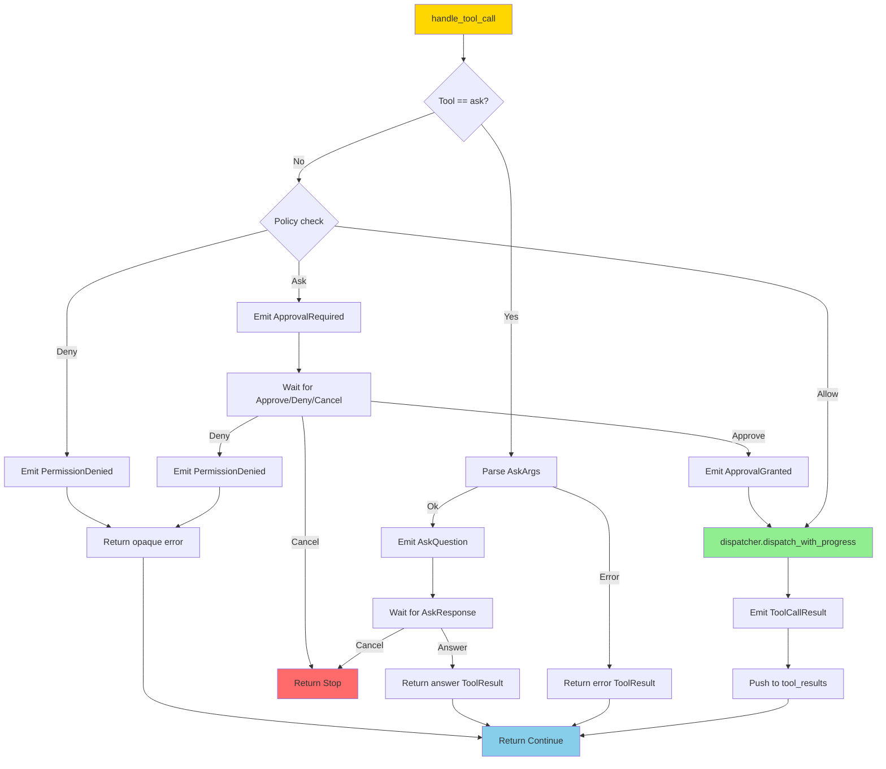

**Return Values**:
```rust
pub enum ToolCallFlow {
    Continue,  // Process next tool call
    Stop,      // Break out of loop (Cancel received)
}
```

---

## HTTP Streaming

**Module**: `http.rs`

### SSE Stream Consumption

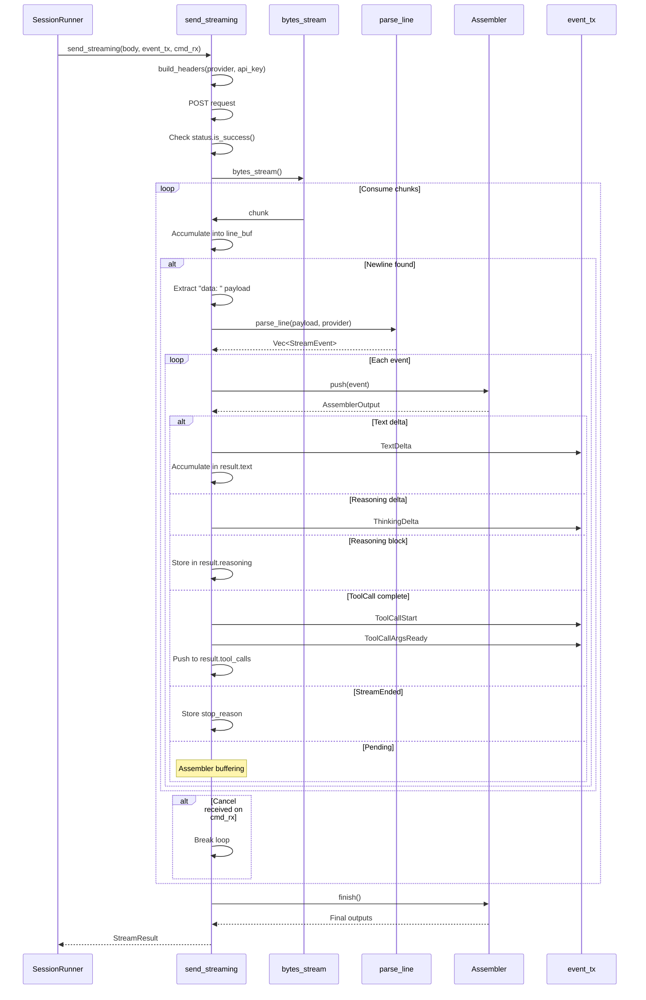

---

### StreamResult

```rust
pub struct StreamResult {
    pub text: String,
    pub tool_calls: Vec<ToolCall>,
    pub stop_reason: Option<StopReason>,
    pub usage_raw: Option<Value>,
    pub reasoning: Option<ReasoningBlock>,
}
```

---

### Header Construction

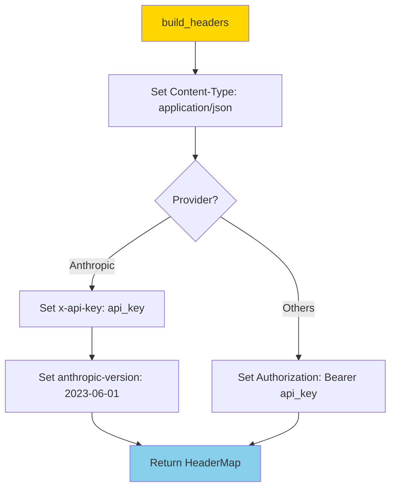

**Provider-Specific Headers**:

| Provider | Auth Header | Extra Headers |
|----------|-------------|---------------|
| **Anthropic** | `x-api-key: {key}` | `anthropic-version: 2023-06-01` |
| **All Others** | `Authorization: Bearer {key}` | None |

---

## Request Building

**Module**: `request.rs`

### Build Flow

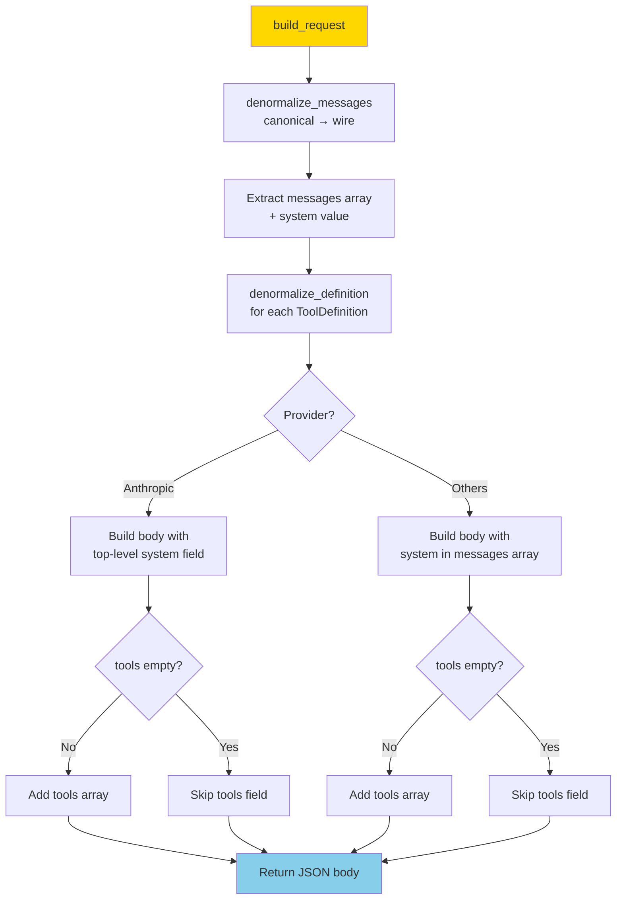

---

### Provider Endpoints

```rust
pub fn provider_endpoint(provider: &Provider) -> &'static str {
    match provider {
        Provider::Anthropic   => "https://api.anthropic.com/v1/messages",
        Provider::OpenAI      => "https://api.openai.com/v1/chat/completions",
        Provider::DeepSeek    => "https://api.deepseek.com/v1/chat/completions",
        Provider::OpenRouter  => "https://openrouter.ai/api/v1/chat/completions",
        Provider::Groq        => "https://api.groq.com/openai/v1/chat/completions",
        Provider::Mistral     => "https://api.mistral.ai/v1/chat/completions",
        Provider::XAI         => "https://api.x.ai/v1/chat/completions",
        Provider::NvidiaNim   => "https://integrate.api.nvidia.com/v1/chat/completions",
        Provider::Ollama      => "http://localhost:11434/v1/chat/completions",
        Provider::Gemini      => "https://generativelanguage.googleapis.com/v1beta/models",
        Provider::Cohere      => "https://api.cohere.com/v2/chat",
    }
}
```

**Note**: Runtime uses `ProviderConfig::effective_base_url()` instead to respect `base_url_override`

---

## JSON Persistence

**Module**: `store.rs`

### Design (Moved from SQLite to JSON)

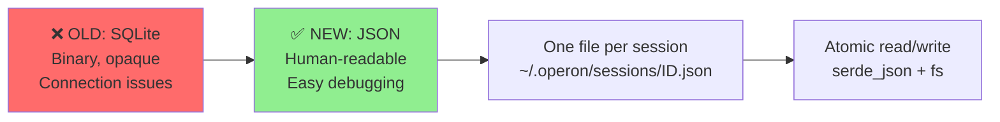

**Why JSON over SQLite**:
1. **Human-readable** — Open in VS Code, inspect directly
2. **No lock issues** — Simple file operations, no connection pooling
3. **Simpler debugging** — cat/grep the JSON file
4. **Transparent** — See exact conversation structure

---

### SessionStore

```rust
pub struct SessionStore {
    path: PathBuf,  // ~/.operon/sessions/<session_id>.json
}
```

**Methods**:
```rust
impl SessionStore {
    pub async fn open(path: &Path) -> Result<Self, SessionError>;
    pub async fn create_session(id, workspace, model_id, provider) -> Result<(), SessionError>;
    pub async fn save_turn(session_id, turn_index, messages, token_count) -> Result<(), SessionError>;
    pub async fn truncate_turns(session_id, keep_turns_count) -> Result<(), SessionError>;
    pub async fn load_turns(session_id) -> Result<Vec<Vec<ConversationMessage>>, SessionError>;
    pub async fn load_turns_with_timestamps(session_id) -> Result<Vec<(i64, Vec<ConversationMessage>)>, SessionError>;
    pub async fn load_full_history(session_id) -> Result<Vec<ConversationMessage>, SessionError>;
    pub async fn list_sessions() -> Result<Vec<SessionRow>, SessionError>;
    pub async fn get_last_token_count(session_id) -> Result<Option<usize>, SessionError>;
    pub async fn get_first_user_message_text(session_id) -> Result<Option<String>, SessionError>;
}
```

---

### JSON Schema

```json
{
  "id": "session-abc123",
  "created_at": 1735689600,
  "workspace": "/home/user/project",
  "model_id": "claude-sonnet-4-20250514",
  "provider": "Anthropic",
  "turns": [
    {
      "turn_index": 0,
      "messages": [
        {
          "role": "user",
          "content": [{"Text": "Hello!"}],
          "stop_reason": null
        },
        {
          "role": "assistant",
          "content": [{"Text": "Hi there!"}],
          "stop_reason": {"EndTurn": {}}
        }
      ],
      "token_count": 1024,
      "created_at": 1735689610
    }
  ]
}
```

---

### Persistence Flow

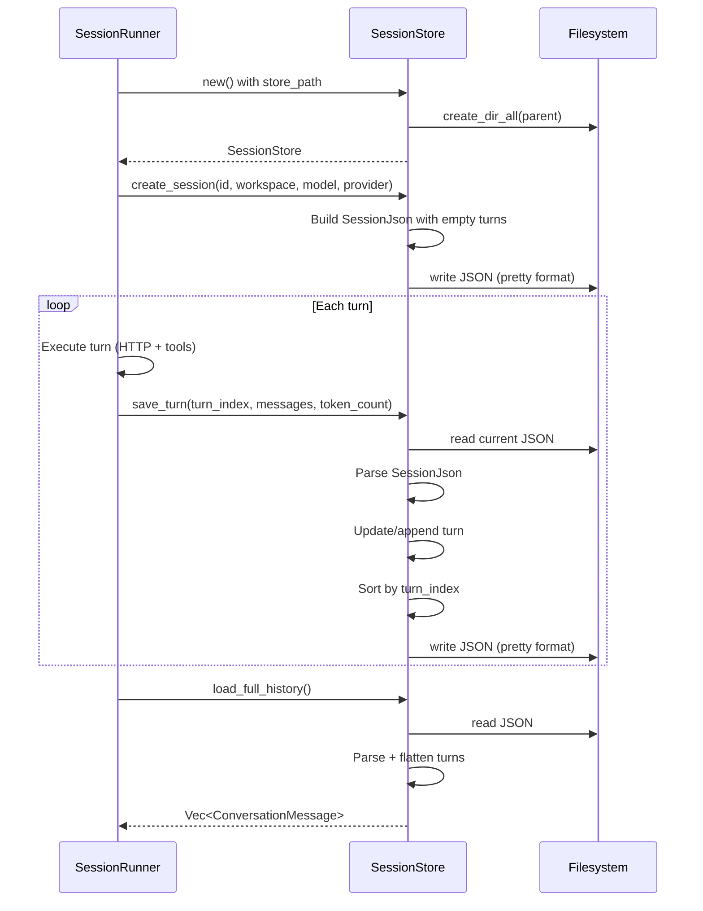

---

## Command Channel

**Module**: `runner/commands.rs`

### Command Flow

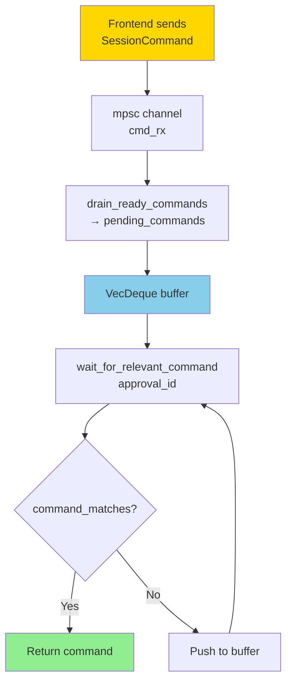

---

### SessionCommand

```rust
pub enum SessionCommand {
    Cancel,
    Approve { id: String },
    Deny { id: String },
    AskResponse { id: String, answer: String },
}
```

---

### Matching Logic

```rust
fn command_matches(command: &SessionCommand, approval_id: Option<&str>) -> bool {
    match command {
        SessionCommand::Cancel => true,  // Always matches
        SessionCommand::Approve { id }
        | SessionCommand::Deny { id }
        | SessionCommand::AskResponse { id, .. } => {
            approval_id.is_some_and(|expected| expected == id)
        }
    }
}
```

**Behavior**:
- **Cancel** — Always matches (global stop signal)
- **Approve/Deny/AskResponse** — Match only if ID matches expected approval_id
- Irrelevant commands are buffered in `pending_commands` for later processing

---

## Special Tool Handling

### ask Tool Interception

**Module**: `runner/tool_dispatch.rs`

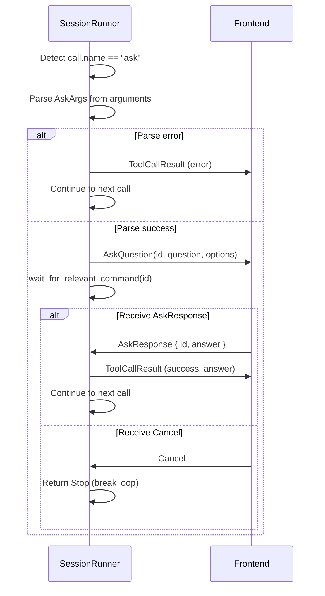

**Key Difference**: ask tool **bypasses Dispatcher** — no tool implementation needed, handled entirely in runner

---

### Upfront Tool Exposure

All registered tools (`fs`, `shell`, `web`, `todo`, `ask`, `memory`) are exposed to the model directly in the top-level API payload from turn 1. This eliminates discovery round-trip latency, supports provider prompt caching, and avoids polluting conversation context with dynamic schema JSON.

---

## Usage Examples

### Basic Session Creation

```rust
use operon_session::{SessionConfig, SessionRunner};
use operon_config::load;
use operon_events::{SessionEvent, SessionCommand};
use tokio::sync::mpsc;

#[tokio::main]
async fn main() -> Result<(), Box<dyn std::error::Error>> {
    // Load application config
    let app = load()?;
    
    // Build session config
    let config = SessionConfig {
        provider_config: app.provider,
        policy: app.policy,
        project_dir: None,
        workspace_root: app.paths.workspace_dir.clone(),
        role: operon_context::Role::Owner,
        tool_groups: SessionConfig::default_tool_groups(),
        compaction: operon_context::CompactionConfig::default(),
        store_path: Some(app.paths.session_db("my-session")),
        channel_instructions: None,
    };
    
    // Create event/command channels
    let (event_tx, mut event_rx) = mpsc::channel(100);
    let (cmd_tx, cmd_rx) = mpsc::channel(10);
    
    // Create runner
    let mut runner = SessionRunner::new(config, event_tx, cmd_rx).await?;
    
    // Spawn event listener
    tokio::spawn(async move {
        while let Some(event) = event_rx.recv().await {
            match event {
                SessionEvent::TextDelta { text } => print!("{}", text),
                SessionEvent::Done => println!("\n[Session complete]"),
                _ => {}
            }
        }
    });
    
    // Run agent loop
    runner.run("Hello!".to_string(), vec![], vec![]).await?;
    
    Ok(())
}
```

---

### Project Mode Session

```rust
use std::path::PathBuf;

let project_path = PathBuf::from("/home/user/my-project");

let config = SessionConfig {
    project_dir: Some(project_path.clone()),
    workspace_root: project_path,  // Snapshot root = project dir
    // ... other fields
};

// AGENTS.md, tree, git status all read from /home/user/my-project
```

---

### Sending Cancel Command

```rust
use operon_events::SessionCommand;

// From UI thread
cmd_tx.send(SessionCommand::Cancel).await?;

// Runner will:
// 1. Break stream consumption if mid-stream
// 2. Break tool-call loop if dispatching
// 3. Emit Done event
// 4. Transition to Done state
```

---

### Handling Approval Required

```rust
// Runner emits:
SessionEvent::ApprovalRequired {
    id: "abc123",
    tool: "bash",
    path: Some("/etc/passwd"),
    reason: "Filesystem operation in restricted directory",
    args_json: "...".to_string(),
}

// UI displays approval dialog

// User approves:
cmd_tx.send(SessionCommand::Approve { id: "abc123".to_string() }).await?;

// OR denies:
cmd_tx.send(SessionCommand::Deny { id: "abc123".to_string() }).await?;
```

---

### ask Tool Flow

```rust
// Runner emits:
SessionEvent::AskQuestion {
    id: "q1",
    question: "Which approach should I use?",
    options: vec!["Option A".into(), "Option B".into()],
}

// UI renders multiple-choice widget

// User answers:
cmd_tx.send(SessionCommand::AskResponse {
    id: "q1".to_string(),
    answer: "Option A".to_string(),
}).await?;

// Runner receives answer and continues loop
```

---

### Resuming a Session

```rust
use operon_session::SessionStore;

let store = SessionStore::open(&app.paths.session_db("session-abc")).await?;

// Load history
let turns = store.load_turns("session-abc").await?;
let full_history = turns.into_iter().flatten().collect();
let last_token_count = store.get_last_token_count("session-abc").await?;

// Restore runner state
runner.set_history(full_history, 3, last_token_count);

// Continue with new user message
runner.run("Continue where we left off".to_string(), vec![], vec![]).await?;
```

---

## Error Handling

### Error Propagation

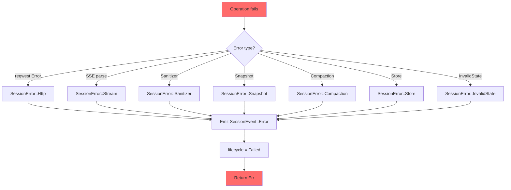

---

### PreTurnFailed Event

Emitted when errors occur BEFORE the HTTP request is sent:

```rust
SessionEvent::PreTurnFailed {
    turn_index: usize,
    step: PreTurnStep,  // Compaction | Snapshot | Sanitizer
    reason: String,
}
```

**Triggered by**:
- Compaction fatal errors (not threshold/insufficient history)
- Snapshot build failures (filesystem errors, watcher issues)
- Sanitizer validation failures

---

### Compaction Error Handling

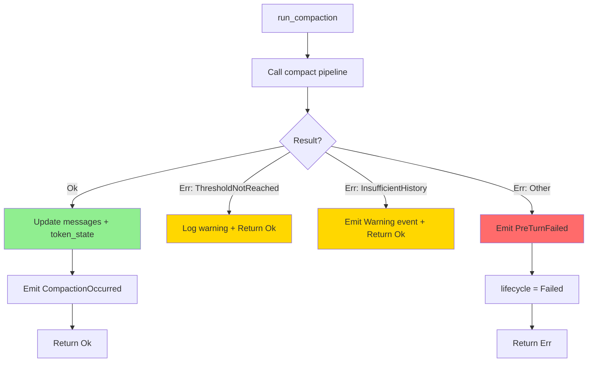

---

## Testing

```bash
# Run all tests
cargo test -p operon-session

# Run with logs
cargo test -p operon-session -- --nocapture

# Test store persistence
cargo test -p operon-session store::tests

# Test lifecycle state machine
cargo test -p operon-session lifecycle::tests
```

---

## Dependencies

```toml
[dependencies]
operon-config                = { workspace = true }
operon-context               = { workspace = true, features = ["http-client"] }
operon-events                = { workspace = true }
operon-policy                = { workspace = true }
operon-providers             = { workspace = true }
operon-tools                 = { workspace = true }
operon-tools-ask             = { workspace = true }
operon-tools-memory-store    = { workspace = true }

tokio      = { workspace = true }
reqwest    = { workspace = true, features = ["json", "stream"] }
futures    = { workspace = true }
serde      = { workspace = true }
serde_json = { workspace = true }
tracing    = { workspace = true }
thiserror  = { workspace = true }
async-trait = { workspace = true }
sqlx = { workspace = true }  # Legacy, not actively used post-JSON migration
```

---

## Design Rationale

### Why JSON Over SQLite?

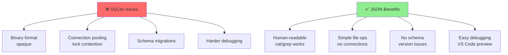

---

### Why Split runner/ into Submodules?

**Before** (single `runner.rs`):
- 2000+ LOC monolithic file
- Difficult to navigate
- Cognitive overload

**After** (7 submodules):
- Each <400 LOC
- Clear separation of concerns
- Easy to locate functionality

```
runner/
  mod.rs           — SessionRunner struct + new()
  loop_impl.rs     — Per-turn agent loop
  tool_dispatch.rs — Per-tool-call handling
  message_build.rs — Pure message construction
  compaction.rs    — Compaction orchestration
  commands.rs      — Command channel plumbing
  policy_path.rs   — Path extraction for policy
```

---

### Why ask Tool Special Case?

```mermaid
flowchart LR
    Normal[Normal Tool] --> Disp[Dispatcher]
    Disp --> Impl[Tool Implementation]
    Impl --> Result[ToolResult]
    
    Ask[ask Tool] --> Intercept[Intercepted in runner]
    Intercept --> UI[UI renders question]
    UI --> User[User answers]
    User --> Direct[Direct ToolResult]
    
    style Normal fill:#87CEEB
    style Ask fill:#FFD700
```

**Why**:
- ask tool MUST suspend the entire loop
- Dispatcher is synchronous — cannot await UI response
- Direct handling in runner allows `.await` on command channel

---

## License

Operon is licensed under the **GNU Affero General Public License v3.0 (AGPLv3)**.

---

> Built by **Luka Gray (aka Soumo Mukherjee)** • West Bengal, India • 2026
