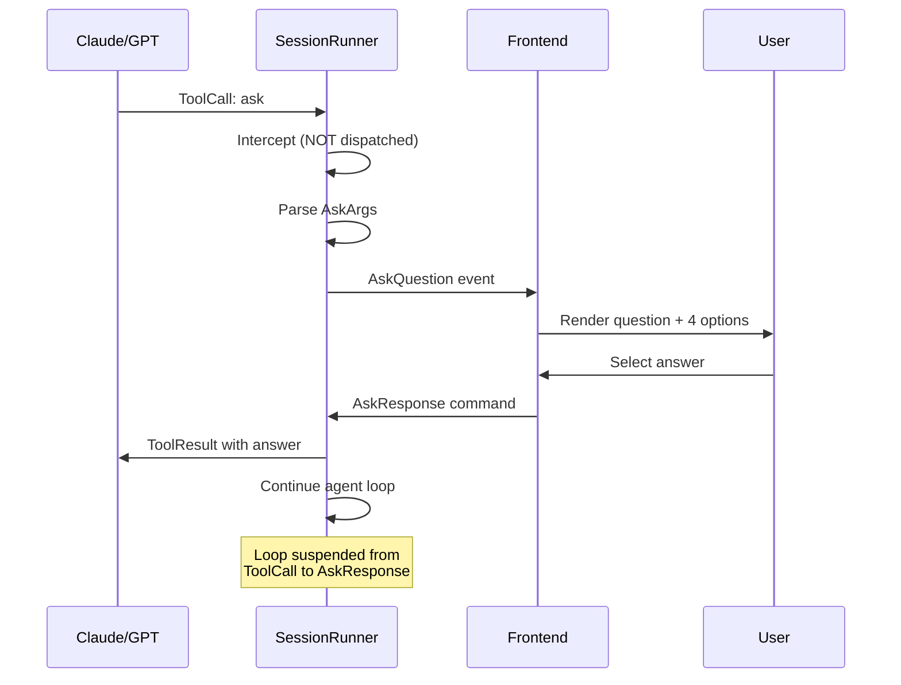
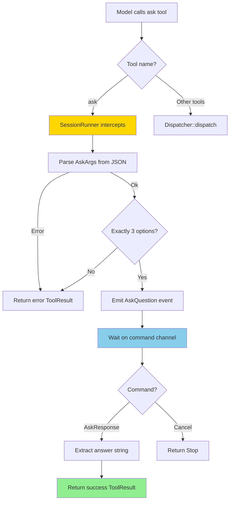
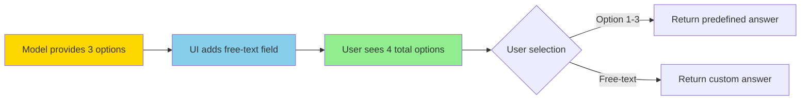
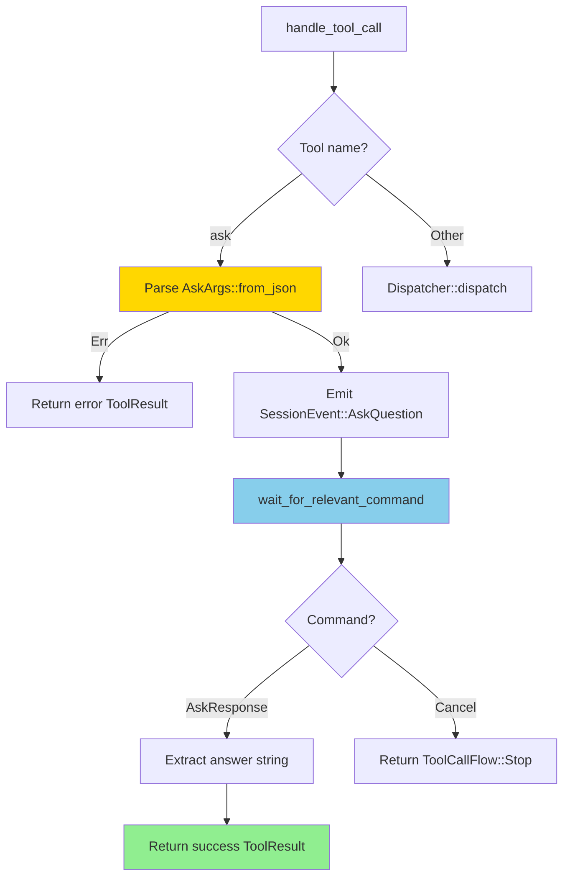
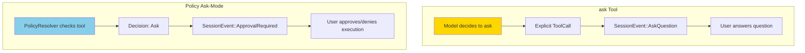
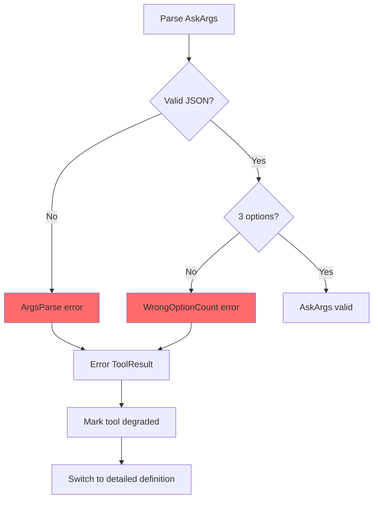
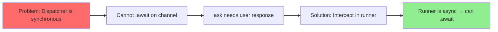

# operon-tools-ask

**The `ask` tool — pause the agent loop and present a multiple-choice question to the user**

`operon-tools-ask` provides the `ask` tool definition and argument types. Unlike other tools, `ask` is **not dispatched through the Dispatcher** — it's intercepted directly by the session runner and suspends the entire agent loop until the user responds.

---

## Overview

The `ask` tool lets the model pause execution and ask the user a multiple-choice question with **3 pre-defined options + 1 free-text field** (added automatically by the UI).



---

## Key Features

- ✅ **Loop suspension** — agent loop pauses until user responds
- ✅ **4-option UI** — model provides 3, UI adds free-text field
- ✅ **Flexible field names** — `question`/`prompt`/`message`, `options`/`choices`
- ✅ **Validation** — enforces exactly 3 options at parse time
- ✅ **Special handling** — intercepted before dispatcher, never reaches tool implementation

---

## Architecture



---

## Data Structures

### AskArgs

```rust
pub struct AskArgs {
    /// The question to present to the user
    #[serde(alias = "prompt", alias = "message", 
            alias = "query", alias = "text")]
    pub question: String,

    /// Exactly 3 pre-defined answer options
    /// UI adds a 4th free-text field automatically
    #[serde(deserialize_with = "deserialize_flexible_string_list",
            alias = "choices", alias = "answers", alias = "items")]
    pub options: Vec<String>,
}
```

**Field Aliases**:

| Canonical Field | Aliases |
|----------------|---------|
| `question` | `prompt`, `message`, `query`, `text` |
| `options` | `choices`, `answers`, `items` |

---

### AskToolError

```rust
pub enum AskToolError {
    /// Failed to deserialize ask arguments
    ArgsParse(#[from] serde_json::Error),
    
    /// options array does not contain exactly 3 elements
    WrongOptionCount(usize),
}
```

---

## Execution Flow

```mermaid
stateDiagram-v2
    [*] --> ModelCall: Model calls ask
    ModelCall --> ParseArgs: runner.handle_tool_call
    ParseArgs --> ValidateCount: AskArgs::from_json
    
    ValidateCount --> CheckCount: len == 3?
    CheckCount --> Error: No
    CheckCount --> EmitQuestion: Yes
    
    EmitQuestion --> WaitCommand: SessionEvent::AskQuestion
    WaitCommand --> CheckCmd: wait_for_relevant_command
    
    CheckCmd --> ReturnAnswer: AskResponse
    CheckCmd --> ReturnStop: Cancel
    
    Error --> ToolResult: error ToolResult
    ReturnAnswer --> ToolResult: success ToolResult
    ReturnStop --> [*]: Break loop
    ToolResult --> [*]: Continue loop
    
    note right of EmitQuestion
        UI renders:
        - Question text
        - 3 model-provided options
        - 1 free-text field (auto)
    end note
```

---

## Tool Definition (Tiered)

### Short Definition (Normal Conditions)

```rust
ToolDefinition {
    name: "ask",
    description: "Ask the user a multiple-choice question and wait for their answer. \
                  Provide exactly 3 options — the UI adds a free-text field as a 4th. \
                  The agent loop pauses until the user responds.",
    parameters: { /* ... */ }
}
```

### Detailed Definition (After Malformed Call)

Sent when the model makes a mistake. Includes:
- Full input shapes
- Response format
- Common mistakes (wrong option count)
- Explicit error messages

---

## Usage Examples

### Basic Multiple Choice

```json
{
  "question": "Which approach should I use?",
  "options": [
    "Use approach A (faster)",
    "Use approach B (more robust)",
    "Mix both approaches"
  ]
}
```

**UI Renders**:
```
Which approach should I use?

○ Use approach A (faster)
○ Use approach B (more robust)
○ Mix both approaches
○ Other (type your answer): _________
```

---

### Using Aliases

```json
{
  "prompt": "What's the priority?",
  "choices": [
    "High priority",
    "Medium priority",
    "Low priority"
  ]
}
```

**Accepted!** Aliases work transparently.

---

### Error: Wrong Option Count

```json
{
  "question": "Choose a color",
  "options": ["Red", "Blue"]  // Only 2!
}
```

**Error**: `"expected exactly 3 options, got 2. Provide exactly 3 pre-defined answer options — the UI adds a 4th free-text field automatically."`

---

## Why 3 Options?



**Rationale**:
- 3 structured options guide common cases
- Free-text field handles edge cases / custom input
- Model doesn't need to anticipate all possible answers
- UI consistency across all ask calls

---

## Integration with SessionRunner

### Interception Logic



---

### Command Matching

```rust
fn wait_for_relevant_command(
    approval_id: Option<&str>,
    cmd_rx: &mut mpsc::Receiver<SessionCommand>,
    pending_commands: &mut VecDeque<SessionCommand>,
) -> SessionCommand {
    loop {
        match cmd_rx.recv().await {
            Some(cmd) => {
                if command_matches(&cmd, approval_id) {
                    return cmd;  // AskResponse or Cancel
                } else {
                    pending_commands.push_back(cmd);  // Buffer for later
                }
            }
            None => break,  // Channel closed
        }
    }
}
```

**Matching Rules**:
- `Cancel` — **always matches** (global stop signal)
- `AskResponse { id, answer }` — matches only if `id == approval_id`
- Other commands → buffered in `pending_commands`

---

## SessionEvents Emitted

### AskQuestion

```rust
SessionEvent::AskQuestion {
    id: String,           // Unique approval_id for this question
    question: String,     // Question text
    options: Vec<String>, // 3 pre-defined options
}
```

**Frontend Action**: Render UI with 4 options (3 model + 1 free-text)

---

### ToolCallResult

```rust
SessionEvent::ToolCallResult {
    call_id: String,
    name: "ask",
    status: ResultStatus::Success,
    content: ResultContent::Text(answer),  // User's selected/typed answer
}
```

---

## Comparison with Policy Ask-Mode



| Aspect | ask Tool | Policy Ask-Mode |
|--------|----------|-----------------|
| **Trigger** | Model decision | Policy config |
| **Purpose** | Get user input | Permission gate |
| **Event** | `AskQuestion` | `ApprovalRequired` |
| **Response** | `AskResponse` | `Approve`/`Deny` |
| **Outcome** | Returns answer string | Executes or blocks tool |

---

## Error Handling

### Parse Errors



---

### Error Messages

| Error | Message |
|-------|---------|
| **Missing question** | `"failed to deserialize ask arguments: missing field 'question'"` |
| **Wrong type** | `"failed to deserialize ask arguments: invalid type: expected string, found number"` |
| **Wrong option count** | `"expected exactly 3 options, got N. Provide exactly 3 pre-defined answer options — the UI adds a 4th free-text field automatically."` |

---

## Testing

```rust
#[cfg(test)]
mod tests {
    use super::*;
    use serde_json::json;

    #[test]
    fn parse_valid_3_options() {
        let args = json!({
            "question": "Pick one",
            "options": ["A", "B", "C"]
        });
        
        let parsed = AskArgs::from_json(&args).unwrap();
        assert_eq!(parsed.question, "Pick one");
        assert_eq!(parsed.options.len(), 3);
    }

    #[test]
    fn parse_with_aliases() {
        let args = json!({
            "prompt": "Choose",  // question alias
            "choices": ["X", "Y", "Z"]  // options alias
        });
        
        let parsed = AskArgs::from_json(&args).unwrap();
        assert_eq!(parsed.question, "Choose");
    }

    #[test]
    fn reject_wrong_option_count() {
        let args = json!({
            "question": "Pick",
            "options": ["A", "B"]  // Only 2
        });
        
        let err = AskArgs::from_json(&args).unwrap_err();
        assert!(matches!(err, AskToolError::WrongOptionCount(2)));
    }
}
```

---

## Dependencies

```toml
[dependencies]
operon-tools-core                    = { workspace = true }
operon-context-normalize-tools       = { workspace = true }
serde                                = { workspace = true }
serde_json                           = { workspace = true }
thiserror                            = { workspace = true }
```

---

## Design Rationale

### Why Not Dispatch Through Dispatcher?



**Technical Constraint**: The `Dispatcher::dispatch()` method is synchronous — it cannot `.await` on an async channel for user input. The `ask` tool fundamentally requires suspending execution until a response arrives, which only the async `SessionRunner` can handle.

---

### Why Exactly 3 Options?

1. **UI Consistency** — Every ask call renders 4 options (3 + free-text)
2. **Guidance vs Flexibility** — 3 structured options cover common cases, free-text handles edge cases
3. **Token Efficiency** — Model doesn't enumerate every possible answer
4. **Validation Simplicity** — Single constraint check in parser

---

## License

Operon is licensed under the **GNU Affero General Public License v3.0 (AGPLv3)**.

---

Built by **Luka Gray (aka Soumo Mukherjee)** • West Bengal, India • 2026
