# operon-tools-fs

**Filesystem tool group — 7 tools for reading, writing, editing, and searching files**

`operon-tools-fs` is a facade crate that re-exports all filesystem tool sub-crates. It provides a complete filesystem manipulation toolkit: **read, write, edit, append, delete, grep, ls**.

---

## Overview

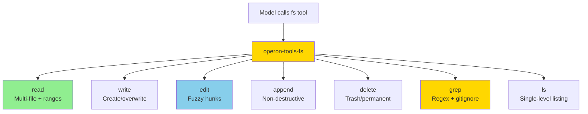
```mermaid
flowchart TB
    Model[Model calls fs tool] --> Facade[operon-tools-fs]
    
    Facade --> Read[read<br/>Multi-file + ranges]
    Facade --> Write[write<br/>Create/overwrite]
    Facade --> Edit[edit<br/>Fuzzy hunks]
    Facade --> Append[append<br/>Non-destructive]
    Facade --> Delete[delete<br/>Trash/permanent]
    Facade --> Grep[grep<br/>Regex + gitignore]
    Facade --> Ls[ls<br/>Single-level listing]
    
    style Facade fill:#FFD700
    style Read fill:#90EE90
    style Edit fill:#87CEEB
    style Grep fill:#FFD700
```

---

## Tool Catalog

| Tool | Purpose | Key Feature |
|------|---------|-------------|
| **read** | Read files | Batch reads, inline ranges (`path:10-40`) |
| **write** | Create/overwrite | Atomic writes, parent must exist |
| **edit** | Replace text | 6-pass fuzzy seeking, partial success |
| **append** | Add to end | Non-destructive, O_APPEND mode |
| **delete** | Remove files/dirs | Trash (default) or permanent |
| **grep** | Regex search | gitignore-aware, context lines, 300 match limit |
| **ls** | List directory | Single-level, metadata, glob exclusion |

---

## 1. read Tool

**Purpose**: Read one or multiple files in a single call, with optional line ranges

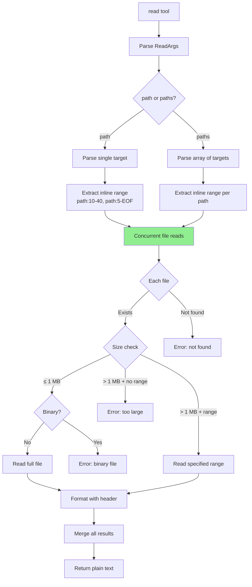
```mermaid
flowchart TB
    Start[read tool] --> Parse[Parse ReadArgs]
    Parse --> Extract{path or paths?}
    
    Extract -->|path| Single[Parse single target]
    Extract -->|paths| Multi[Parse array of targets]
    
    Single --> Range1[Extract inline range<br/>path:10-40, path:5-EOF]
    Multi --> Range2[Extract inline range per path]
    
    Range1 --> Concurrent[Concurrent file reads]
    Range2 --> Concurrent
    
    Concurrent --> Check{Each file}
    
    Check -->|Exists| Size{Size check}
    Check -->|Not found| Err1[Error: not found]
    
    Size -->|≤ 1 MB| Binary{Binary?}
    Size -->|> 1 MB + no range| Err2[Error: too large]
    Size -->|> 1 MB + range| ReadRange[Read specified range]
    
    Binary -->|Yes| Err3[Error: binary file]
    Binary -->|No| ReadFull[Read full file]
    
    ReadFull --> Format[Format with header]
    ReadRange --> Format
    
    Format --> Merge[Merge all results]
    Merge --> Return[Return plain text]
    
    style Concurrent fill:#90EE90
```

---

### Input Shapes

**Single file**:
```json
{"path": "src/main.rs"}
{"path": "src/main.rs:10-40"}
{"path": "src/main.rs:5-EOF"}
{"path": "src/main.rs:15"}
```

**Multiple files**:
```json
{
  "paths": [
    "src/main.rs:1-50",
    "Cargo.toml",
    "README.md:1-10"
  ]
}
```

---

### Output Format

```
=== src/main.rs (lines 10-40 of 200) ===
fn main() {
    println!("Hello, world!");
}

=== Cargo.toml (full file, 15 lines) ===
[package]
name = "my-project"
version = "0.1.0"
```

**No line number prefixes** — raw content only

---

### Range Syntax

| Syntax | Meaning |
|--------|---------|
| `path` | Full file |
| `path:N` | Line N only |
| `path:N-M` | Lines N to M (inclusive) |
| `path:N-EOF` | Line N to end |

**Line Numbering**: 1-indexed (first line is 1)

---

### Limits & Validation

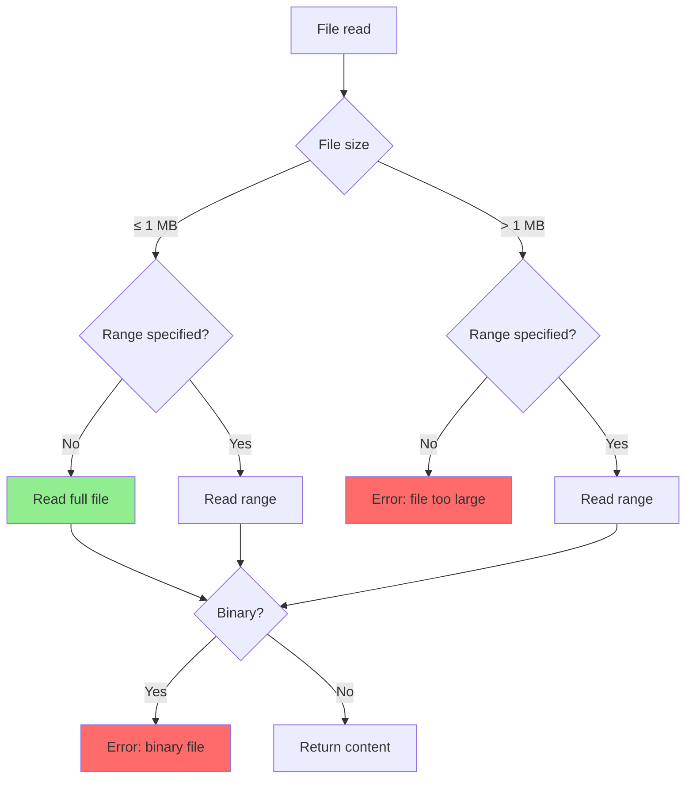
```mermaid
flowchart TB
    Start[File read] --> Size{File size}
    
    Size -->|≤ 1 MB| Check1{Range specified?}
    Size -->|> 1 MB| Check2{Range specified?}
    
    Check1 -->|No| ReadFull[Read full file]
    Check1 -->|Yes| ReadRange1[Read range]
    
    Check2 -->|No| Error[Error: file too large]
    Check2 -->|Yes| ReadRange2[Read range]
    
    ReadFull --> Binary{Binary?}
    ReadRange1 --> Binary
    ReadRange2 --> Binary
    
    Binary -->|Yes| Error2[Error: binary file]
    Binary -->|No| Success[Return content]
    
    style ReadFull fill:#90EE90
    style Error fill:#FF6B6B
    style Error2 fill:#FF6B6B
```

**Constraints**:
- Max 1 MB for full-file reads
- No limit for range reads
- Binary files rejected

---

## 2. write Tool

**Purpose**: Create a new file or completely overwrite an existing file

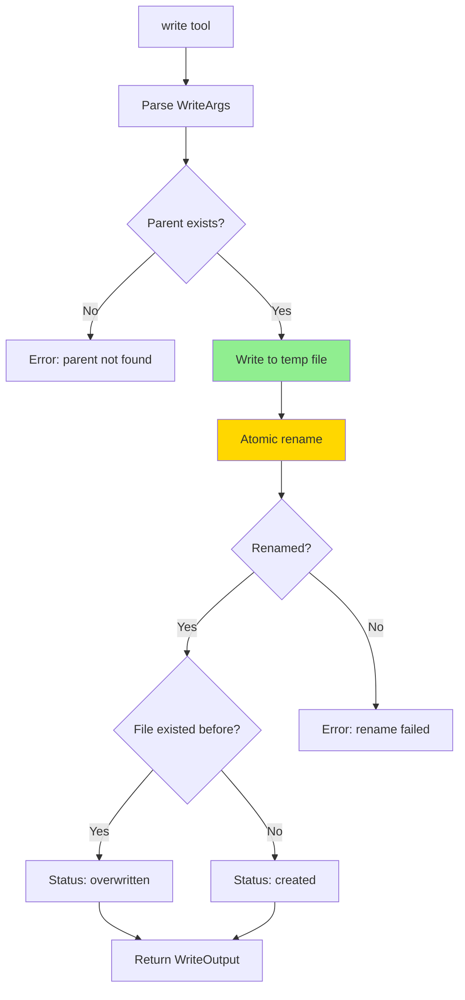
```mermaid
flowchart TB
    Start[write tool] --> Parse[Parse WriteArgs]
    Parse --> Check1{Parent exists?}
    
    Check1 -->|No| Error1[Error: parent not found]
    Check1 -->|Yes| Temp[Write to temp file]
    
    Temp --> Rename[Atomic rename]
    Rename --> Success{Renamed?}
    
    Success -->|Yes| Check2{File existed before?}
    Success -->|No| Error2[Error: rename failed]
    
    Check2 -->|Yes| Created[Status: overwritten]
    Check2 -->|No| Overwrote[Status: created]
    
    Created --> Return[Return WriteOutput]
    Overwrote --> Return
    
    style Temp fill:#90EE90
    style Rename fill:#FFD700
```

---

### Input

```json
{
  "path": "/path/to/file.txt",
  "content": "Hello, world!\nSecond line\n"
}
```

---

### Output

```
=== /path/to/file.txt (created, 27 bytes) ===
```

or

```
=== /path/to/file.txt (overwritten, 27 bytes) ===
```

---

### Atomic Write Pattern

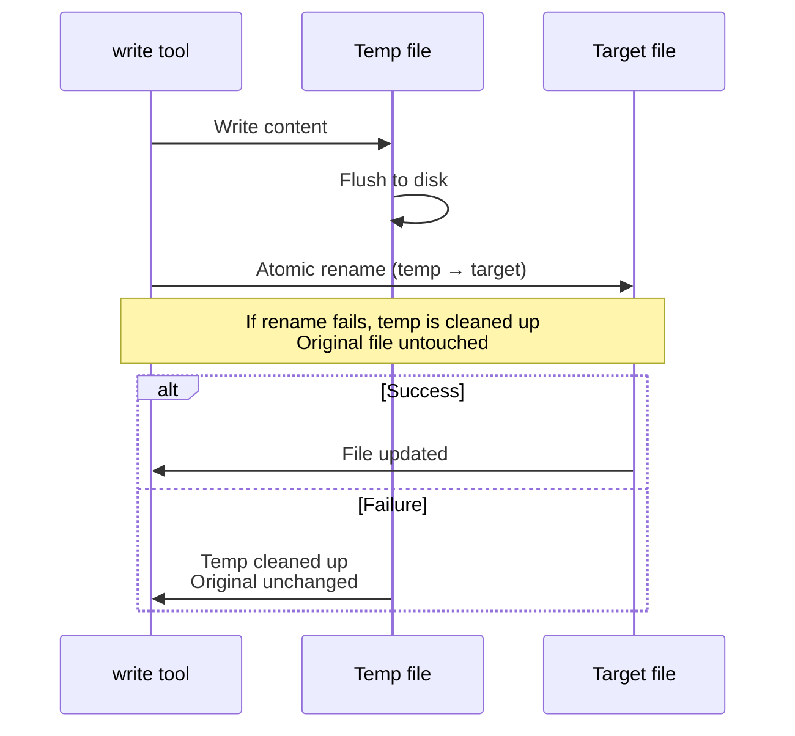
```mermaid
sequenceDiagram
    participant Tool as write tool
    participant Temp as Temp file
    participant Target as Target file
    
    Tool->>Temp: Write content
    Temp->>Temp: Flush to disk
    Tool->>Target: Atomic rename (temp → target)
    
    Note over Tool,Target: If rename fails, temp is cleaned up<br/>Original file untouched
    
    alt Success
        Target->>Tool: File updated
    else Failure
        Temp->>Tool: Temp cleaned up<br/>Original unchanged
    end
```

**Guarantee**: Either the write fully succeeds, or the original file is untouched.

---

### Validation

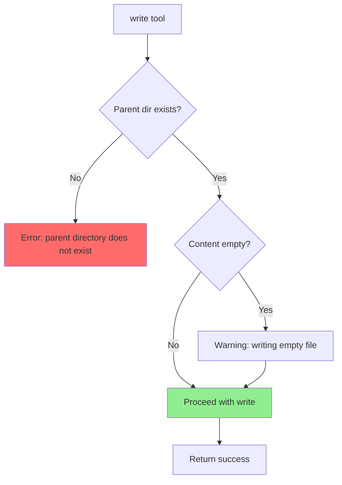
```mermaid
flowchart TB
    Start[write tool] --> Check1{Parent dir exists?}
    Check1 -->|No| Err1[Error: parent directory does not exist]
    Check1 -->|Yes| Check2{Content empty?}
    
    Check2 -->|Yes| Warn[Warning: writing empty file]
    Check2 -->|No| Write[Proceed with write]
    
    Warn --> Write
    Write --> Success[Return success]
    
    style Err1 fill:#FF6B6B
    style Write fill:#90EE90
```

**Note**: Empty content is **allowed** (creates zero-byte file)

---

## 3. edit Tool

**Purpose**: Apply text replacement hunks with 6-pass fuzzy matching

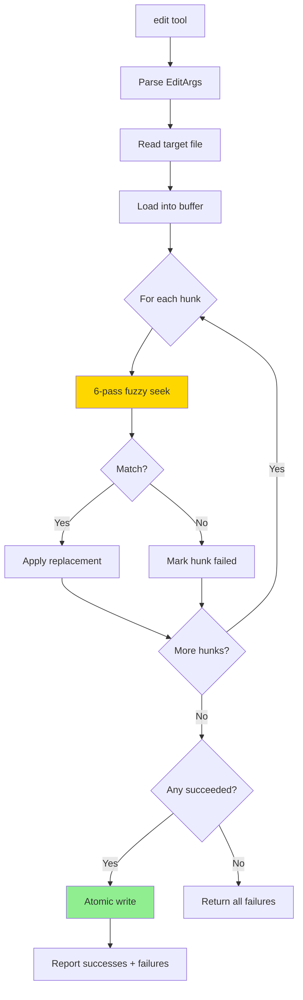
```mermaid
flowchart TB
    Start[edit tool] --> Parse[Parse EditArgs]
    Parse --> Read[Read target file]
    Read --> Buffer[Load into buffer]
    
    Buffer --> Loop{For each hunk}
    
    Loop --> Match[6-pass fuzzy seek]
    Match --> Found{Match?}
    
    Found -->|Yes| Replace[Apply replacement]
    Found -->|No| Skip[Mark hunk failed]
    
    Replace --> Next{More hunks?}
    Skip --> Next
    
    Next -->|Yes| Loop
    Next -->|No| Check{Any succeeded?}
    
    Check -->|Yes| Atomic[Atomic write]
    Check -->|No| AllFailed[Return all failures]
    
    Atomic --> Report[Report successes + failures]
    
    style Match fill:#FFD700
    style Atomic fill:#90EE90
```

---

### 6-Pass Fuzzy Sequence Seeking

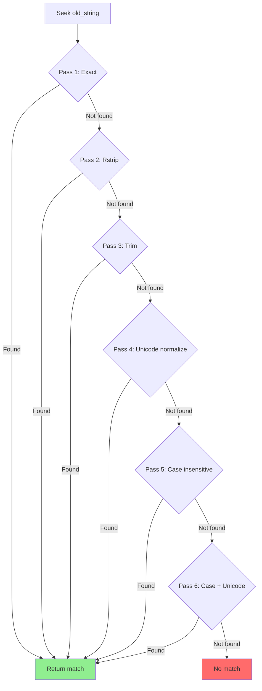
```mermaid
flowchart TB
    Start[Seek old_string] --> Pass1{Pass 1: Exact}
    
    Pass1 -->|Found| Success[Return match]
    Pass1 -->|Not found| Pass2{Pass 2: Rstrip}
    
    Pass2 -->|Found| Success
    Pass2 -->|Not found| Pass3{Pass 3: Trim}
    
    Pass3 -->|Found| Success
    Pass3 -->|Not found| Pass4{Pass 4: Unicode normalize}
    
    Pass4 -->|Found| Success
    Pass4 -->|Not found| Pass5{Pass 5: Case insensitive}
    
    Pass5 -->|Found| Success
    Pass5 -->|Not found| Pass6{Pass 6: Case + Unicode}
    
    Pass6 -->|Found| Success
    Pass6 -->|Not found| Failure[No match]
    
    style Success fill:#90EE90
    style Failure fill:#FF6B6B
```

**Pass Details**:
1. **Exact** — Byte-for-byte match
2. **Rstrip** — Trailing whitespace ignored
3. **Trim** — Leading & trailing whitespace ignored
4. **Unicode normalize** — Convert fancy quotes/dashes to ASCII
5. **Case insensitive** — Ignore case
6. **Case + Unicode** — Both normalizations combined

---

### Input

```json
{
  "path": "/path/to/file.rs",
  "edits": [
    {
      "old_string": "fn old_name() {",
      "new_string": "fn new_name() {"
    },
    {
      "old_string": "let x = 10;",
      "new_string": "let x = 20;"
    }
  ]
}
```

---

### Output (Partial Success)

```json
{
  "applied": 1,
  "failed": 1,
  "failures": [
    {
      "index": 1,
      "old_string": "let x = 10;",
      "reason": "not found: no match after 6 fuzzy passes"
    }
  ]
}
```

**Behavior**: Hunk 0 succeeded → written to disk. Hunk 1 failed → reported in `failures`.

---

### Sequential Application

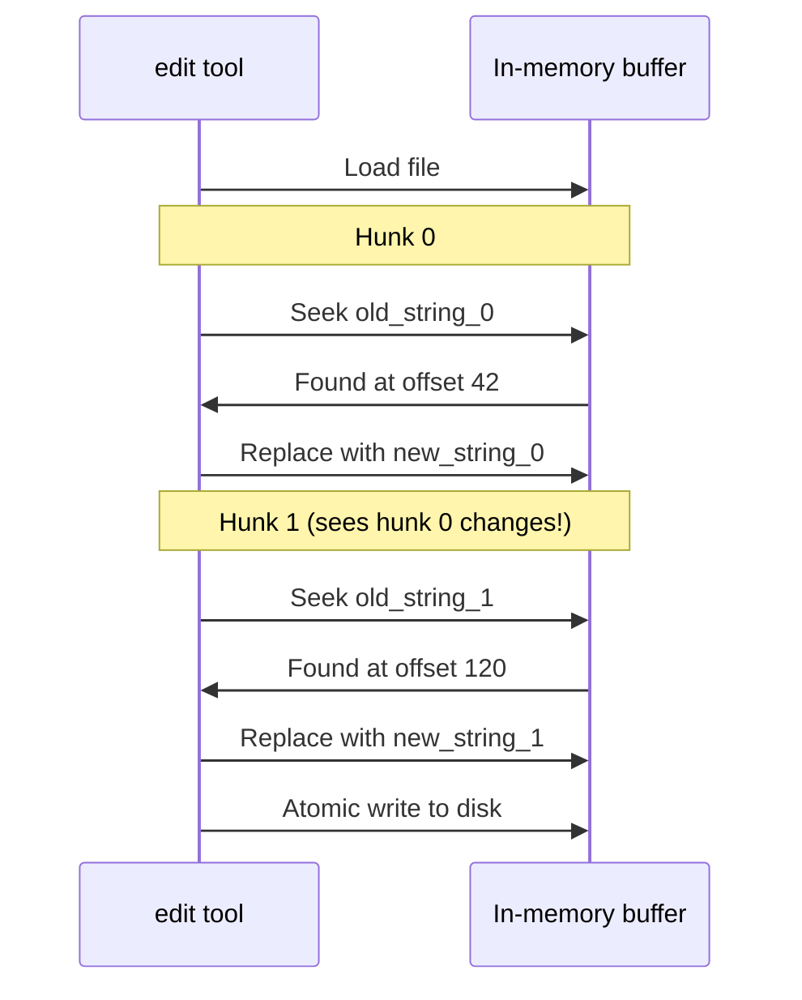
```mermaid
sequenceDiagram
    participant Tool as edit tool
    participant Buffer as In-memory buffer
    
    Tool->>Buffer: Load file
    
    Note over Tool,Buffer: Hunk 0
    Tool->>Buffer: Seek old_string_0
    Buffer->>Tool: Found at offset 42
    Tool->>Buffer: Replace with new_string_0
    
    Note over Tool,Buffer: Hunk 1 (sees hunk 0 changes!)
    Tool->>Buffer: Seek old_string_1
    Buffer->>Tool: Found at offset 120
    Tool->>Buffer: Replace with new_string_1
    
    Tool->>Buffer: Atomic write to disk
```

**Important**: Later hunks see changes made by earlier hunks.

---

### Ambiguity Detection

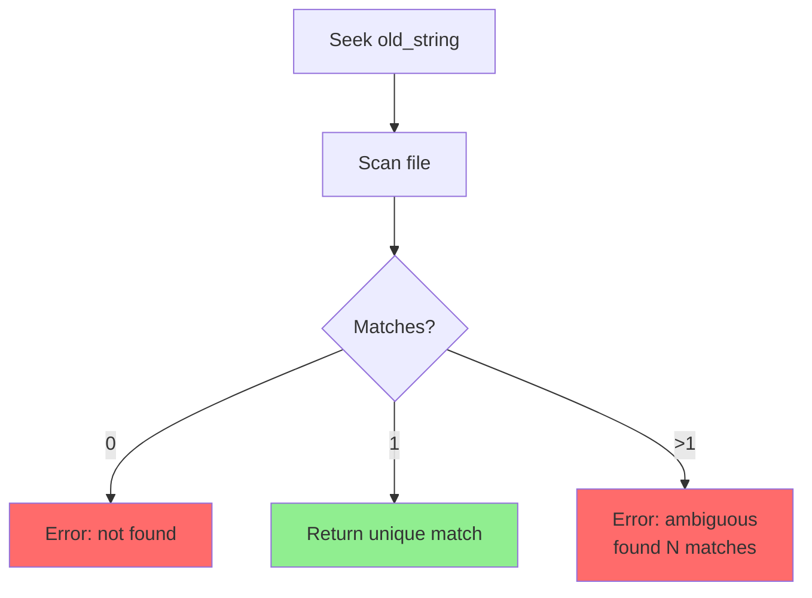
```mermaid
flowchart TB
    Start[Seek old_string] --> Find[Scan file]
    Find --> Count{Matches?}
    
    Count -->|0| NotFound[Error: not found]
    Count -->|1| Success[Return unique match]
    Count -->|>1| Ambiguous[Error: ambiguous<br/>found N matches]
    
    style Success fill:#90EE90
    style NotFound fill:#FF6B6B
    style Ambiguous fill:#FF6B6B
```

**Error Message**: `"ambiguous: 'old_string' appears 3 times. Include more surrounding context to make it unique."`

---

## 4. append Tool

**Purpose**: Append text to the end of an existing file

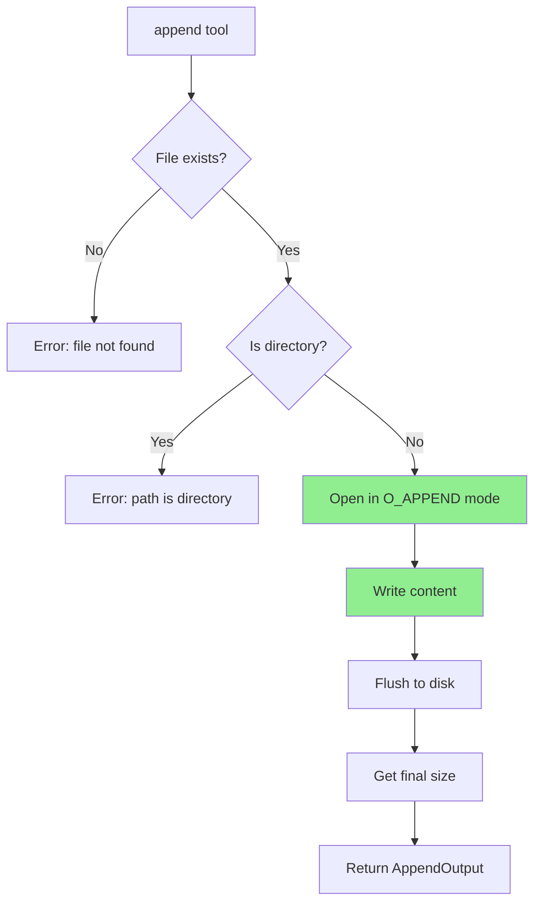
```mermaid
flowchart TB
    Start[append tool] --> Check1{File exists?}
    
    Check1 -->|No| Error1[Error: file not found]
    Check1 -->|Yes| Check2{Is directory?}
    
    Check2 -->|Yes| Error2[Error: path is directory]
    Check2 -->|No| Open[Open in O_APPEND mode]
    
    Open --> Write[Write content]
    Write --> Flush[Flush to disk]
    Flush --> Size[Get final size]
    Size --> Return[Return AppendOutput]
    
    style Open fill:#90EE90
    style Write fill:#90EE90
```

---

### Input

```json
{
  "path": "/path/to/file.txt",
  "content": "\nNew line appended"
}
```

**Note**: Include leading `\n` if you need a separator

---

### Output

```
=== /path/to/file.txt (appended 18 bytes, total 512 bytes) ===
```

---

### O_APPEND Mode

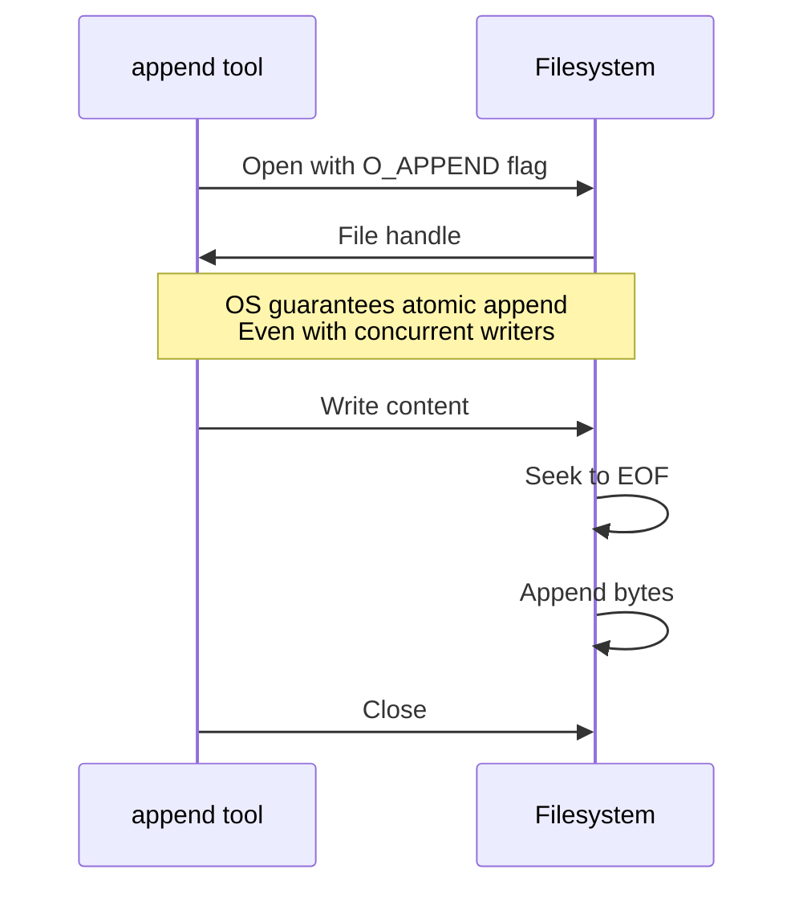
```mermaid
sequenceDiagram
    participant Tool as append tool
    participant FS as Filesystem
    
    Tool->>FS: Open with O_APPEND flag
    FS->>Tool: File handle
    
    Note over Tool,FS: OS guarantees atomic append<br/>Even with concurrent writers
    
    Tool->>FS: Write content
    FS->>FS: Seek to EOF
    FS->>FS: Append bytes
    Tool->>FS: Close
```

**Guarantee**: Content always appended to end, even if file grows concurrently.

---

### Validation

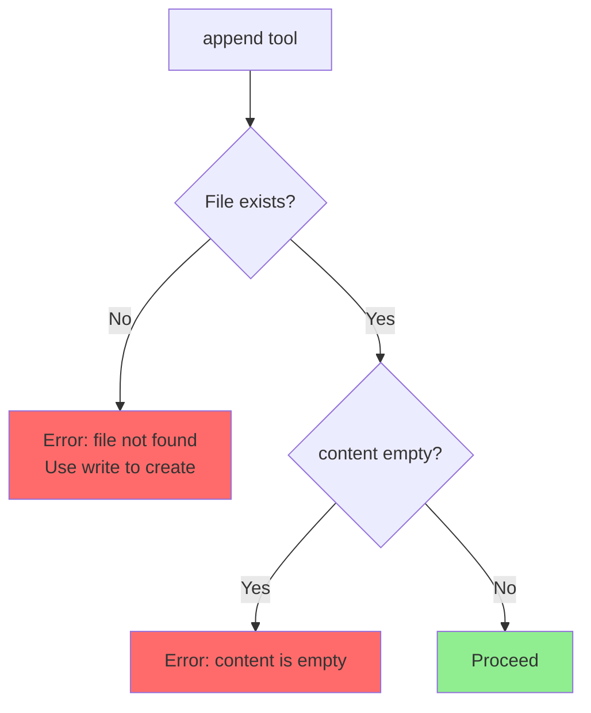
```mermaid
flowchart TB
    Start[append tool] --> Check1{File exists?}
    Check1 -->|No| Err1[Error: file not found<br/>Use write to create]
    
    Check1 -->|Yes| Check2{content empty?}
    Check2 -->|Yes| Err2[Error: content is empty]
    
    Check2 -->|No| Success[Proceed]
    
    style Err1 fill:#FF6B6B
    style Err2 fill:#FF6B6B
    style Success fill:#90EE90
```

---

## 5. delete Tool

**Purpose**: Delete files or directories (trash or permanent)

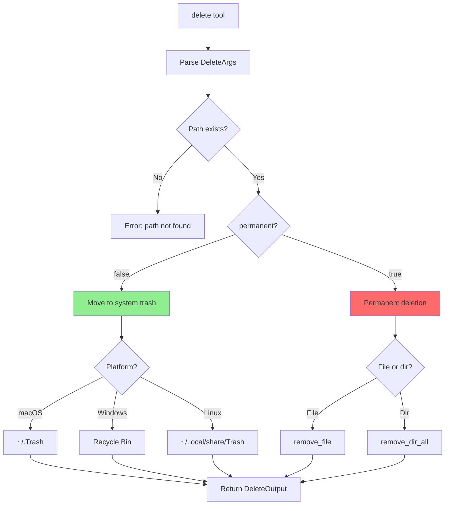
```mermaid
flowchart TB
    Start[delete tool] --> Parse[Parse DeleteArgs]
    Parse --> Check{Path exists?}
    
    Check -->|No| Error[Error: path not found]
    Check -->|Yes| Mode{permanent?}
    
    Mode -->|false| Trash[Move to system trash]
    Mode -->|true| Perm[Permanent deletion]
    
    Trash --> Platform{Platform?}
    Platform -->|macOS| Mac[~/.Trash]
    Platform -->|Windows| Win[Recycle Bin]
    Platform -->|Linux| Linux[~/.local/share/Trash]
    
    Perm --> Type{File or dir?}
    Type -->|File| RemFile[remove_file]
    Type -->|Dir| RemDir[remove_dir_all]
    
    Mac --> Success[Return DeleteOutput]
    Win --> Success
    Linux --> Success
    RemFile --> Success
    RemDir --> Success
    
    style Trash fill:#90EE90
    style Perm fill:#FF6B6B
```

---

### Input

```json
{
  "path": "/path/to/file.txt",
  "permanent": false
}
```

**Default**: `permanent = false` (safe, recoverable)

---

### Output

```json
{
  "path": "/path/to/file.txt",
  "kind": "file",
  "permanent": false,
  "message": "Moved /path/to/file.txt to trash (file)"
}
```

---

### Deletion Modes

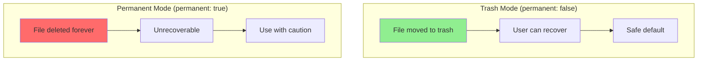
```mermaid
graph TB
    subgraph "Trash Mode (permanent: false)"
        A1[File moved to trash] --> A2[User can recover]
        A2 --> A3[Safe default]
    end
    
    subgraph "Permanent Mode (permanent: true)"
        B1[File deleted forever] --> B2[Unrecoverable]
        B2 --> B3[Use with caution]
    end
    
    style A1 fill:#90EE90
    style B1 fill:#FF6B6B
```

---

### Safety Guidance

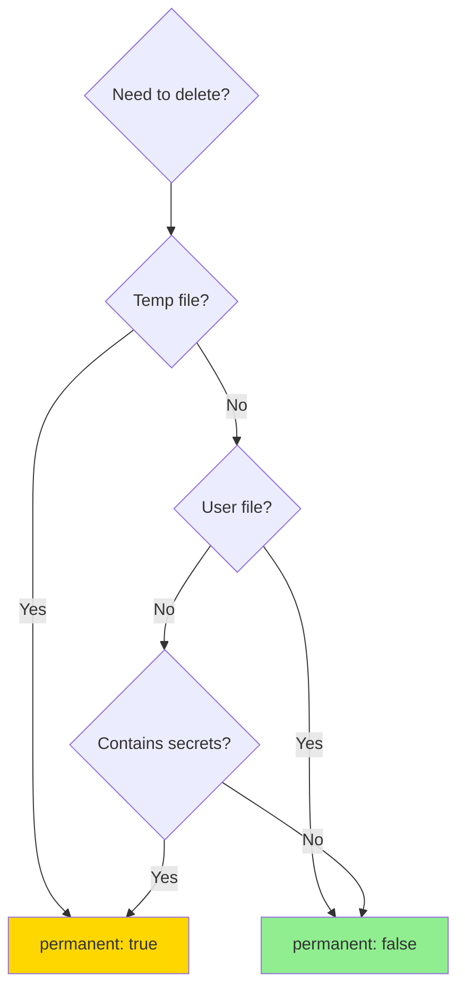
```mermaid
flowchart TB
    Question{Need to delete?} --> Temp{Temp file?}
    
    Temp -->|Yes| Perm[permanent: true]
    Temp -->|No| User{User file?}
    
    User -->|Yes| Trash[permanent: false]
    User -->|No| Sensitive{Contains secrets?}
    
    Sensitive -->|Yes| Perm
    Sensitive -->|No| Trash
    
    style Trash fill:#90EE90
    style Perm fill:#FFD700
```

**Rule**: Prefer `permanent: false` unless you have a specific reason.

---

## 6. grep Tool

**Purpose**: Recursive regex search with gitignore awareness

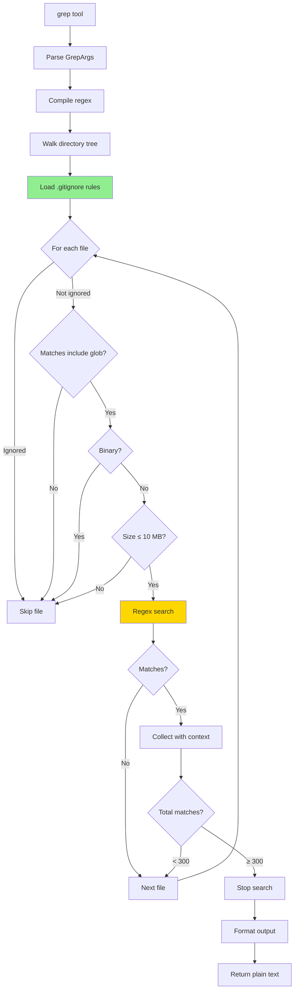
```mermaid
flowchart TB
    Start[grep tool] --> Parse[Parse GrepArgs]
    Parse --> Compile[Compile regex]
    Compile --> Walk[Walk directory tree]
    
    Walk --> Gitignore[Load .gitignore rules]
    Gitignore --> Filter{For each file}
    
    Filter -->|Ignored| Skip[Skip file]
    Filter -->|Not ignored| Include{Matches include glob?}
    
    Include -->|No| Skip
    Include -->|Yes| Binary{Binary?}
    
    Binary -->|Yes| Skip
    Binary -->|No| Size{Size ≤ 10 MB?}
    
    Size -->|No| Skip
    Size -->|Yes| Search[Regex search]
    
    Search --> Matches{Matches?}
    Matches -->|Yes| Collect[Collect with context]
    Matches -->|No| Continue
    
    Collect --> Limit{Total matches?}
    Limit -->|< 300| Continue[Next file]
    Limit -->|≥ 300| Stop[Stop search]
    
    Continue --> Filter
    Stop --> Format[Format output]
    Format --> Return[Return plain text]
    
    style Gitignore fill:#90EE90
    style Search fill:#FFD700
```

---

### Input

```json
{
  "pattern": "fn main",
  "path": "src",
  "include": "*.rs",
  "case_insensitive": false,
  "context_lines": 2
}
```

**Or multiple paths**:
```json
{
  "pattern": "TODO",
  "paths": ["src", "tests"]
}
```

---

### Output Format

```
=== src/main.rs (2 matches) ===
8:
9:
10: fn main() {
11:     println!("Hello");
12: }
---
45: fn run_tests() {
46:     let main = Main::new();
47: }
48:

Showing 2 match(es) across 1 file(s)
```

**Context**: 2 lines before + 2 lines after (default)

---

### Gitignore Integration

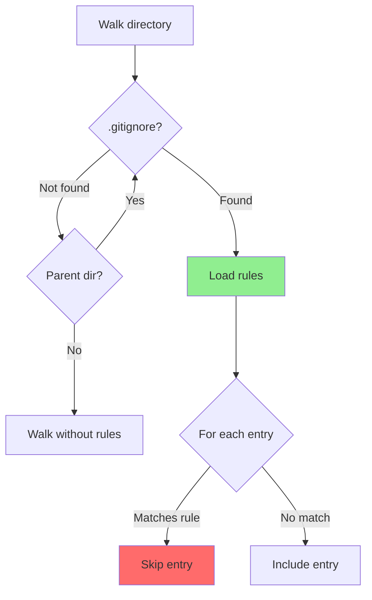
```mermaid
flowchart TB
    Start[Walk directory] --> Check{.gitignore?}
    
    Check -->|Found| Load[Load rules]
    Check -->|Not found| Parent{Parent dir?}
    
    Parent -->|Yes| Check
    Parent -->|No| Walk[Walk without rules]
    
    Load --> Test{For each entry}
    Test -->|Matches rule| Ignore[Skip entry]
    Test -->|No match| Include[Include entry]
    
    style Load fill:#90EE90
    style Ignore fill:#FF6B6B
```

**Rules Respected**:
- `node_modules/` — directory exclusion
- `*.log` — pattern exclusion
- `!important.log` — negation patterns

---

### Limits & Performance

| Limit | Value | Rationale |
|-------|-------|-----------|
| **Max matches** | 300 | Prevent context overflow |
| **Max file size** | 10 MB | Skip large binaries/generated files |
| **Context lines** | Configurable (default 2) | Balance context vs output size |

---

## 7. ls Tool

**Purpose**: Single-level directory listing

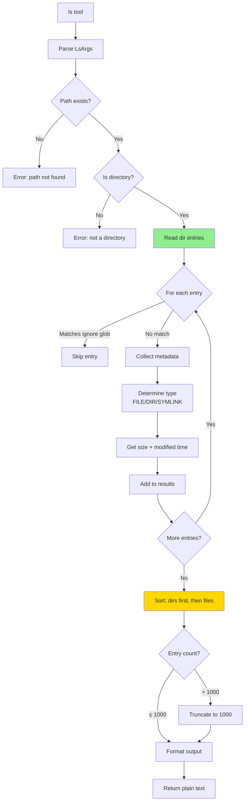
```mermaid
flowchart TB
    Start[ls tool] --> Parse[Parse LsArgs]
    Parse --> Check{Path exists?}
    
    Check -->|No| Error[Error: path not found]
    Check -->|Yes| IsDir{Is directory?}
    
    IsDir -->|No| Error2[Error: not a directory]
    IsDir -->|Yes| Read[Read dir entries]
    
    Read --> Filter{For each entry}
    
    Filter -->|Matches ignore glob| Skip[Skip entry]
    Filter -->|No match| Meta[Collect metadata]
    
    Meta --> Type[Determine type<br/>FILE/DIR/SYMLINK]
    Type --> Size[Get size + modified time]
    Size --> Add[Add to results]
    
    Add --> More{More entries?}
    More -->|Yes| Filter
    More -->|No| Sort[Sort: dirs first, then files]
    
    Sort --> Limit{Entry count?}
    Limit -->|≤ 1000| Format[Format output]
    Limit -->|> 1000| Trunc[Truncate to 1000]
    
    Format --> Return[Return plain text]
    Trunc --> Format
    
    style Read fill:#90EE90
    style Sort fill:#FFD700
```

---

### Input

```json
{
  "path": "src",
  "ignore": ["*.lock", "node_modules", ".git"]
}
```

---

### Output Format

```
=== src (3 items) ===
[DIR]  utils/
[FILE] main.rs (1.2 KB, modified 2024-01-15 10:30)
[FILE] lib.rs (450 B, modified 2024-01-15 09:15)
```

**Entry Types**:
- `[DIR]` — Directory
- `[FILE]` — Regular file
- `[SYMLINK]` — Symbolic link

---

### Sort Order

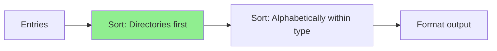
```mermaid
flowchart LR
    A[Entries] --> B[Sort: Directories first]
    B --> C[Sort: Alphabetically within type]
    C --> D[Format output]
    
    style B fill:#90EE90
```

**Example**:
```
[DIR]  aaa/
[DIR]  zzz/
[FILE] aaa.txt
[FILE] zzz.txt
```

---

### Metadata Collection

```mermaid
flowchart TB
    Start[Get entry] --> Type[fs::metadata]
    Type --> Check1{is_dir?}
    
    Check1 -->|Yes| Dir[Type: DIR]
    Check1 -->|No| Check2{is_symlink?}
    
    Check2 -->|Yes| Sym[Type: SYMLINK]
    Check2 -->|No| File[Type: FILE]
    
    Dir --> NoSize[Size: N/A]
    Sym --> NoSize
    File --> GetSize[Size: bytes]
    
    NoSize --> Modified[Get modified time]
    GetSize --> Modified
    
    Modified --> Format[Format entry]
    
    style Type fill:#90EE90
```

---

## Cross-Tool Patterns

### Read → Edit → Write Workflow

```mermaid
sequenceDiagram
    participant Model as Model
    participant Read as read tool
    participant Edit as edit tool
    participant Write as write tool
    
    Model->>Read: Read file:1-50
    Read-->>Model: Content
    Model->>Model: Decide changes
    
    alt Small change
        Model->>Edit: Apply hunk
        Edit-->>Model: Success
    else Complete rewrite
        Model->>Write: Overwrite entire file
        Write-->>Model: Success
    end
```

---

### Grep → Read → Edit Pipeline

```mermaid
flowchart LR
    A[grep: Find pattern] --> B[Collect file:line pairs]
    B --> C[read: Fetch context]
    C --> D[Model: Plan edits]
    D --> E[edit: Apply changes]
    
    style A fill:#FFD700
    style C fill:#90EE90
    style E fill:#87CEEB
```

---

### Ls → Read Multi-File

```mermaid
sequenceDiagram
    Model->>ls: List src/
    ls-->>Model: [main.rs, lib.rs, utils.rs]
    
    Model->>read: Read all 3 files
    read-->>Model: Concatenated content
    
    Model->>Model: Analyze codebase
```

---

## Error Handling Patterns

### Per-File Success/Failure (read, grep)

```mermaid
flowchart TB
    Start[Multi-file operation] --> Batch[Process all files]
    Batch --> Collect[Collect results]
    Collect --> Format{For each file}
    
    Format -->|Success| AddSuccess[Add content]
    Format -->|Error| AddError[Add error message]
    
    AddSuccess --> Merge[Merge into output]
    AddError --> Merge
    
    Merge --> Return[Return ToolResult::success]
    
    Note right of Return: is_error = false<br/>Even with some failures
    
    style Collect fill:#90EE90
```

---

### Partial Success (edit)

```mermaid
flowchart TB
    Start[Apply hunks] --> Loop{For each hunk}
    
    Loop -->|Hunk N| Match{Match found?}
    Match -->|Yes| Apply[Apply replacement]
    Match -->|No| Record[Record failure]
    
    Apply --> Next{More hunks?}
    Record --> Next
    
    Next -->|Yes| Loop
    Next -->|No| Check{Any succeeded?}
    
    Check -->|Yes| Write[Atomic write<br/>+ report failures]
    Check -->|No| Fail[Return all failures]
    
    style Write fill:#90EE90
    style Fail fill:#FFD700
```

---

## Testing

```bash
# Run all fs tool tests
cargo test -p operon-tools-fs

# Run specific tool tests
cargo test -p operon-tools-fs-read
cargo test -p operon-tools-fs-edit
cargo test -p operon-tools-fs-grep

# Run with output
cargo test -p operon-tools-fs -- --nocapture
```

---

## Dependencies

```toml
# Facade crate
[dependencies]
operon-tools-fs-read   = { workspace = true }
operon-tools-fs-grep   = { workspace = true }
operon-tools-fs-ls     = { workspace = true }
operon-tools-fs-edit   = { workspace = true }
operon-tools-fs-write  = { workspace = true }
operon-tools-fs-append = { workspace = true }
operon-tools-fs-delete = { workspace = true }
```

---

## Design Rationale

### Why Inline Ranges in read?

```mermaid
graph TB
    A[Inline ranges] --> B[Single parameter]
    A --> C[Batch-friendly]
    A --> D[Copy-paste from UI]
    
    E[Separate range params] --> F[Multiple parameters]
    E --> G[Verbose for batches]
    E --> H[Error-prone]
    
    style A fill:#90EE90
    style E fill:#FF6B6B
```

**Example**:
```json
// ✅ Inline (clean)
{"paths": ["a.rs:10-20", "b.rs:30-40"]}

// ❌ Separate (verbose)
{
  "paths": ["a.rs", "b.rs"],
  "ranges": [{"start": 10, "end": 20}, {"start": 30, "end": 40}]
}
```

---

### Why Fuzzy Matching in edit?

```mermaid
flowchart LR
    A[Model outputs old_string] --> B{Whitespace matches?}
    
    B -->|Exact| C[✅ Pass 1: Success]
    B -->|Trailing space off| D[✅ Pass 2: Rstrip]
    B -->|Leading space off| E[✅ Pass 3: Trim]
    B -->|Fancy quotes| F[✅ Pass 4: Unicode]
    B -->|Case differs| G[✅ Pass 5: Case insensitive]
    
    style C fill:#90EE90
    style D fill:#90EE90
    style E fill:#90EE90
    style F fill:#90EE90
    style G fill:#90EE90
```

**Problem**: Models often produce slightly mismatched whitespace or Unicode characters.

**Solution**: 6-pass fuzzy seeking increases success rate without ambiguity.

---

### Why Trash by Default in delete?

```mermaid
graph TB
    A[User calls delete] --> B{Default mode?}
    
    B -->|Trash| C[✅ Recoverable]
    B -->|Permanent| D[❌ Irreversible]
    
    C --> E[User can recover from trash]
    D --> F[Data lost forever]
    
    style C fill:#90EE90
    style D fill:#FF6B6B
```

**Rationale**: Mistakes happen. Trash mode prevents accidental data loss.

---

### Why 300 Match Limit in grep?

```mermaid
flowchart LR
    A[No limit] --> B[❌ Context overflow]
    B --> C[Model loses context]
    
    D[300 limit] --> E[✅ Reasonable coverage]
    E --> F[Model stays focused]
    
    style A fill:#FF6B6B
    style D fill:#90EE90
```

**Workaround**: Use more specific patterns or `include` glob to narrow scope.

---

## License

Operon is licensed under the **GNU Affero General Public License v3.0 (AGPLv3)**.

---

> Built by **Luka Gray (aka Soumo Mukherjee)** • West Bengal, India • 2026
