# operon-tools-memory

**Global persistent memory system — SQLite-backed agent memory that survives restarts**

`operon-tools-memory` provides a complete memory subsystem for the Operon agent: **5 tools** (add, edit, delete, retrieve, search) backed by a **global SQLite store** with **FTS5 full-text search**.

Unlike session-scoped todos, memories persist **indefinitely across all sessions** until explicitly deleted.

---

## Overview

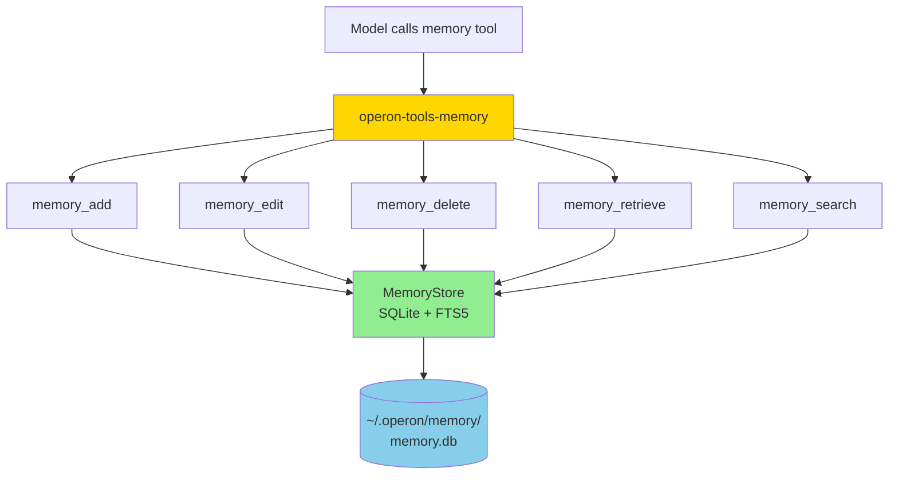

---

## Key Features

- ✅ **5 CRUD + Search tools** — add, edit, delete, retrieve, search
- ✅ **Global persistence** — survives restarts, not session-scoped
- ✅ **FTS5 full-text search** — BM25 relevance ranking
- ✅ **Auto-sync triggers** — FTS index stays in sync with inserts/updates/deletes
- ✅ **Tag support** — categorize memories with string tags
- ✅ **SQLite WAL mode** — concurrent read/write without blocking
- ✅ **Clone-safe store** — `MemoryStore` wraps `sqlx::SqlitePool` (internally Arc)

---

## Architecture

### Crate Dependency Graph

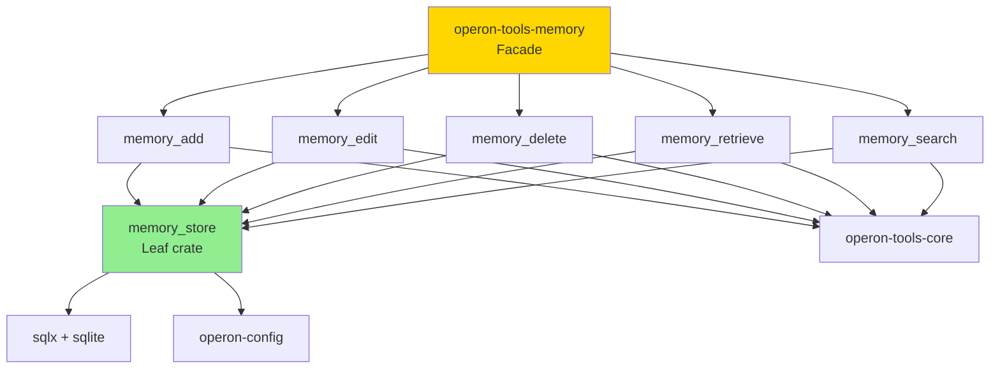

**Leaf Crate**: `operon-tools-memory-store` is the **only** crate that depends on `sqlx`. All 5 tool crates depend on the store, creating a clean dependency tree with no cycles.

---

### Database Schema

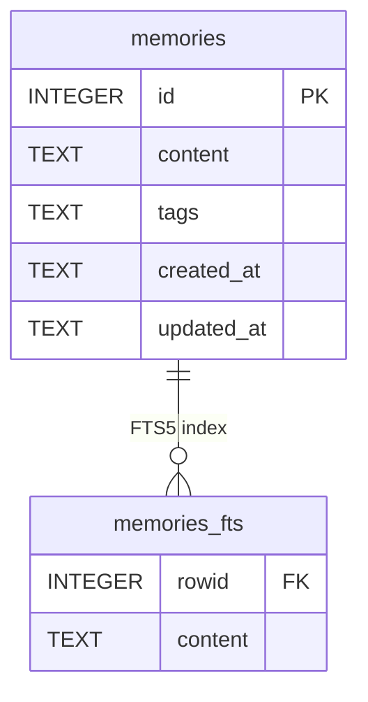

**DDL**:
```sql
CREATE TABLE memories (
    id         INTEGER PRIMARY KEY AUTOINCREMENT,
    content    TEXT    NOT NULL,
    tags       TEXT    NOT NULL DEFAULT '[]',  -- JSON array
    created_at TEXT    NOT NULL,               -- RFC3339
    updated_at TEXT    NOT NULL                -- RFC3339
);

CREATE VIRTUAL TABLE memories_fts USING fts5(
    content,
    content='memories',
    content_rowid='id'
);
```

**Triggers** (auto-sync FTS):
```sql
-- Insert trigger
CREATE TRIGGER memories_ai AFTER INSERT ON memories BEGIN
    INSERT INTO memories_fts(rowid, content) VALUES (new.id, new.content);
END;

-- Delete trigger
CREATE TRIGGER memories_ad AFTER DELETE ON memories BEGIN
    INSERT INTO memories_fts(memories_fts, rowid, content) 
    VALUES ('delete', old.id, old.content);
END;

-- Update trigger
CREATE TRIGGER memories_au AFTER UPDATE ON memories BEGIN
    INSERT INTO memories_fts(memories_fts, rowid, content) 
    VALUES ('delete', old.id, old.content);
    INSERT INTO memories_fts(rowid, content) VALUES (new.id, new.content);
END;
```

---

## Core Types

### Memory

```rust
#[derive(Debug, Clone, Serialize, Deserialize)]
pub struct Memory {
    pub id: String,              // "1", "2", etc. (i64 → String)
    pub content: String,          // The fact/preference/note
    pub tags: Vec<String>,        // ["preference", "workflow"]
    pub created_at: String,       // RFC3339: "2024-01-15T10:30:00+00:00"
    pub updated_at: String,       // RFC3339: "2024-01-15T10:30:00+00:00"
}
```

---

### MemoryStore

```rust
#[derive(Clone)]
pub struct MemoryStore {
    pool: SqlitePool,  // Internally Arc — Clone is O(1)
}

impl MemoryStore {
    pub async fn connect(db_path: &Path) -> Result<Self, MemoryStoreError>;
    pub async fn connect_default() -> Result<Self, MemoryStoreError>;
    
    // Write operations
    pub async fn add(&self, content: String, tags: Vec<String>) 
        -> Result<Memory, MemoryStoreError>;
    pub async fn edit(&self, id: &str, content: Option<String>, tags: Option<Vec<String>>) 
        -> Result<Option<Memory>, MemoryStoreError>;
    pub async fn delete(&self, id: &str) 
        -> Result<bool, MemoryStoreError>;
    
    // Read operations
    pub async fn get(&self, id: &str) 
        -> Result<Option<Memory>, MemoryStoreError>;
    pub async fn list(&self, limit: usize, offset: usize) 
        -> Result<Vec<Memory>, MemoryStoreError>;
    pub async fn count(&self) 
        -> Result<i64, MemoryStoreError>;
    pub async fn search(&self, query: &str, limit: usize) 
        -> Result<Vec<Memory>, MemoryStoreError>;
}
```

---

### MemoryStoreError

```rust
#[derive(Debug, Error)]
pub enum MemoryStoreError {
    #[error("database error: {0}")]
    Database(#[from] sqlx::Error),
    
    #[error("failed to create memory directory: {0}")]
    Io(#[from] std::io::Error),
    
    #[error("failed to resolve default memory path: {0}")]
    Config(#[from] operon_config::ConfigError),
}
```

---

## Tool Catalog

### 1. memory_add

**Purpose**: Store a new persistent memory

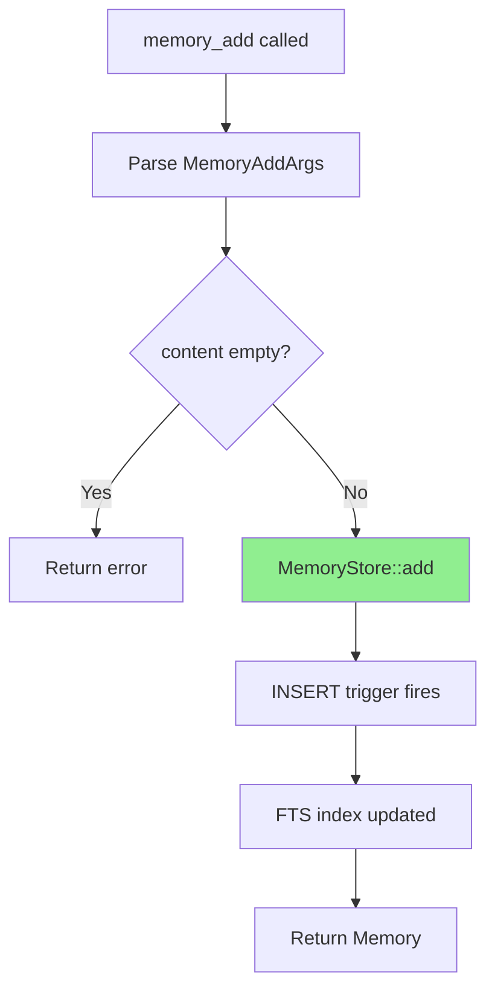

**Input**:
```json
{
  "content": "User prefers dark mode",
  "tags": ["preference"]
}
```

**Output**:
```json
{
  "memory": {
    "id": "1",
    "content": "User prefers dark mode",
    "tags": ["preference"],
    "created_at": "2024-01-15T10:30:00+00:00",
    "updated_at": "2024-01-15T10:30:00+00:00"
  },
  "total": 1
}
```

**Aliases**: `content` = `note`, `fact`, `text`, `memory`, `info`; `tags` = `tag`

---

### 2. memory_edit

**Purpose**: Partially update an existing memory

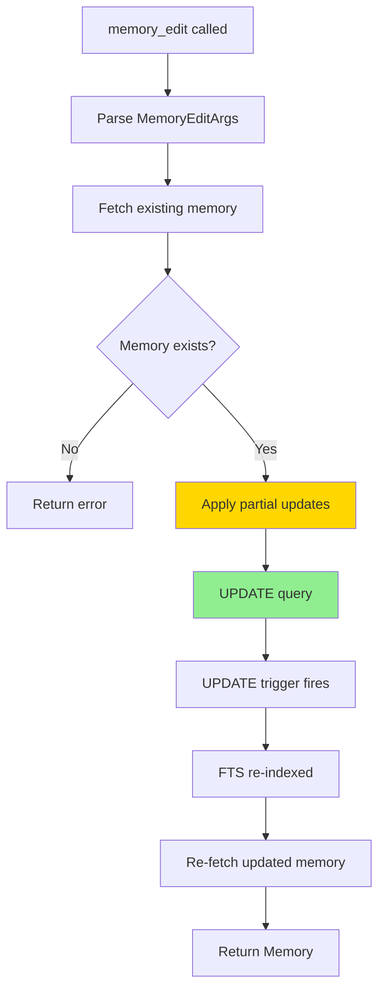

**Input** (partial update):
```json
{
  "id": "1",
  "content": "User strongly prefers dark mode"
}
```

**Output**:
```json
{
  "memory": {
    "id": "1",
    "content": "User strongly prefers dark mode",
    "tags": ["preference"],  // Unchanged
    "created_at": "2024-01-15T10:30:00+00:00",  // Unchanged
    "updated_at": "2024-01-15T11:00:00+00:00"   // Updated!
  }
}
```

**Validation**:
- At least one of `content` or `tags` must be provided
- `content` cannot be empty string

---

### 3. memory_delete

**Purpose**: Permanently remove a memory

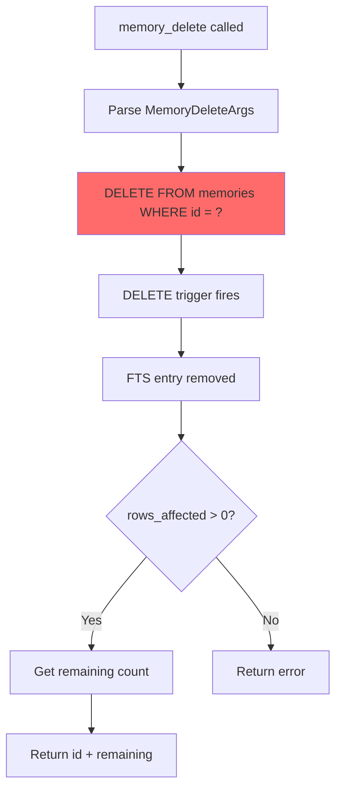

**Input**:
```json
{
  "id": "1"
}
```

**Output**:
```json
{
  "id": "1",
  "remaining": 4
}
```

**Note**: This is **irreversible** — the memory is permanently deleted from SQLite.

---

### 4. memory_retrieve

**Purpose**: Fetch one memory by ID, or list all with pagination

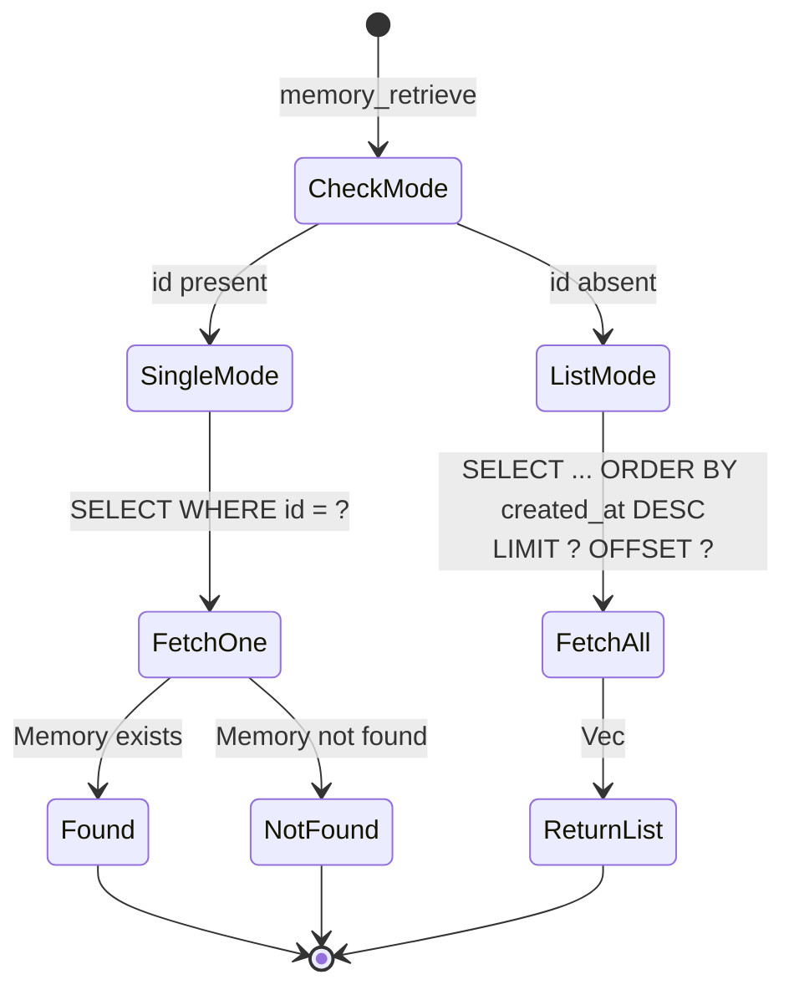

**Single-record mode**:
```json
{
  "id": "1"
}
```

**Output**:
```json
{
  "memories": [{
    "id": "1",
    "content": "User prefers dark mode",
    "tags": ["preference"],
    "created_at": "...",
    "updated_at": "..."
  }],
  "total": 12,
  "limit": 1,
  "offset": 0
}
```

**List mode**:
```json
{
  "limit": 10,
  "offset": 0
}
```

**Output**:
```json
{
  "memories": [...],  // 10 most recent
  "total": 42,
  "limit": 10,
  "offset": 0
}
```

---

### 5. memory_search

**Purpose**: Full-text search with FTS5 BM25 ranking

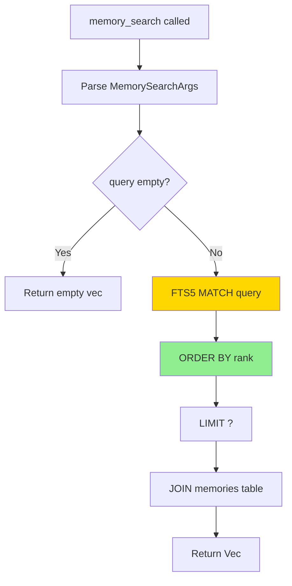

**Input**:
```json
{
  "query": "dark mode",
  "limit": 10
}
```

**Output**:
```json
{
  "memories": [
    {
      "id": "1",
      "content": "User prefers dark mode",
      "tags": ["preference"],
      "created_at": "...",
      "updated_at": "..."
    },
    {
      "id": "7",
      "content": "Always use dark mode in IDE",
      "tags": ["workflow"],
      "created_at": "...",
      "updated_at": "..."
    }
  ],
  "count": 2,
  "query": "dark mode"
}
```

**FTS5 Syntax Support**:
```json
{"query": "Rust"}                   // Single term
{"query": "Rust AND programming"}   // AND (implicit: "Rust programming")
{"query": "Rust OR Go"}             // OR
{"query": "\"dark mode\""}          // Exact phrase
```

**Relevance Ranking**: BM25 algorithm, ascending `rank` = most relevant first

---

## Store Initialization

### Default Path

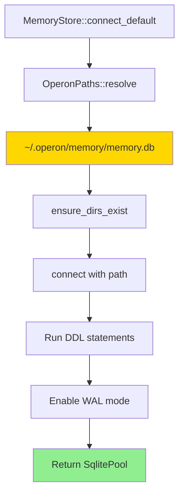

**Platform Paths**:
| Platform | Path |
|----------|------|
| **Linux** | `~/.operon/memory/memory.db` |
| **macOS** | `~/.operon/memory/memory.db` |
| **Windows** | `C:\Users\<user>\.operon\memory\memory.db` |

---

### Custom Path (Testing)

```rust
use operon_tools_memory_store::MemoryStore;
use tempfile::tempdir;

#[tokio::test]
async fn test_memory_add() {
    let temp = tempdir().unwrap();
    let db_path = temp.path().join("test.db");
    
    let store = MemoryStore::connect(&db_path).await.unwrap();
    
    let memory = store.add(
        "Test memory".to_string(),
        vec!["test".to_string()]
    ).await.unwrap();
    
    assert_eq!(memory.id, "1");
}
```

---

## SQLite Configuration

### Connection Options

```rust
SqliteConnectOptions::new()
    .filename(db_path)              // Uses Path directly (no URI issues on Windows)
    .create_if_missing(true)        // Auto-create if first run
    .journal_mode(SqliteJournalMode::Wal)  // Write-Ahead Log for concurrency
```

### WAL Mode Benefits

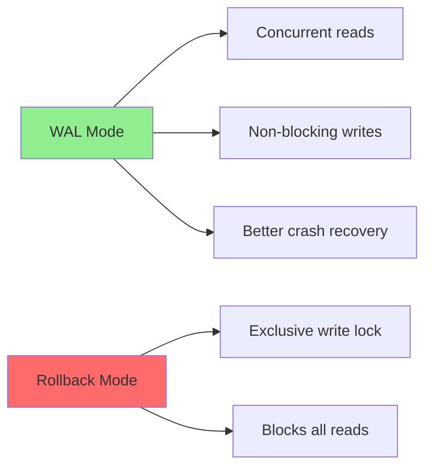

---

## FTS5 Implementation

### Trigger Synchronization

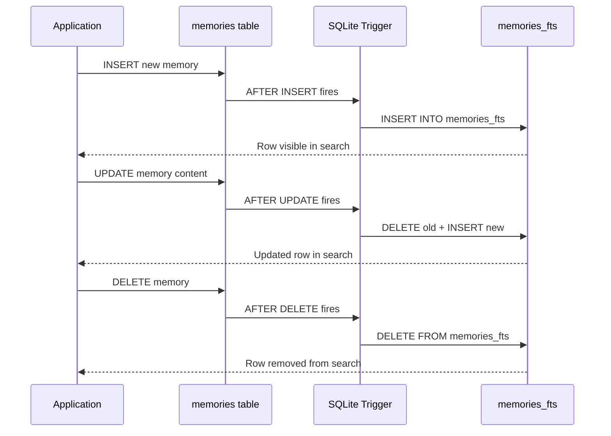

**Guarantee**: FTS index is **always in sync** — no manual rebuild needed.

---

### Search Query Flow

```sql
-- User query: "dark mode"
SELECT m.id, m.content, m.tags, m.created_at, m.updated_at
FROM memories m
INNER JOIN memories_fts ON memories_fts.rowid = m.id
WHERE memories_fts MATCH 'dark mode'
ORDER BY rank
LIMIT 10;
```

**FTS5 Magic**:
- `MATCH` clause uses BM25 tokenization
- `rank` pseudo-column provides relevance score
- Ascending `rank` = most relevant first (lower rank = better match)

---

## Tag Storage (JSON Text)

### Why JSON Text?

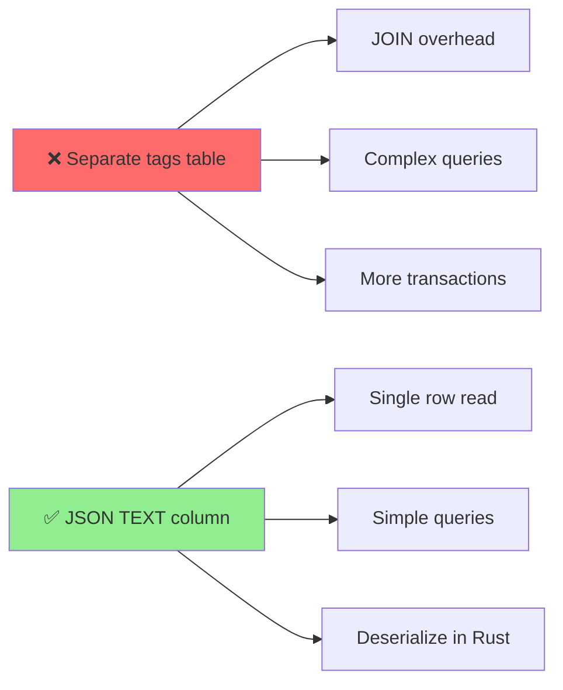

**Implementation**:
```rust
// Serialize on insert
let tags_json = serde_json::to_string(&tags)?;  // '["pref","workflow"]'
sqlx::query("INSERT INTO memories (tags, ...) VALUES (?, ...)")
    .bind(&tags_json)
    .execute(&pool).await?;

// Deserialize on read
let tags: Vec<String> = serde_json::from_str(&row.tags)?;
```

---

## Concurrency Model

### Clone-Safe Store

```rust
#[derive(Clone)]
pub struct MemoryStore {
    pool: SqlitePool,  // Arc<PoolInner> internally
}
```

**Clone Cost**: O(1) — just increments Arc refcount

**Thread Safety**:
```rust
// All methods take &self, not &mut self
pub async fn add(&self, ...) -> Result<Memory, ...>
pub async fn search(&self, ...) -> Result<Vec<Memory>, ...>
```

**Pool Handles Concurrency**:
- Max 4 connections by default
- Automatic connection reuse
- Transparent locking (no `Mutex` in app code)

---

### Concurrent Access Example

```rust
use operon_tools_memory_store::MemoryStore;

#[tokio::main]
async fn main() {
    let store = MemoryStore::connect_default().await.unwrap();
    
    // Clone is cheap — just an Arc refcount bump
    let store1 = store.clone();
    let store2 = store.clone();
    
    // Concurrent reads/writes across tasks
    let task1 = tokio::spawn(async move {
        store1.add("Memory 1".to_string(), vec![]).await
    });
    
    let task2 = tokio::spawn(async move {
        store2.search("query", 10).await
    });
    
    let (mem1, results) = tokio::join!(task1, task2);
}
```

---

## Error Handling

### Store-Level Errors

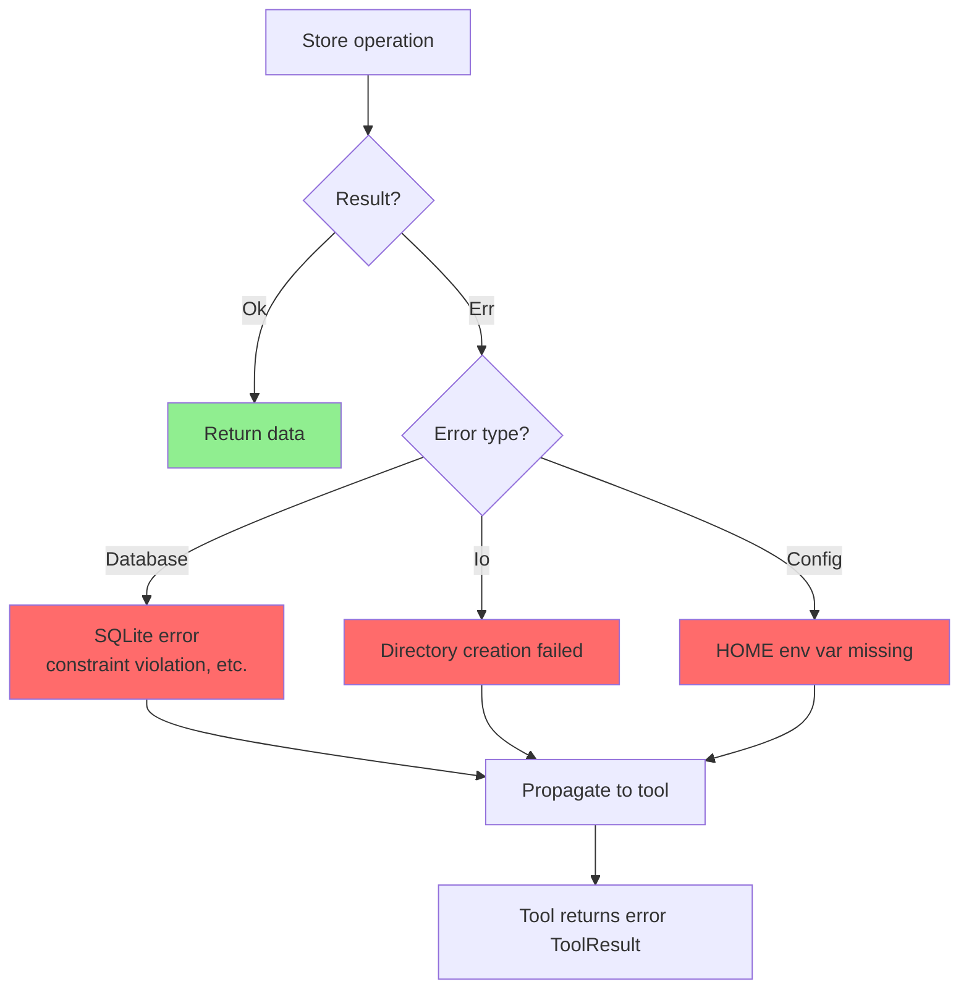

---

### Tool-Level Error Handling

Each tool wraps store errors into domain-specific error types:

```rust
// memory_add
pub enum MemoryAddToolError {
    ArgsParse(#[from] serde_json::Error),
    // Store errors become in-band ToolResult errors
}

// memory_edit
pub enum MemoryEditToolError {
    ArgsParse(#[from] serde_json::Error),
    // Store errors become in-band ToolResult errors
}
```

**Pattern**: Store errors are converted to `ToolResult::error` (not propagated as `Err`)

---

## Usage Examples

### Adding Memories

```rust
use operon_tools_memory_store::MemoryStore;

let store = MemoryStore::connect_default().await?;

// Add a preference
let pref = store.add(
    "User prefers dark mode".to_string(),
    vec!["preference".to_string()]
).await?;

// Add a fact with multiple tags
let fact = store.add(
    "This project uses AGPL-3.0".to_string(),
    vec!["project".to_string(), "license".to_string()]
).await?;
```

---

### Searching Memories

```rust
// Find all memories mentioning "dark mode"
let results = store.search("dark mode", 10).await?;

for memory in results {
    println!("[{}] {}", memory.id, memory.content);
    println!("  Tags: {:?}", memory.tags);
}
```

---

### Partial Updates

```rust
// Update only content
store.edit("1", Some("Updated content".to_string()), None).await?;

// Update only tags
store.edit("1", None, Some(vec!["new_tag".to_string()])).await?;

// Update both
store.edit(
    "1",
    Some("New content".to_string()),
    Some(vec!["tag1".to_string(), "tag2".to_string()])
).await?;
```

---

### Pagination

```rust
// Page 1: items 0-19
let page1 = store.list(20, 0).await?;

// Page 2: items 20-39
let page2 = store.list(20, 20).await?;

// Total count for UI pagination
let total = store.count().await?;
```

---

## Testing

```bash
# Run all memory tool tests
cargo test -p operon-tools-memory

# Run store tests only
cargo test -p operon-tools-memory-store

# Run specific tool tests
cargo test -p operon-tools-memory-add
cargo test -p operon-tools-memory-search
```

---

## Migration from Session-Scoped Todos

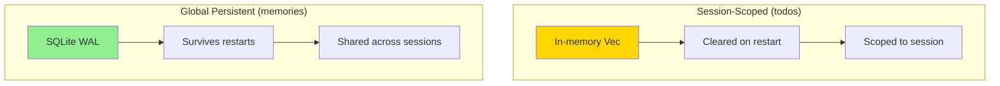

| Aspect | Todos | Memories |
|--------|-------|----------|
| **Scope** | Session | Global |
| **Persistence** | In-memory | SQLite |
| **Lifetime** | Until session ends | Indefinite |
| **Search** | Linear scan | FTS5 indexed |
| **Use Case** | Task tracking | Facts, preferences |

---

## Dependencies

```toml
# Facade crate
[dependencies]
operon-tools-memory-add        = { workspace = true }
operon-tools-memory-edit       = { workspace = true }
operon-tools-memory-delete     = { workspace = true }
operon-tools-memory-retrieve   = { workspace = true }
operon-tools-memory-search     = { workspace = true }
operon-tools-core              = { workspace = true }
serde                          = { workspace = true }
serde_json                     = { workspace = true }
tokio                          = { workspace = true }
operon-context-normalize-tools = { workspace = true }
```

```toml
# Store crate (leaf)
[dependencies]
thiserror     = { workspace = true }
serde         = { workspace = true }
serde_json    = { workspace = true }
tokio         = { workspace = true }
chrono        = { workspace = true }
operon-config = { workspace = true }
sqlx          = { workspace = true, features = ["sqlite", "runtime-tokio", "macros"] }
```

---

## Design Rationale

### Why SQLite Over JSON Files?

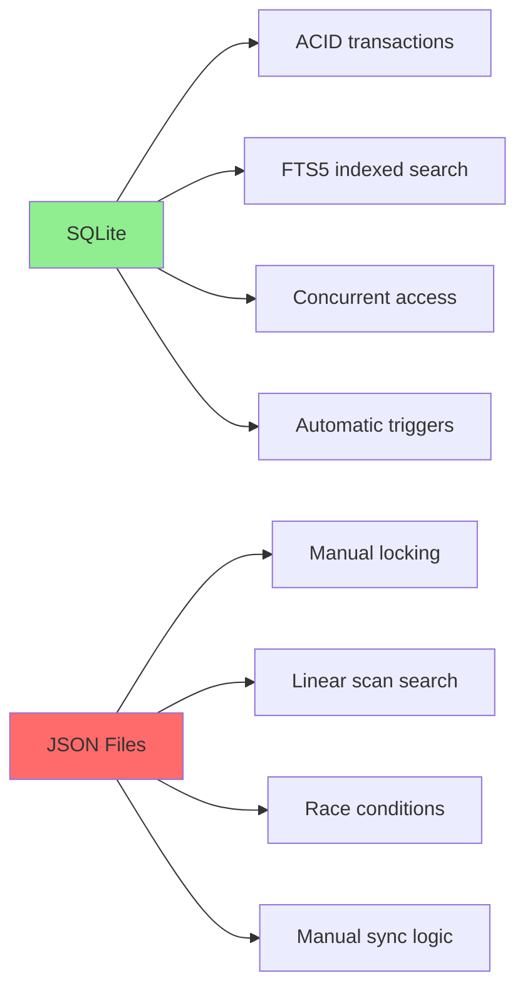

---

### Why FTS5 Over LIKE Queries?

```sql
-- LIKE query (slow)
SELECT * FROM memories WHERE content LIKE '%dark mode%';

-- FTS5 query (fast)
SELECT * FROM memories m
INNER JOIN memories_fts ON memories_fts.rowid = m.id
WHERE memories_fts MATCH 'dark mode'
ORDER BY rank;
```

**FTS5 Advantages**:
- Tokenized indexing (handles word boundaries correctly)
- BM25 relevance ranking
- Phrase matching, Boolean operators
- Sub-millisecond search even with thousands of memories

---

### Why No Separate Tags Table?

**Option A** (Rejected):
```sql
CREATE TABLE memories (...);
CREATE TABLE tags (id, name);
CREATE TABLE memory_tags (memory_id, tag_id);
```

**Complexity**: 3 tables, JOINs, cascading deletes

**Option B** (Chosen):
```sql
CREATE TABLE memories (..., tags TEXT);  -- JSON array
```

**Simplicity**: Single table, no JOINs, deserialize in Rust

---

## License

Operon is licensed under the **GNU Affero General Public License v3.0 (AGPLv3)**.

---

> Built by **Luka Gray (aka Soumo Mukherjee)** • West Bengal, India • 2026
