# operon-tools-shell

**Shell command execution — stateless subprocess execution with explicit working directory**

`operon-tools-shell` provides the `bash` tool for executing shell commands in isolated, stateless subprocesses. Each call is independent — no state persists between invocations.

---

## Overview

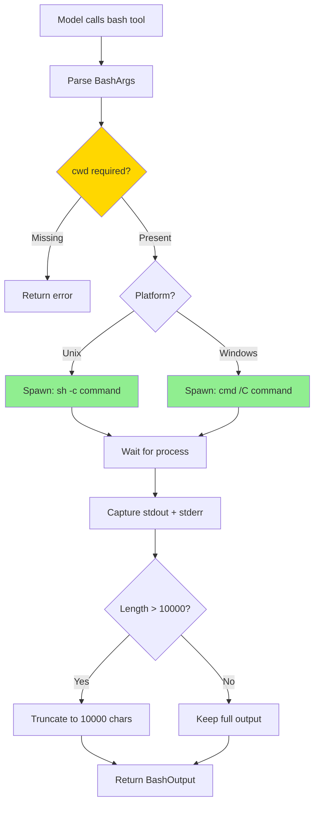

---

## Key Features

- ✅ **Stateless execution** — each call spawns a fresh subprocess
- ✅ **Required cwd** — explicit working directory for policy enforcement
- ✅ **Merged output** — stdout + stderr combined
- ✅ **Output truncation** — capped at 10,000 characters
- ✅ **Exit codes** — 0 = success, non-zero = failure, -1 = timeout
- ✅ **Optional timeout** — kill long-running commands
- ✅ **Cross-platform** — `sh -c` on Unix, `cmd /C` on Windows

---

## Architecture

### Tool Structure

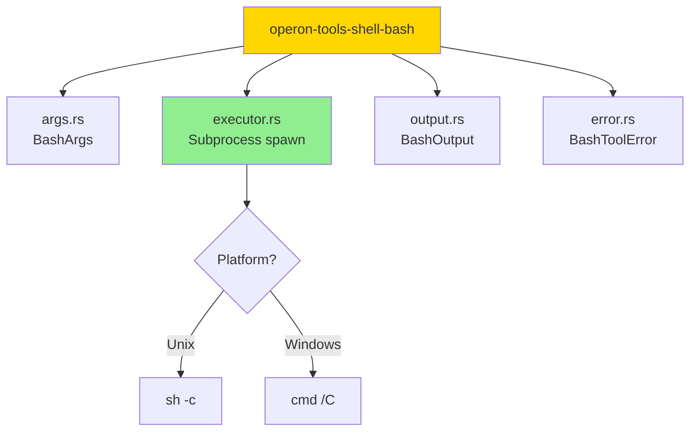

---

### BashArgs

```rust
#[derive(Debug, Deserialize)]
pub struct BashArgs {
    /// Shell command to execute
    pub command: String,
    
    /// Working directory (REQUIRED)
    /// Must be absolute path within allowed directory
    pub cwd: String,
    
    /// Optional timeout in milliseconds
    pub timeout_ms: Option<u64>,
}
```

**Why cwd is Required**: Policy enforcement anchor. Without explicit `cwd`, an external user could trigger shell execution without directory-scoped permission checks.

---

### BashOutput

```rust
#[derive(Debug, Serialize, Deserialize)]
pub struct BashOutput {
    /// Merged stdout + stderr (truncated to 10,000 chars)
    pub output: String,
    
    /// Exit code: 0 = success, non-zero = failure, -1 = timeout
    pub exit_code: i32,
    
    /// The working directory used
    pub cwd: String,
    
    /// Whether output was truncated
    pub truncated: bool,
    
    /// Original byte count before truncation
    pub original_length: usize,
}
```

---

## Execution Flow

### Process Lifecycle

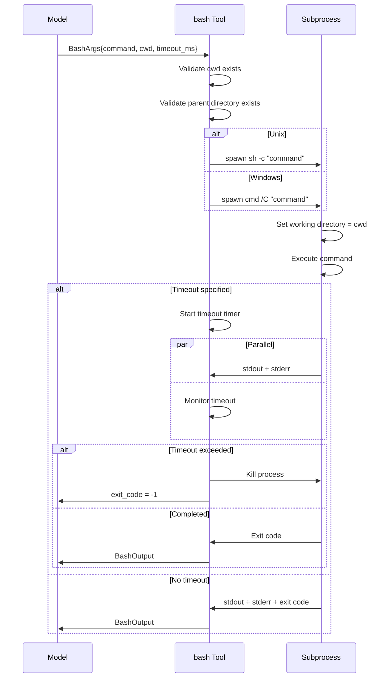

---

### Cross-Platform Command Wrapping

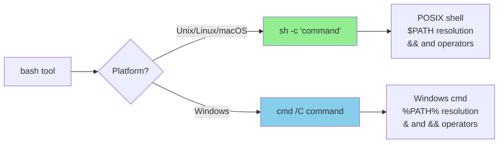

**Example**:
```rust
// User input
command = "ls -la && pwd"
cwd = "/home/user/project"

// Unix execution
sh -c 'ls -la && pwd'
// Working directory: /home/user/project

// Windows execution
cmd /C dir && cd
// Working directory: C:\Users\user\project
```

---

## Why cwd is Required

### Security Model

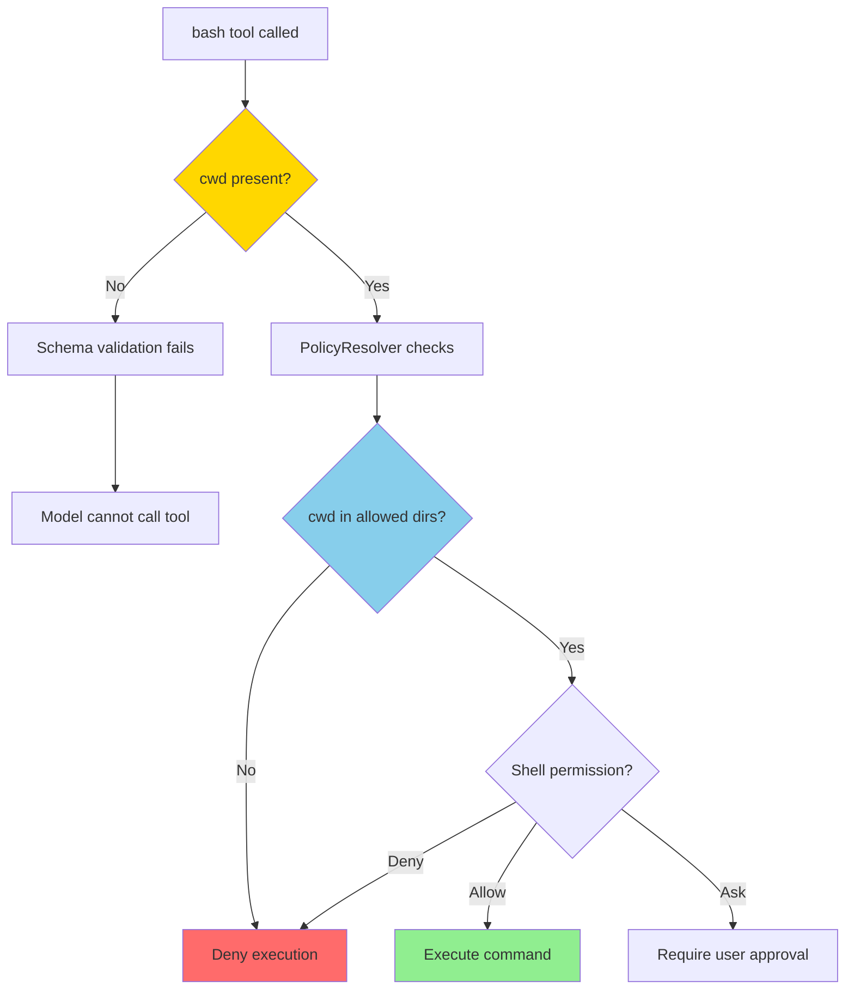

**Attack Prevention**:
```json
// ❌ Without required cwd (hypothetical)
{
  "command": "rm -rf /"
}
// No directory anchor → policy cannot check

// ✅ With required cwd
{
  "command": "rm -rf /",
  "cwd": "/tmp"
}
// Policy checks: Is /tmp allowed? Does user have shell permission there?
```

---

## Output Handling

### Truncation Strategy

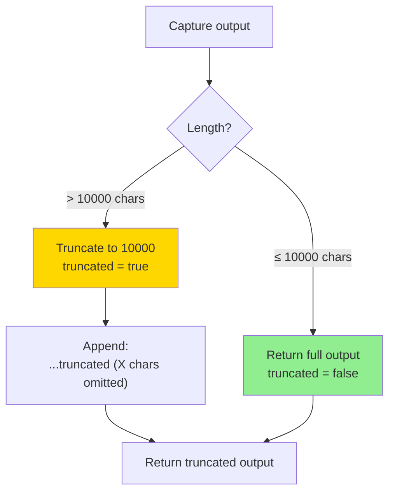

**Example Output**:
```
{
  "output": "Line 1\nLine 2\n... (truncated 50000 chars)",
  "exit_code": 0,
  "cwd": "/home/user/project",
  "truncated": true,
  "original_length": 60000
}
```

---

### Exit Code Semantics

| Exit Code | Meaning |
|-----------|---------|
| `0` | Success — command completed without errors |
| `1-255` | Failure — command returned non-zero exit code |
| `-1` | Timeout — process was killed after exceeding `timeout_ms` |

**Example**:
```rust
// Success
{"exit_code": 0, "output": "Build successful"}

// Command failed
{"exit_code": 1, "output": "error: file not found"}

// Timeout
{"exit_code": -1, "output": "(partial output before kill)"}
```

---

## Tool Definition (Tiered)

### Short Definition (Normal Conditions)

```rust
ToolDefinition {
    name: "bash",
    description: "Executes a shell command in a stateless subprocess rooted at `cwd`. \
                  Returns merged stdout+stderr (max 10,000 chars) and exit code. \
                  Each call is independent — no state persists. Chain with && or ; for sequential state. \
                  `cwd` (absolute path) and `command` required. Optionally specify `timeout_ms`.",
    parameters: { /* ... */ }
}
```

### Detailed Definition (After Malformed Call)

Includes:
- Input shapes (basic, with timeout, chained commands)
- Key behavior (stateless, cwd required, output merged)
- Common mistakes (omitting cwd, assuming persistent state)

---

## Usage Examples

### Basic Command

```json
{
  "command": "cargo check",
  "cwd": "/home/user/my-project"
}
```

**Output**:
```json
{
  "output": "    Checking my-project v0.1.0\n    Finished dev [unoptimized + debuginfo] target(s) in 2.34s",
  "exit_code": 0,
  "cwd": "/home/user/my-project",
  "truncated": false,
  "original_length": 104
}
```

---

### With Timeout

```json
{
  "command": "npm test",
  "cwd": "/home/user/my-project",
  "timeout_ms": 30000
}
```

**Scenario 1** (Completes in time):
```json
{
  "output": "PASS  src/test.js\nTest Suites: 1 passed\n",
  "exit_code": 0,
  "cwd": "/home/user/my-project",
  "truncated": false,
  "original_length": 45
}
```

**Scenario 2** (Timeout):
```json
{
  "output": "(partial output before kill)",
  "exit_code": -1,
  "cwd": "/home/user/my-project",
  "truncated": false,
  "original_length": 30
}
```

---

### Chaining Commands

```json
{
  "command": "cd src && cargo build --release",
  "cwd": "/home/user/project"
}
```

**How it Works**:
```bash
# Spawns:
sh -c 'cd src && cargo build --release'
# Working directory: /home/user/project
# The subprocess starts in /home/user/project, then cd into src
```

**Important**: The `cd` affects only the subprocess — the `cwd` field in the response still shows `/home/user/project`.

---

### Error Handling

```json
{
  "command": "ls nonexistent_file.txt",
  "cwd": "/tmp"
}
```

**Output**:
```json
{
  "output": "ls: cannot access 'nonexistent_file.txt': No such file or directory\n",
  "exit_code": 2,
  "cwd": "/tmp",
  "truncated": false,
  "original_length": 69
}
```

---

## Stateless Design

### Why No State Persists

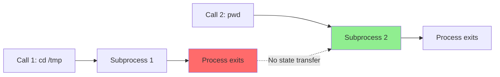

**Example**:
```rust
// Call 1
{"command": "cd /tmp", "cwd": "/home/user"}
// Output: (no output, exit_code=0)

// Call 2
{"command": "pwd", "cwd": "/home/user"}
// Output: /home/user (NOT /tmp!)
```

**Workaround**: Chain commands within a single call:
```json
{
  "command": "cd /tmp && pwd",
  "cwd": "/home/user"
}
// Output: /tmp
```

---

## Platform-Specific Behavior

### Unix (Linux, macOS)

**Shell**: `/bin/sh` (POSIX shell, typically dash or bash)

**Features**:
- `&&` operator (AND)
- `` operator (OR)
- `|` pipe
- `$VAR` environment variables
- `$(command)` command substitution

**Example**:
```bash
sh -c 'ls -la && echo "Done"'
```

---

### Windows

**Shell**: `cmd.exe` (Windows Command Prompt)

**Features**:
- `&` operator (sequential)
- `&&` operator (AND)
- `` operator (OR)
- `|` pipe
- `%VAR%` environment variables

**Example**:
```cmd
cmd /C "dir && echo Done"
```

**Note**: PowerShell syntax (e.g., `Get-ChildItem`) does **NOT** work — only cmd.exe syntax is supported.

---

## Error Handling

### BashToolError

```rust
#[derive(Debug, Error)]
pub enum BashToolError {
    /// Failed to deserialize arguments
    #[error("failed to deserialize bash arguments: {0}")]
    ArgsParse(#[from] serde_json::Error),
}
```

**When it Occurs**: Only when the JSON shape is invalid (missing `command` or `cwd`).

**All other errors** (command failures, timeouts, permission denied) are **not** `BashToolError` — they return success `ToolResult` with `exit_code != 0`.

---

### In-Band Error Reporting

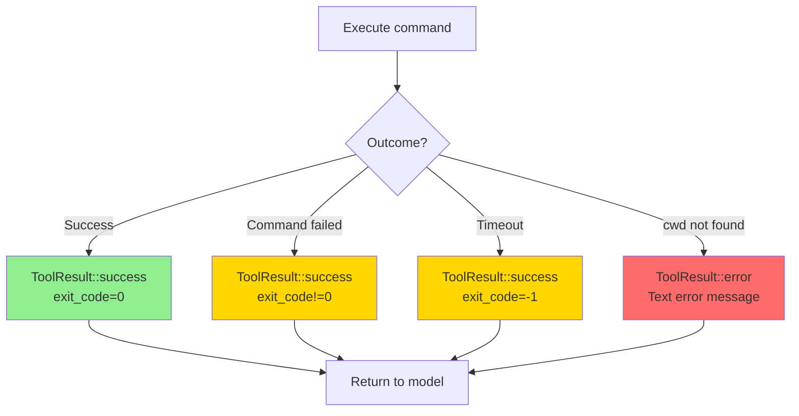

---

## Testing

```bash
# Run all shell tool tests
cargo test -p operon-tools-shell

# Run bash tool tests
cargo test -p operon-tools-shell-bash

# Run with output
cargo test -p operon-tools-shell-bash -- --nocapture
```

---

## Security Considerations

### Command Injection Prevention

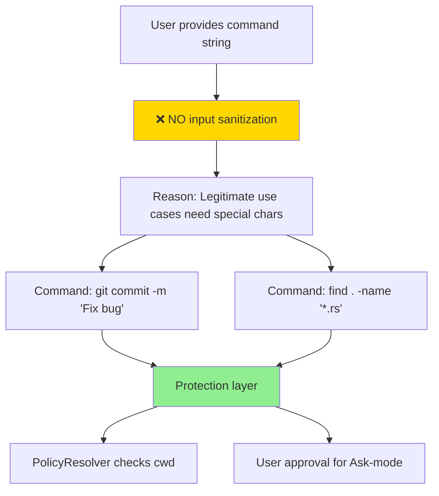

**Why No Sanitization**: The tool intentionally does **not** sanitize or escape the command string, because:
1. Legitimate commands need quotes, pipes, redirects
2. Protection happens at the **policy level**, not the tool level
3. User approval gates high-risk operations

**Protection Mechanisms**:
- PolicyResolver checks `cwd` against allowed directories
- Shell permission can be set to `Ask` (requires user approval)
- `cwd` is required (no blind execution)

---

### Directory Traversal Prevention

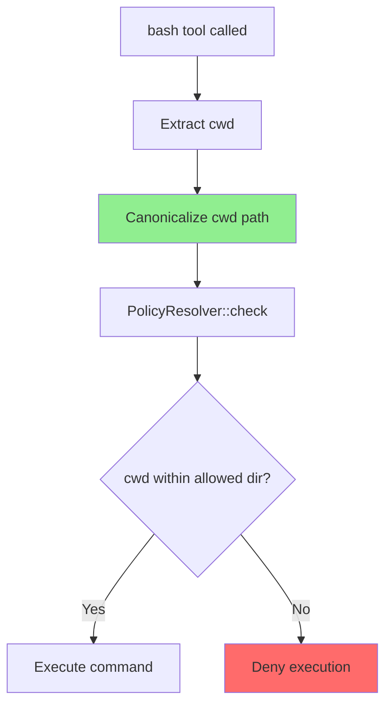

**Example**:
```json
// Attempt to escape via ..
{
  "command": "ls",
  "cwd": "/allowed/dir/../../../etc"
}

// After canonicalization: /etc
// Policy check: Is /etc allowed?
// Result: Denied (not in allowed dirs)
```

---

## Design Rationale

### Why Stateless?

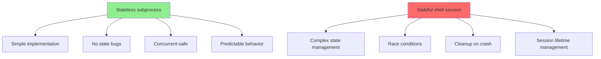

---

### Why Require cwd?

**Option A** (Rejected): Optional `cwd`, default to `~/.operon/workspace/`

**Problem**: External user could trigger execution without specifying directory → policy cannot enforce per-directory permissions

**Option B** (Chosen): Required `cwd` field

**Benefit**: Model **must** declare the directory → policy can enforce before execution

---

### Why 10,000 Character Limit?

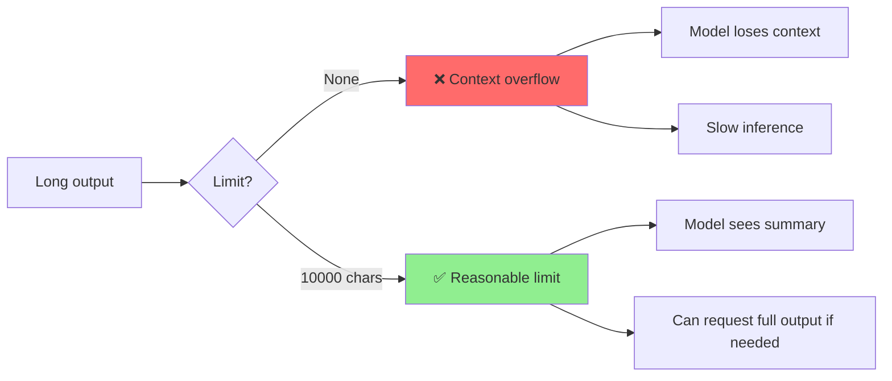

**Rationale**: 10,000 characters is enough for:
- Compiler error messages
- Test output summaries
- Directory listings

**Workaround for Large Output**: Redirect to file, then read file:
```json
{
  "command": "npm test > /tmp/test_output.txt 2>&1",
  "cwd": "/project"
}
// Then use read tool to fetch /tmp/test_output.txt
```

---

## Dependencies

```toml
[dependencies]
operon-tools-core                    = { workspace = true }
operon-tools-shell-bash              = { workspace = true }
operon-context-normalize-tools       = { workspace = true }
serde_json                           = { workspace = true }
tokio                                = { workspace = true }
```

---

## License

Operon is licensed under the **GNU Affero General Public License v3.0 (AGPLv3)**.

---

> Built by **Luka Gray (aka Soumo Mukherjee)** • West Bengal, India • 2026
