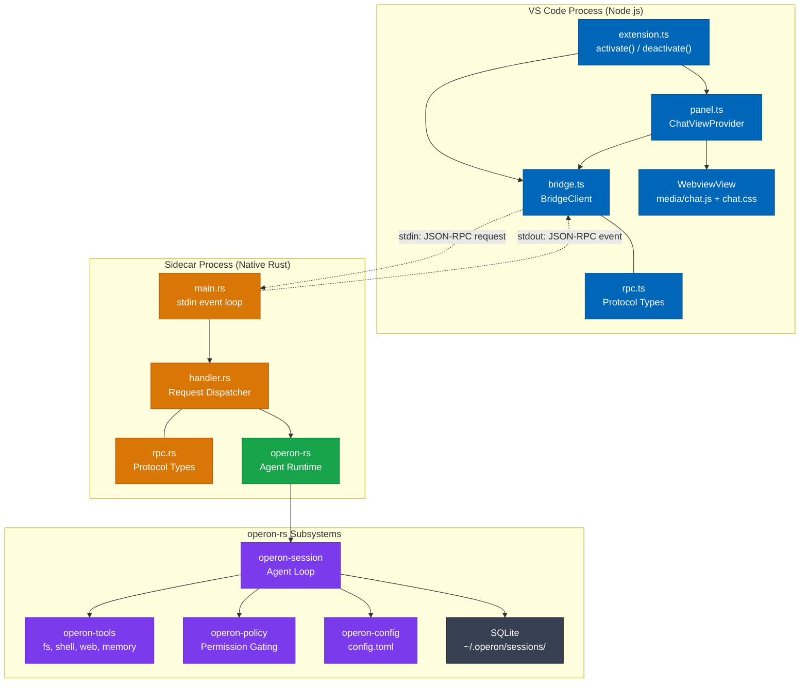
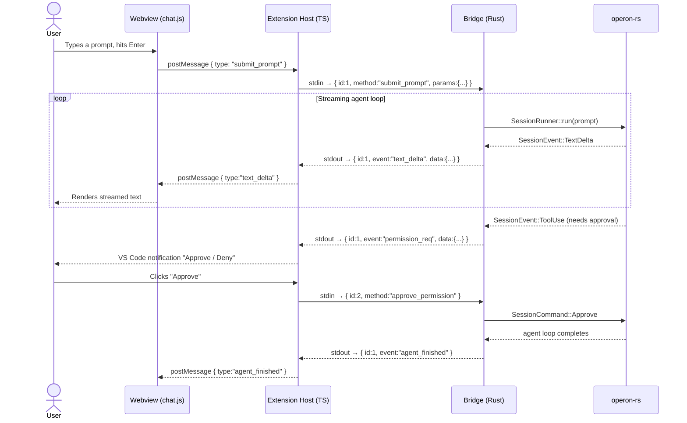

<div align="center">


# Operon — VS Code Extension

*The full Operon agent, living inside your editor.*

[](https://code.visualstudio.com/)
[](https://www.rust-lang.org/)
[](https://www.typescriptlang.org/)
[](../../LICENSE)

</div>

---

## Overview

The Operon VS Code extension brings the full `operon-rs` agent runtime directly into your editor. It is **not** a thin API wrapper — it runs the same production Rust agent that powers the GUI and TUI, embedded as a native sidecar process.

> **No cloud required.** The entire agent loop runs locally on your machine.

---

## Architecture

The extension is split into two layers that communicate over **stdin/stdout JSON-RPC**:



---

## The Sidecar Pattern

VS Code extensions run in a **Node.js** process. Rust code cannot be linked directly into Node.js. The bridge sidecar solves this cleanly — the extension spawns `operon-vscode-bridge` as a child process on activation and communicates with it over its stdio pipes.



---

## JSON-RPC Protocol

All messages are **newline-delimited JSON** on stdin/stdout. Stderr is reserved for diagnostic logs.

### Requests  *(Extension → Bridge)*

| Method | Params | Description |
|---|---|---|
| `submit_prompt` | `session_id?`, `prompt`, `workspace_path?` | Start or continue an agent session |
| `cancel` | — | Cancel the currently running prompt |
| `approve_permission` | `permission_id` | Approve a pending tool permission |
| `deny_permission` | `permission_id` | Deny a pending tool permission |
| `load_history` | `session_id` | Load message history for a session |

### Events  *(Bridge → Extension)*

| Event | Data | Description |
|---|---|---|
| `text_delta` | `{ delta }` | Streamed LLM text chunk |
| `tool_start` | `{ tool, label, input }` | A tool call has started |
| `tool_result` | `{ tool, success, summary }` | A tool call completed |
| `tool_progress` | `{ tool, stage, message }` | Mid-tool progress update |
| `permission_req` | `{ permission_id, tool, description }` | User approval required |
| `token_update` | `{ used, budget }` | Context window token state |
| `agent_finished` | `{ session_id }` | Agent loop completed |
| `agent_error` | `{ message }` | Agent loop failed |

---

## Directory Layout (Example)

```
vscode/
│
├── extension/                    # TypeScript — the .vsix package
│   ├── src/
│   │   ├── extension.ts          # activate() / deactivate()
│   │   ├── bridge.ts             # BridgeClient — child process + stdio RPC
│   │   ├── rpc.ts                # Protocol types (mirrors bridge/src/rpc.rs)
│   │   └── panel.ts              # ChatViewProvider — sidebar WebviewView
│   ├── media/                    # Chat UI assets bundled into .vsix
│   │   ├── chat.js               # Webview JavaScript (to be built)
│   │   └── chat.css              # Webview styles (to be built)
│   ├── assets/
│   │   ├── icon.png              # Marketplace icon (128x128)
│   │   └── icon-mono.svg         # Activity bar icon (monochrome)
│   ├── bin/                      # Pre-built bridge binaries (CI artefacts)
│   │   ├── operon-vscode-bridge.exe   # Windows
│   │   ├── operon-vscode-bridge-linux # Linux
│   │   └── operon-vscode-bridge-mac   # macOS
│   ├── dist/                     # esbuild output (gitignored)
│   ├── package.json              # Extension manifest & build scripts
│   └── tsconfig.json
│
├── bridge/                       # Rust — the native sidecar binary
│   ├── src/
│   │   ├── main.rs               # tokio entry point, stdin reader
│   │   ├── rpc.rs                # Protocol types (mirrors extension/src/rpc.ts)
│   │   └── handler.rs            # Dispatches requests → SessionRunner
│   └── Cargo.toml                # [[bin]] operon-vscode-bridge
│
└── README.md                     # This file
```

---

## Development

### Prerequisites

- **Rust** (stable, 2021 edition)
- **Node.js** ≥ 20
- **VS Code** ≥ 1.90

### Build the bridge binary

```bash
# From the workspace root
cargo build -p operon-vscode-bridge

# Release build (what gets bundled in the .vsix)
cargo build -p operon-vscode-bridge --release
```

The binary is output to `target/release/operon-vscode-bridge[.exe]`. Copy it to `extension/bin/` before packaging.

### Build the extension

```bash
cd vscode/extension
npm install
npm run build       # dev build with source maps
npm run build:prod  # minified production build
npm run watch       # rebuild on file change
```

### Run in VS Code (F5 debug)

1. Open the `vscode/extension` folder in VS Code
2. Copy a built bridge binary to `extension/bin/`
3. Press **F5** → VS Code opens an Extension Development Host with Operon loaded
4. Click the Operon icon in the activity bar

### Type checking

```bash
cd vscode/extension
npm run typecheck   # tsc --noEmit, zero errors expected
```

---

## Packaging (CI only)

The `.vsix` is assembled in GitHub Actions — not locally. The workflow:

1. Cross-compiles `operon-vscode-bridge` for Windows / macOS / Linux
2. Places all three binaries under `extension/bin/`
3. Runs `npx @vscode/vsce package` to produce `operon-vscode-N.N.N.vsix`
4. Uploads as a release artefact

The extension's `bin/` directory is **gitignored**. Developers build the bridge locally for F5 debugging.

---

## Session Storage

The VS Code extension shares the same session database as the GUI and TUI:

```
~/.operon/
├── config.toml              # Provider, model, and permission config
├── sessions/                # Session metadata (.json per session)
└── session-db/              # SQLite turn history (.db per session)
```

Sessions started in VS Code continue seamlessly in the GUI and vice versa.

---

<div align="center">

Built by **Luka Gray** • Part of the [Operon](https://github.com/lukagray-dev/Operon) project

</div>
