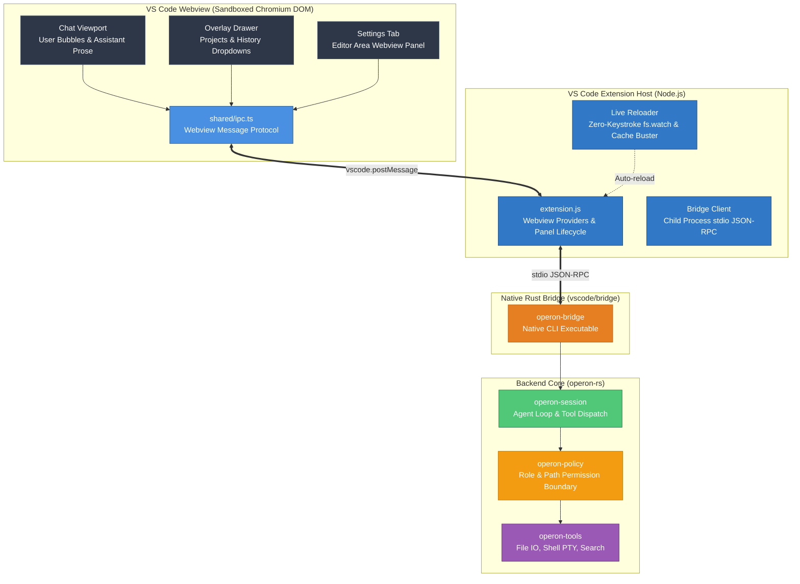

<div align="center">


# **Operon for Visual Studio Code**

[](https://marketplace.visualstudio.com/)
[](https://www.typescriptlang.org/)
[](https://www.rust-lang.org/)
[](../LICENSE)

### Autonomous AI Pair Programming inside your Editor

</div>

---

## 💡 What is Operon VS Code?

The **Operon VS Code Extension** brings the complete **Operon autonomous agent runtime** directly into Visual Studio Code and Cursor.

Unlike typical code assistant plugins that act as simple text completion prompts, Operon in VS Code operates as a true **in-editor autonomous system operator**:
- **Autonomous File & Terminal Tool Execution**: Inspects codebases, edits multi-file projects, and executes shell tasks with full permission controls.
- **Unified Visual Design System**: Symmetrical dark mode aesthetics matching the standalone Operon desktop GUI, styled with Open Sans, Kode Mono, and Literata typography.
- **Overlay Drawer & Floating Input Card**: Ergonomic, distraction-free conversational UI with collapsible project history and multi-turn prompt editing.
- **Standalone Settings Tab**: Complete 9-panel configuration interface rendered directly within the VS Code editor tab space.

---

## 🏛️ Architecture & Data Flow

The extension follows a high-performance **three-tier architecture**, cleanly separating the sandboxed Webview UI, the VS Code Node.js Extension Host, and the Rust-native `operon-rs` backend harness via a lightweight stdio JSON-RPC bridge.



---

## 📦 Directory Structure

```text
vscode/
├── bridge/                         # Native Rust JSON-RPC Bridge
│   ├── src/
│   │   └── main.rs                 # stdio JSON-RPC server interfacing with operon-rs
│   └── Cargo.toml                  # Rust dependencies (operon-rs, serde_json, tokio)
│
├── extension/                      # VS Code Extension Package
│   ├── src/                        # Webview Frontend Source (HTML/CSS/TS)
│   │   ├── index.html              # Chat sidebar UI entry point
│   │   ├── settings.html           # Settings tab UI entry point
│   │   ├── assets/                 # SVGs, brand logos, UI icon masks
│   │   ├── css/
│   │   │   ├── shared/             # Global tokens, typography (@font-face), scrollbar
│   │   │   ├── left-sidebar/       # Overlay history drawer, project cards, context menus
│   │   │   ├── main-content/       # Topbar, empty state, chat stream, floating input
│   │   │   └── settings/           # 9 settings panels (general, appearance, models, etc.)
│   │   └── ts/
│   │       ├── main.ts             # Sidebar chat UI root coordinator
│   │       ├── settings/           # Settings tab UI coordinator
│   │       └── shared/             # Type-safe invokeIpc & event bus wrappers
│   │
│   ├── extension.js                # Extension host activator, webview provider & live-reloader
│   ├── package.json                # Extension manifest, commands & configuration contributions
│   └── tsconfig.json               # TypeScript compiler options (target ES2022 -> src/js/)
│
└── README.md                       # This documentation
```

---

## ✨ Features & User Experience

### 1. Overlay Conversation History Drawer
- Accessible via the hamburger button in the topbar or `Ctrl+N`.
- Floating backdrop animation (`translateX(-100%)` to `0`) without persistent screen clutter.
- Context menu (Share, Rename, Move to Folder, Fork, Delete) with danger highlights.

### 2. Streamlined Chat Viewport & Floating Input Card
- **User Prompt Bubbles**: Hover actions with instantaneous Copy (checkmark feedback) and inline editable fields.
- **Assistant Prose**: Editorial typography powered by *Literata*, accompanied by Like, Dislike, Fork, and Copy actions.
- **Floating Input Card**: Auto-resizing multiline prompt editor, attachment manager, token context indicator (`0 / 128k`), model selector, and Auto-Approve toggle.

### 3. Editor Tab Settings Workspace
- Opens with `Ctrl+,` or the sidebar Settings button.
- Runs inside a dedicated editor tab panel (`vscode.ViewColumn.Active`).
- Full configuration for **General Preferences**, **Appearance & Themes**, **AI Models & API Keys**, **Security & Permission Boundaries**, **Remote Channels (WhatsApp & Telegram)**, **Skills**, and **Memory**.

### 4. Zero-Keystroke Instant Live-Reload
- Built-in native file watching with automatic cache-busting module reloaders.
- Edits in HTML, CSS, or TypeScript instantly refresh inside the Extension Development Host without needing manual reloads or keystrokes.

---

## 🛠️ Development & Contributing

### Prerequisites
- **Node.js**: v18.0 or higher
- **VS Code**: v1.85.0 or higher
- **Rust Toolchain**: 1.78+ (for building `vscode/bridge`)

### Getting Started

1. **Install extension dependencies:**
   ```bash
   cd vscode/extension
   npm install
   ```

2. **Start the TypeScript compiler in watch mode:**
   ```bash
   npm run watch
   ```

3. **Launch the Extension in VS Code:**
   - Open the `Operon` repository in VS Code.
   - Press **`F5`** (or select **Run > Start Debugging**).
   - In the newly opened **[Extension Development Host]** window, click the **Operon** icon in the activity bar to open the chat sidebar.

---

## 📄 License & Credits

Operon is licensed under the **GNU Affero General Public License v3.0 (AGPLv3)**. See [LICENSE](../LICENSE) for full terms.

<div align="center">

<br/>

Built with ❤️ by **Luka Gray (aka Soumo Mukherjee)** • West Bengal, India • 2026  
*"The best tools disappear. You stop thinking about the tool and start thinking about the work."*

<br/>

**[GitHub](https://github.com/lukagray-dev) • [Instagram](https://www.instagram.com/lukagray.official) • [Email](mailto:heylukagray@gmail.com)**

</div>
